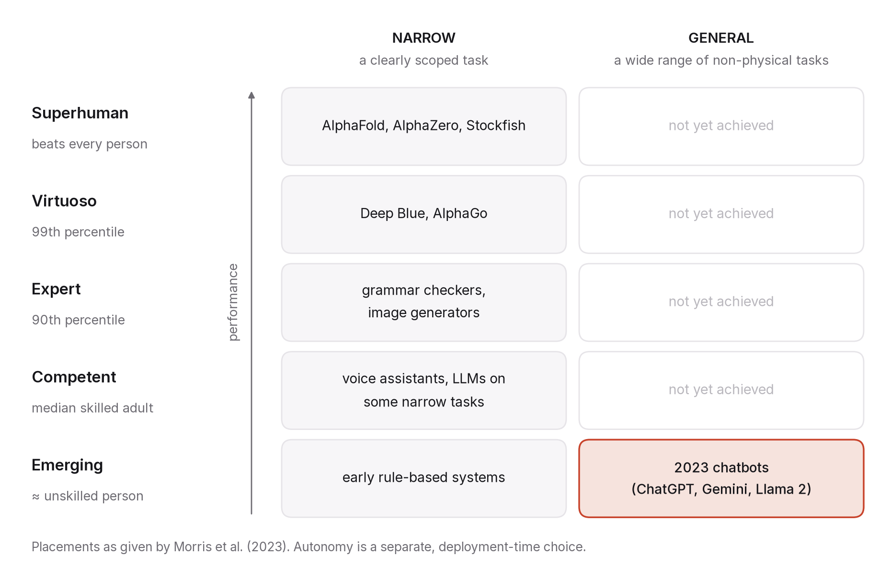

# Chapter 1 — What "general" means, and why the word matters

In the spring of 2023 a system trained to predict the next word in a sentence passed a simulated bar exam, wrote working code in a dozen programming languages, explained jokes, and fumbled the job of counting the letters in a short word. All of that was true at the same time. All of it was reported, too, though hardly ever in the same article. People who read about the bar exam decided general intelligence had arrived. People who saw the letter-counting decided the whole thing was a party trick. Both were reasoning from a single data point about a question that needs a map.

This chapter is about that map. Before you can think clearly about what the next ten years of AI will do to work, to learning, to institutions and to your own plans, you need a way of describing what a system can do that is sharper than "it's smart" and more useful than a benchmark score. You need to be able to say which tasks, how well, how reliably, with how much autonomy, and compared with whom. Once you can say those things, a surprising number of the loudest arguments about AI turn out to be people describing different parts of the same elephant.

## A word asked to carry too much

"Artificial general intelligence" carries at least four separate meanings, and people using the phrase almost never say which one they have in mind.

The first is breadth. A chess engine does one thing; a system that can draft an email, debug a program and summarise a court judgment does many, whatever its quality at each.

The second is parity with people: doing a task as well as a typical person, or as well as an expert. That is a claim about level rather than breadth, and it only means something once you name the people you are comparing against, which is the step most claims skip.

The third is autonomy. Can the system take on a long task, pick its own intermediate steps, recover when something goes wrong and finish without a person checking each move? A model that writes an excellent paragraph on request is not autonomous in this sense. A system that is handed a goal on Monday and reports back on Friday is, even if its paragraphs are mediocre.

The fourth is economic: a system that can do most economically valuable work. Several AI companies write this definition into their charters, and for the subject of this book it is the one that matters most, because it is a claim about labour markets rather than about minds. It is also the hardest to test. Nobody can run "most economically valuable work" as a benchmark.

So when someone tells you a system is, or isn't, AGI, ask them which of the four they mean. In my experience most disagreements end right there. A system can be broad and shallow, or narrow and superhuman, or very capable and still not trusted to act alone, and describing each of those separately is where clear thinking starts.

## A map, not a prophecy

In late 2023 a group of researchers at Google DeepMind published a framework that does this separation for you.[^1] Their paper, *Levels of AGI*, classifies systems on two axes, performance (how well, compared with people) and generality (how broadly), and treats autonomy as a third dimension that depends on how a system is deployed rather than on capability alone.

Performance runs in five steps: emerging (equal to or a bit better than an unskilled person), competent (at least the median skilled adult), expert (90th percentile), virtuoso (99th) and superhuman (better than every person). Generality has two values, narrow and general, where general means a wide range of non-physical tasks, including learning new ones. On this map AlphaFold and the chess engine Stockfish are narrow and superhuman, while a calculator doesn't count as AI at all. The chatbots of 2023 were, in the authors' own judgement, general but only emerging: broad, roughly at an unskilled person's level across most of that breadth, with patches of much better performance.

Two things about the framework are worth more than its labels.

Performance and generality are scored separately, which is exactly what the bar-exam-versus-letter-counting argument was missing. A system can be high on one axis and low on the other, and most of the systems that matter this decade will be. When you meet a capability claim, find it on both axes before you react.

Autonomy, meanwhile, is a decision somebody makes. The same model can be deployed as a tool that acts only when asked, as a consultant whose proposals a person approves, as a collaborator sharing the work, as an expert whose output a person reviews, or as an agent that acts and informs someone afterwards. Which of those it is allowed to be depends on how reliable it is, how high the stakes are and who pays for a mistake. Capability sets a ceiling on sensible autonomy; it doesn't set the level. I lean on this point throughout the book, because nearly every economic and institutional effect of AI flows through the autonomy organisations actually grant, which lags well behind what exists in a lab.

The authors are clear that their framework will be revised, and it will. The levels may merge or split, generality may grow gradations, physical tasks may need their own treatment. Treat it as a map that will be redrawn. Every useful map is.

## Asking the question that can be answered

"Is it AGI yet?" wants a yes or a no about something that is, at any given moment, a scatter of points across a plane. You can't answer it honestly, and attempts to do so mostly generate heat.

The question you can answer has four parts: which tasks, at what level, with what reliability, under how much autonomy?

Start with the tasks, and make them narrow. "Coding" tells you nothing. "Writing a function from a clear specification in a popular language" is one task; "finding the one wrong assumption buried in a large, old codebase" is a very different one. Likewise "medicine" covers both summarising a discharge note and choosing between two treatments for a patient with three conditions. The more precisely the task is described, the more a claim is worth and the harder it is to misread.

Then the level, which always means compared with whom. Drafting contract clauses as well as a second-year associate is one fact. Drafting them as well as a senior partner is another, and as well as a careful layperson with a template is a third. Change the reference group and you change both what the capability is worth and whose job it threatens.

Reliability is where people's intuitions go most wrong. A system that is right 95 per cent of the time is a brilliant assistant and a disastrous autopilot; the same number means opposite things depending on who catches the other five per cent. Reliability has a shape as well as a size. Are the failures scattered at random, bunched on particular inputs, or hidden in cases that look exactly like the successes? Loud failures can be managed. Fluent ones can only be caught by someone who already knows the answer.

Finally, autonomy. Does a person check every output, or a sample, or only hear about the problems? Both the value and the risk of a system grow with its autonomy, and institutions hand out autonomy slowly, as reliability is demonstrated. That is why capabilities show up in labs years before they show up at your desk. The gap between those two moments is one of the main subjects of this book.

It is worth training yourself to translate every claim into this form. "AI can now do X" becomes "a system did task X at level L, with reliability R, while operated as a tool by an expert who checked the output." Some claims survive the translation intact. Many don't.

## Three confusions

Three mistakes come up so often that they deserve names.

The first is mistaking benchmark performance for job performance. A benchmark is a fixed set of questions with known answers, usually picked because they are easy to grade. Jobs are open-ended and graded by consequences. A good benchmark score shows something real, namely that the system can produce gradable answers to that kind of question under those conditions. It doesn't show the system can do the job of the people who normally answer such questions, and the gap is widest wherever most of the work is figuring out what the question actually is. Chapter 2 goes into this properly.

The second is mistaking fluency for competence. Language models write confident, well-organised prose whether or not they are right. All of us grew up in a world where fluent, well-structured writing was a decent sign of a careful mind, and that signal has quietly come apart from the thing it used to indicate. I'd put this near the top of the list of reasons people over-trust these systems, and it is why the ability to verify, which comes up in nearly every chapter here, is getting more valuable rather than less.

The third is mistaking demos for deployments. A demo is a chosen task on chosen inputs, with the operator ready to try again. A deployment is whatever real users do with whatever they bring, with nobody standing by. Most of the engineering in this field lives in the distance between the two, which is also why the companies shipping reliable systems often look slower than the ones shipping impressive videos.

When a capability claim crosses your feed, ask which of these it might be leaning on. Usually it's at least one.

## The bar exam, read again

Let me take the claim this chapter opened with and put it through the four questions.

The March 2023 technical report for a leading language model said the system had passed a simulated Uniform Bar Examination with a score around the 90th percentile of test-takers.[^2] That figure went everywhere, usually compressed to "AI passes the bar exam in the top 10 per cent", and it probably did more than any other number that year to shape what the public believed about how close these systems were to professional work.

Which tasks? The Uniform Bar Examination has three parts: a multiple-choice section, a set of essays, and performance tests that simulate legal work, such as drafting a memo from a file of documents. The system did well on the multiple-choice section, the part most like a benchmark, and less well on the essays, which were graded by the researchers rather than by official graders. "Passed the bar" folded three quite different tasks into one.

At what level, against whom? The 90th-percentile figure was computed against people sitting a February exam. February sittings are dominated by repeat takers who failed before, and they score lower than the July sittings taken mostly by fresh law graduates. A 2024 re-analysis in a peer-reviewed law and AI journal re-estimated the same raw score against July takers and against first-time takers specifically.[^3] It came out around the 69th percentile against July takers, around the 48th against first-timers, and around the 15th against first-timers on the essays alone. Change the comparison group and "top 10 per cent" turns into "roughly median, and weak at the writing".

With what reliability? We don't know. It was a single run, and the re-analysis pointed out that the essays could not be re-graded under official conditions. There was no distribution to read because nobody measured one.

Under what autonomy? The system answered exam questions as a tool, with the questions supplied, the format fixed and nothing riding on the output. A bar exam is a proxy for the start of legal competence, sat under conditions nothing like practice. The result said nothing about whether the system could be trusted to do legal work unsupervised, and to be fair, the original report never said it could.

None of this makes the achievement small. A statistical model of text reaching a median first-time score across the full breadth of the bar exam would have sounded like science fiction in 2020. But "median first-time taker, weak on essays, exam conditions, one run" and "top 10 per cent of lawyers" are different facts, and they mean different things to law firms, law students and anyone deciding what to trust. Getting from one to the other is the skill this chapter is about. So the sentence worth practising isn't "AI passed the bar". It is something like: a system scored near the median of first-time takers on a simulated bar exam, strongest on multiple choice and weakest on essays, in a single run, used as a tool. Longer, yes. Also true.

## Why the word still matters

If "AGI" is this slippery, why not just stop using it?

Because it coordinates an enormous amount of behaviour. Companies set their missions by it, governments draft policy around thresholds that invoke it, and investment, hiring, regulation and public mood all shift with what people believe about how close it is. A word that moves that much money and policy can't simply be retired. It has to be used with care.

And the thing it points at, however vaguely, is real. Systems are getting broader, more reliable and more autonomous, and the consequences of that drift don't wait for anyone to settle on a definition. You can refuse to say "AGI" and you will still have to decide what your college should teach, what your company should automate and what you should learn next year. The map in this chapter is meant to help with those decisions. Winning arguments about the word is beside the point.

## What would make this chapter wrong

If, by 2031, a single system works at expert level across the whole breadth of non-physical tasks and is routinely given high autonomy in consequential settings, then all this careful separating of axes will look fussy, because the scatter of points will have collapsed into one corner of the map. That could happen. The framework would still describe how we got there, but its emphasis on gradations would read as dated.

If instead generality stalled while narrow systems kept improving, then I have under-weighted how much of the decade's change came from many narrow, superhuman tools rather than a few general ones, and chapters 4 and 5 should be read with that correction in mind.

And if the levels framework has been replaced by a better-validated taxonomy, use the better one. My argument is that you need a map with separate axes. I'm not attached to this particular drawing of it.

## What to do this year

Learn to read an evaluation. Pick one widely reported capability claim and track down its source, the benchmark or study behind the headline. Write one line each on which tasks it tested, against which reference group, with what reliability, and how the system was operated. Then write down what the headline implied on each of those four points. The gap between the two lists is the skill this chapter is trying to give you, and you'll find a use for it every month for the next ten years.

---

[^1]: Morris, M. R., Sohl-Dickstein, J., Fiedel, N., Warkentin, T., Dafoe, A., Faust, A., Farabet, C. & Legg, S. (2023, revised 2024). *Levels of AGI for Operationalizing Progress on the Path to AGI.* Google DeepMind. arXiv:2311.02462.
[^2]: OpenAI (2023), *GPT-4 Technical Report*, arXiv:2303.08774, and the accompanying study by Katz, D. M., Bommarito, M. J., Gao, S. & Arredondo, P. (2024), "GPT-4 passes the bar exam", *Philosophical Transactions of the Royal Society A* 382(2270).
[^3]: Martínez, E. (2024), "Re-evaluating GPT-4's bar exam performance", *Artificial Intelligence and Law*. The percentile estimates quoted are from this re-analysis; read it alongside the original for both sides.

### Sources for this chapter
- Morris et al., *Levels of AGI* (2023/2024), arXiv:2311.02462 — the two-axis framework, the autonomy levels and the example placements in the figure.
- OpenAI, *OpenAI Charter* (2018) — the "highly autonomous systems that outperform humans at most economically valuable work" definition, cited as an example of the economic meaning of the term.
- OpenAI, *GPT-4 Technical Report* (2023), arXiv:2303.08774; Katz et al. (2024); Martínez (2024) — the bar-exam result and its re-analysis.
