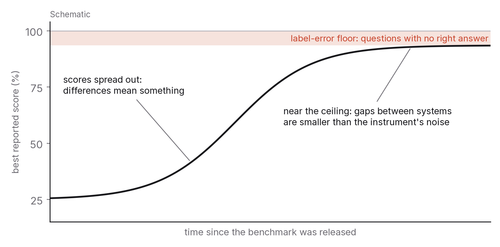

# Chapter 2 — The measurement problem

Every claim about what AI can do rests on a measurement, and most of those measurements are shakier than they look. That isn't because the people making them are careless. Measuring the abilities of a system that has read most of the public internet is genuinely hard, the field is still working out how to do it, and the incentives around the numbers all push in one direction, which is up.

Chapter 1 gave you a map. This one is about the instruments that place a system on it: how they work, how they break, and how to read them anyway. None of this is academic. Over the next decade you will be asked to judge capability claims as a student deciding what to learn, as an employee deciding what to trust, as a manager deciding what to buy and as a citizen deciding what to allow. Nobody is going to hand you a clean number. You'll have to learn to read the dirty ones.

## What a benchmark actually measures

A benchmark is a fixed set of tasks plus a rule for scoring them. Multiple-choice questions across academic subjects, with an answer key. Programming problems with hidden test cases. Maths word problems with numeric answers. You run the system on the tasks, apply the rule, and a number comes out.

The point of all this is comparability. Score two systems on the same tasks under the same rules and you can rank them; score one system a year apart and you can see a trajectory. Most of what we know about how fast this field is moving comes from benchmarks, and later chapters lean on that knowledge, so I am not arguing that benchmarks are bad. My argument is narrower. A benchmark score answers a narrow question, and the narrow question is rarely the one in the headline.

That narrow question goes something like: how often does this system produce a gradable answer matching the key, on this fixed set of tasks, under these particular conditions? Every word in it is doing work.

## Four ways the instrument breaks

A benchmark only tells you something while systems score somewhere in its middle. Once the best systems crowd the ceiling, the differences between them stop meaning much, and gains on the benchmark stop tracking gains in the underlying skill. Benchmarks that took years to climb in the 2010s were climbed in months in the 2020s, and several of the most cited were effectively used up within two or three years of release. A saturated benchmark is a thermometer whose scale ends at room temperature.

Then there is contamination. Modern systems are trained on huge scrapes of the public internet, and benchmark questions, with their answers, are on the public internet. So some share of any public benchmark has usually been seen during training in one form or another, and a high score can partly reflect recall rather than reasoning. Careful technical reports now include contamination checks, which helps. But the clean fix (questions nobody has ever published) cuts against the whole idea of a benchmark, which is that anyone can run it. Held-out sets that are kept private and refreshed over time are the field's answer, and when you see results on one, give them more weight.

Goodhart's law is the third problem: once a measure becomes a target, it stops being a good measure. When a benchmark is the number that drives funding, hiring and press coverage, developers optimise for it, sometimes directly and sometimes through quieter choices about training data and tuning. This isn't necessarily dishonest. It's what any organisation does with a metric it gets judged on. The result is the same either way, though. The number climbs faster than the thing it was meant to indicate.

The last problem is the plainest. Benchmarks don't look like real use. A multiple-choice question tests whether a system can pick the right option when the options are handed to it, and real tasks rarely come with options. A coding benchmark checks whether a short function passes hidden tests given a clear specification, whereas real programming is largely the business of discovering what the specification should have said. The easier a benchmark is to grade, the further it tends to drift from how the skill gets used.

None of these makes a benchmark result false. Each makes it mean less than the headline suggests. So when you read that system X scored Y per cent on benchmark Z, it helps to ask whether Z is saturated, whether Z could be sitting in the training data, whether Z is the number everyone is chasing, and how far Z is from the task you actually care about.

## What holds up

Some kinds of evaluation resist these failures much better than others.

Private, refreshed question sets are the first. If the questions are new, kept out of public view and swapped out over time, they can't be memorised and are harder to target. They cost more to run and are harder to compare across years, which is why you see fewer of them. A result on a private held-out set deserves more trust than a public benchmark score of the same size.

Evaluations built around whole tasks are the second. Ask a system to finish something realistic from start to end, with the mess left in (vague instructions, a real software environment, an output that has to work), and you measure something much closer to usefulness. Such evaluations are harder to score, so they tend to be graded by people or by checking whether the outcome worked rather than whether an answer matched. The recent practice of measuring agents by how long and complex a task they can reliably complete, which comes up again in chapter 9, is one example.

Third, look for reliability rather than accuracy alone. One accuracy figure hides how the failures are distributed. Evaluations that report consistency across repeated runs, calibration (whether a system's confidence tracks whether it's right) and performance on the hardest slice of the questions tell you how the system behaves when it matters. A system that is right 90 per cent of the time and knows which 10 per cent it's unsure about is a different tool from one that's right 90 per cent of the time and equally sure of everything.

And finally, prefer results from people who didn't build the system. Independent replication is the oldest quality signal in science and it works here too. A third party reproducing a result on its own hardware, following the published method, is worth more than the developer's own report, even an honest one, because the third party didn't make the hundred small choices that tend to nudge a number upward.

When you see any of these, lean in. When all you have is a single public benchmark score, lean back.

## Reading a model card and a technical report

Most major systems now come with two documents: a short model card summarising what the system is, what it was trained on, how it was evaluated and what it shouldn't be used for, and a longer technical report with the detail. Reading them well is the practical version of everything in this chapter.

Start with what is disclosed, what is estimated and what is simply missing. Is the training data described, listed, or not mentioned? Is the compute stated, estimated by outsiders, or withheld? Which benchmarks were run, with what prompting, allowing how many attempts, and was contamination checked? Oddly, a report that admits its gaps is often more trustworthy than one that fills every box. The author of the first one knows what they don't know.

Then look at the conditions. Scores move a lot depending on how a system was prompted (with worked examples or without), how many attempts it got and whether it could use tools. The same system can shift ten or twenty points on a benchmark with these settings alone. A score reported without its conditions is barely a score.

And read the limitations section. Every honest report has one, and I'd read it first. It tells you where the system fails, which is what you need to decide whether it fits your task, and it tells you how candid the authors are, which is what you need to decide how much to believe everything else.

It's also worth knowing that independent groups now track, over time, how much technical reports disclose about compute, energy and data. That trend is a measurement in its own right. When disclosure falls, the field is getting harder to check from outside.

## Two benchmarks, looked at closely

In 2024 independent researchers took a hard look at two of the most-cited benchmarks of the early 2020s, and between them the two studies show two of the failure modes above unusually clearly.

The first benchmark was a big multiple-choice test of academic knowledge covering 57 subjects, from elementary maths to professional law. It had become the single most quoted number in model announcements, read loosely as a measure of general knowledge. A team went through 5,700 of its questions by hand, across all 57 subjects, and estimated that about 6.5 per cent of the full benchmark contained errors: wrong answer keys, questions with no correct option or with several, questions that couldn't be answered as written.[^1] In virology, the worst subject, 57 per cent of the questions they checked had problems. A test with an error floor of six or seven per cent can't separate systems that sit within a few points of each other near the top, and by 2024 that's exactly where every leading system sat. The instrument had saturated, and part of the saturation was its own noise.

The second was a widely used set of grade-school arithmetic word problems, the standard check on simple mathematical reasoning. Because it was old and public, its questions and answers were almost certainly in the training data of every model scored on it. So a team wrote a fresh set of a little over a thousand problems, matched for style and difficulty, kept it private, and scored the same models on both.[^2] Several model families did noticeably worse on the fresh problems, with drops of up to eight percentage points. That's direct evidence of contamination: those models had partly memorised the public set instead of learning the skill. The strongest models showed little or no gap, which is the encouraging half of the result, and it's also why the method is so useful. It separated the models that had learned arithmetic from the ones that had learned the test.

Neither study concluded that the benchmarks were worthless. What both showed is what this chapter has been arguing: a score answers a narrow question, and the only way to find out how narrow is to look at the questions and test the system on ones it hasn't seen. I'd argue those two teams did more for our understanding of capability that year than most new state-of-the-art results did, and their methods (re-check a sample by hand; write a private twin) are open to anyone with a free weekend and the inclination to check.

## Evaluation is becoming everyone's job

For most of the history of technology, the people who judged a tool were the people who used it, and using it was how they judged it. A spreadsheet either added up correctly or it didn't, and anyone could find out.

AI systems break that arrangement in two ways. Their output is fluent whether or not it's correct, so using them doesn't reveal their quality unless you already know the answer. And their behaviour is statistical: right most of the time, wrong in ways that are hard to predict, so a handful of tries tells you very little.

The upshot is that evaluation, which used to be a specialist's job, is turning into everyone's. A journalist reporting a capability claim, a manager deciding whether to automate a workflow, a teacher deciding whether a tool is fine for homework, a voter weighing a policy that leans on "what AI can do now": all of them need the reading skills in this chapter, and all of them will be misled without them. The gap between what these systems can do and what people believe they can do runs in both directions, and it's one of the real risks of this transition. Better systems won't close it. Better measurement, and better readers of measurement, will.

## What would make this chapter wrong

If by 2031 the field has settled on a handful of independent, private, task-based evaluations that are widely trusted and track real-world usefulness well, most of the warnings here will read like a description of a problem that got solved. The advice about reading conditions and limitations would still apply, but the urgency wouldn't.

If evaluation has gone the other way and become largely private, with developers measuring their own systems and little independent replication, then I've understated the problem, and every public capability claim deserves more scepticism than I've suggested.

And if systems become able to grade open-ended work as reliably as expert people, much of the difficulty with task-based evaluation goes away, because grading was always the expensive part. That would change the economics of measurement more than anything else discussed in this chapter.

## What to do this year

Run one public benchmark yourself. Choose a small, well-documented one, download the questions, run an openly available model on it with the published prompts, and score the results. Then do three things. Look at the questions it got wrong and see if you can work out why. Search the web for a handful of the questions and count how many turn up word for word. Change the prompt format and watch how far the score moves. An afternoon of this will teach you more about saturation, contamination and conditions than a year of reading about them, and you won't take a single number at face value again.

---

[^1]: Gema, A. P. et al. (2024), "Are We Done with MMLU?", arXiv:2406.04127; the re-annotated subset is published as MMLU-Redux (5,700 questions across all 57 subjects in the current version).
[^2]: Zhang, H. et al. (2024), "A Careful Examination of Large Language Model Performance on Grade School Arithmetic", arXiv:2405.00332; the private twin set is GSM1k.

### Sources for this chapter
- Gema et al. (2024) — MMLU-Redux; Zhang et al. (2024) — GSM1k.
- Goodhart, C. (1975), on measures that become targets; Strathern, M. (1997), "'Improving ratings': audit in the British University system", *European Review*, for the popular formulation.
- Mitchell, M. et al. (2019), "Model Cards for Model Reporting", *FAT\* '19* — the origin of the model-card practice.
- OpenAI (2023), *GPT-4 Technical Report*, arXiv:2303.08774 — includes a contamination analysis, cited as an example of disclosed methodology.
- Kiela, D. et al. (2021), "Dynabench: Rethinking Benchmarking in NLP", *NAACL* — on benchmark saturation and dynamic, held-out evaluation.
- Epoch AI, *Notable AI Models* dataset and documentation (accessed 2026) — on tracking disclosure of compute and training details over time.
- Stanford HAI, *AI Index Report* (2025, 2026) — on benchmark saturation trends and the move toward new evaluations.
