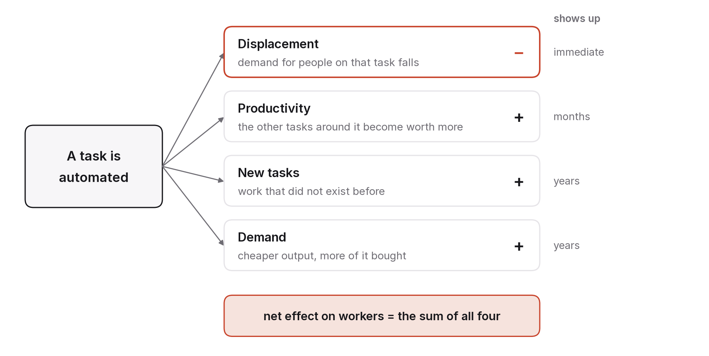

# Chapter 3 — The economics: four effects, not one

Ask most people what AI will do to jobs and you get one verb: replace. Ask most labour economists and you get four. This chapter is about the distance between those two answers, and in my view closing that distance is most of the difference between planning sensibly for the next decade and panicking about it.

The one-verb story isn't foolish. Some tasks people are paid for today will be done by machines tomorrow, and the people who did them won't be paid for them any more. That is real, it's already happening, and chapter 4 takes it seriously. But a technology that can do a task also changes the value of the tasks around it, creates tasks that never existed, and changes how much of the finished output people want to buy. Those three effects are quieter than the first. They take longer to appear. Historically, they have also been bigger. A framework with only the first verb will get the decade wrong.

## Thinking in tasks

The first move is to change the unit. Economists who study automation stopped talking about jobs some time ago and started talking about tasks, because a job is a bundle of tasks and the bundle keeps changing.

The classic example is the bank teller. In 1980 a teller counted cash, checked identities, answered customers' questions and sold the bank's products. The ATM took over the cash counting. The job didn't vanish; it was rebundled around the other three tasks, and the number of tellers in the United States actually kept rising for roughly two decades after ATMs spread, because cheaper branches meant banks opened more of them.[^1] Teller employment only fell in the 2010s, once online banking started taking the remaining tasks as well.

That one story holds the whole framework, which Daron Acemoglu and Pascual Restrepo formalised in a run of papers from 2018 onward.[^2] Automation acts on tasks, and its effect on workers runs through four channels.

Displacement comes first. A machine does a task a person used to do, and demand for human labour on that task falls. This is the one-verb story, and it's the first-order effect of any automating technology.

Productivity, or augmentation, comes next. The task is now cheaper or better done, so the output gets cheaper or better, people want more of it, and the people doing the other tasks that go into it become more valuable. Spreadsheets took over the bookkeeper's arithmetic and made the analyst who could ask sharper questions of the numbers worth a great deal more.

Then there are new tasks. Technologies create kinds of work nobody did before. There were no web developers in 1990, no data scientists to speak of in 2005, no prompt engineers in 2020. When David Autor and his co-authors traced occupational titles back through the twentieth century, they found that around six in ten American workers in 2018 were in kinds of job that didn't exist in 1940, and that new work of this sort accounted for most employment growth over the period.[^3]

Last comes demand. When an output gets cheaper, people buy more of it and spend what they save on other things, which creates work elsewhere. Cheaper lighting didn't reduce the number of hours people spent in artificial light. It multiplied them.

The net effect on any group of workers is the sum of all four, and you only know the sign of that sum after estimating each part. Through steam, electricity and computing, the first channel has always shown up fastest and loudest, and the other three have always decided how things turned out.

## Exposure is not displacement

In 2023 a group of researchers estimated that around 80 per cent of the US workforce had at least a tenth of their tasks "exposed" to large language models, and about 19 per cent had half or more of their tasks exposed.[^4] The International Labour Organization and the International Monetary Fund followed with exposure studies of their own, which found among other things that exposure is highest in rich countries and in clerical work, and that for many jobs it is likelier to mean augmentation than replacement.[^5]

Those figures were widely reported as "80 per cent of jobs at risk", which isn't what they say. In these studies, a task is "exposed" if it could in principle be done at least twice as fast with the technology's help without losing quality. That measures the first two channels together, before the third and fourth have had any effect, and before anyone has checked whether firms actually adopt the tools, whether quality really holds up, or whether the time saved turns into layoffs or into other work. Exposure is an input to the four-channel sum. It isn't the answer.

The studies are still useful, because they tell you where the pressure will land first: clerical and administrative work, routine writing, customer support, parts of software development, parts of law and accounting. If most of your working day is those tasks, chapter 4 is about you. But the road from exposure to displacement runs through adoption, reliability, regulation, retraining and the price of the output, and each of those takes years.

## Watch wages, not headlines

So if displacement is loud and the other channels are quiet, how do you tell which one is winning?

My answer is to watch wages and hours, by occupation and by task, over years rather than months. Newspapers report layoffs, which are visible events with dates attached. They don't report the hiring that happens because a firm's product got cheaper and sold more, because that hiring is spread out and nobody issues a press release about it. The first channel makes news. The net effect makes statistics.

A few signals are worth following through the decade. One is relative wages in exposed and unexposed occupations: if displacement dominates, exposed occupations fall behind; if augmentation dominates, they pull ahead, since the people who stay in them are more productive. The early evidence from 2023 to 2026 is mixed and varies a lot by occupation, which is about what the framework predicts for the first few years.

Another is entry-level hiring in exposed professions. This is where displacement shows up first, for reasons chapter 4 goes into, and it's the signal that matters most if you are a student right now.

A third is prices and volumes in exposed sectors. If translation gets ten times cheaper, does ten times as much get translated? For lighting the answer was yes. For some services it may be no, because there's only so much of them anyone wants. How strong the demand channel is depends heavily on the sector, and it's the hardest of the four to see unless you go looking for it.

It's a good habit to distrust any single number about "jobs" that doesn't come with a time horizon, an occupation and a wage attached.

## Why history keeps showing all four

The ATM isn't an exception. Every general-purpose technology has followed the same pattern, and the pattern has a shape worth understanding, because you are going to live inside it.

Electrification took roughly forty years to go from the first power stations to measurable productivity gains in manufacturing. Factories had been built around a single central steam shaft, and swapping it for a single central electric motor gained very little. The gains arrived when factories were redesigned around small motors at each workstation, which took new buildings, new ways of organising work and a generation of managers who had grown up with the possibility.[^6] The technology was ready decades before the institutions were.

Computing had the same lag. Robert Solow's 1987 line, that you could see the computer age everywhere except in the productivity statistics, stayed accurate for roughly another decade, until organisations rebuilt their processes around the machines instead of bolting machines onto old processes.[^7] Economists now call this the productivity J-curve: in the early years of a general-purpose technology, investment shows up as cost without output, because the complementary investments (training, reorganisation, new business models) are intangible and slow, and only later does the curve turn upward.[^8]

AI will probably trace the same shape, and probably faster than electricity did, because software spreads at the speed of a download rather than a construction project. But faster than forty years is still not instant, and the complementary investments are the familiar ones: redesigned workflows, retrained people, new institutions for trust and verification. Displacement moves at download speed. The other three channels move at the speed of redesign. The transition is the gap between those speeds, and the rest of this book is largely about living in it.

## Two experiments that show the channels at work

All of this stays abstract until you watch it happen to real workers. Two of the first careful field studies of generative AI at work show the augmentation channel in enough detail to see who gains and why.

The first followed 5,179 customer-support agents at a software company for about a year, while an AI assistant that suggested replies and pulled up relevant documentation was rolled out to them in stages.[^9] Because the rollout was staggered, the researchers could compare agents with and without the tool over the same period. In the working-paper version, productivity, measured as issues resolved per hour, rose about 14 per cent on average. The average hid the interesting part. Novice and low-skilled agents improved by about 34 per cent, while the most experienced and skilled agents barely changed. In effect the assistant had learned what the best agents did and was passing it on to everyone else. Customer satisfaction went up, requests to escalate to a manager went down, and new agents reached the productivity of experienced ones much faster.

Put that through the four channels. Nobody was displaced during the study. The task was augmented. The output got cheaper. And the gains went mostly to people at the bottom of the skill range, which narrowed the gap between novice and expert. That last effect matters most for chapter 4. What the tool was doing, passing on experienced workers' tacit knowledge to newcomers quickly, is what apprenticeship used to do slowly, so it changes the value of experience in both directions: the veteran's edge shrinks and the newcomer's road to competence gets shorter.

The second study was a controlled experiment with 758 consultants at a global consulting firm, some of whom were given access to a frontier language model for a set of realistic tasks.[^10] On tasks inside the model's competence (brainstorming, drafting, analysis of the kind it handled well), consultants with the tool finished about 12 per cent more tasks, about 25 per cent faster, and their work was rated about 40 per cent higher in quality. Again the biggest gains went to those who had scored lowest beforehand. But the researchers also included one task chosen to sit just outside what the model could do, one that required combining spreadsheet data with interview evidence in a way the model handled badly. On that task, consultants using the tool were 19 percentage points less likely to reach the right answer than those working without it. The authors called the boundary a "jagged frontier". These tools are strong and weak in a pattern that doesn't match our intuitions about what's hard, and someone who trusts them on the wrong side of the frontier does worse than someone who never used them.

Together the two studies confirm what the framework predicts and add a warning. Augmentation is real and large, it narrows skill differences, and it arrives before displacement does. Its value, though, depends on the worker knowing where the frontier lies, which is the verification skill from chapter 2 that chapter 10 comes back to. The tool makes a novice better. It makes a novice who can't tell good output from plausible output worse. Both are true, and the difference between those two novices is, I think, the skill this decade pays for.

## What it means for you

The framework isn't only for economists. It's a practical tool for deciding what to do with your own working life, and the exercise at the end of the chapter is the hands-on version.

If your tasks today are heavily exposed, the first channel is coming for them, and the question to ask is which of your other tasks get more valuable as a result. The teller who moved toward advice and sales kept a job that the teller who insisted on counting cash didn't.

If you can get yourself into the new-task channel, you're where the growth is. New tasks gather at a technology's edges: integrating it, checking it, teaching it, governing it, fixing what it breaks, and doing the newly valuable things it makes possible. They rarely look glamorous at first and they are hardly ever called by the names they'll eventually have.

And if you understand the demand channel in your own sector, you can tell whether cheaper output means more work or less. People will want more legal documents and more medical imaging when those get cheaper. Some outputs don't behave that way, and in those sectors work shrinks even as the technology improves.

This is not meant as reassurance. Displacement is real, and it lands hardest on people with the least room to move. But a plan built on one verb will put you in the wrong place, and a plan built on four at least gives you a chance of ending up somewhere good.

## What would make this chapter wrong

The framework assumes new tasks keep being created at something like the historical rate, and that people can do them. If AI systems become able to do new tasks as fast as they appear, the third channel closes, and with it most of history's reassurance. That's the scenario in which "this time is different" turns out to be true, and I can't rule it out. A reader in 2031 should check whether the fastest-growing occupations since 2026 are ones AI systems can also do.

It also assumes the demand channel works, that cheaper output gets bought in larger quantities. If the most exposed sectors turn out to be ones where demand saturates quickly, the fourth channel is weak and displacement is offset less than I've suggested.

On the other hand, if adoption has been much slower than the exposure studies implied, held back by reliability, regulation or cost, then my warnings about the first channel will look overdone, and the real lesson will be about how stubborn institutions are rather than how fast technology moves.

## What to do this year

Break your own job, or the one you're training for, into tasks. Write down ten to fifteen of them, as specifically as you can. Mark each one exposed (a current system could do it at least twice as fast at acceptable quality), augmented (a system speeds you up but can't do it alone) or new (it exists because of the technology). Then ask yourself two things: which of the augmented and new tasks you are weakest at, and which you most enjoy. The first answer tells you what to learn this year. The second tells you where you'll be able to keep learning when the list changes, which it will. Appendix B has a worksheet for this.

---

[^1]: Bessen, J. (2015), *Learning by Doing: The Real Connection between Innovation, Wages, and Wealth*, Yale University Press, ch. 6, on bank tellers and ATMs.
[^2]: Acemoglu, D. & Restrepo, P. (2018), "The Race between Man and Machine: Implications of Technology for Growth, Factor Shares, and Employment", *American Economic Review* 108(6); and (2019), "Automation and New Tasks: How Technology Displaces and Reinstates Labor", *Journal of Economic Perspectives* 33(2).
[^3]: Autor, D., Chin, C., Salomons, A. & Seegmiller, B. (2024), "New Frontiers: The Origins and Content of New Work, 1940–2018", *Quarterly Journal of Economics* 139(3).
[^4]: Eloundou, T., Manning, S., Mishkin, P. & Rock, D. (2023), "GPTs are GPTs: An Early Look at the Labor Market Impact Potential of Large Language Models", arXiv:2303.10130.
[^5]: Gmyrek, P., Berg, J. & Bescond, D. (2023), *Generative AI and Jobs: A Global Analysis of Potential Effects on Job Quantity and Quality*, ILO Working Paper 96; Cazzaniga, M. et al. (2024), *Gen-AI: Artificial Intelligence and the Future of Work*, IMF Staff Discussion Note SDN/2024/001.
[^6]: David, P. A. (1990), "The Dynamo and the Computer: An Historical Perspective on the Modern Productivity Paradox", *American Economic Review* 80(2).
[^7]: Solow, R. (1987), "We'd Better Watch Out", *New York Times Book Review*, 12 July 1987.
[^8]: Brynjolfsson, E., Rock, D. & Syverson, C. (2021), "The Productivity J-Curve: How Intangibles Complement General Purpose Technologies", *American Economic Journal: Macroeconomics* 13(1).
[^9]: Brynjolfsson, E., Li, D. & Raymond, L. (2025), "Generative AI at Work", *Quarterly Journal of Economics* 140(2), 889–942; the figures quoted are from the working-paper version, NBER Working Paper 31161 (2023).
[^10]: Dell'Acqua, F. et al. (2023), "Navigating the Jagged Technological Frontier: Field Experimental Evidence of the Effects of AI on Knowledge Worker Productivity and Quality", Harvard Business School Working Paper 24-013.

### Sources for this chapter
- Acemoglu & Restrepo (2018, 2019) — the task framework and its four channels.
- Autor, Chin, Salomons & Seegmiller (2024), *QJE* 139(3) — new work since 1940.
- Bessen (2015), *Learning by Doing* — the ATM and bank-teller case.
- Eloundou et al. (2023); Gmyrek, Berg & Bescond (2023), ILO WP 96; Cazzaniga et al. (2024), IMF SDN/2024/001 — exposure estimates and their interpretation.
- Brynjolfsson, Li & Raymond (2023/2025); Dell'Acqua et al. (2023), HBS WP 24-013 — the two field experiments.
- David (1990), *AER* 80(2); Solow (1987); Brynjolfsson, Rock & Syverson (2021), *AEJ: Macro* 13(1) — diffusion lags and the productivity J-curve.
