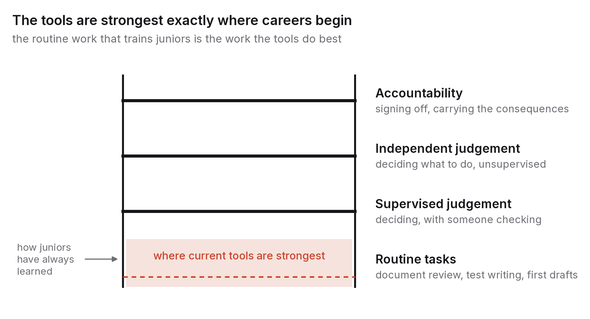
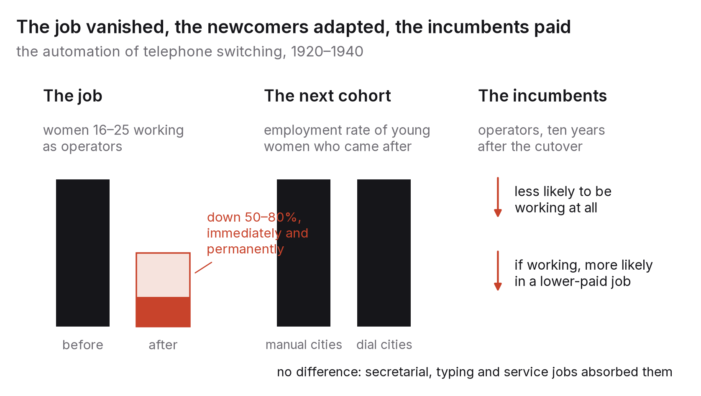

# Chapter 4 — Work: the shape of the next decade

Chapter 3 gave you four channels. This chapter asks how they play out where most readers of this book are actually standing: near the start of a career, in a country whose economy was built on exporting skilled labour, in exactly the kinds of role the exposure studies put near the top of their lists. I won't forecast. I'll lay out three scenarios, show what each implies, and then spend most of the chapter on the one problem that turns up in all three of them, which is what happens to the entry-level job.

## Three scenarios instead of a forecast

Nobody knows how quickly AI capability will improve or how quickly organisations will adopt it. When you can't know, the sensible thing is to hold several scenarios in your head at once and look for choices that hold up across all of them.

In the first, call it slow diffusion, capability keeps improving but adoption is held back by reliability, regulation, liability and the plain slowness of organisational change. It's the electricity pattern from chapter 3, where the technology sits around for years before workplaces are rebuilt around it. The 2030 office looks like the 2026 office with better tools. Most jobs survive, tasks shift at the edges, and people who learn the tools well build an advantage that compounds. The danger here is complacency, because for the first few years it looks as though nothing is happening.

In the second, diffusion is uneven. Some sectors adopt quickly and others slowly, for reasons that have little to do with what is technically possible. Software, marketing, customer support, back-office finance and parts of law move fast, because their output is digital, their mistakes can be undone and their customers are price-sensitive. Healthcare, infrastructure, education and government move slowly, because their mistakes can't be undone, their buyers are regulated and their workflows are tangled up with institutions. The labour market splits: some professions are transformed within five years while others hardly notice. The biggest risk in this world is being trained for a fast-moving profession with slow-moving skills.

In the third, diffusion is fast. Capability jumps, reliability crosses the thresholds that gate autonomy, and adoption follows within a few years because the economics are overwhelming. Whole categories of task get automated, including many the exposure studies had marked as merely augmentable. New tasks appear, but for a while not fast enough to absorb the people displaced. This is the world where the first channel dominates, and it's the one most public discussion quietly assumes. It's possible. It isn't the only possibility, and planning as if it were certain is as big a mistake as planning as if it couldn't happen.

So the test for any decision is whether it holds up in all three. Learning to evaluate AI output does. So does building deep skill in a slow-moving, high-stakes field. Specialising in an already-exposed task and hoping adoption stays slow holds up in exactly one.

## The entry-level paradox

One problem shows up in every scenario, and it lands squarely on students.

Professions have always trained their juniors by handing them the routine work. A first-year law associate reviews documents and drafts standard clauses. A junior analyst builds the spreadsheet and formats the deck. A junior developer fixes small bugs and writes tests. A junior reporter rewrites press releases. Nobody values these tasks for what they produce. They matter because doing them, under supervision, is how a person develops the judgement that senior work depends on.

Unfortunately the tasks that train juniors are precisely the tasks current AI systems do best: well specified, routine, matchable against thousands of earlier examples. So the pressure from the first channel falls hardest on the bottom rung of the ladder, the one everybody has to climb onto first. If a firm can get its document review done by a system, it hires fewer first-years. If it hires fewer first-years, it has fewer people learning to become the partners it will need in fifteen years' time. The firm's short-term incentive and its long-term need point in opposite directions, and firms are not known for resolving that kind of tension in favour of the long term.

The evidence since 2023 fits this picture. The most careful study so far used payroll records covering millions of American workers to follow employment by age and occupation from late 2022, when the current tools became widely available.[^1] For 22- to 25-year-olds in the occupations most exposed to AI, software development and customer service among them, employment fell by about 13 per cent relative to less exposed occupations over the next two and a half years. Older workers in the same occupations held steady or grew. The adjustment came through headcount rather than pay, which is what you'd expect if firms were simply hiring fewer juniors, and it was concentrated in occupations where the technology does tasks rather than assisting with them. Studies of job postings over the same period found entry-level software and analyst postings falling faster than senior ones, and the large technology employers' new-graduate hiring was well below its 2019 and 2022 levels. None of this is conclusive yet. It varies by country and sector, and some of it may be a hangover from the over-hiring of 2021. But it is the pattern the framework predicts, and if you are finishing a degree before 2030 I would plan as though it continues.

## The last time the entry rung vanished

This has happened before, to a job that was once the most common first job in America for a young woman, and the record of what happened next is unusually complete.

In the 1920s, a telephone call went through a person. You lifted the receiver, an operator at the local exchange asked for the number, and she connected you by hand. The work was done overwhelmingly by young, unmarried women, and it was a genuine first rung: a job you could get at sixteen or eighteen with no experience, in every town with an exchange, that taught you to deal with the public and paid better than most of the alternatives. At its peak it accounted for around 4 per cent of the jobs held by the nearly three million young, white, American-born women in the workforce, and about 2 per cent of all female employment.[^2]

Then AT&T automated it. The rotary dial, which let a caller place the call herself, began to spread through the Bell System in the early 1920s, and between 1920 and 1940 exchanges serving more than half of the country's telephones were converted to mechanical switching. Conversion came city by city, on a date known in advance, which is what makes the episode so useful: two economists, James Feigenbaum and Daniel Gross, were able to compare each city before and after its "cutover" and follow the women involved through later censuses.[^2]

Three findings come out of their work, and together they're the clearest picture I know of what happens when an entry rung disappears.

First, the rung really did vanish. After a city's cutover, the number of women aged sixteen to twenty-five working as operators fell by 50 to 80 per cent, immediately and permanently. These weren't jobs that drifted away over a generation. They went in the year the dial arrived.

Second, the next cohort was fine, in aggregate. Young women who came of age in a converted city were no less likely to be employed than those in cities still on manual switching. The operator jobs were replaced by other middle-skill work with a similar wage, typing and secretarial work above all, and by lower-paid service jobs. The labour market absorbed the newcomers, because the people who had never been operators simply started somewhere else.

Third, the women who were already operators paid for it. A decade after their city's cutover, incumbent operators were less likely to be working at all, and those who were working were more likely to be in lower-paid occupations than comparable women elsewhere. A few moved to private switchboards or other jobs in the telephone industry. Most did not. The loss landed on the people whose skill had been specific to the task that was automated, not on the people who came after them.

That pattern is the entry-level paradox resolved, and the resolution is uncomfortable in a different way from the one students usually fear. The economy didn't run out of first jobs. It ran out of *that* first job, and the people hurt most were not the eighteen-year-olds who had to pick a different one, but the twenty-four-year-olds who had already picked it. For a reader finishing a degree now, the lesson cuts two ways. If you haven't yet climbed onto the rung that's narrowing, you have more room to choose a different one than the headlines suggest. If you're already on it, the time to broaden what you can do is before the cutover date, not after.

The analogy has limits, and I'd rather state them than have you find them. Operators were a single, well-defined occupation automated by a single technology on a known schedule. The current tools reach into hundreds of occupations at once and on no schedule anybody can see, which is harder to plan around. And the typing and secretarial jobs that absorbed the next cohort were themselves created by an earlier wave of office technology, which is chapter 3's new-tasks channel doing its work on time. Whether this decade produces its equivalents at the same pace is exactly what the three scenarios disagree about.

How are institutions responding? A few adaptations are already visible. Firms that cut junior headcount tend to raise the bar for the juniors they do take, looking for people who can already do some of the middle-level work (judgement, client contact, thinking at the level of systems), so that the junior role starts to resemble what the second- or third-year role used to be. A smaller number of firms and professions are redesigning training itself, swapping the routine work for supervised use of the tools, structured review of machine output and earlier exposure to real decisions. That's the right response, and it's rare, because it costs senior people's time. And the gap between those who get in and those who don't is widening. When the entry rung narrows, the people who clear it do well and everyone else faces a harder road, so the spread of outcomes within a single graduating class gets wider.

What this means for a student is uncomfortable but clear. Your degree gets you to the door. What gets you through it is evidence that you can already do work that isn't routine. Chapter 10 is about how to build that evidence. For now I just want to make the point that the paradox is structural. It isn't your fault, and it rewards the people who understand it early.

## India specifically

More than most, India's modern economy was built on exporting skilled human labour: software services, business process outsourcing and, more recently, the global capability centres through which multinationals run engineering, finance and analytics teams from Indian cities. These sectors employ several million people and earn a big share of the country's services exports. Their core tasks (writing code to someone else's specification, processing transactions, handling support tickets, maintaining systems) also show up among the most exposed in every study I have seen.

That exposure is a threat and an opportunity at the same time, and which it becomes depends on choices being made right now.

The threat is what I'd call value migration. The IT-services model sells hours of competent labour at a price advantage. Once a system can do the routine hours, that advantage shrinks, and the buyer either pays for fewer hours or moves the work up to where human judgement still earns a premium. Firms that respond by selling the same hours more cheaply will lose. Firms that respond by selling outcomes, systems and judgement can grow, because chapter 3's demand channel is strong in software: when building software gets cheaper, the world wants a lot more of it.

The opportunity is that in this same decade India has the largest cohort of young graduates anywhere, a digital public infrastructure for identity, payments and data exchange that most countries lack, and a domestic market of more than a billion people whose needs are badly served in their own languages. One future has India staffing the world's AI-assisted back office. Another has India building for its own billion users and exporting what it builds. Both are possible, and they ask different things of a graduate.

For an individual graduate, the practical version goes like this. The services-sector entry job of 2026 is about the most exposed job in the country, and the entry-level paradox hits it with full force. The skills that hold their value are the ones that are scarce on both sides of the value migration: understanding a business domain well enough to specify what ought to be built, designing and running systems instead of coding to someone else's spec, and working in the gap between what the tools can do and what a customer actually needs. Chapter 11 comes back to India at length.

## One graduating class, three ways

To make this concrete, picture a class of MCA or B.Tech graduates leaving an Indian college in 2026, and follow them through their first four years under each scenario.

Under slow diffusion, the services firms keep hiring much as before, maybe a little less, at roughly the same salaries. Most of the class joins a large firm, spends six months in training and then two years on maintenance, testing and support. The tools are there, used as assistants, and people still do the routine work, with help. By 2030 this class looks like the class of 2018 with better tooling. Those who used the time to learn a domain and to build systems rather than code to specification are ahead, though not dramatically, and those who didn't still have jobs. The risk is that it all feels safe right up until a different scenario arrives.

Under uneven diffusion, which is the one most consistent with the evidence so far, the big services firms cut fresher intake substantially (several did in 2023 and 2024) and raise the bar for those they do take, so that campus interviews now include system design and a look at real work. The capability centres keep hiring, but for roles that used to go to people with two years of experience. The class splits. Perhaps a third clear the higher bar and start straight away on work that isn't routine. Another third get there more slowly, through smaller firms, startups or contract work. The last third struggle, because the rung they were trained for has gone and nobody warned them in time. The students with a portfolio of verifiable work (the subject of chapter 10) are heavily over-represented in the first group, whatever their college's ranking, because the higher bar is asking for exactly what they have.

Under fast diffusion, junior hiring is cut sharply across sectors, the capability-centre roles narrow too, and the first two years after graduation are hard for most of the class. The portfolio still decides who gets hired; there are just fewer hires. The students who do best go straight for the new-task channel, building and running AI systems for Indian businesses, in Indian languages, for problems the global products ignore (chapter 11 again), where demand is growing fastest and competition is thinnest.

A few things hold in all three versions. A portfolio of verifiable work is the deciding evidence every time. Domain depth and systems skill get rewarded every time. And the student who waits for the market to reveal which scenario is coming finds out at the campus interview, which is about the most expensive way there is to learn it.

## A decade, seen from the inside

One last point, about time, since scenarios can feel abstract.

If you are twenty-two in 2026, the coming decade takes you to thirty-two. Over those ten years, whichever scenario plays out, the tools you use at work will change several times, the tasks you're paid for will shift, and at least one skill you spent years acquiring will become cheap. None of that is specific to AI. It was already true for anyone who started work in 1996 or 2006. What AI changes is the pace. You will have to reinvent part of what you do more often, and in a shorter span.

The people who did well through earlier transitions weren't the ones who guessed the technology correctly. They were the ones who kept a layer of skill that transferred from one setting to the next (judgement, communication, an understanding of how things fit together), who learned each new set of tools quickly enough to stay useful, and who stayed close enough to real problems to notice when the ground moved. You don't need to know which scenario is coming to do any of that. You do need to start before you're forced to.

## What would make this chapter wrong

If by 2031 entry-level hiring in exposed professions is back on its pre-2023 trend, then the paradox was a transitional effect that institutions solved, and I have overstated how long it would last. Check junior job postings and early-career pay in software, law, consulting and finance.

If India's IT-services and capability-centre sectors have grown in both headcount and revenue per employee across the decade, the value-migration threat was managed and my warning about the services entry job should be read as advice that was taken. If headcount fell while revenue held up, the migration happened and the warning stands.

And if fast diffusion is what actually arrived, my even-handedness about the three scenarios will look like hedging. In that case go straight to chapters 10 and 12.

## What to do this year

Work out the one skill in your target role that is hardest to automate, and get measurably better at it. "Measurably" matters here. Aim for evidence, a shipped system, a published analysis, a result someone else can check, rather than a certificate. If you can't name the skill, that's your first task: find three people about five years ahead of you in the role and ask them what they are paid for that a tool can't do yet. Their answers will overlap more than you'd expect.

---

[^1]: Brynjolfsson, E., Chandar, B. & Chen, R. (2025), "Canaries in the Coal Mine? Six Facts about the Recent Employment Effects of Artificial Intelligence", Stanford Digital Economy Lab working paper, August 2025, using ADP payroll data.
[^2]: Feigenbaum, J. & Gross, D. P. (2020, revised), "Automation and the Fate of Young Workers: Evidence from Telephone Operation in the Early 20th Century", NBER Working Paper 28061. The 4 per cent, 2 per cent, "more than half", "50 to 80 per cent" and incumbent-outcome figures are theirs.

### Sources for this chapter
- Brynjolfsson, Chandar & Chen (2025), "Canaries in the Coal Mine?" — early-career employment in exposed occupations.
- Feigenbaum & Gross (2020, revised), NBER Working Paper 28061 — the automation of telephone operation and what happened to incumbents and to the next cohort.
- Acemoglu, D. & Restrepo, P. (2019), "Automation and New Tasks", *Journal of Economic Perspectives* 33(2) — the task framework applied to employment.
- Eloundou, T. et al. (2023), "GPTs are GPTs", arXiv:2303.10130; Gmyrek, P. et al. (2023), ILO Working Paper 96; Cazzaniga, M. et al. (2024), IMF SDN/2024/001 — exposure by occupation and by country income level.
- Brynjolfsson, E., Li, D. & Raymond, L. (2023/2025), "Generative AI at Work", NBER Working Paper 31161 / *Quarterly Journal of Economics* — productivity gains concentrated among less-experienced workers.
- Stanford HAI, *AI Index Report* (2025, 2026) — adoption and hiring indicators.
- NASSCOM, *Technology Sector in India: Strategic Review* (annual editions) — employment and export figures for IT services and GCCs; consult the latest edition for current numbers.
- David, P. A. (1990), "The Dynamo and the Computer", *American Economic Review* 80(2) — the slow-diffusion base rate.
