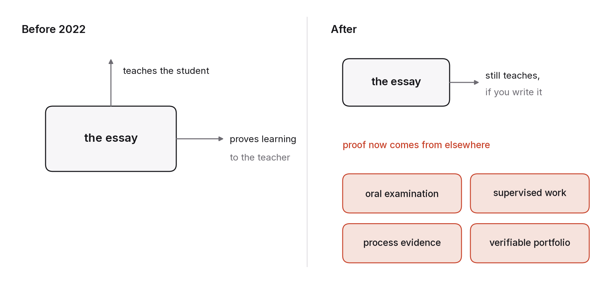

# Chapter 5 — Learning: schools, colleges and the end of the essay as proof

For roughly two centuries, education has run on a convenient coincidence. The things students produce in order to learn (essays, problem sets, programs, proofs) were also the things that proved they had learned. Set an essay and it did two jobs at once: writing it taught the student, and reading it told the teacher what the student knew. The coincidence was never perfect, but it was good enough to build whole systems of grading, credentials and admissions on top of.

Late in 2022 it ended. A student can now turn in a competent essay, a working program or a correct proof without having learned anything at all, in less time than it takes to read the assignment. The essay still teaches, if the student actually writes it. What it no longer does is prove anything, because the teacher can't tell whether the student wrote it.

This chapter is about what happens to learning once proof and practice come apart, what the technology really does offer learners, and what a curriculum should look like when the tools can do the exercises. I've written it for students and for the people who teach them, because both groups are about to be asked to change, and the ones who understand why will change better.

## When the artefact stops carrying information

I'll call the problem assessment collapse: the sudden loss of information from the artefacts education relied on to measure learning.

The first responses were predictable, and most of them have failed. Detection tools that claim to spot machine-written text have error rates that make them unusable for decisions that matter, and they fail worst on people writing in a second language.[^1] Bans can't be enforced outside a supervised room. Carrying on as though nothing had changed produces grades that measure access to the tools rather than learning.

The responses that do work have one thing in common: they move assessment back toward things that can be observed directly.

The oldest is the oral exam: ask the student to explain their work, defend it and take it a step further, in conversation. It costs a great deal of teacher time, and it has been the standard for doctoral degrees for centuries precisely because it is so hard to fake. It's now coming back at every level. A student who can talk sensibly about an essay they handed in has learned something. One who can't hasn't, however good the essay looks.

Supervised work is the second: writing, problem-solving or coding done in a room where the conditions are known. It measures what a student can do alone, which is worth measuring, though it isn't the only thing worth measuring.

Process evidence is the third. Drafts, version history, notes, the record of how a piece of work came to exist. A student who shows the route has shown the learning. This is already normal in software (commit history), in mathematics (scratch work) and in art and design (the portfolio of attempts), and it generalises to most subjects.

And over a term or a whole degree, a student can build up a portfolio of verifiable work: things other people have used, tested, built on or cited. A program running in production, an analysis someone acted on, a result someone else reproduced. These are hard to fake because the world pushes back on them.

In each case the question being asked shifts from "what did you produce?" to "what can you do, and how did you do it?". That shift is right, it's overdue, and it means more work for everyone involved. It also happens to bring assessment into line with what employers were already asking for, which chapter 10 takes up.

## The detector

After late 2022 the first instinct of many institutions was to buy a detector. What happened next is the clearest lesson I know of in why that instinct doesn't work.

In April 2023 the largest supplier of plagiarism-checking software to universities switched on an AI-writing detector for its institutional customers and reported a false-positive rate below one per cent at the level of a whole document.[^4] One per cent sounds small until you do the arithmetic. A large university pushes tens of thousands of submissions through such a system every term, and at one per cent that's several hundred students a term accused of something they didn't do, with no way to prove a negative, in a process where the accusation is itself the punishment. Within months a number of universities had switched the feature off. One of the first, a large private university in the United States, explained its decision publicly in August 2023: the vendor couldn't explain how the detector reached its verdicts, the false-positive rate couldn't be independently checked, and even the claimed rate would wrongly flag an unacceptable number of honest students.[^5]

A study published that same summer exposed a deeper problem.[^1] The researchers took essays written by non-native English speakers for a standardised English test, written before any of these tools existed, and ran them through seven commercial detectors. The detectors classified more than half of them as machine-written on average, and almost all of them were flagged by at least one detector. Essays by American eighth-graders, run through the same tools, were classified as human-written nearly every time. The detectors were reacting to the features of careful, simpler, more formulaic prose, which is what second-language writers tend to produce and what language models also produce. So the students most likely to be falsely accused were the ones least able to fight the accusation.

That's why I think this problem is structural rather than something better detectors will fix. A detector is a classifier in an arms race against a generator that improves faster than it does. Its errors fall on innocent people, in a setting where a false accusation does real harm. And even a perfect detector would be answering the wrong question, because the problem was never catching the student who used the tool. It was knowing what the student learned. The institutions that coped best stopped asking the essay to prove learning and started asking the student.

## What the technology does offer

It would be a mistake to see AI in education only as a threat to assessment. The same capability that has broken the essay as proof makes available something education has wanted for a very long time.

In 1984 the educational psychologist Benjamin Bloom reported what became known as the two-sigma problem.[^2] Students taught one to one by a skilled tutor performed about two standard deviations better than students taught in an ordinary classroom, which means the average tutored student outperformed roughly 98 per cent of the classroom-taught group. The "problem" in the name was that individual tutoring was far too expensive to provide at scale, and Bloom challenged researchers to find classroom methods that came close to its effect.

AI tutors are the first technology that plausibly attacks that problem head on: a patient explainer that is always available, adapts to the individual and never gets tired of the same question asked a fourth way. Early controlled studies in real courses have found meaningful gains, in at least one case larger than those from well-designed active learning, when the tutor was built to guide students rather than hand them answers.[^3]

The promise needs a few caveats to stay honest.

Access is the first. A tutor that needs a good device, a fast connection, fluent English and a habit of asking questions will reach the students who already have the most. Without deliberate design, AI tutoring widens the very gap it could close. In India, as chapter 11 discusses, this is the central design problem.

Motivation is the second. Bloom's tutors didn't just explain things. They held students to account, noticed when attention drifted, and cared how things went. The explaining part of tutoring is now cheap. The caring part isn't, and twenty years of online education suggest that explanation without accountability reaches the students who were already motivated and loses most of the rest.

The third is that a tutor isn't a syllabus. A system that answers questions well is not a curriculum. Somebody still has to decide what should be learned, in what order, to what standard and for what reason. The schools and colleges that do well will be the ones that keep that design job for themselves and use the tools to deliver it, rather than handing the job over to the tool.

So the realistic promise is not two sigmas for everyone. It's that the explaining part of teaching becomes cheap and good, which frees human teachers for the parts that were always scarce: motivation, judgement, accountability and deciding what is worth learning in the first place.

## What a computing degree should look like

Take the degree most readers of this book have or are working towards: a computing degree, an MCA or a B.Tech in computer science, in the country that produces more of them than any other.

The traditional curriculum spends a lot of its time teaching students to produce things that machines now produce on demand: syntax, standard algorithms written from memory, boilerplate, routine debugging. Students still need to understand all of that. They no longer need it to be what they're paid for, and a curriculum that treats it as the destination is training people for the entry-level jobs that chapter 4 showed are narrowing.

I'd change five things. First, move from writing code toward specifying, reading and verifying it. The scarce skills are knowing what should be built, judging whether what got built is right, and working out why when it isn't. Students should spend as much time reviewing code they didn't write, with and without machine help, as writing their own.

Second, move from the solution to the problem. Framing problems, gathering requirements and understanding a domain well enough to know what matters all come before any code is written, and the tools are bad at them. They can be taught, mostly by giving students real, messy problems instead of tidy exercises.

Third, move from individual programs to systems: how components fit together, fail and recover, how data flows, where latency and cost come from, what breaks at scale. Systems thinking sits above any single program, and it keeps its value when programs become cheap. (It's also the subject of this book's companion volume.)

Fourth, move from trusting output to measuring it. Every graduate should be able to evaluate a model, a system or a claim: build a test set, read a result, spot a confound, and know what a number does and doesn't show. Chapter 2 argued that evaluation is a civic skill. For a computing graduate it's a professional one.

Fifth, move from the exam to the portfolio. The proof a degree offers should be a body of verifiable work (systems that run, analyses that hold up, contributions other people accepted) rather than a transcript of supervised exams. Colleges that put the portfolio at the centre will turn out graduates who can clear the narrowed entry rung. Colleges that don't will turn out graduates whose credential means a little less every year.

None of this means giving up on fundamentals. Data structures, algorithms, probability, operating systems and networks matter more when the tools are powerful, because they are what lets a person tell good output from merely plausible output. What changes is that fundamentals get taught as a basis for judgement instead of as a list of things to reproduce in an exam hall.

## What you can do without waiting for your college

Institutions change slowly, for the reasons chapter 3 gave. You don't have to wait for yours.

Use the tools to learn, not to skip learning. The difference is whether you can do the thing afterwards without them, and there's an easy test: after a system has helped you with a problem, close it and solve a similar problem on your own. If you can, you learned something. If you can't, you were shown something.

Start your portfolio now. One verifiable piece of work per term is enough to put you ahead of most of a graduating class by the time it counts. Verifiable means somebody else used it, ran it or checked it.

Practise explaining. Oral examination is making a comeback, and in any case it's what every technical interview and most meetings amount to. Being able to say clearly what you did, why you did it and what you'd change is a skill, and it's one no tool can perform for you when you're the one in the room.

Pick a domain. Computing applied to a field you understand (finance, health, agriculture, logistics, law) is worth far more than computing on its own, because the scarce input is knowing what the field needs. India has plenty of underserved fields and very few people who understand both the field and the technology. That gap is a career.

## What would make this chapter wrong

If by 2031 assessment has mostly moved to supervised, oral and portfolio forms and the change went smoothly, the word "collapse" will look melodramatic, and this chapter will be useful mainly as a record of why the change happened. Check whether the major universities and school boards changed their assessment rules between 2024 and 2030, and how.

If AI tutoring has produced large, broad and well-measured learning gains across income levels, my caveats about access and motivation were too gloomy and I underestimated what good design could do. Look especially at randomised studies with low-income and non-English-speaking students.

And if detection tools have become reliable enough for consequential decisions, which seems unlikely to me, part of the assessment-collapse argument weakens. Before believing any vendor, check the false-positive rate on second-language writers.

## What to do this year

Build one thing that a system can't do for you, and document how you did it. Pick a problem that requires talking to real people, collecting data that isn't online, or making a call that depends on context the tools don't have. Keep the drafts, the dead ends and the notes. At the end you'll have a piece of work that proves what an essay no longer can, plus a record of how you got there that's worth more than the result.

---

[^1]: Liang, W., Yuksekgonul, M., Mao, Y., Wu, E. & Zou, J. (2023), "GPT detectors are biased against non-native English writers", *Patterns* 4(7).
[^2]: Bloom, B. S. (1984), "The 2 Sigma Problem: The Search for Methods of Group Instruction as Effective as One-to-One Tutoring", *Educational Researcher* 13(6).
[^3]: Kestin, G., Miller, K., Klales, A., Milbourne, T. & Ponti, G. (2025), "AI tutoring outperforms in-class active learning: an RCT introducing a novel research-based design in an authentic educational setting", *Scientific Reports* 15 — one of the first randomised comparisons in a real university course; read its scope and limitations before generalising.
[^4]: Turnitin (2023), "AI writing detection" product announcement and FAQ, April 2023, stating a document-level false-positive rate below 1 per cent.
[^5]: Vanderbilt University (2023), "Guidance on AI detection and why we're disabling Turnitin's AI detector", Brightspace / Center for Teaching announcement, 16 August 2023.

### Sources for this chapter
- Bloom (1984), *Educational Researcher* 13(6) — the two-sigma problem.
- Liang et al. (2023), *Patterns* 4(7) — detector bias against non-native writers.
- Kestin et al. (2025), *Scientific Reports* 15 — AI tutoring RCT.
- Freeman, S. et al. (2014), "Active learning increases student performance in science, engineering, and mathematics", *PNAS* 111(23) — the active-learning baseline that tutoring studies compare against.
- UNESCO (2023), *Guidance for generative AI in education and research* — the policy response to assessment collapse.
- Turnitin (2023); Vanderbilt University (2023) — the detector case.
