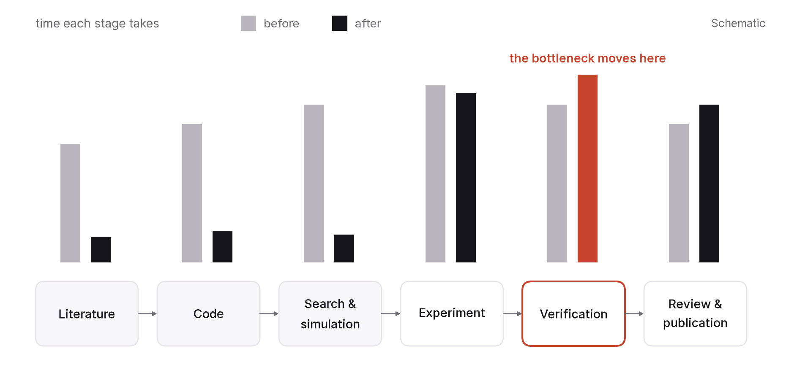

# Chapter 6 — Science and engineering: faster, not automatically better

In 2020 a system called AlphaFold predicted the three-dimensional shapes of proteins from their amino-acid sequences with an accuracy biologists had been chasing for fifty years, and within two years its predicted structures for nearly every known protein were free for anyone to download.[^1] It's still the clearest case of AI changing what a science can do. I want to start with it because of what it didn't do. It didn't run the experiments that confirmed the predictions, decide which proteins mattered, write or review the papers, or persuade anyone to change a drug programme. It made one step in a long chain enormously faster, and the rest of the chain reorganised itself around a new bottleneck.

That pattern is what this chapter is about. AI speeds up particular steps of research and engineering, sometimes dramatically. Speeding up one step moves the bottleneck to the next one, and the next one is usually limited by something physical, institutional or human: an experiment that takes a week, a review that takes a month, a verification that takes a career. If you know where the bottleneck is moving, you know where the work, and the value, are moving with it.

## Where things speed up

There are four main places, which I'll take roughly in order of how settled the evidence is.

The first is the literature: reading, summarising, searching and connecting what's been published. A researcher can now survey a field in days rather than months, pick out the three papers that matter from three thousand, and get a serviceable summary of a technique outside their own speciality. That's real, and it's already changing how research gets done. It also produces exactly the failure chapter 2 warned about: fluent summaries of papers that don't say what the summary claims, and citations to papers that don't exist. The speed-up is in finding and skimming. Verifying still means a person reading the actual paper.

Code comes next. Analysis scripts, simulations, data pipelines, the glue that holds research software together. A lot of time in computational research goes into code that isn't the point of the research, and that's precisely the code current systems write well. The scientist who used to lose a week getting a pipeline to run loses a day and spends the rest on the question. The risk is code that runs and is wrong, which was always the risk with research software and is now easier to produce in bulk.

Then simulation and search: predicting properties of molecules, materials, proteins and designs, proposing candidates for experiments, cutting a search space of millions down to hundreds. AlphaFold lives here, along with a growing number of systems in chemistry, materials science and engineering design. The gains are biggest where the space of possibilities is huge, testing each one is expensive, and a reasonably accurate predictor can eliminate most candidates before anyone builds anything.

Last is analysis: finding structure in big datasets, fitting models, generating hypotheses from patterns. It's powerful, and it's where the line between "the system found something" and "the system found something that's actually there" is thinnest. Every statistical sin that has dogged empirical science, from fishing for significance to overfitting to missed confounds, can now be committed faster.

Each of these is a genuine acceleration, and each one moves the bottleneck.

## Where the bottleneck goes

It goes first to experiments. If a system can propose a thousand candidate molecules in an afternoon and the lab can make and test ten a week, the lab is the constraint. Automated labs, robotic synthesis and high-throughput screening are the response, but they're expensive, slow to build and well behind the software. For most of this decade, any science that has to touch the physical world will be rate-limited by it.

It goes to verification. A result isn't knowledge until somebody has checked it, and checking hasn't got any faster. If anything the flood of plausible-looking results has slowed it down, because reviewers and replicators have more to check and less to go on about which checks matter. The fields that cope best will be the ones that make verification cheap by design, with code and data published alongside every result, automated reproduction and analyses registered in advance.

It goes to review and publication. Peer review was already under strain before 2023. Since then, submissions have risen sharply in several fields, more and more of them show signs of machine drafting, and the supply of reviewers hasn't grown. Venues have responded by tightening requirements and, in some cases, by refusing whole categories of paper that are easy to generate and hard to evaluate. The institution of publication is being renegotiated as we watch, and the direction is toward demanding evidence that's harder to fake.

And it goes to judgement: which question is worth asking, which anomaly is a discovery and which is a bug, when a result is good enough to act on. These were always the scarce inputs to research, and speeding up everything else makes them relatively scarcer. A researcher who used to spend most of the week on pipeline code now spends most of it on judgement, which is harder to learn and harder to teach.

If you're heading into research or engineering, here is the short version as I see it: the parts of the job that felt like work are getting easier, and the parts that felt like the job are getting more important.

## The reproducibility dividend

One second-order effect deserves its own section, because it changes what counts as credible, and credibility is what many readers of this book are trying to build.

When plausible results are cheap to produce, results that can be checked become more valuable. A paper that comes with its code, its data, its exact environment and a one-command reproduction is more believable than one without, and the gap between the two kinds widens as the cost of producing the second kind falls towards nothing. Journals and conferences are already moving towards requiring these artefacts. Hiring committees and recruiters, who have always treated publications as a signal, are learning to give reproducible work more weight than the rest.

That works in your favour. A student with one small, fully reproducible, honestly reported result has something a hundred fluent summaries can't buy: evidence of exactly the judgement the bottleneck has moved to. Code, plus data, plus a frank section on limitations, is the new unit of credibility, and anyone with a laptop and some discipline can produce it.

Engineering works the same way. A benchmark other people can run is worth more than a performance claim. A design document that records what was measured and what was assumed is worth more than one that only records the decision. In a decade when plausibility is cheap, I think making your work checkable is the professional habit that matters most.

## Engineering in particular

Engineering is research's practical sibling, and the pattern holds there with one difference. In engineering the bottleneck was already judgement and integration rather than production, and the speed-up just makes that easier to see.

Writing software, designing systems, specifying hardware: the production steps get faster. Knowing what to build doesn't. Nor does knowing whether it will work under conditions nobody tested, or keeping it working as the world changes around it. The engineering disciplines that will do well are the ones that already prized those things (reliability engineering, systems design, safety engineering), and the engineers who will do well are the ones who can hold a whole system in their heads and ask what breaks.

There's also a new category of engineering work, which is building and running the AI systems themselves. Evaluation, monitoring, guardrails, data pipelines, integration: the unglamorous reliability work that turns a model into a product. It's a new-task channel in chapter 3's sense, it's where a lot of the hiring is, and it rewards exactly the measurement discipline that this chapter and chapter 2 describe. It's also the work I do, so I'm biased, but I don't think I'm wrong.

## Materials discovery, 2023–2024

Over about eighteen months, one field produced the clearest illustration I know of every point in this chapter.

In November 2023 a Google DeepMind team published GNoME, a system that used graph neural networks to predict the stability of around 2.2 million candidate crystal structures, about 381,000 of which were reported as new stable materials.[^2] That was presented as an order-of-magnitude expansion of a catalogue the field had spent decades building. In the same issue of the same journal, a Berkeley team described the A-Lab, an autonomous laboratory that used robots and machine-learning planning to synthesise materials proposed by predictions like these, and reported making 41 of 58 target compounds in 17 days of continuous running.[^3] Taken together, the two papers were presented, not unreasonably, as a glimpse of science at machine speed: a model proposes hundreds of thousands of candidates, a robot makes them, and the loop closes without a person in the middle.

Then came verification, carried out slowly, in public, by people. Within months two experienced solid-state chemists analysed a sample of the GNoME "new" materials and concluded that many weren't new in any useful sense.[^4] Some were known compounds with one element swapped for a chemically similar one. Some were ordered versions of phases already known in disordered form. Some contained radioactive or otherwise impractical elements, and some counted as novel only because of the catalogue's narrow definition of "known". A separate group went back over the A-Lab's 41 claimed syntheses and argued that for a substantial fraction the evidence didn't support the claim: in their reading, the automated analysis of the X-ray data had mistaken known phases for the intended new ones, and several of the "novel" compounds were already in the literature.[^5] The original authors replied, the exchange went on, and the field settled on a more careful position than either the original papers or the first critiques had taken.

You can find every mechanism from this chapter in that episode. The acceleration was real; the search space really was pruned by a factor no human team could have managed. The bottleneck moved, just as you'd expect, from proposing candidates to verifying them, and verification turned out to need the two scarcest inputs, expert chemists and careful measurement, in quantities no amount of prediction speed could supply. The publishing system strained: both papers passed review at the field's most prestigious journal, and the checks that counted came afterwards, from readers. And the reproducibility dividend paid out. The critiques were only possible because the original teams had published their predictions and data in full, which is to their credit, and by the end the most trusted researchers were the ones who had shown their checking rather than their speed.

I don't take the lesson to be that the systems failed. It's that "we predicted 381,000 new materials" and "we have 381,000 new materials" are different sentences, the distance between them is measured in human verification, and the people who can close that distance, in any field, are the ones this decade will need most.

## What would make this chapter wrong

If by 2031 automated labs and simulation have made the physical bottleneck much less binding, with AI-proposed candidates routinely tested at scale, then I underestimated how fast the experimental side could catch up. Check how many AI-originated discoveries reached clinical or industrial use.

If peer review and verification have largely been automated, with trusted AI reviewers and automatic reproduction, the verification bottleneck moved faster than I've argued. Check whether major venues accept or require automated review, and whether reproduction rates improved.

If instead the volume of low-quality machine-assisted research has swamped the field's ability to sort it, I was too optimistic about institutions adapting, and the reproducibility dividend is even bigger than I've described, because checkable work is rarer.

## What to do this year

Reproduce one published result from start to finish. Pick a paper in your field with public code and data, run it, and see whether you get the paper's numbers. Write down everything that was missing, ambiguous or wrong in what was published. You'll learn what the result actually depends on, how rarely published work reproduces cleanly, and what your own work needs to include to be worth more than the average. Then publish your reproduction, with its code, as a short note. It counts as a first paper, it's honest, and it's the kind of work the next decade rewards.

---

[^1]: Jumper, J. et al. (2021), "Highly accurate protein structure prediction with AlphaFold", *Nature* 596; Varadi, M. et al. (2022), "AlphaFold Protein Structure Database", *Nucleic Acids Research* 50(D1).
[^2]: Merchant, A. et al. (2023), "Scaling deep learning for materials discovery", *Nature* 624, 80–85.
[^3]: Szymanski, N. J. et al. (2023), "An autonomous laboratory for the accelerated synthesis of novel materials", *Nature* 624, 86–91.
[^4]: Cheetham, A. K. & Seshadri, R. (2024), "Artificial Intelligence Driving Materials Discovery? Perspective on the Article: Scaling Deep Learning for Materials Discovery", *Chemistry of Materials* 36(8), 3490–3495.
[^5]: Leeman, J. et al. (2024), "Challenges in High-Throughput Inorganic Materials Prediction and Autonomous Synthesis", *PRX Energy* 3, 011002.

### Sources for this chapter
- Jumper et al. (2021), *Nature* 596 — AlphaFold; Varadi et al. (2022) — the open database.
- Merchant et al. (2023); Szymanski et al. (2023); Cheetham & Seshadri (2024); Leeman et al. (2024) — the materials-discovery case and its re-examination.
- Nosek, B. A. et al. (2015), "Promoting an open research culture", *Science* 348(6242) — the transparency and openness guidelines behind artefact requirements.
- arXiv (2025), "Updated practice for review articles and position papers in the CS category", arXiv blog, 31 October 2025 — a publication institution responding to machine-drafted submissions.
- Baker, M. (2016), "1,500 scientists lift the lid on reproducibility", *Nature* 533 — the pre-AI baseline on reproducibility.
