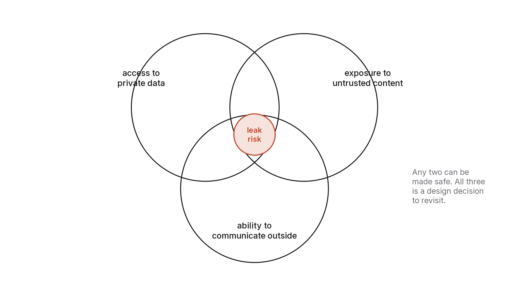

# Chapter 8 — Trust, security and the information commons

Early in 2024 an employee in the Hong Kong office of a multinational engineering firm joined a video call with what looked like the company's chief financial officer and several colleagues, and on their instructions transferred about HK$200 million, roughly US$25 million, to a set of accounts. Everyone else on that call was synthetic. Their faces and voices had been generated from publicly available footage. The employee had been suspicious of the original email, and what reassured them was precisely that the people on the call looked and sounded like who they said they were.[^1]

I find the case useful because it isn't a story about a gullible person. It's about an assumption that held for the whole of human history and then quietly stopped holding: that a face and voice you recognise, moving and talking in real time, belong to the person you think they do. Banking, journalism, politics, family life and ordinary courtesy all leaned on that assumption. This chapter is about what replaces it, and about two related shifts: the new attack surface that appears when software starts acting on our behalf, and what happens to shared public knowledge once most new text on the internet is written by machines.

The same thread runs through all three. Once a convincing artefact becomes cheap to produce, the artefact stops being evidence, and the weight moves to provenance: where did this come from, who signed it, and can I check? That's a change in habits as much as in technology, and the habits are the part you control.

## The end of seeing is believing

A few facts set the terms here.

Synthetic audio, images and video are now good enough to fool attentive people in ordinary conditions, and they're still improving. Audio is the most dangerous of the three. It needs the least source material (a few seconds of someone's voice is enough for a usable clone), and phone audio was always low quality, so the artefacts hide easily.

The cost has fallen to almost nothing. A voice clone, a face swap on a live call or a photorealistic picture of an event that never happened can be made in minutes, on a phone, by someone with no technical skill.

And detection doesn't scale. Tools that try to judge from the content alone whether media is real are in an arms race they're built to lose, since every improvement in detection becomes a training signal for the next generator, and a detector that is wrong one time in twenty is no use for decisions that matter. Detection is still a useful signal for a trained investigator alongside other evidence. It isn't a solution for the public.

Put those together and the burden has to shift from the receiving end ("can I tell this is fake?") to the producing end ("can this prove where it came from?"). That is what provenance infrastructure tries to do.

### Provenance: C2PA and Content Credentials

The main open standard comes from the Coalition for Content Provenance and Authenticity (C2PA), set up in 2021 by a group that included Adobe, Microsoft, the BBC, Intel and Arm, which published its first specification in January 2022.[^2] The idea is simple. When a piece of media is created or edited, the device or software attaches a cryptographically signed manifest recording who made it, with what tool, and what edits were made. Each later edit adds another signed entry. Anyone viewing the file can inspect that chain (branded "Content Credentials") and check the signatures. If the manifest is intact and you trust the signer, you know the file's history. If there's no manifest, all you know is that there's no manifest.

Between 2023 and 2026 this moved from standards documents into products. Cameras started signing images at the moment of capture (the first consumer camera with built-in Content Credentials shipped in late 2023, and mainstream phones followed). The big image generators began attaching provenance data to their output, and several large social platforms began reading it and labelling content accordingly. The EU AI Act's transparency rules, applying from 2026, require AI-generated content to be marked in a machine-readable way, which pushes the whole ecosystem towards some standard like this, whether or not it ends up being C2PA.

Next to signed manifests there's watermarking, which hides a signal in the generated content itself, invisible to people but detectable by a tool that knows the key. Google DeepMind's SynthID family, introduced from 2023 and partly open-sourced in 2024, is the best-known example. Watermarks can survive some edits that strip metadata. They can also be removed by a determined attacker, and they only mark content from generators that choose to watermark.

Two limits matter more than any of the technical detail. The first is that provenance proves the origin of signed content and says nothing at all about unsigned content, which means most of the internet and all of history. Widespread provenance gives you a world in which trustworthy content can prove itself. It doesn't give you a world in which untrustworthy content gets caught. The practical result is a change in default, from "assume it's real unless shown to be fake" to "assume it's unverified unless shown to be real". That's an uncomfortable default to live with, and it's where we're heading.

The second is that provenance is only as good as the signing keys and the organisations behind them. A signed manifest from a signer you've never heard of proves nothing. The trust infrastructure (who may sign, how keys get revoked, how a viewer knows which signers to believe) is the hard part, and it's being built now, much as certificate authorities were built for the web in the late 1990s, with the same failures still to come.

### The human protocol

Technology sets the floor, but habits decide what actually happens. The habits that security-conscious organisations already had are becoming everybody's. In 2024 American law enforcement publicly recommended the family version: a shared secret word for emergencies, calling back on a number you already know before acting on any urgent request for money or passwords, and treating urgency itself as a warning sign.[^3] Inside institutions the equivalents are confirming payments above a threshold through a second channel, signing any instruction that moves money or data, and the principle that no single channel is enough to authorise something irreversible.

None of this is new. What's new is that it now applies to everyone, including people who never thought of themselves as targets, because the cost of targeting them has dropped below the value of what they can be talked into doing.

## When software acts, there's a new attack surface

The second shift is quieter and, if you build software, more urgent.

Until recently software took instructions from its developer and data from its user, and the two stayed separate: the developer wrote the code, the user supplied the data, and nothing in the data could change what the code did. Systems built on language models blur that line by design. The model receives instructions and data through the same channel, as text, and it can't reliably tell which is which. Anything the model reads (a web page, an email, a document, a search result) can contain instructions that it might follow.

This is prompt injection. It was named in 2022 and has sat at the top of the OWASP Top 10 for Large Language Model Applications since that list's first edition in 2023.[^4] The indirect form, where the malicious instruction is hidden in content the system retrieves rather than typed by the user, was described formally in 2023, and it's the version that matters for agents. A system that reads your email to summarise it can be told, by an email, to forward your inbox somewhere. A system that browses the web to answer a question can be told, by a web page, to visit an address that leaks what it knows.

Several things make this harder than the injection attacks software engineers already know.

There's no complete defence. SQL injection was solved, in principle, by keeping code and data apart at the interface. Language models have no such interface, because instructions and data are the same kind of thing to them. Mitigations exist and are getting better (instruction hierarchies, input filtering, constraints on output, separate models for handling untrusted content), but none of them is a guarantee. Any system that reads untrusted text has to be designed on the assumption that it will sometimes obey instructions hidden in that text.

The damage grows with what the system can do. A chatbot that can only reply is embarrassing when it gets injected. A system that can send email, move money, change files or call other systems is dangerous. The most useful rule of thumb I know for when the danger becomes acute is a combination of three properties: access to private data, exposure to untrusted content, and the ability to communicate with the outside world.[^5] A system with all three can be made to leak what it knows, and that combination should be treated as a design smell in the same way "stores passwords in plain text" is.

And users often can't see the attack. The injected instruction might be white text on a white background, a comment buried in a file, a string in some tool's output. The user asked for a summary and got one; the leak happened somewhere in between.

### What this means if you build with language models

By the end of the decade most people in software will be writing code that touches a language model, and the discipline that goes with it is a security discipline. Its outline is already fairly clear.

Give agents the narrowest permissions that let them do the job, scoped to the task, revocable, and separate from the user's own credentials wherever you can. "It needs to read the inbox" doesn't mean "it may send mail".

Treat everything retrieved as hostile. Text from the web, from documents, from other systems' output and from other agents is data and never instruction. Design things so that an attacker who controls that text can, at worst, spoil the answer.

Require a person to confirm anything irreversible. Sending, paying, deleting, publishing, granting access: a person approves each one, specifically, rather than giving a blanket yes at the start. It's slower, and it's the price of safety until these systems earn more trust, which chapter 9 discusses.

Log everything, on the assumption that you'll need the log. When something goes wrong, and something will, the questions are what the system read, what it decided and what it did. If you can't answer them, you can't fix anything.

And test adversarially. A system tested only with cooperative inputs hasn't really been tested. Red-teaming, suites of injection tests and the habit of asking "what if this page is malicious?" belong in the build, not in a post-mortem.

If you're a student aiming at security or infrastructure, this is one of the most promising areas of the decade: a genuinely new class of vulnerability, no settled fix, enormous deployment, and very few people who understand both the machine-learning side and the security side. Chapter 10 comes back to this.

## The information commons after the flood

The third shift is the slowest, and it affects anyone who reads.

For about thirty years the public web grew through human effort. People wrote pages, answered each other's questions on forums, maintained encyclopaedias, published code and argued in comment threads, and all of that became the training data for the systems now writing a growing share of new text. Some of the consequences are already visible.

There's volume without provenance. Machine-written text is cheap and, at a glance, indistinguishable from the human kind, so the synthetic share of new public text is rising, and there's no reliable way to measure by how much. Search engines, which ranked pages using signals of human attention and links, are coping unevenly. You get more plausible, generic, lightly sourced pages competing for the same queries, and it gets harder to find the one written by somebody who actually knew.

There's a feedback problem. Systems trained on web text will increasingly be trained on text produced by earlier systems. Research published in 2024 showed that models trained recursively on their own output degrade, losing the tails of the distribution first (the rare, specific, surprising material) and drifting toward a bland middle.[^6] It isn't inevitable, since curation, filtering and fresh human data can prevent it. But it does mean that human-made, verified, specific content becomes more valuable, both as training data and as reference material, because it's the thing these systems can't produce for themselves.

And the commons that fed the models is shrinking. Community question-and-answer sites saw big drops in new questions after 2022 as people started asking models instead, even though those models had learned from those very sites. In 2025 publishers and infrastructure providers began blocking AI crawlers by default and experimenting with charging for access. The free, open, human-written web that made today's systems possible is being fenced off from one side and diluted from the other. Nobody yet knows what replaces it as the base layer of public knowledge, and the answer will involve money, licensing and law as much as technology.

For a reader, the implication is the one that has run through this book since chapter 2. When plausible text costs nothing, the scarce goods are originality (something that isn't already on the web), verification (something checked against the world) and accountability (a named person standing behind it). Search engines are trying to reward these, readers are learning to look for them, and the institutions that certify them, journals, newsrooms, professional bodies, are recovering some of the authority they'd lost. Original, checked, signed work is going up in value precisely because the alternative is now unlimited.

If you're building a public reputation, which chapter 10 treats as part of a personal strategy for the decade, this is basically the whole game. Write what hasn't already been written, show how you checked it, and put your name on it.

## What would make this chapter wrong

If by 2031 provenance is close to universal, with most cameras, phones, platforms and generators signing and displaying credentials and a working trust system behind them, then the "assume unverified" default will have arrived faster and more comfortably than I expect, and my warnings about keys and adoption gaps were too cautious. Check what share of content on the major platforms carries verifiable credentials.

If prompt injection has largely been solved through architectures that genuinely separate instructions from data, then the agent-security section describes a passing problem. Check whether OWASP still ranks it first, and whether serious incidents fell even as deployment grew.

If the information commons has been rebuilt on new terms (licensed human content, fair pay for contributors, search that ranks by provenance) and public knowledge is measurably healthier than in 2026, then calling it a flood was too pessimistic. Check contribution rates to the big open projects and the measured synthetic share of search results.

And if, on the other hand, a major democratic election has visibly been swung by synthetic media, or a large institution has been brought down by an injected agent, then I understated the near-term harms, and the habits I recommend were more urgent than I made them sound.

## What to do this year

Build provenance and verification habits into your own publishing. Sign what you publish: put your name and a stable identity on your work and keep one authoritative home for it. Where your tools allow it, attach content credentials to the images and documents you produce. Cite primary sources with dates, and check that they exist. Agree a verification routine with your family and your team for any request involving money, passwords or urgency, and use it even when it feels silly. And if you build software that uses a language model, write down, before you ship, what text it reads from untrusted sources and the worst thing that text could make it do. If the answer is unacceptable, change the design. That alone will put you ahead of most of the industry.

---

[^1]: Hong Kong Police press briefing, 4 February 2024, as reported by RTHK, CNN and the *South China Morning Post*; the firm was later identified in press reports as Arup.
[^2]: Coalition for Content Provenance and Authenticity, *C2PA Technical Specification*, version 1.0, January 2022, and subsequent 2.x releases, c2pa.org.
[^3]: US Federal Bureau of Investigation, Public Service Announcement I-120324-PSA, "Criminals Use Generative Artificial Intelligence to Facilitate Financial and Romance Fraud", 3 December 2024.
[^4]: OWASP Foundation, *OWASP Top 10 for Large Language Model Applications*, version 1.0 (August 2023) and the 2025 edition; Greshake, K. et al. (2023), "Not what you've signed up for: Compromising Real-World LLM-Integrated Applications with Indirect Prompt Injection", *AISec '23*.
[^5]: Willison, S. (2025), "The lethal trifecta for AI agents: private data, untrusted content, and external communication", simonwillison.net, 16 June 2025.
[^6]: Shumailov, I. et al. (2024), "AI models collapse when trained on recursively generated data", *Nature* 631, 755–759.

### Sources for this chapter
- C2PA Technical Specification (2022–2025); Content Authenticity Initiative documentation.
- Google DeepMind, SynthID (2023); "SynthID-Text" open-source release and *Nature* paper, Dathathri et al. (2024), *Nature* 634.
- Regulation (EU) 2024/1689, Article 50 (transparency obligations for synthetic content).
- OWASP Top 10 for LLM Applications (2023, 2025); Greshake et al. (2023); Willison (2022, 2025) on prompt injection and the lethal trifecta.
- Shumailov et al. (2024), *Nature* 631 — model collapse.
- FBI PSA I-120324-PSA (December 2024) — family verification practices.
- Cloudflare (2025), announcements on default blocking of AI crawlers and pay-per-crawl, 1 July 2025.
- Reporting on the Hong Kong deepfake video-call fraud (February 2024) and the New Hampshire synthetic robocall (January 2024).
