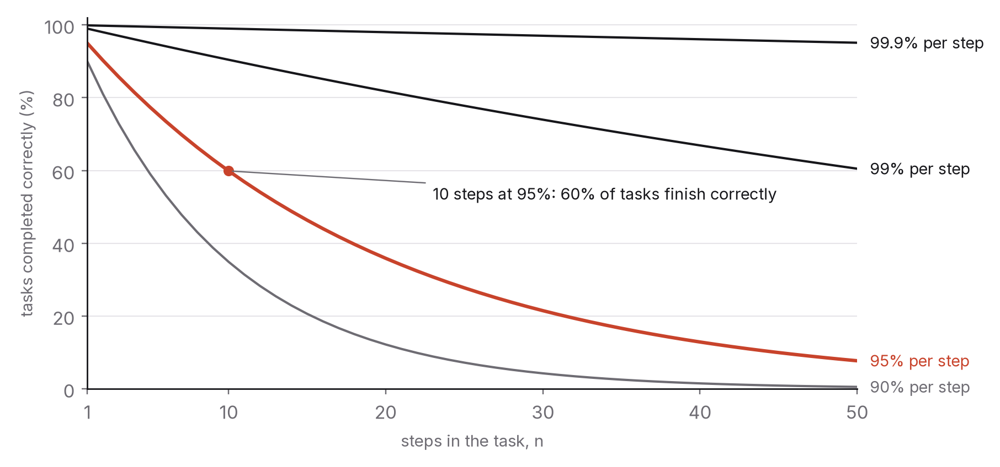

# Chapter 9 — Agents: when software starts acting

For the first couple of years of the current wave, the main way people used AI was a text box. You typed, it answered, and you decided what to do with the answer. Whatever the system got wrong, a person stood between its output and the world.

That's changing. The systems being deployed now read your email and draft replies, browse websites and fill in forms, write code and run it, call other software and act on the results, and string dozens of those steps together in pursuit of a goal you stated once. The industry calls them agents, a word stretched so far it can mean almost anything. In this chapter I'll use it to mean a system that takes actions in the world, with some autonomy, over several steps, towards a goal. The important change is from answering to acting, and it changes what matters.

When a system only answers, what you care about is how good the answer is. When it acts, you care about how often it fails, how much a failure hurts, whether failures get caught before they land, and who is responsible when they don't. Intelligence, in the benchmark-score sense of chapter 2, turns out to be the easy part. Reliability is the hard part, and it's reliability rather than capability that decides what gets deployed.

## What an agent is, mechanically

Take away the marketing and an agent is a loop. The model gets a goal and a description of the tools it's allowed to use: search, read a file, send a message, call an API, run some code. It picks a step, the step runs, the result comes back as text, and the model picks the next step. The loop ends when the model says the goal is met, or a budget runs out, or a person stops it.

Any particular agent is defined by a handful of design choices. The first is its tools. A system that can only read things is a research assistant. A system that can write files, send messages or spend money is something else entirely, and the difference lies in its permissions rather than its model. Chapter 8's security argument follows directly: what an agent can damage is bounded by its tools, not by how clever it is.

The second is how much it does before checking in. At one end the system proposes each step and waits for approval. At the other it runs for hours unattended. Everything useful sits somewhere in between, and where exactly depends on how reversible the actions are and what a mistake costs.

The third, and in 2026 the weakest part of most agents, is knowing when it's finished or stuck. That means noticing that a step failed, that the goal has drifted, that it has tried the same thing three times. People are bad at this too, but people at least notice when they're confused. Systems often don't, and they report success just as fluently whether or not they succeeded.

None of this needs an especially capable model. Agents built on 2023-era models worked, badly. Most of the improvement since has come from models that follow long instructions more reliably, from better interfaces to tools, and from the accumulated craft of the people building the loops: when to summarise, when to retry, what to log, how to recover. That craft is where most of the engineering in the next few years will happen, and it can be learned. A fair amount of my own working week goes on exactly this kind of plumbing, and the model is rarely the thing that breaks.

## The arithmetic of reliability

One fact governs everything else in this chapter. If each step in a chain succeeds independently with probability *p*, a chain of *n* steps succeeds with probability *p* to the power *n*. A system that gets each step right 95 per cent of the time sounds good, but it finishes a ten-step task correctly only about 60 per cent of the time, and a twenty-step task about 36 per cent of the time. At 99 per cent per step, twenty steps succeed about 82 per cent of the time. At 99.9 per cent, about 98.

Several things follow. Per-step reliability matters much more than per-step brilliance, so for multi-step work a less capable system that is right 99 per cent of the time is worth more than a more capable one that is right 95 per cent of the time. That's the opposite of how benchmarks rank systems, and it's part of why benchmark leaders aren't always deployment leaders.

Checkpoints change the sums. If a person, or an automated check, catches failures at step five and again at step ten, a twenty-step chain becomes four chains of five, and a failure costs five steps of rework instead of twenty. Most of the practical art of building agents comes down to deciding where to put the checkpoints: after anything irreversible, before anything expensive, and whenever the system's confidence drops.

And independence is the generous assumption. In practice failures are correlated, because a misunderstanding at step two quietly corrupts steps three to twenty. Real completion rates for long unattended tasks are often worse than the arithmetic suggests, which is why, in 2026, the tasks agents do reliably are still mostly short ones, and the long ones are supervised.

This is now measured in public. Evaluation suites built from realistic multi-step tasks (software fixes drawn from real repositories, tasks on real websites, tasks on real desktop applications) report completion rates that have risen steeply year on year and are still well below what a competent person manages unsupervised on the harder tasks.[^1] One useful way to track progress, proposed in 2025, is to measure how long a task (in human working time) a system can complete at a given success rate. By that measure the horizon roughly doubled every seven months or so through the mid-2020s.[^2] If that trend holds, tasks that take a person a full day become feasible for agents at a useful reliability within the decade. If it bends, they don't. It's the single most important number to watch in this area, and chapter 12 lists it among the things I might be wrong about.

## When delegating is worth it

A simple model makes the decision clearer. Say a task takes a person *T* minutes, an agent gets it right with probability *p*, checking the agent's work takes *c* minutes, and when the agent gets it wrong the cost of rework, damage and clean-up is *F* minutes' worth. Delegating is worth it when

> *c* + (1 − *p*) × *F* < *T*.

The inequality is trivial. What it implies isn't.

Tasks that are cheap to check go first. If verifying is much quicker than doing (a draft you can skim, code that comes with tests, a calculation you can spot-check), even a mediocre agent pays its way. First drafts, test cases, ticket triage, document summaries, boilerplate: these were the first things delegated at scale, and the reason is the small *c*.

Tasks that are expensive to get wrong go last. If a failure is costly or can't be undone (sending the wrong thing to a customer, deleting data, moving money, giving medical advice), *F* dominates, and no realistic *p* makes unattended delegation sensible. Those tasks get agents with a person approving each step that matters, which caps the saving at the difference between doing something and approving it.

The middle is where judgement lives. When checking is nearly as hard as doing (a long analysis you'd have to re-derive to verify, a design decision whose quality only shows up months later), "the agent did it" tells you least. The sensible response is to delegate the parts that can be checked and keep the parts that can't.

So a 95-per-cent-reliable agent is enormously valuable for some tasks and useless for others, and the difference isn't in the agent at all. It's in *c* and *F*. People who know their own work well enough to see those two numbers for each task will get much more out of these tools than people asking "can the AI do this?", which is the wrong question.

## Oversight, permissions and earning trust

The institutions around agents are taking shape now, around a few patterns that will look obvious in hindsight.

The first is graduated autonomy. New agents, like new employees, start with narrow permissions and close supervision and earn more as they show reliability on work that's been logged. In engineering terms that means a permission system that is specific (this agent may read these files and send mail to these addresses), revocable, and tied to a record of what the agent has actually done. Blanket permissions granted at the start of a session are what to avoid, for the security reasons in chapter 8 and the reliability reasons in this one.

The second is a person approving anything irreversible. Send, pay, delete, publish, deploy, sign: each gets its own confirmation, and the confirmation shows the person exactly what's about to happen. It's slow on purpose. Aviation, surgery and finance already work this way, with checklists and read-backs for the steps that can't be undone.

The third is budgets and kill switches. Every agent run has a limit, on time or money or number of actions, beyond which it stops and asks, and a person can stop it at any moment. Missing either one is a design flaw.

And the fourth is treating logs as the unit of accountability. When something goes wrong, you need to know what the agent read, what it decided and what it did, in that order. A system that can't tell you can't be improved, insured or defended in a dispute, and the liability questions from chapter 7 will largely be settled by whether such logs exist.

None of these patterns is exotic. They're the controls any organisation already applies to a person who can act on its behalf, applied now to software that can. The trouble in 2026 is that a lot of agent deployments skipped them, because the people deploying them were thinking of a chatbot (what harm can a text box do?) rather than an employee with access to the systems. The incidents that followed, deleted databases and leaked data and runaway bills among them, were predictable, and they'll keep happening until that mental model catches up.

## Two experiments on programmers

Of the three variables in the delegation inequality, *p* is the hardest to see from the inside, because people are poor judges of how much a tool is helping them. Two controlled experiments on software developers, about two years apart, show how wide the gap between feeling and measurement can be, and why the task matters more than the tool.

In the first, in 2023, 95 developers were given a well-specified task, building a small web server from a clear description, and half of them were randomly given an AI coding assistant. The assisted group finished about 56 per cent faster.[^3] The result was widely reported, and it was real. On a bounded, well-defined task with a known answer, the tools speed people up a great deal.

In the second, in 2025, researchers took 16 experienced open-source maintainers working on their own large, mature codebases, gave them 246 real tasks from their own issue trackers, and for each task randomly allowed or forbade AI tools.[^4] With the tools, the developers took about 19 per cent longer. Before the study they'd predicted the tools would make them about 24 per cent faster, and afterwards they still believed they'd been about 20 per cent faster. The measured effect and the perceived effect had opposite signs.

The two results don't contradict each other. They sit at opposite ends of the delegation inequality. In the first experiment *c* was small (the specification was clear and the output easy to check), *F* was small (nothing was at stake) and *p* was high (the task sat squarely inside what the tools could do), so delegating paid handsomely. In the second, the tasks lived in big codebases full of context the tools didn't have, so *p* was lower than the developers assumed; checking and fixing the output was expensive, because these developers held standards the tools didn't meet; and they delegated anyway, because the tools felt fast. The researchers reported that the developers accepted fewer than half of the suggestions they were given and spent a lot of time reviewing and correcting the rest, which is exactly the cost the inequality tells you to count and intuition leaves out.

The tool was the same in both studies. The task was different, and the task decided which way the result went. And if you're estimating your own *p*, the second study is humbling: measure it, because the feeling of speed is not evidence of speed, and these were experts who misjudged it by nearly forty percentage points.

## What it means for work, and for you

Agents are how the economics of chapter 3 actually reaches the workplace. Displacement happens task by task as agents become reliable enough at each one. Augmentation happens as people hand over the parts that are cheap to check and keep the judgement. And new tasks appear in building, supervising, evaluating and repairing agents.

That last category deserves attention if you're planning a career. Somebody has to decide which tools an agent gets, write its permission rules, design its checkpoints, build its evaluation suites, read its logs when things go wrong and fix its loop. In 2026 that's a new discipline without a settled name (it borrows from software engineering, site reliability engineering, security and people management), and it's where a large share of the interesting technical hiring is. It rewards the skills this book keeps calling durable: measurement (chapter 2), systems thinking (chapter 6), security habits (chapter 8), and the judgement to see *c* and *F* for a given task.

It also rewards something older. The person who delegates well to an agent is the person who could have done the task themselves and knows what good looks like. Delegation without competence is abdication, and it produces work nobody checked. In a world of agents, the reason to learn the fundamentals isn't that you'll do the work by hand. It's that you'll be the one who can tell when the agent got it wrong.

## What would make this chapter wrong

If by 2031 agents routinely complete day-long or week-long tasks unattended, at reliability comparable to a competent professional, then "reliability gates deployment" will turn out to have described the late 2020s rather than the decade, and I underestimated how fast per-step reliability could improve. Check the measured task-horizon trend and completion rates on the hardest realistic suites.

If a major incident traceable to an unsupervised agent (a large financial loss, a safety failure, a serious breach) has led to strict regulation of agent autonomy, then the oversight patterns I describe arrived through law rather than craft, faster and more rigidly than I expect.

And if the agent approach has stalled, with multi-step reliability levelling off and most useful deployment still single-step and supervised, I was too optimistic about the trend, and *p* stayed lower than the industry hoped.

## What to do this year

Run an agent on a real task, with a budget and a kill switch, and write down where it failed. Pick something that matters a little but not a lot: tidying a set of files, drafting replies you'll review before sending, writing and running tests for a small project. Give it the narrowest permissions that let it do the job and a limit on time or actions, and watch the log. When it finishes or stops, write a page: what it did well, where it went wrong, whether you caught the failure before it landed, and what checkpoint would have caught it sooner. Then estimate *c*, *F* and *p* for the task. You'll learn more about the next decade of work from that afternoon than from any amount of reading, and you'll have the beginnings of a discipline almost nobody has yet.

---

[^1]: Among the public suites: SWE-bench and its verified subset (software tasks from real repositories; Jimenez et al., 2023, and subsequent leaderboards), WebArena (Zhou et al., 2023), OSWorld (Xie et al., 2024) and GAIA (Mialon et al., 2023). Read each suite's own documentation for its definition of "success" before comparing numbers.
[^2]: Kwa, T. et al. (2025), "Measuring AI Ability to Complete Long Tasks", Model Evaluation and Threat Research (METR), March 2025, with later updates; the headline finding was a doubling time of roughly seven months in the length of tasks (measured by human completion time) that systems complete at 50 per cent reliability.
[^3]: Peng, S., Kalliamvakou, E., Cihon, P. & Demirer, M. (2023), "The Impact of AI on Developer Productivity: Evidence from GitHub Copilot", arXiv:2302.06590.
[^4]: Becker, J., Rush, N., Barnes, E. & Rein, D. (2025), "Measuring the Impact of Early-2025 AI on Experienced Open-Source Developer Productivity", METR, July 2025.

### Sources for this chapter
- Jimenez, C. E. et al. (2023), "SWE-bench: Can Language Models Resolve Real-World GitHub Issues?", *ICLR 2024*.
- Zhou, S. et al. (2023), "WebArena: A Realistic Web Environment for Building Autonomous Agents".
- Xie, T. et al. (2024), "OSWorld: Benchmarking Multimodal Agents for Open-Ended Tasks in Real Computer Environments", *NeurIPS 2024*.
- Mialon, G. et al. (2023), "GAIA: a benchmark for General AI Assistants".
- Kwa et al. (2025), METR, "Measuring AI Ability to Complete Long Tasks".
- Peng et al. (2023); Becker et al. (2025) — the two developer-productivity experiments.
- Yao, S. et al. (2022), "ReAct: Synergizing Reasoning and Acting in Language Models" — the loop pattern most agents descend from.
- OWASP Top 10 for LLM Applications (2025), entries on excessive agency and prompt injection.
