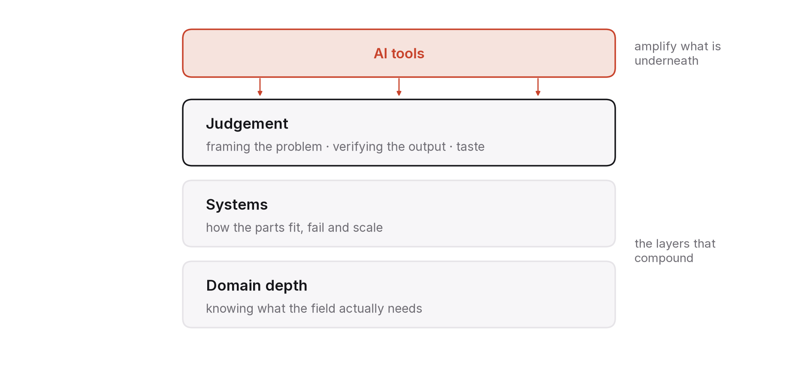

# Chapter 10 — The personal skill portfolio for 2026–2036

So far this book has been about the world. This chapter is about you. I suspect it's the one many readers skipped ahead to, so I've written it to stand on its own and flagged where it leans on earlier chapters.

The question people actually ask me is some version of "what should I learn so I don't get replaced?" I think it's the wrong question, for the same reason "is it AGI yet?" was the wrong question in chapter 1. It wants a yes-or-no answer about something that comes in degrees. People don't get replaced; tasks do. And nobody is safe in some absolute sense; it's just that some skills compound with the tools and others get substituted by them. The more useful question is: which of my skills become more valuable as the tools improve, and how do I prove I have them?

What follows is a way of answering that, a one-page plan, and a list of things to stop doing, which most people find the least comfortable part.

## The wrong frame: "AI skills"

Through 2024 and 2025 job postings filled up with demands for "AI skills", and a whole industry of courses grew up to sell them. Most of what was being sold was knowledge of particular products: how to prompt a particular model, how to use a particular tool, how to wire up a particular API. Nothing wrong with learning those. They're just the wrong thing to build a career on.

For one thing, they lose value on the product's schedule, not yours. Anything specific to a 2024 tool is already partly out of date, and anything specific to a 2026 tool will be by 2028. Chapter 3 explained why: the capability frontier keeps moving and the interfaces move with it.

They're also exactly the skills the tools make cheap. Prompting was a real skill when models were brittle. As models got better at understanding ordinary instructions, the premium for it fell, and the same will happen to every skill that consists of working around some system's current limits.

And they don't set you apart. If something can be learned in a two-hour course, everyone you're competing with has taken the course, and it tells an employer nothing.

The better frame is skills that compound with AI: abilities that become more valuable as the tools get better, because the tools amplify them instead of replacing them. As far as I can tell in 2026, those come in three layers.

## Three layers that compound

### Judgement

By judgement I mean the skills that decide what to do and whether it was done right. Three of them come up again and again in this book.

The first is framing a problem: turning a vague situation into a well-posed question. What are we actually trying to achieve? What would count as success? What are the constraints nobody has mentioned? The tools are superb at answering well-posed questions and poor at posing them, so someone who can frame a problem clearly multiplies the value of everything that comes after. It's the oldest skill in engineering and consulting, and it's now the scarcest.

The second is verification, meaning knowing whether an output is right and knowing how you know. Chapter 2 argued that reading an evaluation is a civic skill. For a professional, being able to check work (your own, a colleague's, a machine's) is what turns cheap output into reliable output. It rests on fundamentals. You can't verify code without understanding what it ought to do, or a statistical claim without understanding what the number means, or a system design without knowing where systems break. This is why fundamentals matter more, not less, in a world full of fluent tools.

The third is taste, which is harder to name: the ability to tell good from merely acceptable. A design that will age well, an analysis that asks the right question, writing that says one thing clearly. You build taste by being exposed to excellent work and by making a lot of work yourself and seeing what holds up. It can't be downloaded, and it's what separates the person whose work people seek out from the person whose work is interchangeable with a machine's.

### Systems

Systems thinking is understanding how parts fit together, where the bottlenecks are, how failures spread and what breaks at scale. Chapter 6 argued that this is where engineering value has moved now that production is cheap, and chapter 9 showed that building and supervising agents is largely a systems discipline.

For a technical reader it means the unglamorous core of computer science and engineering: how data moves, what latency and throughput are and where they come from, how to reason about consistency and failure, how to measure before and after a change, how components hide and reveal their faults. It's the subject of this book's companion volume and of the second half of any good computer-science degree. The strategic point is that someone who can hold a whole system in their head gets amplified by tools that can build any single part, because the scarce step becomes deciding what the parts should be and whether they'll work together.

For a non-technical reader the same layer exists in different words: how an organisation actually works, where its information flows, who decides what, what fails when volume triples. Whoever understands the system is the one who can point the tools at the right problem.

### Domain depth

The third layer is knowing a field properly: finance, health, law, agriculture, logistics, energy, education, public administration, a branch of science. General-purpose tools are, by their nature, shallow in every domain. Value gets created where somebody who knows a field well enough to know what matters directs the tools at it.

Computing students undervalue this layer more than any other. They tend to treat the domain as a detail and the technology as the point, and for the next decade I think it's the other way round. Chapter 5 made the point for students and chapter 11 makes it for India: the gap between what the tools can do and what a particular field needs is where the careers are, and it gets filled by people who understand both sides. Pick a domain early and learn it seriously (its vocabulary, its data, its regulations, how things go wrong in it, its people), and your technical skills become far more valuable because they're aimed at something.

The layers reinforce one another. Judgement without systems knowledge is opinion. Systems knowledge without a domain is abstraction. A domain without judgement is expertise that can't adapt. A good portfolio has all three, in proportions that depend on who you are.

## What to stop learning

People dislike this part, and it's the part that saves the most time.

Stop learning to do by hand the things you'll never do by hand: memorising syntax, standard algorithm implementations, boilerplate patterns, formulaic writing. You need to understand all of these well enough to verify them, which is the judgement layer. You don't need to be fast at producing them, because you won't be the one producing them. The difference between understanding something and producing it fluently is roughly the difference between an hour of study and a hundred hours of drill, and those hundred hours are now better spent elsewhere.

Stop collecting tool certifications as if they were skills. One or two, for tools you use every day, are fine as evidence of competence. Beyond that, they mostly signal that you confused the tool with the work.

Stop optimising for the entry-level task. Chapter 4 showed that the tasks which used to train juniors are the first to be automated, so preparing exhaustively to do them prepares you for a rung that's narrowing. Prepare instead to be useful above that rung earlier than previous generations needed to be, which means working on judgement and systems from the start.

And stop treating breadth as a goal in itself. Knowing a little about many frameworks, languages and tools made sense when you had to learn each one in order to use it. Now the tools will learn the tool for you. Depth in a few things you can verify, plus a domain you understand, beats a long list of things you've touched.

## Proving it

A skill nobody can see is a skill the market can't price. So the other half of a personal strategy is proof, and chapter 5 named the form proof now takes: a portfolio of verifiable work, meaning work other people have used, tested, built on, cited or checked, as opposed to work that merely exists.

That distinction matters because existence is now free. A repository of generated code, a blog of generated articles, a certificate from a generated course: none of these demonstrates anything, and recruiters know it. What demonstrates something is contact with the world.

Some work runs: a system that people other than you actually use, with all that implies (real data, real failures, real users who complain). Even a small one counts.

Some work gets checked: an analysis with its code and data published so someone else can reproduce it (chapter 6), a result that survives a sceptic, a measurement instead of a claim.

Some work gets accepted by others: a contribution to a project you don't control, reviewed by people who didn't have to take it; a talk at an event whose organisers chose you; a paper or note that passed somebody's screening.

And some work explains: writing that teaches something true to people who didn't know it, under your name, somewhere they can find it. Explanation is a test of understanding that generated text fails in ways anyone who knows the subject can see, and it's the quickest way to be found by the people who are looking for someone who understands.

One piece of verifiable work per quarter, kept up through a degree or the first years of a career, puts you ahead of almost everybody, because almost nobody does it. It compounds, too. Each piece makes the next easier, the body of work turns into a reputation, and that reputation becomes the thing chapter 8 said rises in value when everything else is free: a signed, checked, accountable identity.

## The one-page plan

Write this on a single page and revisit it every quarter.

1. **Domain.** The field you're going deep in, and why, in a sentence or two. If you can't write them, that's your first task.
2. **Judgement skills this year.** Pick two of framing, verification and taste, and name the practice: what you'll do every week that builds them. If you're unsure, start with verification; it's the most learnable and pays off soonest.
3. **Systems knowledge this year.** The specific fundamentals. For a technical reader, the two or three core-curriculum topics you understand least; for others, the two or three mechanisms of your organisation or field you can't yet explain.
4. **What you're stopping.** Name it: the drill you'll drop, the certification you won't chase, the breadth you'll trade for depth.
5. **This quarter's verifiable work.** One piece: what it is, who will use or check it, where it will live under your name, and the date.
6. **How you use the tools.** A personal rule for delegation, using chapter 9's *c*, *F* and *p*: what you hand over freely, what you hand over and check, and what you do yourself because doing it is how you learn.
7. **What would change this plan.** One or two developments that would make you revise it (a jump in capability in your domain, a change in how your target employers hire) and how you'll notice them.

It's short on purpose, because long plans don't get followed, and specific on purpose, because vague plans can't be checked. The whole argument of this book is that checkable beats plausible.

## One plan, filled in

Abstract plans are easy to agree with and hard to start, so here's the page filled in for a composite student: second year of an MCA at a good Indian institute, comfortable in Python and Java, aiming at a software or quantitative role at a large firm, no particular domain yet. It's not meant to be copied. It's meant to show what "specific" looks like.

**Domain.** Financial systems: payments, risk and market data. The firms I'm aiming at run on them; there's public data I can actually work with (exchange prices, central-bank statistics, open payments data); and the problems, correctness under failure, latency, measurement, are ones I find interesting. If I've lost interest in six months, I'll know, because I'll have stopped reading about it unprompted.

**Judgement.** Verification and framing. Every Saturday I take one claim I read that week (a benchmark result, a product launch, a "study shows") and write half a page on what it actually measured and what it didn't. Once a month I take one vague problem (a friend's startup idea, a college process everyone complains about) and write it up as a one-page problem statement with success criteria and constraints before I think about solutions.

**Systems.** The three fundamentals I understand least: consistency models in distributed data stores, how operating systems schedule threads and why that matters for tail latency, and the statistics of backtesting, meaning what out-of-sample really means. One textbook chapter and one hands-on measurement for each, by the end of each term.

**Stopping.** Competitive-programming drill beyond the level needed to clear screening rounds, which I've reached. More cloud certifications; I have one, and it's enough. Watching tutorials for frameworks I'm not using on a real project.

**This quarter's work.** A small, fully reproducible empirical study: download public daily index data, test whether a simple risk model's predictions hold up out of sample, and publish the code, the data snapshot, the results and a short write-up with its limitations under my name in a public repository by 30 November. Anyone who runs the script can check it, and I'll ask two people to try and record what broke. Next quarter: a working service with a measured latency budget.

**Tools.** I delegate freely: boilerplate, first drafts of documentation, test scaffolding, syntax I'd otherwise look up. I delegate and check: analysis code (I read every line and re-derive one result by hand) and literature summaries (I read the paper before I cite it). I do myself: the problem statement, the design decision, the interpretation of any result, and anything I'm trying to learn rather than produce.

**What would change it.** If by next summer the firms I'm aiming at have clearly stopped hiring for the quantitative and systems roles I'm preparing for, I'll revisit the domain. If a tool appears that makes reproducible empirical work trivial to generate, my quarterly pieces lose value and I'll move toward work with more direct contact with real users. I'll check both at the end of each term by reading the firms' actual job postings and asking two people in those roles what's changed.

That's about three hundred words. Its value isn't in the particular choices (another student would choose differently). It's that every line can be checked at the end of the quarter. Either the study was published by 30 November or it wasn't; either the Saturday write-ups exist or they don't. A plan you can check is a plan you can improve, and that's the only kind worth having in a decade that will keep revising it for you.

## If you're just starting out

If you're a student or in your first job, all of the above may sound like advice for someone further along, so here's the version for you.

You're entering a market where the easiest tasks are being automated and the hardest still need people, and where the traditional route (do the easy tasks for a few years, learn by doing them, move up to the hard ones) is narrowing. That's a real disadvantage, and it isn't your fault.

It's also an opening. The firms that cut junior hiring haven't stopped needing people who can do the harder work. They've stopped believing a degree alone proves someone can. A student who turns up with a verifiable portfolio (one system that runs, one analysis that reproduces, one contribution that was accepted, one explanation that taught somebody something) isn't competing for the narrowed entry rung. They're competing for the one above it, and there are far fewer candidates for that than there are places.

Fundamentals, a domain, a quarterly piece of real work and the habit of verifying before trusting aren't the safe path. They were always the only path that reliably worked, and a new technology has simply made that obvious by removing the alternatives.

## What would make this chapter wrong

If by 2031 the tools are capable enough that judgement, systems thinking and domain depth are themselves being substituted at scale, my three layers describe a shrinking island rather than solid ground. Check whether experienced people in judgement-heavy roles (senior engineers, doctors, lawyers, analysts) are seeing falls in pay and employment comparable to entry-level roles.

If the credential has made a comeback, with employers falling back on degree and college brand because portfolios became too easy to fake, I underestimated how quickly proof can be counterfeited. Look at what the big employers' hiring processes actually weight.

And if "AI skills" in the narrow, product-specific sense have turned out to carry a lasting premium, I was too dismissive at the start of this chapter. Check pay data for roles defined by tool proficiency rather than domain or judgement.

## What to do this year

Publish one piece of verifiable work a quarter, starting this quarter: four pieces, under your name, each of which someone else can run, reproduce, check or learn from. Keep them small enough to finish. Write the one-page plan before you start the first and revise it after the fourth. By the end of the year you'll have a portfolio most people with twice your experience don't have, and a clear view of which of your skills the tools amplified and which they replaced, which is the most useful career information there is for the decade ahead.

---

### Sources for this chapter
- Autor, D. (2024), "Applying AI to Rebuild Middle Class Jobs", NBER Working Paper 32140 — the argument that AI can extend expertise to more workers, and its conditions.
- Brynjolfsson, E., Li, D. & Raymond, L. (2025), "Generative AI at Work", *Quarterly Journal of Economics* 140(2) — who gains most from assistance (less-experienced workers) and why that matters for the entry rung.
- Dell'Acqua, F. et al. (2023), "Navigating the Jagged Technological Frontier", Harvard Business School Working Paper 24-013 — the uneven capability frontier and the risk of over-trusting output.
- Chapters 2, 4, 5, 6, 8 and 9 of this book for the evidence behind each layer.
- Ericsson, K. A. & Pool, R. (2016), *Peak* — on deliberate practice, for the distinction between understanding and fluent production.
