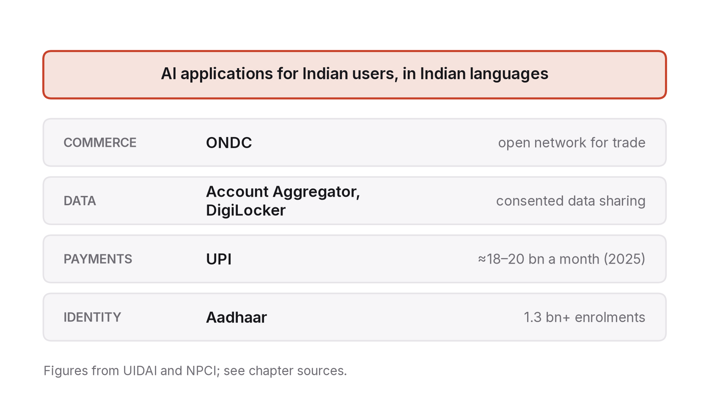
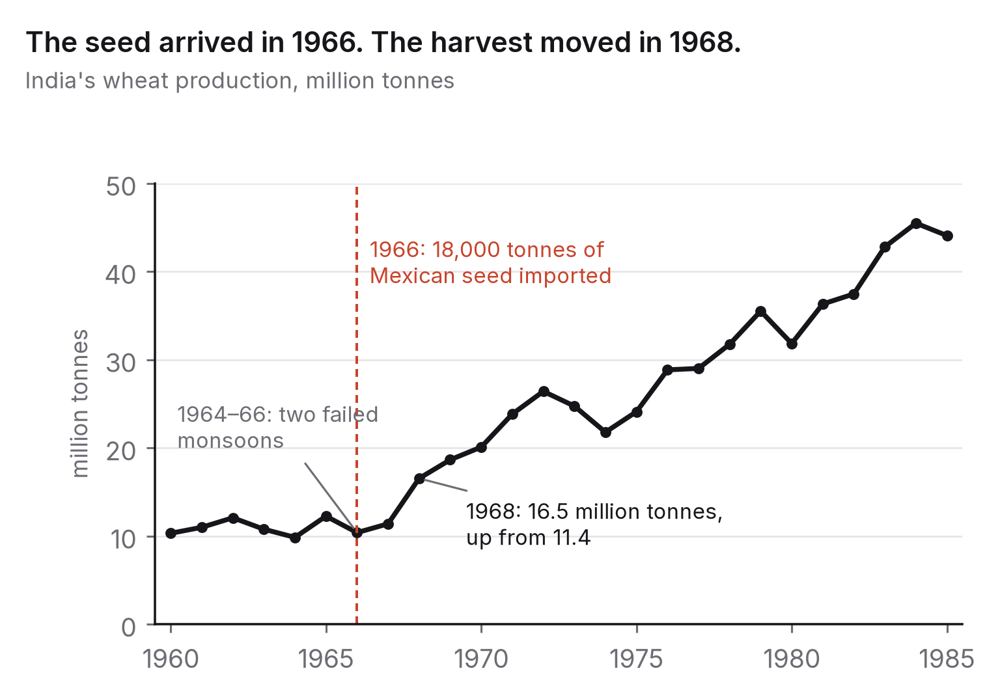
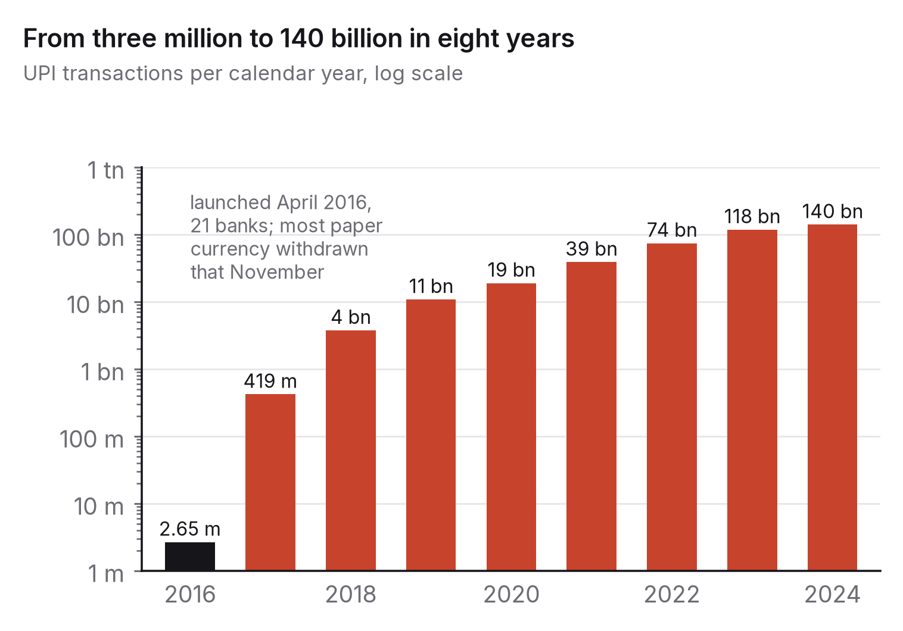

# Chapter 11 — India's decade

I've written this book from India and used India as an example throughout: the entry-level paradox in chapter 4, the curriculum in chapter 5, the governance choices in chapter 7. This chapter pulls those threads together and asks the question head on. What does this transition mean for the country with the largest young population in the world, one of the largest pools of software engineers, and a services economy built in large part on doing, for everyone else, the kind of work the tools are learning to do?

My honest answer has two halves, and both are true. India is unusually exposed, because a big share of its export earnings and its graduate jobs come from exactly the task categories chapter 3 marked as most automatable. And India is unusually well placed, because over fifteen years it has built a digital public infrastructure most countries don't have, it has a domestic market large enough to be worth building for, and it has the people. The technology won't decide which half wins. Choices made over the next five years, by firms, institutions and individuals, will, and this chapter is about what those choices are.

## The exposure

Start with the numbers that matter.

India's IT and business-process services industry directly employed about 5.4 million people in 2024 and brought in something like US$190–200 billion a year in exports, making it the largest single part of the country's services exports and one of the biggest employers of graduates.[^1] Its model is the one chapter 4 described. Hire fresh graduates in large numbers, train them for a few months, bill them to overseas clients for well-specified, repeatable work (application maintenance, testing, support, data processing, routine development), and promote the ones who learn to manage and design.

Every step of that model is exposed. The work being billed is what chapter 3's exposure studies rank highest. The juniors' training ground is the set of tasks being automated first. And the clients are the same companies now deploying the tools in-house and asking why they're paying for human hours to do what their own systems can do. The big Indian services firms saw this early. From around 2023 their headcount stopped tracking their revenue, fresher hiring fell sharply in 2023 and 2024 before partly recovering, and their public strategy moved towards "AI-led" services, which means fewer people each billed for more value.[^2] It's a rational move, and it means the industry that absorbed a huge share of India's engineering graduates for twenty-five years will absorb fewer of them, at a higher bar, for the rest of this decade.

The second exposure is in the newer layer, the global capability centres, which are multinationals' own operations in India. They grew fast through the 2020s, to more than 1,700 centres employing around two million people by 2025.[^3] On average they do higher-value work than the services firms (engineering, analytics, product development, finance operations), and they're less exposed for that reason. They're also where the multinational employers many readers of this book hope to work for actually hire in India, and they're hiring for exactly the profile chapter 10 described: people who can work above the narrowed entry rung from day one.

The third exposure is one nobody counts: the millions of graduates each year, in computing and every other field, whose first job was going to be some kind of information work, and for whom the entry rung is narrowing in every sector at once.

### What the headcount numbers show

The industry's own figures make the shift visible. For two decades the three biggest Indian IT-services firms added staff every year, often tens of thousands each, and their campus intake was the single largest entry point into professional work for Indian engineering graduates. In the financial year that ended in March 2024, all three reported a net fall in headcount, together losing somewhere around 60,000 employees while revenue kept growing, and fresher hiring at the large firms fell to a fraction of its 2022 level.[^7] Revenue per employee, flat for years, started to climb. Headcount recovered a little the next year, but campus offers didn't go back to their old scale, and in mid-2025 the largest of the three announced it would cut about 2 per cent of its workforce, mostly in middle and senior grades, citing a mismatch between skills and a changing market.[^8]

Read through chapter 3's channels, those numbers say three things. Revenue rising while headcount falls is the productivity channel at work: the same output with fewer people, or more output with the same people. Fresher intake falling faster than total headcount is chapter 4's entry-level paradox in its purest form. And the industry's public strategy of "AI-led" services, with fewer, more senior people billed for outcomes instead of hours, is the value migration I've been describing, undertaken deliberately by the firms themselves. None of this means the industry is shrinking. It means its relationship with the graduate pipeline has changed, and you can see the change in the firms' own accounts before it shows up in any labour statistics.

## The platform

Now the other half.

Between 2009 and 2024 India built a set of shared digital systems that almost no other country has. There's a universal digital identity, Aadhaar, with more than 1.3 billion enrolments. There's a real-time, interoperable payments system, UPI, handling something like 18 to 20 billion transactions a month by 2025. There's a consent-based framework for sharing data (the Account Aggregator system, plus DigiLocker), and there are open-protocol initiatives for commerce (ONDC) and other sectors.[^4] Collectively they're usually called India's digital public infrastructure, and they matter for the AI transition in a specific way.

AI systems create value when they can act on real processes using real data. In most countries those processes are scattered across incompatible private systems and the data is locked in silos, so an AI product has to be integrated from scratch with every bank, every merchant and every agency. In India, a large share of the economy's basic transactions run on shared rails with open interfaces. A system that speaks UPI can transact with hundreds of millions of people. A system using the Account Aggregator framework can, with consent, reason over someone's financial history. A system that works with the identity layer can check who it's talking to. So putting an AI application into the real economy costs less in India than almost anywhere else, because the plumbing is already shared.

That's why the version of the future in which India is "the world's AI back office" (data labelling, model evaluation, support and integration for products built elsewhere) isn't the only one on offer. The alternative is building AI products for the Indian economy itself, on rails that already exist, for 1.4 billion people, most of whom are badly served by every kind of formal service from credit to health care to legal advice to education. The rails make that possible. They don't make it inevitable.

## Two transitions India has already made

It's easy to talk about India's "AI transition" as if the country had never been through anything like it. It has, twice in living memory, and both times the lesson was the same: the technology was necessary and the institutions around it were decisive.

The first was wheat. In 1965 and 1966 the monsoon failed two years running. India's wheat harvest fell to about 10 million tonnes, grain was being shipped in from the United States faster than it could be unloaded, and the phrase of the time was that the country lived "ship to mouth". In 1963 the agronomist M. S. Swaminathan had invited Norman Borlaug to India and begun trials of the short, stiff-strawed Mexican wheats that could carry heavy fertiliser without falling over. In 1965 the government imported 250 tonnes of seed. In 1966 it imported 18,000 tonnes, enough to plant the irrigated plains of Punjab, Haryana and western Uttar Pradesh.[^wheat] The harvest of 1968 was 16.5 million tonnes, half as much again as the year before. By 1971 it was 23.8 million; by 1985, 44 million.[^wheat]

The seed gets the credit in the textbooks, and it deserves a lot of it. But the seed had existed in Mexico for years. What made 1968 happen in India was everything built around it in a hurry: a guaranteed minimum price announced before sowing so that farmers would risk the new variety; a Food Corporation to buy the grain at that price; fertiliser and credit pushed through the cooperative banks; the agricultural universities at Ludhiana and Pantnagar, modelled on the American land-grant colleges, which bred the Indian varieties (Kalyan Sona, Sonalika) that replaced the Mexican imports within three seasons; and canal water from Bhakra. Remove any of those and the seed is a curiosity. That's the pattern chapter 3 described, the complementary investments deciding the outcome, except that here the investments were made deliberately, fast, by a state that had decided it could not afford another 1966.

The second was payments. In April 2016 the National Payments Corporation of India switched on the Unified Payments Interface with twenty-one banks. In its first calendar year it carried fewer than three million transactions. The next year it carried 419 million; the year after that, 3.7 billion. In 2024 it carried 140 billion, and by 2025 it accounted for more than four-fifths of all digital payments in the country.[^upi] Nothing like that curve exists anywhere else in the world for a payments system.

Again, the technology was not the scarce part. Instant mobile payments existed elsewhere. What India did differently was institutional: a single open standard that every bank had to join, run by a non-profit the banks jointly owned, with no fee to the person paying, built on top of a universal identity system that already existed, and then a shock, the withdrawal of most of the paper currency in November 2016, that pushed hundreds of millions of people to try it in the same few months. Design plus a forcing event plus rails that were already there. The result was that a vegetable seller in Kanpur accepts payment by QR code and a hundred-rupee transfer costs nothing, a state of affairs that richer countries have still not reached.

I put these two stories here because they are the right template for the next five years, and because they correct a mistake I hear often, which is that India's AI future depends on whether India builds a frontier model. The wheat didn't depend on inventing the seed. The payments didn't depend on inventing the smartphone. Both depended on a small number of institutional decisions, made early, that let a technology invented elsewhere reach a billion people on terms that suited them. The digital public infrastructure described below is the modern version of the canals and the minimum price. The question is what gets planted on it.

## Language: barrier and moat

India has 22 scheduled languages and hundreds more in daily use, and the current generation of AI systems was trained overwhelmingly on English. In 2023 the gap was stark. Models were dramatically worse in Hindi than in English and close to useless in most other Indian languages, partly because there was so little training data and partly because tokenisers designed for English made Indian-language text several times more expensive to process.[^5]

The gap has narrowed since. Frontier models got substantially better at Indian languages through 2024–2026. Academic groups, companies and the IndiaAI Mission built dedicated Indian-language models and datasets. Speech systems in Indian languages, which matter more than text for most of the population, improved fastest of all. By 2026 the question was no longer whether these systems could work in Indian languages at all, but how well, in which languages, at what cost, and whether anyone was actually building the applications.

Here the diversity cuts both ways. It's a barrier, because everything is harder, more expensive and slower in a market with twenty-two languages than in one with a single language. It's also a moat. A product that works well in Bhojpuri or Marathi or Kannada, for what speakers of those languages actually need, isn't something a firm in California will build first, or build well. The people who do that work have a market global products will reach slowly, and a defensible position when they finally arrive. Chapter 10's advice to go deep in a domain applies with special force: the domain can be a language and the communities who speak it.

## Education at a scale that matters

India has around 250 million school students and more than 40 million in higher education, in a system that's chronically short of good teachers and uneven in quality to a degree national averages hide.[^6] Chapter 5 argued that AI tutoring is the first technology with a plausible shot at Bloom's two-sigma problem. If that promise is real anywhere, it matters most here, where the alternative for most students isn't a human tutor but no tutor at all.

What can the technology realistically do in Indian conditions? It can explain, in a student's own language, patiently and as many times as needed, the material a crowded classroom couldn't. It can give teachers tools for preparation, assessment and feedback that stretch their limited time. And it can make good material available in languages and places it has never reached.

What it can't do are the things chapter 5 identified. It can't supply the motivation and accountability that come from an adult being present, and two decades of educational technology in low-resource settings suggest that technology without that adult mainly reaches students who were already motivated. It can't fix access by itself: a tutor that needs a smartphone, mobile data and a quiet place reaches the students who have those and leaves the rest further behind, unless access is designed in deliberately through shared devices, offline modes, voice-first interfaces, and working with the schools and teachers who already exist. And it can't decide what should be taught. That's still a human, institutional job, and India's institutions move slowly.

So the realistic goal isn't two sigmas for every child. It's a measurable improvement for students in the middle, who have a device and a teacher but not enough of either, and the design problem is making the tools work through teachers rather than around them. That's a problem for Indian builders to solve, because nobody else is going to solve it for Indian classrooms.

## Governance: capacity before constraint

Chapter 7 described India's choice: no dedicated AI law, a data-protection act phasing in, a large industrial mission, and soft instruments (advisories, guidelines, intermediary rules on synthetic content) ahead of hard ones. The strategic reading is that India has decided to build capacity first and regulate once it knows what it's regulating.

That's defensible, and it has a cost. The benefit is that builders in India in 2026 face fewer constraints than their European counterparts and can move faster. The cost is that harms arrive before rules do: synthetic media in elections, fraud using cloned voices, biased automated decisions in lending or hiring, and companies that treat the absence of an AI-specific law as the absence of any law. The DPDP Act, as its rules phase in through 2027, is the instrument that will bite first, and the practical governance job for an Indian builder is to take personal data seriously before being forced to.

## What this means for a graduate around 2030

Put those threads together and a picture forms for anyone finishing an MCA or B.Tech between 2028 and 2030.

The services-firm entry rung that absorbed earlier cohorts will be smaller and set higher. The capability-centre rung, which is where multinational employers hire in India, will be larger, and it will expect from the first day the judgement-and-systems profile from chapter 10. The domestic product sector, building on the rails for Indian users in Indian languages, will be the fastest-growing and the least certain. And in every case the way in will reward verifiable work over credentials, for the reasons chapter 5 gave.

If you're a student reading this now, I'd take three things from that. Build for India, not just for your résumé. A system that solves a real problem for real Indian users (a clinic, a school, a farmers' cooperative, a small business, a language community) is better verifiable work than a tutorial project aimed at nobody, and it puts you in the part of the market global products reach last.

Learn the rails. UPI, Aadhaar-based verification, the Account Aggregator framework, DigiLocker and ONDC are the integration points for any AI product that touches the Indian economy, and hardly any graduates know them. It's a small investment with a large return in how much you stand out.

And treat the capability-centre and quant-finance rung as reachable. The multinationals hiring in India for engineering, analytics and quantitative roles want people who can measure, reason about systems and verify their own work. Chapter 10's plan builds exactly that profile, and chapter 6's habit of reproducible work produces the kind of proof those employers can check.

## What would make this chapter wrong

If by 2031 India's services exports have kept growing strongly with stable employment, because the industry moved up the value chain faster than its juniors were displaced, then I was too pessimistic about the exposure. Check industry employment and export figures and the large firms' fresher-hiring numbers.

If the digital public infrastructure hasn't produced a domestic AI product sector of any consequence, and India's role in the global AI economy in 2031 is mainly talent, data work and integration, then I overestimated how much the rails would matter and the back-office version won. Check the revenue and user numbers of Indian-built AI products serving Indian users.

If Indian-language AI has reached parity with English across the major languages at low cost, the language-as-moat argument weakens, because the barrier that protected local builders has gone. Check the cost and quality of leading models across the scheduled languages.

And if AI tutoring has produced large, well-measured gains in Indian government schools at scale, I was too cautious about education, and the design problem turned out easier than it looked.

## What to do this year

Build something for an Indian language or an Indian institution. Choose a problem you've seen with your own eyes: a form a relative couldn't fill in, a school that needs a timetable, a shop that can't keep track of stock, a community whose language no tool serves well. Build the smallest thing that helps, in the language its users speak, on whichever rails apply. Put it in front of five real users and keep what you learn. It will count as verifiable work in chapter 10's sense, it will teach you more about the gap between capability and deployment than any course, and it's exactly the kind of work the next decade in India will reward, because hardly anyone else is doing it.

---

[^1]: NASSCOM, *Strategic Review 2024* and *2025*: industry revenue, export share and direct employment figures. The industry's own figures; treat them as upper bounds on employment.
[^2]: Quarterly results and annual reports of the large listed Indian IT-services firms, FY2023–FY2026, for headcount and fresher-hiring figures; coverage in *The Economic Times*, *Mint* and *Business Standard* through 2024–2026.
[^3]: NASSCOM–Zinnov, *GCC Landscape* reports (2023, 2024, 2025) for centre counts and employment.
[^4]: Unique Identification Authority of India, enrolment dashboard (2025); National Payments Corporation of India, UPI monthly statistics (2025); Reserve Bank of India and Sahamati on the Account Aggregator framework; Open Network for Digital Commerce documentation.
[^5]: Ahuja, K. et al. (2023), "MEGA: Multilingual Evaluation of Generative AI", *EMNLP 2023*, and Petrov, A. et al. (2023), "Language Model Tokenizers Introduce Unfairness Between Languages", *NeurIPS 2023*, for the capability and tokenisation gaps; AI4Bharat (IIT Madras) publications for Indian-language benchmarks and models.
[^6]: Ministry of Education, *UDISE+ 2023–24* for school enrolment; *All India Survey on Higher Education 2021–22* for higher-education enrolment; ASER Centre, *Annual Status of Education Report 2024* for learning outcomes.
[^7]: Annual reports and fourth-quarter FY2024 results of Tata Consultancy Services, Infosys and Wipro (April 2024), each reporting a year-on-year net decline in employees; coverage of the combined figure and of campus-hiring trends in *The Economic Times* and *Mint*, April–May 2024.
[^8]: Tata Consultancy Services, statement and press coverage, 27 July 2025, on a planned workforce reduction of about 2 per cent during FY2026.

[^wheat]: Wheat production is the USDA series (market years: 1966, 10.4 million tonnes; 1967, 11.4; 1968, 16.5; 1971, 23.8; 1985, 44.1). On the seed imports (250 tonnes in 1965, 18,000 in 1966) and the Swaminathan–Borlaug collaboration, see Swaminathan, M. S. (2010), *From Green to Evergreen Revolution*, Academic Foundation, and Perkins, J. H. (1997), *Geopolitics and the Green Revolution*, Oxford University Press.
[^upi]: National Payments Corporation of India, UPI product statistics (monthly volumes, aggregated by calendar year: 2016, 2.65 million; 2017, 419 million; 2018, 3.75 billion; 2019, 10.8 billion; 2020, 18.9 billion; 2021, 38.7 billion; 2022, 74.0 billion; 2023, 117.7 billion; 2024, 140.0 billion). The 2016 launch with 21 banks is from NPCI's own account; the share of digital payments is the RBI's 2025 figure.

### Sources for this chapter
- Swaminathan (2010); Perkins (1997); USDA production series — the Green Revolution in wheat.
- NPCI UPI statistics; RBI payment system reports — the growth of UPI.
- NASSCOM Strategic Reviews (2024, 2025); NASSCOM–Zinnov GCC reports.
- NPCI UPI statistics; UIDAI dashboard; RBI/Sahamati Account Aggregator data; ONDC documentation.
- IndiaAI Mission (Cabinet approval, 7 March 2024); MeitY *India AI Governance Guidelines* (November 2025); DPDP Act 2023 and Rules 2025.
- Ahuja et al. (2023); Petrov et al. (2023); AI4Bharat IndicLLMSuite and related papers (2024).
- UDISE+ 2023–24; AISHE 2021–22; ASER 2024.
- Chapters 3, 4, 5, 7 and 10 of this book.
