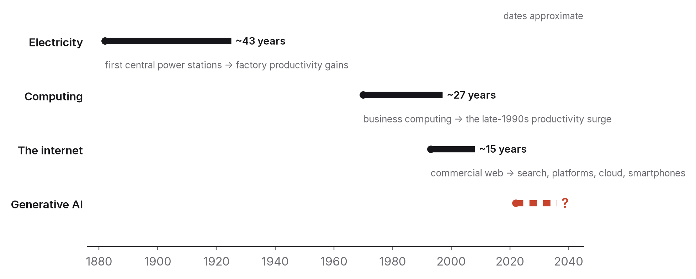

# Chapter 12 — How to be wrong well

Every chapter of this book has ended with a section on what would make it wrong. This one is that section for the book as a whole, and it's also the real conclusion, because a field guide to a transition doesn't stand or fall on any particular prediction. Its central claim is that the people who come out of the next decade stronger will be the ones who update fastest and most honestly, and that updating is a skill with a method.

The method has three parts: know the base rates, keep a record, and list your own likely mistakes in advance. I'll take them in turn and then finish with the ten habits the rest of the book has been building towards.

## Base rates from earlier general-purpose technologies

The most reliable guide to how a transformative technology spreads is how the previous ones spread, and the record is consistent enough to be useful.

Electricity first. The dynamo was commercially practical by the early 1880s, yet factory productivity didn't visibly respond until the 1920s, roughly forty years later. The gains didn't come from swapping steam engines for electric motors inside the same factory layout. They came from redesigning factories around a small motor at every machine, which took a generation of engineers who had grown up with the new technology, and a stock of old factories that had to wear out first.[^1] The technology was the fast part. Reorganising work around it was the slow part, and that's where the value was.

Then computing. Business computing was common by the 1970s, but through the 1980s the countries investing most heavily saw unimpressive productivity growth, which is what prompted Robert Solow's 1987 remark that the computer age was visible everywhere except in the productivity statistics.[^2] The acceleration finally arrived in the second half of the 1990s, two decades after the investment began, and it came together with large intangible investments (new processes, training, organisational redesign) that the statistics hadn't been counting. Economists later formalised this as the productivity J-curve: a general-purpose technology first depresses measured productivity, because firms are investing in intangibles that don't show up as output, and then raises it, often sharply.[^3]

Then the internet. It opened commercially in the early 1990s, had its first boom and bust by 2001, and the business models that actually came to dominate (search advertising, platforms, cloud computing, the smartphone ecosystem) mostly emerged or matured between 2004 and 2012. With a few exceptions, the companies leading in 1999 weren't the ones leading in 2015. Early winners in a transition aren't reliably the eventual winners, and the most important applications usually aren't the ones people imagined at the start.

A few regularities hold across all three. Diffusion takes decades rather than years: measured from commercial availability to broad economic impact, the lag has been twenty to forty years. AI may well be faster, because it spreads through software rather than physical capital and because it's being adopted by organisations that have already digitised. I don't expect it to be instant, though, because the binding constraints (chapter 3's institutional lag, chapter 6's moving bottleneck, chapter 9's reliability gate) are the same ones that slowed every earlier technology.

Returns are uneven. Some sectors, firms and workers gain a great deal, and early; others gain late or lose. Averages hide this. So the useful question is never "will AI raise productivity?" but whose productivity, when, and who bears the cost of adjusting.

And institutions lag, then catch up, roughly. Education, law, professional norms and labour markets adapt slowly and imperfectly, and it's their adaptation, more than the technology, that decides who pays.

None of this proves that this time will be the same. What it does is put the burden of proof on anyone claiming this time is different, and the proof ought to come as measurements rather than demonstrations.

## Seventy years of "twenty years away"

There's a second set of base rates worth knowing, and they're about the forecasters rather than the technology.

In the summer of 1955, four researchers wrote a proposal for a workshop at Dartmouth College. They wanted to study how to make machines use language, form concepts and improve themselves, and they wrote that "a significant advance can be made in one or more of these problems if a carefully selected group of scientists work on it together for a summer."[^8] The workshop happened the next year, and it gave the field its name. The summer was not enough.

Ten years later, Herbert Simon, who would go on to win a Nobel prize in economics and a Turing award in computing, wrote that "machines will be capable, within twenty years, of doing any work a man can do."[^9] That put the date at 1985. In 1970 Marvin Minsky, who had been at Dartmouth, told *Life* magazine that "in from three to eight years we will have a machine with the general intelligence of an average human being."[^10] That put it somewhere between 1973 and 1978. These were not cranks. They were among the most capable people ever to work on the problem, and they were wrong by half a century and counting.

The forecasts of the 2010s that I grade below have the same shape: a serious person, a real trend, and a date that turned out to be far too close. When two researchers collected ninety-five published predictions of human-level AI made between 1950 and 2012 and plotted when each predicted it would arrive, the single most common answer was fifteen to twenty-five years from whenever the prediction was made.[^11] Experts and non-experts predicted about the same horizon. The horizon had barely moved in sixty years. It is just far enough away to be beyond the forecaster's career, just close enough to be exciting, and it has been "about twenty years" since before anyone reading this book was born.

I don't take this to mean the current forecasts are wrong. Some trend has to be the one that finally delivers, and the systems of 2026 can do things the systems of 1985 could not. I take it to mean that "twenty years away" is what a confident technologist says when they don't know, and that a date attached to a capability forecast should be weighed by the record of such dates, which is poor. The base rate for the technology is decades of diffusion. The base rate for the forecasters is that the exciting date arrives late and the dull one, the institutional one, arrives on schedule.

## The decision journal

The second part of the method is a record. The idea is old (serious investors and forecasters have done it for decades) and simple enough that almost nobody bothers.

Whenever you make a decision that depends on a belief about how this transition will go (what to study, which job to take, what to build, what to stop doing), write down four things: the decision, the belief behind it, what evidence would change that belief, and a date to check. On that date, check. Write down what actually happened and whether the belief held.

The journal earns its keep in a few ways. It separates the quality of a decision from the quality of its outcome. Good decisions sometimes turn out badly and bad ones sometimes turn out well, and only a record over many entries shows which of your beliefs are reliable.

It defeats hindsight. Memory rewrites itself to make past beliefs look more accurate than they were; a dated entry doesn't. Reading your own confident entry from two years ago and seeing how wrong it was is unpleasant, and it's the most effective calibration training I know of.

And it forces the question "what would change my mind?" at the moment you decide, which is when that question is most useful and least often asked. Chapter 2's measurement discipline, chapter 9's checkpoints and the "what would make this wrong" sections in this book are all versions of the same move: name the evidence before you see it.

Keep it short, a paragraph per decision and a paragraph per check. A year of it will be worth more to you than any forecast anyone publishes, because it'll be about your beliefs and your decisions, measured against your world.

## Three forecasts, ten years on

The value of all this is easiest to see with forecasts old enough to grade. Here are three from the mid-2010s, each made by serious people, each widely repeated, each gradable now.

In 2013 two Oxford researchers estimated that about 47 per cent of US employment was in occupations at high risk of computerisation within "a decade or two".[^4] The number travelled the world and is still quoted. Graded in 2026: US unemployment over the period sat at or near historic lows, and nothing like an occupation-level collapse on that scale happened. The study was careful about what it measured (the technical feasibility of automating an occupation's tasks, as judged by experts), but the reporting wasn't. Feasibility got read as displacement, occupations got read as jobs, and the time horizon fell out of the headline. A 2016 OECD analysis that redid the exercise at the level of tasks rather than whole occupations put the share of jobs at high risk at about 9 per cent, because most occupations mix tasks that are easy to automate with tasks that aren't.[^5] Both numbers were defensible answers to different questions. The lesson is chapter 3's: exposure isn't displacement, and a forecast that doesn't say which channel it's about will get graded against the wrong one.

In 2016 one of the field's most distinguished researchers said people should stop training radiologists, because it was, in his words, "just completely obvious" that deep learning would outperform them within five years.[^6] Graded in 2026: image-recognition systems did reach and exceed radiologist-level performance on many specific, well-defined detection tasks, much as predicted. Meanwhile radiologist employment, pay and training places rose, with shortages reported in several countries. The capability forecast was largely right and the labour forecast was wrong, because the job isn't the task. A radiologist's work includes combining findings across different kinds of scan, handling the unusual case, talking to other clinicians, and taking responsibility for the diagnosis, inside a regulatory and liability structure that decides who's allowed to sign a report. The systems became tools that radiologists used, which raised their productivity and, through chapter 3's demand channel, the volume of imaging. The forecaster later said he'd got the timing wrong but the direction right. I think the more useful correction is that "outperforms at the task" and "replaces in the job" are different claims, and the distance between them is institutional rather than technical.

And from 2016 onward, a leading electric-car company's chief executive predicted, roughly once a year, that fully autonomous driving was about a year away.[^7] Graded in 2026: driver assistance improved enormously, limited robotaxi services ran in a handful of cities under particular conditions, and general-purpose autonomy, in any weather, on any road, with no human responsible, still hadn't arrived. The shape of that forecast is instructive. A capability that genuinely was improving, a demonstration that genuinely worked in chosen conditions (chapter 1's demos-versus-deployments point), and a reliability bar for unsupervised operation (chapter 9's arithmetic) that was much higher than the demos suggested and kept moving as the systems revealed new ways to fail.

All three share a shape. The technical trajectory was called roughly right and the consequences were called wrong, because the consequences ran through institutions (how jobs are bundled, who carries liability, how much reliability is required before autonomy is granted) that the forecasters didn't model. That's this chapter's base-rate lesson applied to the recent past, and it's why I've spent more pages in this book on institutions than on capabilities. It's also an argument for the journal. Each of those forecasts, written down with the belief behind it and a date, would have taught its author something precise about which belief failed. Without that record, people remember the earlier forecasts only as "the experts were wrong", which is the least useful lesson there is, and they repeat the same mistake about the current wave.

## What I expect this book to get wrong

Here, as plainly as I can put them, are the places I'm most likely to be wrong, roughly in order of how much it would matter.

The speed of progress. I've assumed continued but uneven improvement, with reliability lagging raw capability and agents held back by chapter 9's arithmetic. If the task-horizon trend in chapter 9 keeps doubling every seven months or so through 2030, systems will be completing week-long professional tasks unattended within the decade, and large parts of chapters 4, 6, 9 and 10 will have been too conservative about what gets automated and how fast. If the trend bends, as trends usually do, the book will look about right. What to watch is the measured horizon on realistic tasks, not demonstrations.

The entry-level paradox. I've argued that the narrowing of junior roles is real and lasting, and that the response is to become useful above the entry rung sooner. If firms instead redesign apprenticeship successfully, or demand effects create more junior roles than automation removes, the paradox will turn out to have been a 2023–2027 adjustment rather than a feature of the decade. Watch hiring and pay for the youngest workers in exposed occupations, year by year.

India. Chapter 11 sets out two halves and declines to say which wins. If I'm wrong about India, I'll most likely be wrong in the pessimistic direction, having underestimated how fast the services industry adapts and how much the domestic product sector grows. The evidence will be in export figures, employment figures and the revenue of Indian-built AI products.

Governance. Chapter 7 expects jurisdictions to keep diverging and enforcement to stay slow. A major incident could produce fast, convergent, strict regulation; a long quiet period could produce the opposite. I don't know which, and I've tried to say so.

The information commons. Chapter 8 expects the synthetic share of content to rise and the value of verified human work to rise with it. I could be wrong about the second half. The market might not reward verification as much as my argument needs, and provenance infrastructure might never reach the scale required. Watch whether platforms, search engines and employers actually pay for provenance.

And the whole frame. This book treats the transition as something institutions and individuals can navigate with judgement, measurement and good habits. There are scenarios at both extremes where that frame fails: a jump in capability that makes human judgement irrelevant across most of the economy, or a stall that makes the whole discussion premature. I've argued, in chapters 1, 3 and 9, that both extremes are less likely than the broad middle, and I've given my reasons. They could be wrong.

If you're reading this in 2031 and find that this list missed the thing that actually mattered, I'd ask you to treat that as the book's most important lesson rather than its failure. The things that matter most are often the ones nobody put on the list, which is exactly why the method (base rates, a record, named errors) matters more than any list.

## Ten habits

This isn't a summary. It's the set of habits each chapter has recommended in its own way, gathered in one place so you can check yourself against them.

1. Ask which tasks, at what level, with what reliability, never "is it intelligent?" or "can it do my job?" (chapter 1).
2. Read the evaluation before you believe the claim: what was measured, on what, by whom, and what was left out. Run one yourself (chapter 2).
3. Think in tasks rather than jobs, and watch wages rather than headlines. Break your own work down and track what actually changes (chapters 3 and 4).
4. Build proof that can't be generated: work that runs, gets checked, is accepted by others, or teaches. One piece a quarter (chapters 5 and 10).
5. Make your work reproducible, with code, data, method and limitations, every time. It's the unit of credibility now (chapter 6).
6. Read the primary text, whether that's the law, the paper or the specification, not the summary. It's nearly always shorter and clearer than the commentary (chapter 7).
7. Default to verification. Sign what you publish, verify what you receive, and agree a routine for anything involving money, passwords or urgency (chapter 8).
8. Delegate by *c*, *F* and *p*: hand over freely what's cheap to check, supervise what's costly to get wrong, and keep what you need to do yourself to stay able to judge (chapter 9).
9. Compound rather than collect: judgement, systems, domain depth. Stop drilling what you'll never do by hand (chapter 10).
10. Keep the journal. Write down the belief, the evidence that would change it and the date; then check, and update (this chapter).

None of these habits depends on a product that might disappear, a prediction that might fail or a job that might vanish, and that's the point. The decade ahead will be shaped by capabilities nobody can forecast precisely and by institutional responses nobody controls. What you control is how you reason about evidence, how you prove what you can do, and how you update when you turn out to be wrong. Those were always the things that mattered. The transition has just made them harder to ignore.

## What would make this chapter wrong

If the coming decade looks nothing like earlier general-purpose technologies in how it spreads, with the impact arriving in years rather than decades and spread evenly rather than unevenly, then my base rates misled by analogy, and the discontinuity I discounted was the right call.

And if keeping a decision journal and listing your own likely errors turns out not to improve anyone's decisions (which can be tested), then the method I'm recommending is a comfort rather than a tool. The forecasting research so far says otherwise, but that research could be wrong too.

## What to do this year

Start the journal today with a single entry: the most consequential decision you're making this year that depends on how this transition goes. Write down the belief it rests on, the evidence that would change your mind, and a date twelve months from now. Then go back and reread chapter 1, and see whether you still agree with it. Being wrong well is a practice, and the first entry is the hardest one to write.

---

[^1]: David, P. A. (1990), "The Dynamo and the Computer: An Historical Perspective on the Modern Productivity Paradox", *American Economic Review* 80(2), 355–361.
[^2]: Solow, R. M. (1987), "We'd better watch out", review of Cohen & Zysman, *Manufacturing Matters*, *New York Times Book Review*, 12 July 1987, p. 36.
[^3]: Brynjolfsson, E., Rock, D. & Syverson, C. (2021), "The Productivity J-Curve: How Intangibles Complement General Purpose Technologies", *American Economic Journal: Macroeconomics* 13(1), 333–372.
[^4]: Frey, C. B. & Osborne, M. A. (2013), "The Future of Employment: How Susceptible Are Jobs to Computerisation?", Oxford Martin School working paper; published 2017 in *Technological Forecasting and Social Change* 114, 254–280.
[^5]: Arntz, M., Gregory, T. & Zierahn, U. (2016), "The Risk of Automation for Jobs in OECD Countries: A Comparative Analysis", OECD Social, Employment and Migration Working Papers No. 189.
[^6]: Geoffrey Hinton, remarks at the Machine Learning and Market for Intelligence conference, Toronto, October 2016, widely reported; see also Hinton's later comments revising the timeline (2023–2024).
[^7]: Public statements by Tesla's chief executive on the timeline for full self-driving capability, 2016–2024, as compiled in contemporaneous press coverage; graded against the deployment status of unsupervised autonomy in 2026.
[^8]: McCarthy, J., Minsky, M. L., Rochester, N. & Shannon, C. E. (1955), "A Proposal for the Dartmouth Summer Research Project on Artificial Intelligence", 31 August 1955.
[^9]: Simon, H. A. (1965), *The Shape of Automation for Men and Management*, Harper & Row, p. 96.
[^10]: Darrach, B. (1970), "Meet Shaky, the first electronic person", *Life*, 20 November 1970, quoting Marvin Minsky.
[^11]: Armstrong, S. & Sotala, K. (2012), "How We're Predicting AI, or Failing To", in *Beyond AI: Artificial Dreams*, University of West Bohemia, 52–75; the database of 95 predictions and the 15-to-25-year finding are theirs.

### Sources for this chapter
- David (1990), *AER* 80(2) — electricity's forty-year lag.
- Solow (1987) — the productivity paradox remark.
- Brynjolfsson, Rock & Syverson (2021), *AEJ: Macro* 13(1) — the J-curve.
- Bresnahan, T. & Trajtenberg, M. (1995), "General purpose technologies: 'Engines of growth'?", *Journal of Econometrics* 65(1) — the GPT framework.
- Frey & Osborne (2013); Arntz, Gregory & Zierahn (2016) — the two automation-risk estimates.
- McCarthy et al. (1955); Simon (1965); Darrach (1970); Armstrong & Sotala (2012) — seventy years of forecasts and their horizon.
- Tetlock, P. E. & Gardner, D. (2015), *Superforecasting* — the evidence that recording and scoring beliefs improves calibration.
- Kwa et al. (2025), METR — the task-horizon measurement named as the number to watch.
