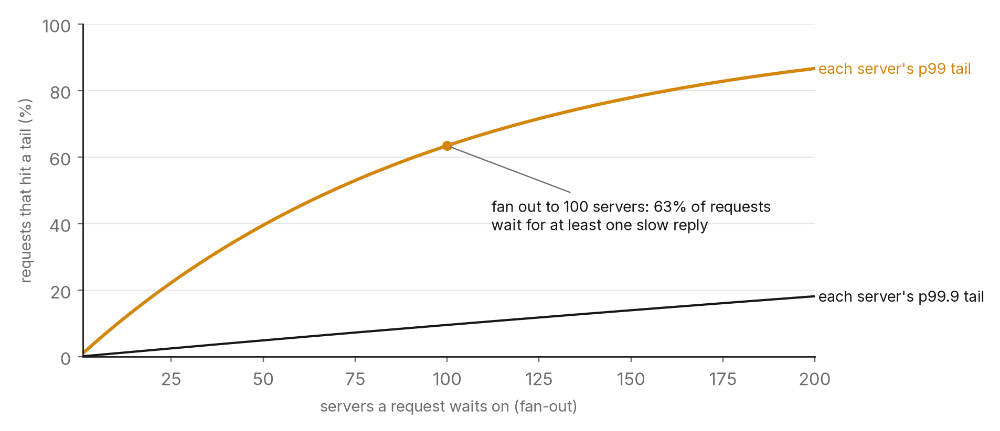
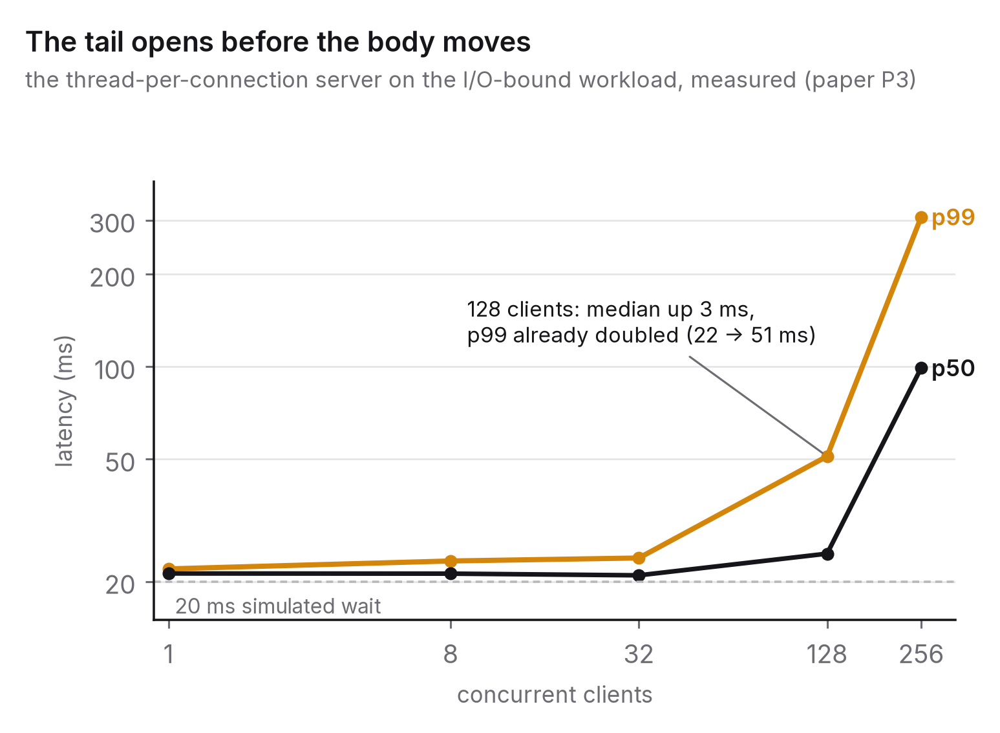

# Chapter 1 — Latency is a distribution, not a number

Ask an engineer how fast their service is and you'll usually get a single number: "about 40 milliseconds". Ask a user and you'll get a story: "mostly fine, but sometimes it just hangs". They're describing the same system. The engineer is quoting an average and the user is describing a tail, and performance engineering starts with accepting that the user is the one who's right.

This chapter explains why one number misleads, what to measure instead, how to split a latency target into pieces you can actually engineer, and how to measure latency so the number you get is the number users feel. Like every chapter, it ends with the question you'll be asked and an experiment you can run in an afternoon.

## The principle

*Latency is a distribution. Report and engineer its percentiles rather than its mean, budget it stage by stage against a target a user would recognise, and measure it in a way that can't hide the slow requests.*

## Why averages lie

Suppose a service answers 99 requests in 10 ms each and one in 1,000 ms. The mean is 19.9 ms, and nobody experienced it. Ninety-nine people waited 10 ms and one waited a full second. The mean describes a request that never happened.

Real latency distributions are almost never symmetric. There's a floor, the fastest a request can possibly be served. There's a body, where most requests sit. And there's a long right tail of requests held up by garbage collection, a lock, a cache miss, a slow disk, a retry, a network hiccup or a noisy neighbour. The user's "sometimes it hangs" lives in that tail. The mean gets pulled toward it just far enough to misdescribe the body, without telling you anything useful about the tail itself.

What replaces the mean is a set of **percentiles**. The p50, or median, is the latency half of all requests beat. The p95 is the latency 95 per cent beat, so one request in twenty is slower. The p99 is one in a hundred, the p99.9 one in a thousand. Each answers a precise question: how slow is it for the unluckiest one-in-N user? You describe a service with several of them together, never just one.

Which percentile matters depends on who's counting. A page that makes one call to your service meets its p99 about once every hundred page loads. A page that makes a hundred calls to a hundred services, which is how most modern applications are built, meets *somebody's* p99 on almost every load. That's the central observation of Dean and Barroso's "The Tail at Scale" (2013).[^1] When a user request fans out to many servers and waits for all of them, the user's latency is the *maximum* of many samples, and the maximum of a hundred samples lives in the tail of each one. If each of a hundred servers is slow on 1 per cent of requests, the chance that a user request avoids all of them is 0.99¹⁰⁰, about 37 per cent. Nearly two users in three wait for someone's tail. At scale, the tail isn't an edge case. It's the user experience.

That has three practical consequences.

*Dashboards show percentiles, not means.* A latency graph with one line on it is a graph of the wrong thing. Plot the p50, p95 and p99 together. The gaps between them are the shape of the distribution, and a widening gap is an early warning the mean will miss.

*Service-level targets are set on percentiles.* "99 per cent of requests under 300 ms" is a promise a user can recognise. "Average under 100 ms" isn't, because it's compatible with a tenth of your users waiting a second.

*The tail is engineered separately from the body.* Making the median faster, with a tighter loop or a smaller payload, does nothing about the causes of the tail: pauses, contention, retries. The techniques in chapter 7 for living with slow dependencies, and the hedged requests and timeouts Dean and Barroso describe, are tail engineering. They often make the median a little worse in exchange for a much better p99, and that's nearly always the right trade.

## Where the time goes: the latency budget

A target like "p99 under 300 ms" is no use until you break it down, because no single component owns 300 ms. The breakdown is a **latency budget**: the end-to-end target divided among the stages a request passes through, so each stage gets a number it can be built and measured against.

A typical interactive request passes through at least the client's own processing, the network from the user to the edge, a load balancer or gateway, authentication, the service's own logic, one or more dependency calls (a database, a cache, another service, a model), serialisation, the network back and rendering. Appendix B has a worksheet for this. Fill it in for a real system and you'll usually get three surprises.

First, the network is a fixed cost you don't control. A round trip from a user in Kanpur to a server in Mumbai takes roughly 20–40 ms on a good connection, 60–90 ms to Singapore and 200 ms or more to the eastern United States.[^2] With a 300 ms budget and a 200 ms round trip, you have 100 ms for everything else. Where the servers are is a latency decision, and it's made before anyone writes a line of code.

Second, sequential dependency calls add up, while parallel ones cost only the slowest. A service that calls three dependencies one after another at 30 ms each spends 90 ms. Call them concurrently and it spends about 30 ms, plus whatever the slowest one's tail adds. In many services, finding the sequential calls that could run in parallel is the single biggest latency win available, and it needs no new infrastructure.

Third, the p99 of the whole isn't the sum of the p99s of its parts. Adding up the stage p99s gives you the worst case, where every stage is slow on the same request, and that's rarer than any one stage's p99. Adding up the p50s gets you close to the median of the whole. The real end-to-end p99 sits somewhere in between, and the only way to find it is to measure end to end, which the traces in chapter 9 make possible. The budget is a planning tool. The measurement is the fact.

## Measuring correctly

Latency numbers are easy to produce and easy to get wrong, and the three classic mistakes all make the system look better than it is.

**Coordinated omission.** Most load-testing tools work like this: send a request, wait for the response, record the latency, send the next one. If the system stalls for two seconds, the tool waits two seconds, records one slow request and carries on. But during those two seconds a real population of users would have *sent* two seconds' worth of requests, and every one of them would have waited. The tool recorded one slow request where there should have been hundreds. It left out the slow requests in exact step with the system's slowness, which is about the worst bias a measurement can have.[^3] The fix is to decide in advance when each request *should* be sent, on a fixed schedule, and measure from that scheduled time. Then a stall shows up as hundreds of delayed requests instead of one. Tools that don't do this, and plenty of popular ones don't, can under-report the p99 by an order of magnitude in exactly the conditions you care about. Chapter 10 comes back to this when it compares open-loop and closed-loop testing.

**No warm-up, and too short a run.** Just-in-time compilers, caches, connection pools and the operating system's page cache all start cold, so the first few seconds of any measurement describe a different system from the one that runs in steady state. Throw away a warm-up period. Then run long enough for the periodic events (garbage collection, log rotation, cache expiry) to happen several times. A five-second test measures the cold start and misses the tail.

**A single run.** Latency varies between runs on the same machine for reasons that have nothing to do with your code: background processes, thermal throttling, where memory happened to land. One run is one sample from that distribution as well. Repeat the run and report the spread, as a range or as the median of several runs with the others shown, so you don't mistake a 5 per cent improvement for signal when the run-to-run noise is 10 per cent. The companion benchmark for this chapter does exactly that, and reports how much its p99 moved across repeats next to the value it keeps.

Two more habits are worth building. Measure in the right place: the service's own view of its latency leaves out the queue in front of it and the network behind it, and it's the user's view that counts, so measure as close to the user as the system lets you (chapter 9). And keep the whole distribution, not summary statistics computed on the fly. Percentiles can't be averaged across machines or time windows (the average of two p99s isn't the p99 of the combined traffic), so record histograms with enough resolution in the tail and compute percentiles from those.[^3]

## What this looks like when measured

The companion study for this book (paper P3 in the research repository, described in Appendix A) built four small HTTP servers that differ only in how they handle concurrency, ran the same workloads against each at rising concurrency, and recorded the latency of every request. Chapter 2 is about *why* the designs behave differently. Here the only point is what a latency distribution looks like once you actually measure one.

Here is one row of what came out. At 256 concurrent clients on the CPU-bound workload, the thread-per-connection server and the single-threaded event loop were doing almost the same amount of work: 116 and 152 requests a second. Their medians were similar too, 1.5 and 1.6 seconds. Their p99s were 8.2 seconds and 2.2 seconds, and the slowest request the threaded server answered took 16.7 seconds. Same capacity, four times the tail. If you had been watching a throughput graph, or a mean, you would have called those two servers equivalent.

Three features of these distributions turn up in almost every latency measurement you'll make, and they're exactly the features a mean would hide.

The floor is set by physics and the body by design. On the I/O-bound workload, no design can beat the 20 ms simulated downstream wait, and from one client to 128 every server's median sat within about ten milliseconds of it. The design only showed up at 256 clients, and then it showed up in the tail: the threaded server's median rose to 99 ms and its p99 to 307 ms, while the three event-loop designs kept their p99s under 50 ms and served three and a half times as many requests.

The tail opens before the body moves. On that same workload at 128 clients, the threaded server's median had moved from 21 ms to 25, a change nobody would notice, while its p99 had already doubled from 24 ms to 51. The system was serving most requests well and a growing minority badly. A dashboard showing the mean would have shown a gentle slope, while the users in the p99 would have been describing a system that had started to hang.

The ratio of p99 to p50 is a design signature. At full load, every event-loop design in the study had a ratio between 1.2 and 1.6 on every workload: its slowest one per cent of requests waited at most half again as long as the median. The threaded server's ratios were 3.1, 4.3 and 5.4. The ratio barely depends on the machine, which makes it one number worth putting on a dashboard, because it captures the shape the mean throws away.

One more habit the study paid for: every setting was run three times, and the three p99 values are kept next to the one reported. Most agreed within 10 or 20 per cent. One server's didn't, its p99 at 256 clients ranging from 1.7 to 2.6 seconds across the repeats, and a background-load sample taken right after it showed other processes had woken up during its run. Without the repeats and the sample, that would have been a finding. With them, it's a footnote.

## The question you will be asked

*"Your p50 is 20 ms and your p99 is 2 seconds. What's going on?"*

A ratio of a hundred tells you the body and the tail come from different mechanisms: most requests take a fast path and one in a hundred takes a slow one. So name the candidates, in the order you'd check them. A dependency with its own heavy tail, like a database query that occasionally gets a bad plan, a cache miss falling through to a slow source, or a downstream service's p99. Pauses in the process itself, from garbage collection, a lock held during a slow operation, or a thread pool that's briefly exhausted so requests queue. Something periodic, such as a batch job, a log rotation, or a batch of cache entries expiring together and stampeding the source (chapter 3). Or infrastructure: a noisy neighbour, a load-balancer health check, DNS.

Then say how you'd find out. Pull traces of the slow requests (chapter 9) to see which stage held them up. Line the slow timestamps up against garbage-collection logs, deploys and batch schedules. Look at the dependency's own percentiles. And say what you *wouldn't* conclude, which is that the service is "about 20 ms". An answer that lists the mechanisms, explains how to tell them apart and refuses to fall back on the mean is the answer of someone who's run a service.

## The trade-off, stated

Measuring percentiles costs more than measuring means. You need histograms instead of counters, more storage, more care when you aggregate, and load tests that are harder to write correctly. What you get is the only latency numbers that match what users experience, and the only ones you can make reliability promises on. Engineering the tail costs some median latency and some complexity, in timeouts, hedging and redundancy. What you get is the difference between a system that's fast on average and one that's fast. In neither case is the cheaper option really cheaper. It just moves the cost from the engineer's dashboard to the user's experience, where it's paid without anyone counting it.

## Run this yourself

The harness from the research repository (`papers/p3-tail-latency/harness.py`) is a single Python file containing four servers, three workloads, a load generator and a results file. Run it on an idle machine; it takes about an hour, and it waits for the machine to go quiet before it starts. Then open the results and, for one server and one workload at the highest concurrency, plot the full latency histogram instead of the percentiles. Look at its shape: the floor, the body, the tail. Work out the mean and mark it on the plot, and notice how few requests are anywhere near it. Then change one thing, say halving the simulated I/O wait or doubling the CPU work, and run it again. Watch which part of the distribution moves. An afternoon with the real distribution in front of you will do more for your intuition than any number of percentile tables, including the ones in this book.

---

[^1]: Dean, J. & Barroso, L. A. (2013), "The Tail at Scale", *Communications of the ACM* 56(2), 74–80.
[^2]: Typical figures from public round-trip-time measurements between major Indian and regional cloud regions (2025–2026). Your numbers depend on the route and should be measured, not quoted.
[^3]: Tene, G. (2013–2015), "How NOT to Measure Latency", talks and the HdrHistogram documentation, hdrhistogram.org, on coordinated omission and the case for recording full histograms.

### Sources for this chapter
- Dean & Barroso (2013), "The Tail at Scale", *CACM* 56(2).
- Tene (2013–2015), "How NOT to Measure Latency"; HdrHistogram.
- Schroeder, B., Wierman, A. & Harchol-Balter, M. (2006), "Open Versus Closed: A Cautionary Tale", *NSDI 2006*, on why the load model changes the tail you measure.
- Gregg, B. (2020), *Systems Performance*, 2nd ed., chapter 2 (methodologies), on latency as the primary metric and how to decompose it.
- Beyer et al. (2016), *Site Reliability Engineering*, chapter 4, on percentile-based service-level objectives.
- Paper P3 in the companion repository (Appendix A), the measurements referred to in this chapter.
