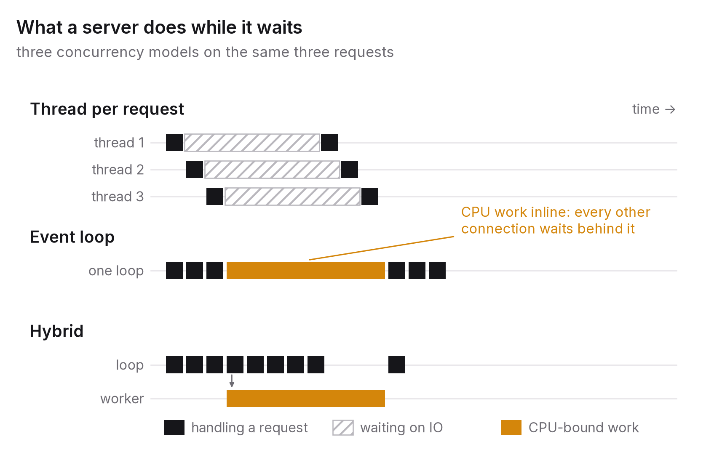

# Chapter 2 — Concurrency models and the price of blocking

Before a server answers any request, it has to answer a different question: what does it do while it's waiting? A request comes in, the server asks a database for something, and for twenty milliseconds there's nothing to do but wait. What the server does with those twenty milliseconds is its concurrency model. It might hold a thread idle, switch to another request, or hand the wait to the operating system. That choice decides how the latency distribution from chapter 1 behaves when the load goes up.

This chapter covers the three models in common use, the mistake each one tempts you into, the measurements that show the mistake happening, and the mechanism, backpressure, that keeps any of them alive when demand outruns what they can do.

## The principle

*Concurrency is about what a server does while it waits. Choose the model that matches what your requests wait for, never let CPU-bound work block the thing that's supposed to be waiting, and bound every queue so the system says no before it falls over.*

## Three models

**Thread per request.** The operating system gives each connection its own thread, and when a thread waits on a socket, a disk or a lock, the kernel runs another one. It's the oldest model and the one most frameworks default to. Its strengths are simplicity and isolation. The code reads top to bottom, and a wait is just a line that takes a while. One slow request can't stall another, because the kernel preempts. Its costs are memory, context switching and, in some languages, parallelism. Each thread has a stack, usually hundreds of kilobytes to a few megabytes, so ten thousand connections means gigabytes of stacks. Context switches get more expensive as thread counts grow. And in languages with a global interpreter lock, threads give you concurrency for waiting but not parallelism for computing.

**Event loop (asynchronous).** A single thread runs a loop that picks up whichever connection has something ready, does a little work until that connection has to wait again, and moves on. In the code, waits are written as points where control goes back to the loop. The strength is efficiency for I/O-bound work. One thread can hold tens of thousands of idle connections at almost no cost, because an idle connection is a few bytes of state rather than a whole stack. The cost is the subject of this chapter: the loop is cooperative and nothing preempts it. If any piece of code doesn't yield, because it's computing instead of waiting, every other connection on that loop waits until it finishes.

**Hybrid.** An event loop handles the waiting, and CPU-bound work is handed to a pool of workers, threads or processes, so the loop stays free. Every asynchronous framework's documentation recommends this pattern, and it's the one teams most often skip, because it requires knowing which work is CPU-bound, and the answer changes as the code grows. The two variants behave very differently in a language with a global interpreter lock. A *thread* pool keeps the loop responsive but still runs one computation at a time. A *process* pool actually uses the cores, at the price of copying arguments and results between processes.

There are other models: green threads and virtual threads, which make threads cheap enough to behave like an event loop, plus actor systems and structured concurrency. Each sits somewhere between these three, and once you understand the three you can reason about all of them.

## What blocks what

"Blocking" gets used loosely in concurrency discussions, so it's worth being precise. An operation blocks a *thread* if the thread can't do anything else until it finishes: a synchronous socket read, a sleep, acquiring a lock, a long computation. An operation blocks an *event loop* if it runs on the loop's thread without yielding, which includes any synchronous call and any computation, however the code is written.

Blocking a thread is fine in a thread-per-request server, because the kernel just runs other threads. Blocking the loop is fatal in an event-loop server, because nothing else is there to serve the other connections. This is the classic mistake, and it's classic because testing doesn't reveal it. A single request that computes for 3 ms returns in 3 ms whether or not it blocked the loop. The damage only appears under concurrent load, when a hundred connections each wait for the one that's computing, and it appears in the tail first.

The **global interpreter lock** (the GIL in CPython, and similar locks in some other runtimes) adds a second layer. Even with threads, only one thread executes interpreter bytecode at a time. Threads waiting on I/O release the lock, so I/O-bound work scales across threads, but CPU-bound work doesn't, however many threads or cores you have. The hybrid with a thread pool keeps the event loop responsive, so I/O-bound requests carry on, but it does nothing for the throughput of the CPU-bound requests themselves, which still run one at a time. Only a process pool, or moving the computation into native code that releases the lock, gets you real parallelism. CPython 3.13 shipped an experimental build without the GIL. The companion study records whether the interpreter it ran on had the lock enabled, because that changes which of these statements are true.

## What the measurements show

The companion study (paper P3, described in Appendix A) built four small HTTP servers in Python that differ only in their concurrency model: thread per request, an event loop with the CPU work inline, an event loop with a thread pool, and an event loop with a process pool. It ran three workloads against each. The I/O-bound workload waits 20 ms on a simulated downstream call, the CPU-bound one does about 3 ms of computation, and the mixed one does both. A closed-loop load generator drove each server at 1, 8, 32, 128 and 256 concurrent clients, three repeats per setting, and the latency of every request was recorded.

Four things came out of it, and together they are this chapter in numbers.

On the I/O-bound workload, the event loop won, as the folklore says, but only at the top. Up to 128 clients all four servers sat at the 20 ms floor. At 256, the thread-per-connection server's p99 went to 307 ms and its throughput halved, to about 2,100 requests a second, while the three event-loop designs held their p99 under 50 ms at 7,400 to 7,800 requests a second. Holding 256 idle connections costs a loop almost nothing. Holding 256 threads that all wake at once costs scheduling and lock hand-offs, and the cost arrives in the tail.

On the CPU-bound workload, the interpreter lock decided the throughput and the design decided the tail. The threaded server, the event loop with the computation inline, and the event loop with a thread pool all ran Python one request at a time, and from 32 clients upward their throughputs were within a narrow band, roughly 115 to 160 requests a second. Moving the computation to a thread pool bought nothing, because the worker threads hold the same lock as the loop. But at 256 clients the threaded server's p99 was 8.2 seconds and its worst request 16.7 seconds, against a p99 of 2.2 seconds for the event loop at nearly the same throughput. The loop serves connections in the order they become ready, so every request waits behind about the same number of others. Two hundred and fifty-six threads fighting for one lock are scheduled with no such fairness. Same work, same rate, four times the tail.

The process pool was the only design that could use the cores, and it showed the whole trade in one row. With a single client it was the slowest server of the four, 7.6 ms against 2.9 for the inline loop, because handing a request to a worker process and getting the answer back cost about 4.7 ms, more than the 2.8 ms of work it carried. From 8 clients upward it was the fastest, and at 128 clients it had twice the throughput and a quarter of the p99 of the lock-bound designs. Then it plateaued, at about 310 requests a second, far below what eight cores could do. The ceiling was the dispatching loop itself, which parses each request, hands it off, collects the result and writes the reply, all under its own lock. On that machine, the design that uses the cores used about one of them.

And the ratio of p99 to p50 at full load told the designs apart more cleanly than any absolute number: 1.2 to 1.6 for every event-loop design on every workload, 3.1 to 5.4 for threads.

How the study was set up matters as much as what it found. The servers are deliberately minimal, with no framework and no middleware, so the concurrency model is the only thing that varies. The workloads are deliberately synthetic, so the CPU and I/O components are known exactly. The load is deliberately closed-loop, which, as chapter 10 explains, measures what each of N concurrent clients experiences rather than what happens at a fixed arrival rate. That's the right model for "how does this server behave as more users connect" and the wrong one for "what's this server's capacity at 3,000 requests a second". And the machine, interpreter and GIL state are all recorded, because the absolute numbers belong to that one machine. The comparisons between designs are the finding.

## Backpressure: the system that says no survives

Every model above has a point where demand exceeds capacity: more connections than threads, more computation than the loop can interleave, more jobs than the pool can take. What happens at that point is a design decision, and the default in most systems is the wrong one.

The default is an **unbounded queue**. Connections queue in the kernel's accept backlog, requests queue in the framework, jobs queue in the pool. Nothing is refused and everything waits. Under sustained overload the queues grow without limit, and every request's latency grows with the queue in front of it. Eventually the system is working flat out and serving nobody within their timeout, because by the time a request reaches the front of the queue its client has given up and retried (chapter 7), which adds yet another request to the queue. This is **congestion collapse**, and it's how a system that was merely slow becomes a system that's down.

The opposite failure is a queue that's too small, and the companion harness ran into it on its first attempt. Python's standard-library threaded HTTP server asks the operating system for an accept backlog of just five connections. At 256 concurrent clients the backlog filled instantly, and the operating system started refusing new connections outright, so the clients saw "connection refused" rather than slow responses. The fix was one line, raising the backlog to 1,024. The lesson is that every queue has a size whether you chose it or not, and the default was picked by someone who didn't know your load.

**Backpressure** is the alternative to both. When a stage can't keep up, it signals upstream to slow down or stop, and the signal travels back to the source, which then waits, sheds work or fails fast. The mechanisms are unglamorous. Bounded queues reject when they're full. A concurrency limit per stage, such as a semaphore around the expensive section, makes excess requests fail immediately with a clear "overloaded" instead of waiting. Admission control at the edge refuses connections beyond what the system has been measured to handle (chapter 10). TCP's own flow control is backpressure at the transport layer, and it's a big part of why the internet doesn't collapse. Applications have to do the same thing at their own layer.

The counter-intuitive result is that a system that rejects 10 per cent of requests under overload is *more* available than one that accepts all of them. The 90 per cent it serves, it serves within budget, and the rejected 10 per cent get an answer they can act on, like retrying later or showing a fallback, instead of a timeout. Chapter 7 develops this as load shedding. The point here is that it's a property of the concurrency design, decided when the queues are sized, and almost impossible to bolt on during an incident.

## Choosing

Match the model to what your requests wait for.

If requests are *I/O-bound*, spending most of their time waiting on databases, caches, other services or model APIs, the event loop is efficient, and threads work fine until the thread count gets expensive. Most web services, gateways, proxies and AI-application backends fall here. For them, an event loop with a strict rule against inline computation is the right default.

If requests are *CPU-bound*, doing image processing, cryptography, parsing or numerical work, an event loop is wrong unless it has a process pool behind it, and threads are wrong under a global interpreter lock. The right answer is parallelism across processes, or a runtime without the lock.

If requests are *mixed*, which most real services end up being, the hybrid with a process pool for the computation is the design that holds up. The discipline is keeping the boundary honest. Every piece of computation that creeps onto the loop is a future tail-latency incident.

Whichever model you pick, bound the queues, and decide what happens when they're full before your first user arrives.

## The question you will be asked

*"When would you choose threads over async?"*

When the work is CPU-bound and the runtime's threads really do run in parallel, because there's no global interpreter lock or the native code releases it. When the codebase or its libraries are synchronous, and making them asynchronous (rewriting every I/O call, hunting down every blocking library) would cost more than it gains. When isolation matters more than efficiency: in a thread-per-request server a slow request can't stall the others, and in systems where one misbehaving request is worse than a lower connection limit, that's worth paying for in stacks. When connection counts are modest, hundreds rather than tens of thousands, so the event loop's efficiency buys you nothing. And, honestly, when the team knows threads and doesn't know event loops, since a model your team can operate beats one it can't. Then say what you'd do in either case: bound the queues, measure the tail, and keep computation off whatever is supposed to be waiting.

## The trade-off, stated

Threads buy simplicity and isolation, and cost memory and, under a global lock, parallelism. The event loop buys connection efficiency, and costs the discipline of never blocking it. The hybrid buys both, and costs the upkeep of the boundary plus, with processes, the overhead of copying data between them. Backpressure costs some requests their service and buys the rest of them theirs. None of these is free, and the choice that's wrong for your workload won't show up in tests. It shows up in the p99 under load, which is why chapter 1 came first.

## Run this yourself

Run the P3 harness and look at the CPU-bound workload across the four servers at 128 concurrent clients. Then open the harness and move the CPU work in the event-loop server into the thread pool (the variant is already in the file to copy from), and notice that almost nothing changes, because the pool's threads hold the same lock as the loop. Move it into the process pool instead and watch the p99 fall by three-quarters. That pair of edits is the clearest demonstration I know of what the interpreter lock does and doesn't allow. Then try the opposite. Add a tiny synchronous sleep, say 1 ms, inside the asynchronous I/O path, as if a blocking library call had slipped in unnoticed, and watch the I/O-bound tail that sat flat at 20 ms open up as concurrency rises. Finally, put a semaphore of 16 around the CPU section in the threaded server and drive it with 256 clients. Requests beyond the limit should fail fast instead of queueing, and the p99 of the ones that are served should fall. Those three edits are the whole chapter, and each takes about ten minutes.

---

### Sources for this chapter
- Welsh, M., Culler, D. & Brewer, E. (2001), "SEDA: An Architecture for Well-Conditioned, Scalable Internet Services", *SOSP 2001*, on staged event-driven design and explicit backpressure between stages.
- Pariag, D. et al. (2007), "Comparing the Performance of Web Server Architectures", *EuroSys 2007*, a careful empirical comparison of thread- and event-based servers.
- von Behren, R., Condit, J. & Brewer, E. (2003), "Why Events Are a Bad Idea (for high-concurrency servers)", *HotOS 2003*, and Ousterhout, J. (1996), "Why Threads Are a Bad Idea (for most purposes)", the two sides of the classic argument.
- Python Software Foundation, *asyncio* documentation, "Running blocking code", and the `concurrent.futures` executors; `socketserver` documentation for `request_queue_size`; PEP 703 (2023), "Making the Global Interpreter Lock Optional in CPython".
- Beyer et al. (2016), *Site Reliability Engineering*, chapter 21, "Handling Overload", on admission control and the case for rejecting work.
- Paper P3 in the companion repository (Appendix A), the measurements referred to in this chapter.
