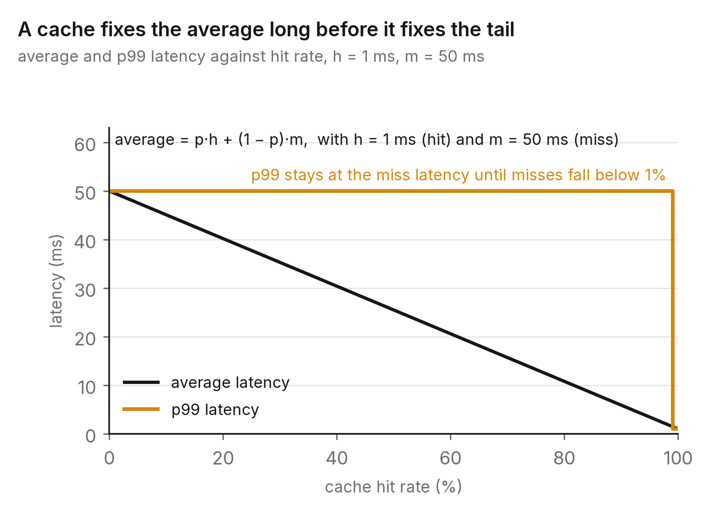

# Chapter 3 — Caching: the fastest request is the one you don't make

Sooner or later every performance conversation arrives at a cache, and a surprising share of production incidents involving caches were caused by someone who added one without asking what it would do when it was wrong, empty or shared. A cache is the most effective latency tool you have and the most common source of the bugs that are hardest to reproduce. Both facts come from the same property: a cache is a deliberate decision to serve data that might be stale.

This chapter is about making that decision well. When does a cache pay for itself, what does it cost, how does it fail, and which few rules prevent the failures that keep recurring?

## The principle

*A cache trades freshness for latency and load. Decide how stale is acceptable before you build it, make invalidation part of the design rather than an afterthought, and never cache anything under a key that doesn't include everything the value depends on.*

## The arithmetic of a hit rate

Three numbers describe a cache in front of a slow source: the hit latency *h*, the miss latency *m* (the source's latency plus the cache's own overhead), and the hit rate *p*. The average latency is

> *p* × *h* + (1 − *p*) × *m*.

Say *h* is 1 ms, an in-memory lookup over a local network, and *m* is 50 ms, a database query. At a 50 per cent hit rate the average is 25.5 ms, about half. At 90 per cent it's 5.9 ms, and at 99 per cent, 1.5 ms. The curve is steepest near the top, and that has two consequences.

The last few per cent of hit rate are worth more than the first fifty. Going from 90 to 99 per cent cuts the average by a factor of about four, while going from 0 to 50 per cent only halves it. That's why cache tuning is really about the long tail of keys; the popular ones are hits anyway.

And the tail latency is still the miss latency. Chapter 1 argued that users experience percentiles rather than averages, and a cache does nothing for the request that misses. Suppose your p99 target is 20 ms and your source takes 50. A 98 per cent hit rate doesn't meet the target, because two requests in every hundred still take 50 ms, so the p99 is 50 ms. Only once misses fall below one in a hundred does the p99 drop to the hit latency. A cache improves the average and the load almost immediately. It improves the tail only when the hit rate is high enough that misses fall outside the percentile you care about, or when the misses themselves get faster.

Often, though, the real reason for a cache is load. If the source can handle 1,000 queries a second and the application needs 10,000, a 90 per cent hit rate isn't a latency optimisation. It's the difference between a working system and a collapsed one. When a cache is doing that job, the question to ask is what happens when it's empty.

## Three places to cache, and what each really costs

The simplest is inside the process: a dictionary in memory, bounded by size and maybe by age, with hits measured in nanoseconds or microseconds. The catch is that each process has its own copy, so the same key can hold different values on different servers, and every deployment starts cold. It suits small, slowly changing data (configuration, feature flags, reference tables) and memoising pure computations.

Next is a shared cache such as Redis or Memcached, or one of their managed versions. There's one copy, shared by every process, a network hop away, so hits take a few hundred microseconds to a millisecond or two. Now you have a network dependency that can fail or slow down, another component to run, and a real consistency problem, because the cache has become a second system of record that the first one doesn't know about. Shared caches suit session state, rendered fragments, query results, rate-limit counters and anything read far more often than it's written.

Then there's the edge, meaning a CDN or the browser itself, where copies sit close to the user and hit latency is mostly the last mile. Invalidation here is slow and partial (a purge takes seconds to minutes to propagate), behaviour is controlled by headers you set once and can't easily take back, and anything personal cached at the edge under a shared key is a data leak waiting to happen. The edge is for static assets and public content that can tolerate minutes of staleness.

Each step away from the source is faster, more widely shared and harder to keep truthful. A design that uses all three has to answer the same question at every level: when the source changes, how does this copy find out?

## Invalidation

There's an old joke that computer science has only two hard problems, cache invalidation and naming things. It survives because invalidation genuinely is hard: it requires the system of record to know about every copy of its data. There are only a handful of strategies, and each fails in a well-known way.

A time to live (TTL) makes every entry expire after a fixed period. It's simple, needs no coordination, and bounds staleness: with a 60-second TTL, data is never more than a minute old. The failure is that it can be a minute old at any moment, including the second after the source changed, so choosing a TTL is really a statement that a minute of staleness is acceptable for this data. If that statement isn't true, no TTL is short enough. A one-second TTL on a bank balance still shows the wrong balance for a second.

Explicit invalidation deletes (or updates) the cached entry whenever the source changes. You get fresh data straight away, at the cost of coupling, because every code path that writes to the source has to know every key that depends on it. It fails on the path somebody forgot, usually a batch job or a migration, which leaves stale entries no TTL will clear. The standard mitigation is to combine the two: invalidate explicitly and keep a long TTL as a safety net.

Write-through sends writes to the cache and the source together, so the cache is never stale for data written through it. It fails for data written by anything else, and it adds latency to every write.

Event-driven invalidation has the source publish change events (a change-data-capture stream from the database, or messages on a bus) that the caches subscribe to. It decouples writers from caches and scales to many caches. It fails through delay and dropped events, so it also wants a TTL behind it.

Whatever strategy you pick, two rules hold.

The key has to contain everything the value depends on. A rendered page cached under `/products/42` is wrong the moment it depends on the user's currency, language, permissions or experiment group, and the symptom is one user seeing another user's data. That's the most serious category of caching bug, and it's entirely preventable. If the value depends on something, that something goes in the key. If doing so makes the key space too big to be useful, the data shouldn't be cached at that level.

And delete rather than update when you invalidate. Writing a new value into the cache races with concurrent readers who might write an older value back; deleting forces the next reader to fetch fresh. Even deletion leaves a narrow window (a reader fetches the old value from the source, a writer updates the source and deletes the entry, then the reader writes its old value into the cache), and closing it fully needs either a short TTL to limit the damage or a version check on write. Just know the window is there.

## The stampede

This is the failure that brings down otherwise healthy systems. A popular key expires. Within ten milliseconds a thousand requests miss, and all thousand go to the source for the same value. The source, which was comfortably handling a trickle of misses, gets a thousand identical queries at once and slows down, and the slowdown means more entries expire before they can be refilled, which sends even more traffic to the source. The cache that was protecting the database has become the thing that overloads it. People call this a cache stampede, a thundering herd or a dog-pile, and anyone who has run a cache at scale has either prevented one or been paged by one.

There are three standard defences, and good systems use more than one. The first is request coalescing, sometimes called single flight: when a key misses, one request goes to the source and the rest wait for its answer instead of fetching it themselves, so a thousand misses become one query. It's a small amount of code in the cache client and it removes the worst of the problem.

The second is probabilistic early expiry. Instead of every request treating the TTL as a hard cliff, each request has a small probability, rising as expiry approaches, of refreshing the entry early. Popular entries then get refreshed by a single request shortly before they would have expired, and nobody ever sees a cold key.[^1]

The third is to serve stale while revalidating: keep the expired value and keep serving it while one request fetches a fresh copy in the background. You accept a little extra staleness, there's no stampede, and no user ever waits for the miss. HTTP standardised this behaviour for edge caches.

Combine any of them with the general rule for anything that protects a dependency: when the cache itself is unavailable, the application should degrade (go to the source under a concurrency limit, or serve a default) rather than failing open and passing the full load downstream.

## Caching what a model says

AI systems make caching interesting again, because the source (a model call) is slow, expensive and often non-deterministic, and because two requests that differ as strings may mean the same thing.

Caching model outputs by exact match works where the same prompt recurs (templated requests, popular questions) and fails where every request differs by a word. Semantic caching tackles the second case: embed the request, search for a nearby earlier request, and return its answer if the two are close enough. For workloads with lots of near-duplicate requests it can cut cost and latency sharply. It also introduces a failure ordinary caches don't have, the false hit, where two requests that are close in embedding space need different answers ("flights from Delhi to Mumbai on the 3rd" versus "on the 4th"). Choosing the similarity threshold is a precision–recall trade-off, the rule about keys applies with extra force (the key has to include the user, the context and anything else the answer depends on, not just the question), and a stale value now becomes a wrong one. Chapter 4 covers the nearest-neighbour search that semantic caches are built on.

The other place caching shows up in AI systems is inside the model-serving stack itself, which can reuse the computation for a prompt prefix that many requests share, such as a long system instruction or a document lots of users are asking about. This is caching in the strict sense, with exact dependencies, and it's one of the biggest levers on both latency and cost when serving large models. The mechanics differ from system to system. The principle is the one this chapter started with.

## The question you will be asked

*"How do you invalidate a cache when the source of truth changes?"*

The answer is a design, not a word. Start with what the data is and how stale it can acceptably be, because that decides everything else. Say which strategy fits (a TTL for bounded staleness, explicit or event-driven invalidation for data that must be fresh the moment it changes) and why. Say what the key contains, and confirm it contains every dependency. Say how you'd prevent a stampede when a hot key is invalidated, and what happens when the cache is down. Then say how you'd know the cache was wrong: metrics for hit rate and staleness, plus an occasional comparison of cached values against the source. An interviewer who hears those six things has heard someone who has operated a cache. One who hears "use a TTL" hasn't.

## The trade-off, stated

A cache buys you latency and relief from load. It costs you freshness, a new failure mode (the stampede), a new class of bug (the wrong-key leak), and a second place where the truth lives. For data that tolerates staleness and is read far more than it's written, the trade is overwhelmingly worth it. For data that doesn't, the cache belongs closer to the source (a materialised view, or a replica with a session guarantee, as in chapter 5), or nowhere. The engineer's job is to know which kind of data they're holding before reaching for a cache.

## Run this yourself

Put a small HTTP service in front of a slow function (a 50 ms sleep standing in for a query). Measure p50 and p99 under closed-loop load from 32 concurrent clients requesting keys from a set of 1,000 with a skewed, Zipf-like popularity. Add an in-process cache with a 10-second TTL and measure again; notice that the average falls much further than the p99. Then make one key hot, say half of all requests, and watch what happens at the ten-second mark. The stampede shows up as a latency spike and a burst of calls to the slow function. Add single-flight coalescing and watch it disappear. The harness from chapter 1 is enough for all of this, and the whole exercise fits in an afternoon.

---

[^1]: Vattani, A., Chierichetti, F. & Lowenstein, K. (2015), "Optimal Probabilistic Cache Stampede Prevention", *VLDB* 8(8) — the "XFetch" method.

### Sources for this chapter
- Vattani, Chierichetti & Lowenstein (2015), *VLDB* 8(8) — probabilistic early expiration.
- RFC 5861 (2010), "HTTP Cache-Control Extensions for Stale Content" — stale-while-revalidate and stale-if-error.
- RFC 9111 (2022), "HTTP Caching" — the current HTTP caching specification.
- Nishtala, R. et al. (2013), "Scaling Memcache at Facebook", *NSDI 2013* — leases (single flight), stale sets, and invalidation at scale; the best single paper on operating a shared cache.
- Fitzpatrick, B. (2004), "Distributed Caching with Memcached", *Linux Journal* — the original design rationale.
- Bang, F. (2023), "GPTCache: An Open-Source Semantic Cache for LLM Applications", *NLP-OSS 2023* — semantic caching and its false-hit problem.
- Kwon, W. et al. (2023), "Efficient Memory Management for Large Language Model Serving with PagedAttention", *SOSP 2023* — prefix sharing in model serving.
