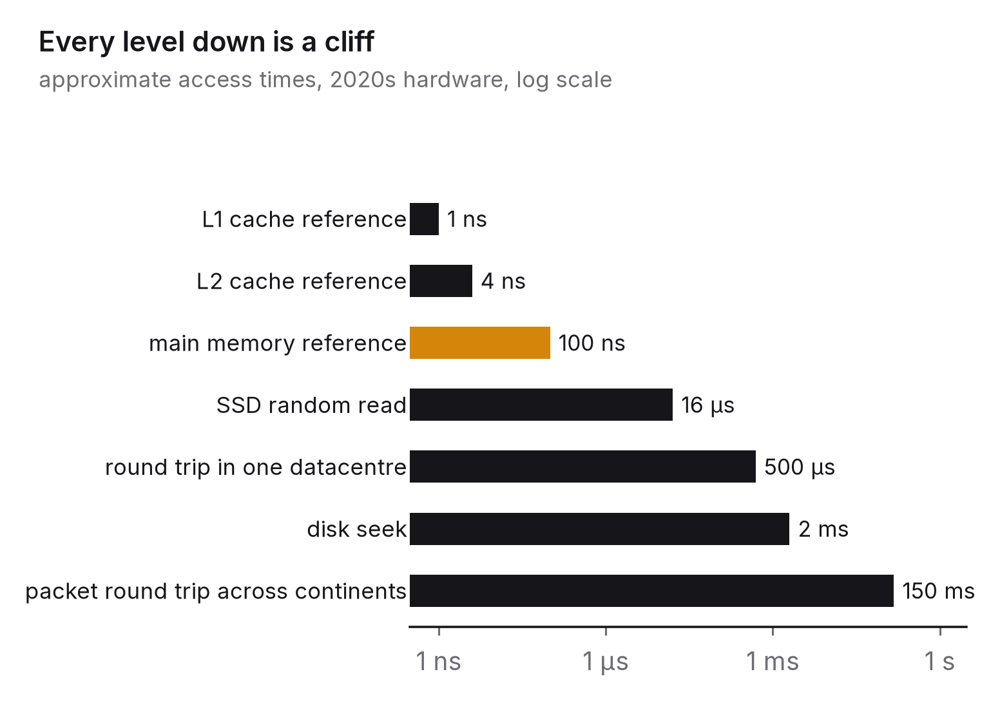

# Chapter 4 — Data structures at scale

Every computer-science student learns that a hash table looks things up in constant time and a balanced tree in logarithmic time, and that constant beats logarithmic. Every engineer who has profiled a real system has watched a hash table lose to a sorted array, a tree beat a hash table, and a theoretically slower structure win by a factor of ten because of where its bytes happened to sit in memory. Both are right. Big-O tells you how cost grows, not what the cost is, and at scale it's the constants, the memory hierarchy and the access pattern that decide the result.

This chapter is about the structures large systems are actually built from, and what each one buys and costs in practice rather than on paper. It finishes with a modern case, approximate nearest-neighbour search, where the trade between accuracy and speed is explicit, measurable and, in the companion study, measured.

## The principle

*Asymptotic complexity is necessary but not sufficient. Choose structures by the access pattern and the memory hierarchy, measure the constants on your own data, and when you don't need exactness, trade it for speed deliberately, along a curve you've measured.*

## Why Big-O isn't enough

Three facts about hardware dominate how data structures perform at scale, and none of them shows up in an asymptotic analysis.

**Memory is a hierarchy with cliffs.** A load from the first-level cache takes about a nanosecond, and from main memory about a hundred. A random read from a fast SSD takes tens of microseconds, a disk seek a few milliseconds, and a packet round trip across continents well over a hundred milliseconds.[^1] The steps aren't even, but from top to bottom the range is eight orders of magnitude. A structure whose accesses stay in cache can be a hundred times faster than one with the same Big-O whose accesses don't, and a structure that fits in memory is thousands of times faster than the same structure spilled to disk. "O(log n) comparisons" says nothing about how many of those comparisons miss the cache.

**Sequential beats random.** Hardware fetches memory and disk in blocks, so reading the next byte is nearly free and reading a random one is a full miss. A linear scan over a contiguous array can beat a pointer-chasing tree that does asymptotically less work, up to surprisingly large sizes, because the scan's accesses are predictable and the tree's aren't. That's why columnar storage, log-structured storage and sorted runs turn up all over large systems. They turn random access into sequential access.

**Constants are big, and they differ by a factor of a hundred.** Hashing a key, following a pointer, comparing two strings, allocating a node: each costs something that depends on the language, the allocator and the data, and two implementations of the "same" structure routinely differ tenfold. The only way to know a constant is to measure it, on your data and your hardware.

None of this means abandoning complexity analysis. Use it to rule out the structures that can't scale, then choose among the survivors by measuring.

## The structures large systems are built from

Here's a short field guide. Each entry says what the structure is for, what it costs, and the question that decides whether it fits.

**Hash tables.** Point lookups by exact key, and the default in-memory index. Lookups take expected constant time, with the constant dominated by the hash function and the cache miss to reach the bucket. The costs are no ordering, so range queries are impossible; resize pauses, since a table that doubles has to rehash everything, which is a latency spike in a serving system unless it's done incrementally; and memory overhead for the load factor and pointers. *Question: do I only ever look up by exact key?*

**B-trees and their variants.** Ordered storage with logarithmic lookups, range scans and in-place updates, and the structure underneath most relational database indexes and many file systems. Wide nodes holding hundreds of keys, sized to a disk or memory page, keep the tree shallow, three or four levels for billions of keys, so a lookup is a handful of page reads. The costs are write amplification (one insert may rewrite a whole page), fragmentation, and random writes on disk. *Question: do I need range queries or ordered iteration, with reads dominating?*

**Log-structured merge trees (LSM trees).** Writes go to an in-memory structure that's flushed to disk as sorted runs. Reads check several runs, and background compaction merges them. This is the structure underneath most write-heavy stores, including LevelDB, RocksDB and the databases built on them, Cassandra and HBase. It buys sequential writes and very high write throughput. It costs read amplification, because a read may have to check several levels (Bloom filters help), plus compaction's background I/O and the latency spikes it can cause, and extra space while merges run.[^2] *Question: is this write-heavy, and can reads tolerate a few extra lookups?*

**Skip lists.** A probabilistic ordered structure with logarithmic operations and a simple concurrent implementation. You'll find them wherever an ordered in-memory structure has to be modified by many threads, such as the memtable in several LSM stores and the sorted sets in Redis. The costs are pointer-chasing, which the cache dislikes, and memory for the extra levels. *Question: ordered, in memory, concurrent?*

**Bloom filters.** A compact probabilistic set that answers "definitely not present" or "probably present" with a false-positive rate you can tune, using a few bits per element. They're used to skip expensive lookups. Does this key exist in that run on disk? Is this URL on the malware list? Have we seen this item before? The costs are no deletion in the basic form, no way to list the contents, and false positives you have to be able to live with. *Question: can I afford the occasional false positive in exchange for skipping most lookups?*

**HyperLogLog.** Counts the distinct elements in a stream to within a few per cent using about a kilobyte, however many billions of distinct items there are. It's used for cardinality, like unique visitors or distinct queries, where an exact count would mean storing every item. *Question: is approximately right good enough for this count?*

**Inverted indexes.** A map from each term to the list of documents that contain it, and the structure underneath every search engine. It buys fast text queries and costs build time, awkward updates, and a size comparable to the corpus itself. *Question: do I search by content rather than by key?*

**Vector indexes.** Find the items whose embedding vectors are nearest to a query vector. This is the structure underneath semantic search, recommendations and retrieval-augmented AI systems, and it's the subject of the rest of this chapter, because it's the clearest modern example of a structure whose correctness is a dial rather than a guarantee.

## A modern case: approximate nearest-neighbour search

Represent each item (a document, an image, a product, a user) as a vector of a few hundred numbers, produced by a model so that similar items end up with nearby vectors. Retrieval then becomes geometry: given a query vector, find the *k* items whose vectors are closest. Every semantic search, every "similar items" feature and every retrieval step in an AI application does this, often over millions or billions of vectors and often inside a latency budget of tens of milliseconds.

**Exact search is a scan.** Comparing one query against a million 128-dimensional vectors takes 128 million multiply-adds, and it means streaming half a gigabyte through the processor. That's a few tens of milliseconds on one core, and it grows linearly with the collection. For one query over a million vectors it's tolerable. Over a billion, or at thousands of queries a second, it isn't. In high dimensions no exact index escapes this. The "curse of dimensionality" means tree structures that work well in two or three dimensions degrade into scans at a hundred.

**Approximate search trades recall for speed.** An approximate index returns *k* neighbours that are mostly, but not always, the true *k* nearest. Quality is measured as **recall@k**, the fraction of the true *k* the index actually found. The price is measured as throughput (queries per second) or per-query latency, plus build time and memory. Every approximate index has a knob that sets how much of the structure to explore per query, and turning it traces out a **frontier**, a curve of recall against speed. Your job is to pick a point on it.

Two families dominate.[^3]

*Inverted-file (IVF) indexes* cluster the vectors with k-means, into 1,024 or 4,096 cells say, and at query time search only the cells nearest the query. The knob is how many cells to probe. Building is fast and memory stays close to the raw vectors. Recall rises with the number of probes, and so does the cost. Compressing the vectors inside each cell (product quantisation) gives up more accuracy to save memory, which is how billion-scale indexes fit in RAM.

*Graph indexes*, of which HNSW (Hierarchical Navigable Small World) is the standard, connect each vector to a few dozen neighbours. A search walks greedily from an entry point toward the query, keeping a beam of candidates. The knob is the beam width, often called `ef`. Graph indexes usually reach high recall at a lower cost per query than IVF. They cost more to build, minutes to hours for millions of vectors, and more memory for the graph's edges, and they're harder to update incrementally.[^4]

## What the measurements show

The companion study (paper P4, described in Appendix A) built exact, IVF and HNSW indexes, the last in two independent implementations, over two standard public datasets: one million 128-dimensional SIFT image descriptors, and 1.18 million 100-dimensional GloVe word vectors. For each configuration it measured recall@10 against the ground truth shipped with the data, batched throughput, single-query latency on one thread (the number an online service actually sees), build time and memory.

On SIFT, the textbook case, the graph index won at every level of recall. Exact search over the million vectors ran at about 380 queries a second with all eight cores. The HNSW graph reached 91 per cent recall at 28,500 queries a second, 74 times faster, and still managed 8,500 a second at 99 per cent, 22 times faster, with a single-query p99 of 1.25 ms. The inverted-file index reached the same recall levels at a third to a fifth of that throughput. But look at the shape rather than the ranking: for the graph, going from 91 to 99 per cent recall cost a factor of 3.4 in throughput, and going from 99 to 99.9 cost another 4.3. The last point of recall was as expensive as the eight before it.

GloVe, the hard case, overturned the ranking entirely. No index reached 99 per cent recall at all. At 90 per cent the approximate indexes were three times faster than brute force. At 95 per cent they were slower: the best inverted-file setting ran at about 690 queries a second and the best graph at about 630, while exact search over the whole collection ran at 750, because a dense matrix product on eight cores is a very efficient way to compare a million vectors, and an approximate index has to beat it with a chain of dependent memory accesses. The approximate indexes still answered a single query five to six times faster than exact search. But the thing the leaderboards are built to show, the gap in batched throughput, had closed.

And the number a service actually pays, single-query latency on one thread, was two and a half to fifteen times what the batched figures implied, with a median of about six on SIFT and four on GloVe. Batching amortises the fixed cost of a search call and uses every core. A request arriving alone gets neither.

Three features of the frontiers are worth carrying away.

The frontier is steep near the top. Getting from 90 to 95 per cent recall is cheap, getting from 99 to 99.9 is expensive, and exact search at 100 per cent is a different regime altogether. So you have to decide how much recall the application really needs, and that's a product question before it's an engineering one. Would a user notice if one of ten results were the eleventh-nearest instead of the tenth?

Batched throughput and single-query latency are different numbers for the same index. A batch of thousands of queries spreads the overheads and uses every core. A service answering one query at a time on one thread sees a per-query latency that can be an order of magnitude worse. Quoting one number when your workload looks like the other is the most common mistake in planning capacity for vector search.

Build time and memory are part of the trade. The index that searches fastest may take longest to build and the most memory to hold, which matters if it has to be rebuilt as the data changes or has to fit on a particular machine. In the study the graph took three minutes to build on SIFT where the inverted file took five seconds, and the denser graph added more than half again to the memory the raw vectors needed. Chapter 11's cost lens applies here.

One more thing the study taught, which I didn't set out to measure. The GloVe half had to be run three times, for reasons that had nothing to do with the code: a process got killed, an antivirus scan woke up, and by the third attempt the laptop had been running benchmarks for eleven hours and had quietly throttled itself. Recall was identical across all three runs to three decimal places. Throughput differed by up to a factor of six. The same program, the same data, the same machine, three hours apart. If you take one habit from this chapter into any benchmark you ever run, make it this: record what else the machine was doing, repeat, and report the best timing as what the hardware can do while keeping the rest. A number without its environment is a number about the afternoon.

## The question you will be asked

*"Design a system that finds the 10 most similar items among a billion in under 50 ms."*

Start with the arithmetic. A billion vectors of 128 32-bit floats is 512 GB, too much for one machine's memory. So you need compression (product quantisation to 16–64 bytes per vector brings it down to 16–64 GB), partitioning across machines, or both. Exact search is out, because a billion distance computations per query takes seconds, not milliseconds. That means an approximate index, and your first question back to the interviewer should be *what recall do you need?*, because the answer decides everything downstream.

Then the design. Partition the collection, by IVF cell or by hash, across a few dozen machines so each holds a shard that fits in memory. On each shard, run either an IVF index over product-quantised vectors, which is memory-efficient at this scale, or an HNSW graph over quantised vectors, which is faster per query but needs more memory. A query goes out to the shards, or only to the shards that own the nearest cells. Each returns its top candidates in a few milliseconds, a coordinator merges them, and the final *k* are re-ranked against full-precision vectors fetched for just those candidates. For the budget, allow 5–10 ms for the fan-out and merge, 10–20 ms for the per-shard search at p99, a few milliseconds for the re-rank, and headroom for the tail (chapter 1), because the user waits for the slowest shard.

Then operations. How do new vectors get in? IVF takes appends cheaply and graphs less so, so most systems batch inserts and rebuild periodically. How is recall monitored in production? Sample live queries, compute their exact neighbours offline, and track recall over time as the data drifts. What gives way under load? Probe fewer cells or narrow the beam, because the frontier doubles as a load-shedding dial. An answer that asks the recall question, does the memory arithmetic and knows the frontier can be turned down under load is the answer of someone who has built one of these.

## The trade-off, stated

Choosing a structure by Big-O alone gets you a defensible argument and costs you the tenfold factors that the memory hierarchy and the constants impose. Measuring on your own data costs an afternoon and gets you the real number. Approximate structures (Bloom filters, HyperLogLog, vector indexes) buy orders of magnitude in speed and memory, and cost exactness. That exactness has to be given up on purpose, then measured and monitored, because an approximation whose error nobody tracks is a bug nobody can find.

## Run this yourself

Run the P4 benchmark, or just its first dataset for a quicker experiment. Then do two things. First, take the HNSW results and plot single-query p99 latency against recall. Find the point where the curve turns upward, and ask what the application you have in mind would lose at that recall. Second, write a twenty-line exact search in NumPy over the same million vectors and time it for one query and for a batch of a thousand. Compare that with the flat index's numbers in the results, and notice how much of the gap comes from the library using all your cores. Then, with the frontier in front of you, write down the recall you'd choose for a product search, a near-duplicate detector and the retrieval step of an AI assistant, and why the three differ. That reasoning, backed by a curve you measured, is the chapter.

---

[^1]: The "latency numbers every programmer should know", first compiled by Jeff Dean and Peter Norvig and since updated by others for current hardware. The ratios matter more than the absolute figures, which shift every few years.
[^2]: O'Neil, P., Cheng, E., Gawlick, D. & O'Neil, E. (1996), "The Log-Structured Merge-Tree (LSM-Tree)", *Acta Informatica* 33(4).
[^3]: Aumüller, M., Bernhardsson, E. & Faithfull, A. (2020), "ANN-Benchmarks: A benchmarking tool for approximate nearest neighbor algorithms", *Information Systems* 87, the public benchmark and datasets the companion study uses.
[^4]: Malkov, Y. A. & Yashunin, D. A. (2018), "Efficient and robust approximate nearest neighbor search using Hierarchical Navigable Small World graphs", *IEEE TPAMI* 42(4); Johnson, J., Douze, M. & Jégou, H. (2019), "Billion-scale similarity search with GPUs", *IEEE Transactions on Big Data* 7(3), which describes FAISS, including product quantisation at billion scale.

### Sources for this chapter
- Dean & Norvig, "Latency numbers every programmer should know" (various updated versions).
- O'Neil et al. (1996) on LSM trees; Bayer, R. & McCreight, E. (1972), "Organization and Maintenance of Large Ordered Indexes", *Acta Informatica* 1(3), on B-trees.
- Bloom, B. H. (1970), "Space/time trade-offs in hash coding with allowable errors", *CACM* 13(7); Flajolet, P. et al. (2007), "HyperLogLog: the analysis of a near-optimal cardinality estimation algorithm", *AofA 2007*.
- Pugh, W. (1990), "Skip Lists: A Probabilistic Alternative to Balanced Trees", *CACM* 33(6).
- Malkov & Yashunin (2018) on HNSW; Jégou, H., Douze, M. & Schmid, C. (2011), "Product Quantization for Nearest Neighbor Search", *IEEE TPAMI* 33(1); Johnson, Douze & Jégou (2019) on FAISS; Aumüller et al. (2020) on ANN-Benchmarks.
- Kleppmann (2017), *Designing Data-Intensive Applications*, chapter 3, on storage engines (B-trees and LSM trees) for practitioners.
- Paper P4 in the companion repository (Appendix A), the measurements referred to in this chapter.
