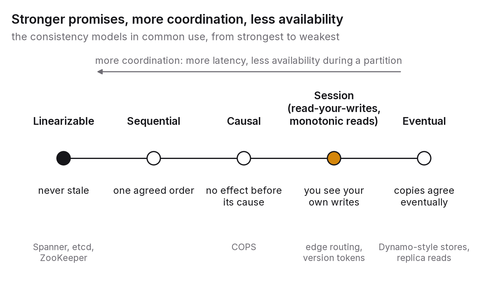

# Chapter 5 — Consistency, availability and what you actually get

A user changes their display name and the page reloads with the old name still showing. They try again, and this time the new one appears. Then they open the app on their phone and see the old one. Nothing is broken, in the sense that every server is up and every request succeeded. Something is definitely wrong, though, because the system has told one person three different things about one fact inside ten seconds.

This chapter is about that gap between a system that's available and a system that's telling the truth, and about the vocabulary engineers use to say exactly which truths a system promises. The vocabulary matters because strong promises are expensive, weak ones are often good enough, and the worst outcome isn't picking a weak guarantee. It's not knowing which one you picked.

## The principle

*Consistency is a promise about what reads return relative to writes, and every promise has a price in latency, availability or both. Choose the weakest promise that keeps the user's experience coherent, and say out loud which one it is.*

## What CAP actually says

Nearly everyone who has sat a system-design interview has heard of the CAP theorem, and nearly everyone has heard a version of it that's wrong. The folk version is a menu: consistency, availability, partition tolerance, pick any two. The theorem says something narrower and more useful.

A distributed system keeps copies of its data on more than one machine, and the network between those machines will sometimes fail. Messages get delayed or lost, and for a while the machines can't tell whether the others are down or merely unreachable. That's a partition. CAP, stated informally by Eric Brewer in 2000 and proved by Gilbert and Lynch in 2002, says that during a partition a system has to choose between answering every request (availability) and answering only with values guaranteed to be up to date (consistency).[^1] It can't do both, because an isolated node has no way of knowing whether the other side has accepted a newer write.

The menu version hides three things. First, partition tolerance isn't optional. Networks partition, and a system that doesn't tolerate it is a system that corrupts data or stops when it happens. The only real choice is between C and A, and only while a partition is going on.

Second, CAP says nothing at all about the rest of the time, which is almost all of the time. A system can be both consistent and available while the network is healthy, and most are. The trade-off that matters during normal operation is a different one, between consistency and latency, because stronger guarantees need coordination between nodes and coordination costs round trips. Daniel Abadi's PACELC formulation spells this out: if there's a Partition, trade Availability against Consistency; Else, trade Latency against Consistency.[^2] It's the more useful acronym of the two, and the less well known.

Third, "consistency" in CAP means one specific and very strong property, linearizability. Most of the consistency models engineers actually use are weaker than that, and CAP isn't about them.

## The models, in plain terms

A consistency model is a promise about the order in which operations appear to happen. These are the ones that matter, from strongest to weakest, each with the promise a user would actually notice.

Linearizability, usually called strong consistency, means every operation appears to take effect at a single instant between its start and its finish, and every client agrees on the order. If a write finishes and a read starts afterwards, anywhere in the system, the read sees the write. It's what people mean when they say "the database just works", and it's the most expensive option, because every linearizable read or write has to coordinate with a majority of replicas (or go through a single leader). That costs at least one network round trip and makes the operation unavailable whenever a majority can't be reached. The promise is that you'll never see stale data. Spanner, etcd and ZooKeeper offer it, as do single-leader relational databases when reads go to the leader.

Sequential consistency means all clients see operations in the same order, an order that respects each client's own sequence of operations but needn't match real time. A read might return a value overwritten a moment ago, as long as everyone sees the same history. Few systems offer it explicitly, but it's a useful concept for understanding the models below it.

Causal consistency means that if operation B could have been caused by operation A (because B came after A on the same client, or because B read something A wrote), then everyone sees A before B. Unrelated operations may appear in different orders to different clients. The promise is that you'll never see an effect before its cause, like a reply showing up before the comment it's replying to. Roughly speaking, it's the strongest model that can stay available during a partition, which makes it a natural target for systems that have to keep working when the network doesn't.[^3]

Session guarantees are a family of promises scoped to one client's session, each cheap to provide and each fixing one specific anomaly a user would notice.[^4] Read-your-writes means that once you've written something, your own reads see it, which fixes the display-name problem this chapter opened with. Monotonic reads means that once you've seen a value, you never see an older one, which fixes "the comment appeared, vanished, then came back". Monotonic writes means your writes are applied in the order you made them, and writes-follow-reads means a write you make after reading a value is ordered after that value everywhere. Session guarantees are what most applications actually need, and they're often implemented outside the database: by routing a user's requests to the same replica, by having the client carry a version token, or by reading from the leader for a few seconds after a user writes.

Eventual consistency promises only that if writes stop, all replicas will converge on the same value eventually. There's no promise about how long that takes or what you'll see in the meantime. What you do get is that nothing is lost and the copies will agree in the end. It's the natural model for data replicated across regions, cached widely or written in many places at once, and it's fine for data where a brief disagreement doesn't matter: view counts, presence indicators, feeds, product catalogues. It's not fine for anything where two clients acting on different views can create an irreversible conflict, such as balances, inventory, seat reservations or access control.

The key realisation is that these aren't a ladder you climb as your budget allows. They're tools for different kinds of data. A single system will often offer linearizable operations on a few critical keys, causal or session consistency for user-facing state and eventual consistency for everything else, and the engineering skill lies in knowing which data is which.

## Where the big systems sit, and why

A handful of widely used systems show how these trade-offs get made in practice. The dates matter, because each design was a response to a particular need at a particular time.

Amazon's Dynamo, published in 2007, chose availability and eventual consistency for the shopping cart, on the reasoning that a cart you couldn't use cost more than one that was briefly inconsistent.[^5] It introduced the mechanisms (vector clocks, sloppy quorums, hinted handoff, read repair) that a whole generation of "AP" stores copied. Its descendants, including Cassandra (2008) and Riak, let the client choose consistency per operation using tunable quorums. With *N* replicas, a write acknowledged by *W* of them and a read that consults *R* of them, the read is guaranteed to overlap a recent write whenever *W* + *R* > *N*. The arithmetic is simple and the behaviour under failure isn't; the overlap guarantee says nothing about which of several concurrent writes you'll see.

Google's Spanner, published in 2012, went the other way and showed that linearizable, globally distributed transactions were practical at scale.[^6] It bounded clock uncertainty with atomic clocks and GPS receivers (the TrueTime API) and waited out that uncertainty before committing. The price is latency, since commits wait for the clock bound and for cross-region consensus, plus the hardware. The lesson is that engineering can move the trade-off, at a cost, when an application demands it; for Google it was the advertising backend.

DynamoDB, which Amazon launched in 2012, descends from Dynamo's ideas but has always let each read choose between eventually consistent (cheaper, and the default) and strongly consistent, and later added transactions. Making the choice explicit, per request, is itself the design lesson.

Single-leader relational databases such as PostgreSQL and MySQL, and their managed versions, are linearizable when every read goes to the leader and eventually consistent the moment reads are served from replicas, which is how most of them run at scale. Replication lag is usually milliseconds and occasionally seconds, and the display-name anomaly at the start of this chapter is almost always exactly this: a write to the leader followed by a read from a lagging replica. The fix is a session guarantee, read-your-writes, implemented by sending a user's next few reads after a write to the leader.

## The question you will be asked

*"A user updates their profile and immediately sees the old value. Where did it come from?"*

The interviewer wants a diagnosis, not a guess, so walk the read path. Was the read served by a replica that hadn't yet applied the write (replication lag)? By a cache still holding the old value (invalidation, chapter 3)? By a CDN edge? By the client's own local state? Each of those has a different fix. Then name the guarantee that would have prevented it (read-your-writes), say how you'd provide it (route that user's reads to the leader for a few seconds after a write, or carry a version token and re-read until the replica catches up), and say what it costs (more load on the leader, or a little extra latency for the user who just wrote). An answer that stops at "eventual consistency" without the diagnosis, the fix and the cost sounds like someone who has heard of the problem but never met it.

## The trade-off, stated

Stronger consistency buys correctness under concurrency and failure. It costs latency (coordination round trips), availability during partitions and throughput (points where operations have to be serialised). Weaker consistency buys speed and availability and costs you the possibility of anomalies, which are either harmless for the data in question or have to be prevented by application logic (idempotency, conflict resolution, compensation), which is harder than it sounds and is the subject of chapter 6.

The failure to fear isn't choosing weak consistency. It's choosing it without noticing: reading from replicas because that was the default, caching because it was easy, and discovering the guarantee you didn't have when a customer gets charged twice.

## Run this yourself

Set up a database with one leader and one replica (PostgreSQL streaming replication works, as does a managed service with a read replica). Write a script that updates a row on the leader and immediately reads it from the replica, a thousand times, recording how often the read is stale and by how much. Then put artificial load on the leader and run it again. You'll see the lag distribution with your own eyes, which is worth more than any number I could quote, because it depends on your hardware, your load and your configuration. Finally, implement read-your-writes (route to the leader for two seconds after a write) and confirm the anomaly disappears. It takes an afternoon, and it's the most common distributed-systems bug in production.

---

[^1]: Brewer, E. (2000), "Towards Robust Distributed Systems", keynote, *PODC 2000*; Gilbert, S. & Lynch, N. (2002), "Brewer's conjecture and the feasibility of consistent, available, partition-tolerant web services", *ACM SIGACT News* 33(2). Brewer revisited the misreadings in "CAP Twelve Years Later: How the 'Rules' Have Changed", *IEEE Computer*, February 2012.
[^2]: Abadi, D. (2012), "Consistency Tradeoffs in Modern Distributed Database System Design: CAP is Only Part of the Story", *IEEE Computer* 45(2).
[^3]: Mahajan, P., Alvisi, L. & Dahlin, M. (2011), "Consistency, Availability, and Convergence", UT Austin TR-11-22; Lloyd, W. et al. (2011), "Don't Settle for Eventual: Scalable Causal Consistency for Wide-Area Storage with COPS", *SOSP 2011*.
[^4]: Terry, D. B. et al. (1994), "Session Guarantees for Weakly Consistent Replicated Data", *PDIS 1994*.
[^5]: DeCandia, G. et al. (2007), "Dynamo: Amazon's Highly Available Key-value Store", *SOSP 2007*.
[^6]: Corbett, J. C. et al. (2012), "Spanner: Google's Globally-Distributed Database", *OSDI 2012*.

### Sources for this chapter
- Brewer (2000, 2012); Gilbert & Lynch (2002) — CAP and its misreadings.
- Abadi (2012) — PACELC.
- Terry et al. (1994) — session guarantees.
- Lloyd et al. (2011); Mahajan, Alvisi & Dahlin (2011) — causal consistency and availability.
- DeCandia et al. (2007) — Dynamo; Corbett et al. (2012) — Spanner.
- Kleppmann, M. (2017), *Designing Data-Intensive Applications*, chapters 5 and 9 — the best single treatment of replication and consistency for practitioners.
- Bailis, P. et al. (2013), "Highly Available Transactions: Virtues and Limitations", *VLDB 2014* — which guarantees can be offered without giving up availability.
