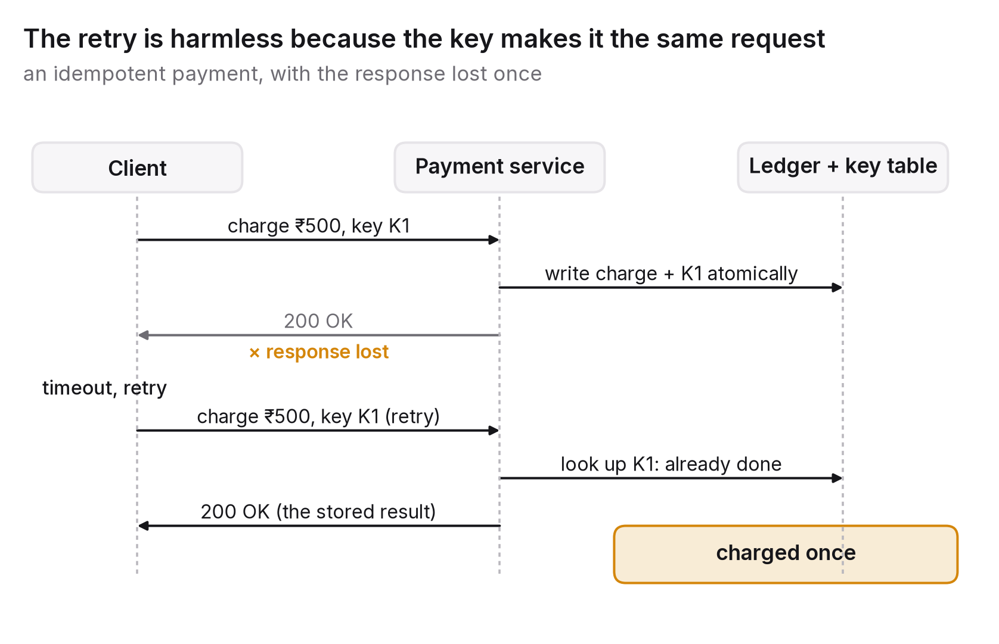

# Chapter 6 — Replication, partitioning and the two hard problems

One database on one machine is the simplest, most consistent and best understood system there is, and almost every system that matters outgrows it in one of two ways. Either it has to survive the machine failing, which means keeping more than one copy of the data (replication), or it has to hold or serve more than one machine can, which means splitting the data across machines (partitioning, also called sharding). Both are old problems with known solutions. Both also produce the failure modes that fill incident reports, because both turn one fact into several facts that have to be kept in agreement.

This chapter is about the shapes those solutions take, the problems each shape brings, and the two particular hard problems every engineer meets sooner or later: a payment that must happen exactly once, and a transaction that spans machines.

## The principle

*Every copy of data is a place where the truth can diverge, and every boundary between machines is a place where an operation can half-finish. Design for both from the start: decide who may write, decide what happens when writers disagree, and make every operation safe to repeat.*

## Replication: who may write

There are three basic shapes, and nearly everything else follows from which one you pick.

With a single leader, one replica accepts writes and the others copy its log and serve reads. It's easy to reason about, since there's exactly one order of writes (the leader's), and it's the model behind most relational databases, most managed database services and most systems that need strong consistency for at least some operations. The costs are that writes are capped at one machine's capacity, the leader is a single point of failure that has to be replaced when it dies, and reads from followers are stale by however far replication is lagging (chapter 5's opening anomaly).

Replication itself can be synchronous, where the leader waits for a follower to confirm before acknowledging the write, so a leader failure loses nothing but a slow or dead follower slows or stops writes. Or it can be asynchronous, where the leader acknowledges straight away, which is fast but means writes not yet copied are lost if the leader dies. Most production systems mix the two: one synchronous follower for durability and the rest asynchronous.

With multiple leaders, several replicas accept writes (usually one per region) and exchange changes. Writes are local and fast everywhere, and the system keeps accepting them even when regions can't reach each other. The price is exactly the thing a single leader avoided: the same record can be written differently in two places at once, so the system has to resolve conflicts. Last-writer-wins, by timestamp, is the common default, and it silently throws away one of the writes. Application-specific merging is correct but expensive to write. Conflict-free replicated data types (CRDTs) make certain structures, such as counters, sets and some kinds of text, mergeable by construction.[^1] I'd use multiple leaders only when write availability across regions matters more than simplicity, and only for data whose conflicts you've already decided how to resolve.

With no leader at all, any replica accepts writes, clients write to and read from several replicas, and a quorum (chapter 5's *W* + *R* > *N*) makes reads overlap writes. This is the Dynamo family. There's no failover and no leader election, and partial failures are handled gracefully, but you inherit the same conflict problem as multi-leader systems plus weaker ordering guarantees. It suits highly available data where eventual consistency is acceptable and the operational simplicity of having no leader is worth the extra semantic complexity.

### Failover and the split brain

In a single-leader system the dangerous moment is when the leader fails, or seems to. A follower has to be promoted and clients redirected to it, and the old leader, if it was only cut off rather than dead, has to be prevented from accepting writes when it reconnects. If it isn't, you end up with two leaders, both accepting writes, each unaware of the other. That's a split brain, and when the partition heals, writes to one side will be lost or will conflict.

The defences are well established. Leader election through a consensus protocol (Raft or Paxos, or a coordination service like ZooKeeper or etcd that implements one) makes sure only one node believes it's the leader at any time. Fencing makes sure the old leader can't act: every write carries a monotonically increasing epoch number or fencing token, and storage rejects writes from an older epoch. A lease makes a leader that can't renew its claim within a time limit stop acting on its own, before anyone else is elected.[^2] A system that promotes followers automatically without fencing will, one day, have two leaders.

## Partitioning: where the data lives

Once the data or the load is too big for one machine, it gets split by a partition key. There aren't many ways to do it, and the consequences are large.

Partitioning by key range puts records with keys A–F on one machine, G–M on another, and so on. Range scans are efficient because neighbouring keys sit together. The danger is hot spots: if the keys are timestamps, every write lands on the newest partition, and one machine does all the work while the rest sit idle.

Partitioning by a hash of the key spreads keys evenly, so the load balances. Range queries then have to scatter to every partition and gather the results. Hot spots still happen when a single key is hot (a celebrity's record, one big tenant's data), and the fixes are at the application level: split the key by appending a random suffix and reading all the variants, or cache it.

Choosing the key is where the real decision lies. The partition key should be whatever most queries filter on, so that most queries touch one partition, and it should spread load evenly over time. Those goals conflict more often than not, and I'd argue the choice of partition key is the most consequential decision in a large data store, because it's the hardest one to change later.

Rebalancing comes with adding machines. Naive hashing, key mod *N*, moves almost everything when *N* changes. Consistent hashing, or a fixed number of partitions much larger than the number of machines (assigned to machines and moved whole), keeps the amount of data that moves proportional to the change.[^3] Automatic rebalancing is convenient, and it's also a way for a system to shift huge amounts of data at the worst possible moment, so good systems let an operator confirm.

Secondary indexes are the last piece: finding records by something other than the partition key. Either each partition indexes its own data, so writes stay local but reads have to query every partition, or the index is partitioned by the indexed value, so reads go to one place but writes have to update an index on some other machine, asynchronously, and the index lags behind. Neither is free, and most systems offer one of the two and let you feel what it costs.

## The first hard problem: exactly once

Take a payment service. A client sends "charge this card ₹500". The service charges the card, and before it can reply, the connection drops. Now the client doesn't know whether the charge happened. If it retries, the customer might be charged twice. If it doesn't, the customer might not be charged at all. The protocol offers no third option: a message either arrives or it doesn't, and the sender can't tell "lost before it was processed" from "lost after".

That's why exactly-once delivery is, strictly speaking, impossible over an unreliable network, and why systems that advertise exactly-once really mean effectively-once: at-least-once delivery combined with processing that's safe to repeat.[^4] That combination is a discipline, and it has a name.

An operation is idempotent if doing it twice has the same effect as doing it once. Reads are idempotent, and so is "set the balance to 1,000"; "add 500 to the balance" isn't. You make a non-idempotent operation idempotent by attaching an idempotency key, a unique identifier the client chooses for this one logical operation, which the server records together with the result. A retry carrying the same key gets the recorded result back instead of running the operation again. Every serious payment provider's API works this way, and a payment system without idempotency keys is a double charge waiting for a flaky network.

The details matter. The key and the result have to be stored atomically with the operation's effect, or a crash between the two recreates the original problem. Keys have to be kept long enough to cover any plausible retry. And the check has to happen at the point where the effect happens, not at some edge that can be bypassed.

## The second hard problem: transactions across machines

A transaction moves money from account A, on partition 1, to account B, on partition 2. Either both change or neither does. On one machine the database's own transaction takes care of that. Across machines, something has to coordinate.

Two-phase commit is the classic answer. A coordinator asks every participant to prepare (make the change durable but not yet visible, and promise to commit if asked), and if they all agree, tells each of them to commit. That gives you atomicity across machines. The costs are latency, since it takes two round trips to every participant, and the fact that the coordinator becomes a single point of failure during the protocol: if it dies after the participants have prepared, they sit holding locks, unable to proceed, until it comes back. Two-phase commit is correct, but it's a blocking protocol, which is why most large systems avoid it across service boundaries and use it only inside a single database system that has a highly available coordinator.[^5]

Sagas are the pragmatic alternative. The transaction is broken into a sequence of local transactions, each paired with a compensating action that undoes it: debit A, then credit B, and if crediting B fails, run the compensation and re-credit A.[^6] No locks are held across machines and there's no blocking coordinator, but the guarantee is different. The system passes through visible intermediate states (A debited, B not yet credited), and the compensations themselves have to be reliable, idempotent and sensible in business terms (you can't un-send an email, so you send a correction). Sagas move the hard work out of the database and into the application, where it has to be designed, tested and monitored. A saga that doesn't let you see which step each in-flight instance is on is a saga nobody can debug.

Better still is designing around the problem. The best cross-partition transaction is the one you never need. Choose partition keys so that records which have to change together live together, the customer with their orders, the account with its ledger entries. Where that isn't possible, prefer sagas with idempotent steps, and accept the intermediate states explicitly rather than pretending they don't exist.

## The question you will be asked

*"Design a payment system that never double-charges."*

The core of the answer is above: client-generated idempotency keys; a record of key and outcome written in the same transaction as the charge; retries that get the recorded outcome back; a reconciliation job comparing the service's records with the card network's, because the network can fail in ways that leave the two disagreeing; and clear rules for clients about how long a key stays valid. Everything else, queues, retries with backoff, timeouts, is plumbing around that core.

Then come the follow-ups, which are what the question is really testing. What if the card network times out? Treat the charge as unknown, don't retry blindly, and reconcile against the network's record. What if two requests with the same key arrive at once? The key insert has to be atomic and unique-constrained, so the second request waits or fails. What if the service crashes after charging but before recording? Record and charge in one transaction where you can; where the charge is external, record "charge attempted, network reference R" before calling out, and reconcile later. How would you know it works? A metric for duplicate-key hits, a daily reconciliation report, and a chaos test that kills the service mid-charge. What the interviewer is listening for is an understanding that over a network, "exactly once" is something you build, not something you're given.

## The trade-off, stated

Replication buys durability and read capacity and costs you consistency (lag and conflicts) and operational complexity (failover and fencing). Partitioning buys write capacity and storage and costs you query flexibility (scatter-gather and lagging indexes) and cheap transactions. At scale both are unavoidable, and both are manageable with a short list of disciplines: one writer or an explicit conflict rule; fencing on failover; a partition key chosen for the queries; idempotency everywhere; and sagas with visible state wherever a transaction has to span machines. The systems that fail aren't the ones that chose weak guarantees. They're the ones that didn't notice which guarantees they had.

## Run this yourself

Write a tiny payment service with an endpoint that "charges" by appending a line to a ledger file, and a client that sends charges and retries when it times out. Put a proxy between them that drops 10 per cent of responses (responses, not requests) and compare the ledger with what the client intended. You'll see double charges within a minute. Add an idempotency key to the request and a key-to-result table to the service, written atomically with the ledger entry, and run it again; the duplicates disappear. Then kill the service at random moments under load and check that the ledger and the key table still agree. It's an afternoon's work, and it makes the whole of the first hard problem visible.

---

[^1]: Shapiro, M., Preguiça, N., Baquero, C. & Zawirski, M. (2011), "Conflict-free Replicated Data Types", *SSS 2011*.
[^2]: Ongaro, D. & Ousterhout, J. (2014), "In Search of an Understandable Consensus Algorithm" (Raft), *USENIX ATC 2014*; Gray, C. & Cheriton, D. (1989), "Leases: An Efficient Fault-Tolerant Mechanism for Distributed File Cache Consistency", *SOSP 1989*; Kleppmann, M. (2016), "How to do distributed locking", on fencing tokens.
[^3]: Karger, D. et al. (1997), "Consistent Hashing and Random Trees", *STOC 1997*; the fixed-partition scheme is described in the Dynamo and Riak literature.
[^4]: The impossibility is the Two Generals problem (Akkoyunlu, Ekanadham & Huber, 1975) in another guise; for the practical treatment see Kleppmann (2017), chapter 11, and the Kafka "exactly-once semantics" design notes (2017), which are explicit that the guarantee is idempotent production plus transactional consumption.
[^5]: Gray, J. (1978), "Notes on Data Base Operating Systems", in *Operating Systems: An Advanced Course*, Springer — the original description; Gray, J. & Reuter, A. (1993), *Transaction Processing: Concepts and Techniques*, Morgan Kaufmann.
[^6]: Garcia-Molina, H. & Salem, K. (1987), "Sagas", *SIGMOD 1987*.

### Sources for this chapter
- Kleppmann (2017), *Designing Data-Intensive Applications*, chapters 5–9 — replication, partitioning, transactions and consistency for practitioners.
- Ongaro & Ousterhout (2014) — Raft; Lamport, L. (1998), "The Part-Time Parliament", *ACM TOCS* 16(2) — Paxos.
- Shapiro et al. (2011) — CRDTs.
- Karger et al. (1997) — consistent hashing.
- Gray (1978); Gray & Reuter (1993) — two-phase commit and transaction processing.
- Garcia-Molina & Salem (1987) — sagas.
- Stripe and Razorpay API documentation on idempotency keys — the production pattern, as deployed.
- Helland, P. (2012), "Idempotence Is Not a Medical Condition", *ACM Queue* 10(4) — the clearest essay on the first hard problem.
