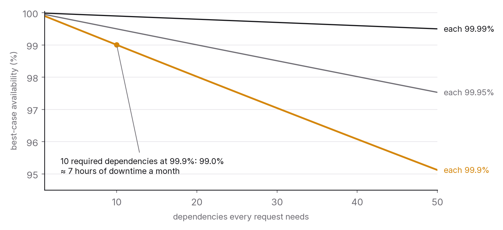

# Chapter 7 — Failure is the normal case

On a big enough system, something is always broken. A disk is failing, a network link is flapping, a dependency is slow, a deployment is half rolled out, a certificate is about to expire. The engineering question is never whether the system has failures. It's whether the failures it has are the ones it was built to survive. Systems that treat failure as an exception fall over when it arrives. Systems that treat it as normal are built from parts that each assume the others will misbehave, and they bend instead of breaking.

This chapter covers the small set of mechanisms that make a system tolerant of the failures it will certainly have, the ways those mechanisms fail when they're misused, and the practice of finding out, deliberately, how a system breaks before it breaks on its own.

## The principle

*Every dependency will fail, slow down or return garbage. Decide in advance what your system does in each case, cap how long it waits, limit how hard it retries, and rehearse the failure before it happens.*

## The arithmetic of many parts

A service that depends on ten others, each available 99.9 per cent of the time, is available at most 99.9 per cent to the tenth power, about 99.0 per cent, if every request needs every dependency. That's roughly seven hours of downtime a month, built from parts that each promised less than one. Availability multiplies downwards. The only ways to beat the arithmetic are to depend on fewer things, to make dependencies optional (degrade when they fail instead of failing with them), or to make them redundant (two independent paths). All three are design decisions, and none can be added afterwards with a configuration flag.

The same arithmetic applies to time. If one dependency's latency goes from 20 ms to 2 seconds, every request waiting on it now takes 2 seconds, every thread or connection holding one of those requests is tied up a hundred times longer, and the service's capacity drops a hundredfold. Chapter 2's blocking argument turns into an outage. The dependency didn't fail. It slowed down, and the caller had never decided what to do about that.

## Timeouts: deciding how long to wait

A call with no timeout is a promise to wait forever, and forever is exactly how long a hung connection can last. Every outbound call needs a timeout, and the timeout should be chosen rather than inherited from a default.

Chosen how? From the latency budget in chapter 1. If the caller has to respond within 200 ms and has 150 ms left when it calls a dependency whose p99 is 40 ms, a 100 ms timeout is reasonable: comfortably above the dependency's normal tail and comfortably inside what the caller can afford. A 30-second timeout, the default in plenty of client libraries, isn't really a timeout at all. It's a way of hearing about the problem from your users.

Two refinements help. Deadlines should propagate, meaning the remaining budget gets passed downstream so a dependency doesn't spend 100 ms on work the caller has already abandoned. And a timeout isn't the same as a failure: the timed-out request might have succeeded on the other side (chapter 6's first hard problem), and whatever happens next has to allow for that.

## Retries: the mechanism that takes down healthy systems

Retrying a failed call is the right thing to do for transient failures (a dropped packet, a brief overload, a node in the middle of restarting) and a disaster for persistent ones. Here's how the disaster unfolds. A dependency slows down under load. Callers time out and retry. The dependency now receives its original load plus the retries, slows further, and more callers time out and retry. Within seconds it's receiving several times its capacity, nearly all of it retries of work it's already struggling with, and it can't recover because the load never falls. This is a retry storm, and retries and reconnection surges feature in several of the best-known outages of the last decade, including some at the largest cloud providers.[^1]

The disciplines that prevent it are few, and they aren't optional. Keep retries bounded to a small fixed number, usually one to three, and never unbounded.

Back off exponentially and add jitter: wait before retrying, wait longer each time, and randomise the wait so that a thousand callers who failed together don't retry together.[^2] Without jitter, backoff just organises the storm into synchronised waves.

Use retry budgets, capping retries as a fraction of all requests (say 10 per cent) across the whole client, so that when the failure rate is high, retries get dropped rather than multiplied. It's the single most effective defence and the least commonly implemented.

Retry only what's safe: idempotent operations (chapter 6), and only on errors that mean the request didn't get through. Never retry a request that came back "invalid"; it'll be invalid again.

And retry at one layer only. If the client retries, the proxy retries and the service retries its own dependency, one failure becomes 3 × 3 × 3 = 27 attempts. Decide where retries live and make every other layer pass failures straight through.

## Circuit breakers and bulkheads

A circuit breaker wraps a dependency and counts its failures. When failures cross a threshold within a time window, the breaker opens, and calls fail immediately without being attempted for a cooling-off period, after which a trial call checks whether the dependency has recovered. That does two things: the caller stops wasting its own capacity on calls that are going to fail, and the dependency gets the drop in load it needs to recover.[^3] A breaker is the automated version of someone noticing "that service is down, stop calling it", except that it notices in milliseconds rather than minutes.

A bulkhead isolates resources per dependency, so one slow dependency can't use up every thread, connection or queue slot and starve calls to the healthy ones. The name comes from ship design, where compartments contain flooding. In practice it means a separate connection pool and concurrency limit for each downstream service, sized from that service's expected load, so that a failing recommendations service can't take checkout down with it just because the two shared a pool.

Along with timeouts and bounded retries, these make up the standard kit. Most mature service frameworks and service meshes provide all four. The engineering lies in configuring them from your latency budget and your dependency map instead of accepting the defaults.

## Graceful degradation: deciding what to drop

When a dependency is unavailable, a service has three options, and which one it takes should have been decided in advance.

It can fail the request, which is right when the dependency is essential, like payment authorisation for a purchase.

It can degrade, serving the response without that dependency's contribution: a product page without recommendations, a feed from cache, search without personalisation. That's right when the dependency is an enhancement and the user is better off with a slightly worse page than an error. Degradation has to be designed, though. The code path that renders a page without recommendations has to exist and be tested, or the first time it runs will be in the middle of the outage.

Or it can fall back to an alternative: a secondary provider, a stale cache, a default value. That's right when the alternative is genuinely acceptable and has been tested under realistic conditions. A fallback that has never run is a second outage queued up behind the first.

The design artefact here is a table listing every dependency, what happens when it fails, what happens when it's slow, and who decided. Most systems don't have one, so their behaviour under failure is whatever the code happens to do, which usually means waiting and then failing.

## Load shedding: saying no on purpose

Chapter 2 made the case for bounded queues. The general version is load shedding: when a system is over capacity, reject some requests quickly rather than serving all of them slowly, because serving everything slowly serves nothing within budget and often ends in collapse. Shed by priority (health checks and payments before analytics), by cost (expensive queries first) and early (at the edge, before any work has been done), and send back an explicit "overloaded, retry after" so well-behaved clients back off. A system that sheds load at 110 per cent of capacity stays up. One that accepts everything falls over at 120 per cent and recovers slowly, because the backlog has to drain first.

## Finding out on purpose

Until it has been tested under failure, everything above is just a hypothesis about how the system behaves under failure. Testing it deliberately, in production or in a faithful copy, is called chaos engineering, and in fifteen years it has gone from a provocative idea to standard practice at large operators.[^4]

The method is an experiment. State a hypothesis: "if the recommendations service is unavailable, product pages still render in under 300 ms without recommendations, and the error rate stays flat." Inject the failure (kill the instances, add latency, drop network traffic) within a controlled scope. Measure. If the hypothesis holds, the system is as resilient as designed. If it doesn't, you've found the gap under controlled conditions instead of during an incident. Start small, with one instance in a test environment during working hours and a hand on the abort switch, and widen the scope as confidence grows.

A game day is the human-scale version: a planned exercise in which a team responds to a simulated failure using its runbooks, aiming to find gaps in both the system and the response. A runbook that has never been run is as untested as a fallback that has never run.

## Learning from the failures you didn't plan

Incidents happen anyway. The practice that turns them into resilience is the blameless post-mortem: a written account of what happened, in order and with times, what the impact was, what the contributing causes were, and what will change, with owners and dates.[^5] It's blameless because the aim is to understand the system's behaviour rather than to punish a person, and because people who expect blame hide information.

Two habits make post-mortems worth writing. The first is asking "why" more than once. The outage was caused by a bad deployment; the bad deployment got through because the canary didn't catch it; the canary didn't catch it because it measured only errors, not latency; and it measured only errors because nobody had ever decided what a canary should measure. Each "why" points to a different fix, and the deeper ones prevent whole classes of incident. The second habit is tracking the action items to completion. A post-mortem whose actions never get done is a document, not a practice.

## The question you will be asked

*"Your dependency's latency doubled. What happens to your service in the next 60 seconds?"*

Walk it through. In the first second, requests in flight to that dependency take twice as long, the threads or connections holding them are tied up twice as long, and that dependency's pool starts to fill. By ten seconds, if there's no bulkhead, the shared pool is full and unrelated requests start queuing; if no timeout is tighter than the new latency, nothing has failed yet, which is actually worse, because nothing has been shed. By twenty seconds queues are growing, latency is rising for everything, and clients upstream have started timing out and retrying, so incoming load rises just as your capacity has fallen. Without the standard kit, by sixty seconds you are the outage. With it, the timeout fires at the budgeted point and the request degrades or fails fast, the bulkhead keeps other dependencies' paths clear, the breaker opens once the threshold is crossed and stops the bleeding, retry budgets cap what upstream can send, and load shedding turns away the excess with a clear signal. Then say how you'd see all this happening: the dependency's p99, pool saturation, breaker state and shed count on one dashboard, with an alert on the first of them.

## The trade-off, stated

Resilience costs latency (timeouts shorter than the dependency's worst case mean some good requests fail), capacity (bulkheads reserve resources that often sit idle), complexity (more configuration, more states, more things to get wrong) and engineering time (degradation paths, chaos experiments, post-mortems). In return you get a system whose behaviour under failure is known and bounded. For any system that matters, the trade isn't optional. The only choice is whether you pay before the incident or after it.

## Run this yourself

Take the two-service setup from chapter 2's exercise, with bounded concurrency on the upstream service. Add a dependency call with a 30-second default timeout and no retry limit, then inject 2 seconds of latency into the dependency. Watch the upstream's p99 and throughput collapse within a minute. Then add, one at a time: a 200 ms timeout; three retries with exponential backoff and jitter; a 10 per cent retry budget; a per-dependency concurrency limit; and a circuit breaker that opens at a 50 per cent failure rate over ten seconds. Measure after each. You'll see what each mechanism contributes, and if you add retries before the budget, you'll see the retry storm happen: traffic to the dependency goes up as it slows down. Seeing that once, on your own harness, is worth more than this chapter.

---

[^1]: Among the public post-event summaries that describe retries or reconnection surges amplifying an initial fault: Amazon Web Services, "Summary of the Amazon DynamoDB Service Disruption and Related Impacts in the US-East Region", September 2015; and "Summary of the AWS Service Event in the Northern Virginia (US-EAST-1) Region", December 2021. Both are worth reading in full as examples of the genre.
[^2]: Brooker, M. (2015), "Exponential Backoff And Jitter", AWS Architecture Blog, March 2015 — the clearest demonstration that jitter, not backoff, is what prevents synchronised retries.
[^3]: Nygard, M. T. (2007; 2nd ed. 2018), *Release It! Design and Deploy Production-Ready Software*, Pragmatic Bookshelf — the book that named circuit breakers and bulkheads as software patterns.
[^4]: Basiri, A. et al. (2016), "Chaos Engineering", *IEEE Software* 33(3) — the Netflix team's statement of the discipline; principlesofchaos.org.
[^5]: Beyer, B., Jones, C., Petoff, J. & Murphy, N. R. (eds.) (2016), *Site Reliability Engineering: How Google Runs Production Systems*, O'Reilly, chapter 15, "Postmortem Culture: Learning from Failure".

### Sources for this chapter
- Nygard (2007/2018), *Release It!* — stability patterns.
- Beyer et al. (2016), *Site Reliability Engineering*, chapters 21–22 (handling overload, addressing cascading failures) and 15 (post-mortems).
- Brooker (2015) — backoff and jitter; Brooker, M. (2022), "Fixing retries with token buckets and circuit breakers", marcbrooker.com — retry budgets.
- Basiri et al. (2016) — chaos engineering.
- AWS post-event summaries (2015, 2021) — retry and reconnection amplification in the wild.
- Dean, J. & Barroso, L. A. (2013), "The Tail at Scale", *CACM* 56(2) — hedged requests and other tail-tolerance techniques.
