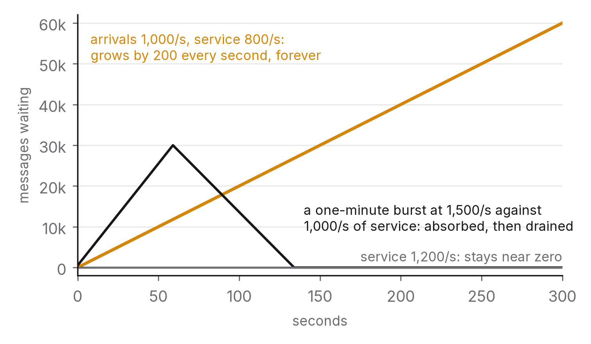

# Chapter 8 — Queues, streams and asynchrony

After caching, the most common performance fix is making something asynchronous: take the slow part out of the request, put it on a queue, return to the user, and do the work later. It's often the right call, it's frequently made for the wrong reasons, and it changes a system's failure modes in ways that are easy to miss until the queue is a million messages deep and nobody can say whether the work is actually getting done.

This chapter covers when asynchrony is the right tool, what a queue really promises, how the two main families (message queues and logs) differ, and the one metric that tells you whether an asynchronous system is healthy.

## The principle

*Make work asynchronous when the user doesn't need its result to carry on, never just because it's slow. A queue decouples the producer's pace from the consumer's; it doesn't create capacity, and queue depth is the metric that tells you the truth.*

## When asynchrony is right, and when it's a mistake

The test is simple: does the user, or the caller, need the result of this work in order to proceed? If someone uploads a photo and the system has to generate three thumbnails, the user needs to know the upload succeeded but doesn't need to wait for the thumbnails, so asynchronous is right. If someone submits a payment, they need to know whether it went through before they leave the page, so asynchronous is wrong however slow the authorisation is. The fix for that slowness is to make it faster or to show honest progress, not to hide the wait and hope.

The mistake is making something asynchronous because it's slow. The work doesn't get any faster. It just becomes invisible. The user no longer waits, so the user no longer notices when the work doesn't happen, and neither does anyone else until someone discovers the backlog. Asynchrony turns a latency problem, which everyone can see, into a reliability problem, which nobody can. That's only worth doing when the work can genuinely wait and the system has the means (queue depth, dead-letter handling, monitoring) to know it's getting done.

There are three situations where it's clearly the right tool. One is fan-out, where a single event triggers lots of work (notify, index, log, bill) and doing it all inline makes the request as slow as the slowest piece and as fragile as the least reliable one. Another is smoothing, where load arrives in bursts and the work can be spread out, so a queue absorbs the burst and consumers run at a steady rate. The third is decoupling, where producer and consumer belong to different teams, deploy on different schedules, and shouldn't be able to take each other down.

## What a queue promises, and what it doesn't

A queue promises buffering, meaning the producer can carry on while the consumer is busy, and delivery, meaning a message put in will be handed to a consumer under whatever delivery guarantee the queue offers. It doesn't promise capacity. If producers add 1,000 messages a second and consumers handle 800, the queue grows by 200 a second, forever. A queue in that state isn't healthy; it's a failure happening in slow motion, and the only fixes are more consumers, faster consumers or fewer messages. The queue made the mismatch survivable for a while. It didn't make it go away.

That's why queue depth, or its equivalent in time (the age of the oldest unprocessed message), is the health metric for every asynchronous system. Latency and error rate describe the synchronous path; depth tells you whether the asynchronous work is keeping up. A growing depth is an alarm no matter what any other dashboard says. A depth that's stable but large means every message pays a permanent delay. A depth near zero means the consumers have headroom.

Delivery guarantees come next. Most queues offer at-least-once delivery: a message is redelivered if the consumer doesn't acknowledge it, so a consumer that crashes halfway through will see the message again. Chapter 6's lesson applies in full: consumers have to be idempotent, because they will get duplicates. At-most-once delivery (no redelivery) is simpler and loses messages when things fail, which is fine for metrics and not fine for orders. Exactly-once is, as chapter 6 argued, at-least-once plus idempotent processing, sometimes packaged up by the system (transactional consumption with deduplication) and always subject to the same limits wherever it meets the outside world.

Then ordering. One queue with one consumer preserves order. Add consumers for throughput and you lose ordering across them, and a message that failed and got redelivered arrives after the ones behind it. Systems that need order within a key (every event for one account, in sequence) partition by that key and process each partition with one consumer at a time, which is exactly the log model described below. Systems that need global order have one consumer and therefore one consumer's worth of throughput. There's no third option.

And dead letters. A message that keeps failing (because of a bug, a malformed payload, a dependency that rejects it) will be redelivered until it blocks the queue, unless something stops it. A dead-letter queue collects messages that exceed a retry count, so the main queue keeps flowing and the failures are visible, inspectable and replayable. A system without one has a poison-message outage waiting in it. A system with one that nobody monitors has a quiet data-loss problem instead.

## Two families: message queues and logs

The two dominant designs differ on one point: what happens to a message after it's been consumed.

Message queues, such as RabbitMQ, Amazon SQS, ActiveMQ, Azure Service Bus and their relatives, hand each message to one consumer and delete it once it's acknowledged, so the queue only ever holds unprocessed work. That makes them natural for distributing tasks across a pool of workers, each taking the next job. They offer flexible routing (topics, fan-out exchanges, priorities), per-message acknowledgement and simple semantics, where a message is pending, in flight, done or dead. Their limits are that a consumed message is gone, so a new consumer can't see history, and that throughput per queue is bounded by the broker's per-message bookkeeping.

Logs, such as Apache Kafka, Amazon Kinesis, Apache Pulsar and Redpanda, append every message to a partitioned, ordered, durable log and keep it for a retention period whether or not anyone has read it. Consumers track their own position, an offset, in each partition. Many independent consumer groups can read the same message at their own pace, a new consumer can start from the beginning, and a consumer that had a bug can rewind and reprocess.[^1] Order is guaranteed within a partition, and partitions are shared out among the consumers in a group, so parallelism equals the number of partitions. Throughput is very high because the broker does almost nothing per message. The limits are that there's no per-message acknowledgement or deletion (a group's progress is a single offset per partition, so one slow message holds up everything behind it in that partition), routing works only by topic and partition key, and there's more to learn about operating them (partitions, offsets, consumer-group rebalancing, retention).

Which to choose follows from one question: who else needs this data? If the answer is "only the worker that does the job", a message queue is simpler. If it's "several systems, now and later, some of which don't exist yet", a log is the right foundation, and that's why logs became the backbone of event-driven architectures and of the data pipelines that feed analytics and machine learning. The event (something happened: an order was placed) gets written once, and billing, fulfilment, search indexing, fraud scoring and the data warehouse each consume it independently.

It's worth noticing that the log is a design idea well beyond messaging. The same structure, an append-only, ordered, replayable record of changes, is the replication log in a database (chapter 6), the write-ahead log that gives a database its durability, and the change-data-capture stream that keeps caches and search indexes in step with the source of truth (chapter 3). Learn the log once and it pays off across the whole stack.[^2]

## Jobs that must complete

"Fire and forget" is fine for work whose failure doesn't matter much, like an analytics event or a cache warm-up. It's the wrong pattern for a refund, a report a customer is waiting for, or a provisioning step that leaves the system half-configured if it never runs. Work that must complete needs the properties of a transaction, spread out over time.

It needs a durable enqueue: the job is persisted before the request returns, ideally in the same transaction as the state change that triggered it. The transactional outbox pattern does this by writing the job to an outbox table inside the same database transaction and having a relay publish it, so a crash between "state changed" and "job queued" can't lose the job.[^3]

It needs idempotent execution with a status record. The job has an identity, a status (pending, running, done, failed) that's updated as it progresses, and steps that can safely be re-run, so a job that got halfway and was retried either carries on or restarts cleanly.

It needs visibility. Someone should be able to answer "what's the state of job 4812?" from a table, not by grepping logs. Chapter 6's sagas are this pattern applied to multi-step business transactions, and workflow engines (Temporal, AWS Step Functions, Cadence and their relatives) are the pattern turned into a product: durable state per workflow, retries with policies, timers, and the ability to see and resume every instance in flight.

And it needs deadlines and escalation. A job that hasn't finished within its expected time needs attention, and the system should notice before the customer does.

## Backpressure, again

Chapter 2 introduced backpressure for synchronous systems. In asynchronous ones it's the question of what happens when the queue is full or growing without bound, and there are three answers to choose between in advance. You can block the producer, which is right when the producer can afford to wait, like a batch loader. You can shed, dropping or rejecting the message with a signal, which suits low-value, high-volume data. Or you can spill to slower, larger storage, which is right when nothing may be lost and delay is acceptable. An unbounded queue is, in effect, a decision to spill into memory until the broker dies, which is the worst of the three.

## The question you will be asked

*"A job queue is growing. Is the system healthy?"*

No. The good answer says why and what to look at. Growing depth means consumers are slower than producers. If the growth is new, something changed: the number of consumers (did a deployment fail?), their speed (is a dependency slow, as in chapter 7?), or the rate of production (is there a burst, a retry storm, a loop?). Look at the age of the oldest message to translate depth into the delay a user actually feels. Check the dead-letter queue to see whether failures are behind it, and check the consumers' own latency and error rate. Then act: scale consumers if the work parallelises, fix the dependency if it's slow, shed or throttle producers if the burst is abnormal. Finally, say what ought to have happened before anyone asked: an alert on the trend in depth or on the oldest message's age, rather than on raw depth, because a large stable queue and a small growing one are completely different problems.

## The trade-off, stated

Asynchrony buys lower request latency, absorption of bursts, decoupling between teams and systems, and fan-out without fragility. It costs visibility (the work is out of the request path, so it fails silently unless you instrument it), complexity (at-least-once delivery, idempotency, ordering, dead letters, another component to run), and eventual consistency between the triggering action and its effects (chapter 5). The trade is right when the user doesn't need the result to carry on and the team is willing to treat queue depth as a first-class metric. It's wrong when asynchrony is being used to hide slowness rather than to enable independence.

## Run this yourself

Set up a queue (Redis lists are enough, or a local Kafka or RabbitMQ) with a producer sending 1,000 messages a second and a consumer handling 800. Plot depth over five minutes and watch it grow in a straight line. Add a second consumer and watch it drain. Then make the consumer fail on every fiftieth message with no dead-letter queue, and watch either the whole partition stall behind the poison message (in a log) or the broker redeliver it forever (in a queue). Add a dead-letter queue and watch the main queue flow again. Finally, kill the consumer halfway through a message and confirm that you see the duplicate when it restarts. That's the whole chapter in an hour, and the shape of the depth curve under each condition is the thing to remember.

---

[^1]: Kreps, J., Narkhede, N. & Rao, J. (2011), "Kafka: a Distributed Messaging System for Log Processing", *NetDB 2011*.
[^2]: Kreps, J. (2013), "The Log: What every software engineer should know about real-time data's unifying abstraction", LinkedIn Engineering blog, December 2013 — the essay that generalised the idea.
[^3]: Richardson, C. (2018), *Microservices Patterns*, Manning, chapter 3 — the transactional outbox and polling-publisher patterns.

### Sources for this chapter
- Kreps, Narkhede & Rao (2011) — Kafka; Kreps (2013) — the log as abstraction.
- Kleppmann (2017), *Designing Data-Intensive Applications*, chapter 11 (stream processing) — logs vs message brokers, delivery semantics.
- Richardson (2018) — the outbox pattern.
- Hohpe, G. & Woolf, B. (2003), *Enterprise Integration Patterns*, Addison-Wesley — the vocabulary of messaging (dead letter channel, competing consumers, idempotent receiver).
- Temporal and AWS Step Functions documentation — durable execution as a product category.
- Beyer et al. (2016), *Site Reliability Engineering*, chapters 24 (distributed periodic scheduling) and 25 (data processing pipelines) — operating asynchronous systems at scale.
