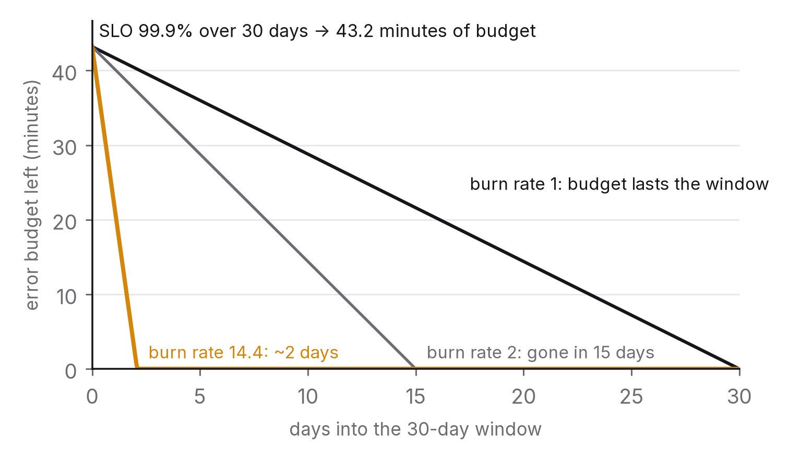

# Chapter 9 — Observability: you can't fix what you can't see

Every chapter so far has ended by asking you to measure something, as part of an exercise. In production, measurement isn't an exercise; it's part of the product. A system that can't report what it's doing gets debugged by guessing, and guessing is slow, expensive and usually wrong. When an engineer looks at an unfamiliar system mid-incident and says, within minutes, where the time is going and what changed, it can look like intuition. Really it's practised use of three kinds of data and one organising idea.

This chapter is about those three kinds of data (logs, metrics and traces), the idea that turns them into a rule for making decisions (service-level objectives and error budgets), and the discipline of alerting on what users feel rather than on what machines are doing.

## The principle

*Instrument so that any question about the system's behaviour can be answered from data that already exists. Define reliability as a number a user would recognise, set a target, and let the gap between target and reality decide what the team works on.*

## Three kinds of data

Logs are records of individual events: a request arrived, a query ran, an error happened. They're the oldest form of telemetry and the one every engineer reaches for first. Their strength is detail, since a log line can carry anything. Their weaknesses are volume (a busy service emits millions of lines an hour, and storing and searching them costs real money) and the difficulty of turning free text into a picture. Two practices fix most of that. Log in structured form, as key–value records (JSON or similar) rather than sentences, so every field can be filtered and counted. And log with intent: every line should answer a question somebody will eventually ask. "Entering function" answers none.

Metrics are numbers aggregated over time: requests per second, p99 latency, error rate, queue depth, CPU. They're cheap to store (a time series costs a few bytes per interval however much traffic there is), fast to query, and the natural raw material for dashboards and alerts. Their weakness is that aggregation throws detail away. A metric can tell you the p99 went up. It can't tell you which requests, from which users, or why. The four metrics that describe almost any service are latency (as a distribution, per chapter 1), traffic (a rate), errors (a rate, by type) and saturation (how full the constraining resource is). The SRE literature calls these the golden signals, and a dashboard showing them for every service and every dependency is the one you want at three in the morning.[^1]

Cardinality deserves a warning here. Metrics are indexed by labels such as service, endpoint, status code and region, and each distinct combination of label values is its own time series. The cost of a metrics system grows with the number of series, so a label with unbounded values (a user ID, a request ID, a full URL) multiplies the series count without limit. That's the classic way to knock over a monitoring system. Keep metrics to low-cardinality dimensions and put high-cardinality detail in traces and logs.

Traces follow a single request through every service it touches and record how long it spent in each. A trace is a tree of spans, each a timed operation with a name and attributes, all linked by a trace ID that travels with the request in a header. Of the three kinds of data, only traces can answer "where did the time go for this particular request?" across service boundaries, which makes them the main tool for latency debugging in any system with more than one service.[^2] The cost is volume (a trace for every request is a lot of data), which is handled by sampling: keep a fraction of all traces, plus every trace that was slow or failed (tail-based sampling), so the interesting ones are always there.

What ties all three together is a request identifier. Give every incoming request an ID at the edge and pass it along in every call, every log line and every span. Then a slow request you find in a trace can be matched to its log lines, a spike in a metric can be traced to the requests that caused it, and an error in a log can be placed inside the request that produced it. A system without a propagated request ID can still be debugged, slowly. A system with one can be debugged by pulling on a thread. OpenTelemetry, which merged the earlier competing standards from around 2019, provides the vocabulary and libraries for all three signals and the propagation between them, and it's the default choice in 2026.[^3]

## From data to decisions: SLIs, SLOs and error budgets

Having the data doesn't tell you what to do with it. A service might emit a hundred metrics. Which ones matter, how good is good enough, and when should the team stop building features and fix reliability instead? The framework that answers those questions came out of Google's SRE organisation and is now standard.[^4]

A service-level indicator, or SLI, measures one aspect of the service that users care about, expressed as a ratio: the fraction of requests that succeeded, the fraction that finished in under 300 ms, the fraction of time the service was reachable. Good SLIs are measured as close to the user as possible, because the user's experience is what's being promised. A server that reports success while the load balancer in front of it is dropping requests has a misleading SLI.

A service-level objective, or SLO, is a target for an SLI over a time window: 99.9 per cent of requests succeed over 30 days, say, or 99 per cent of requests finish under 300 ms. Choosing the target is a product decision as much as an engineering one. It should reflect what users need, not whatever the system happens to achieve, and it should be below 100 per cent, because 100 per cent is infinitely expensive and users can't tell 99.99 per cent from 99.999 per cent through a network that's less reliable than either.

An error budget is the complement of the SLO. At 99.9 per cent over 30 days, the service may fail 0.1 per cent of requests, about 43 minutes of total unavailability, before it has broken its promise. The budget is something you can spend, which is the whole point. While there's budget left, the team ships features, runs experiments and takes risks. Once it's gone, the team stops shipping and works on reliability until the rolling window gives some budget back. The rule turns an endless argument (reliability versus speed) into arithmetic, and it gives both sides a number they agreed to in advance.

Three practices make the framework work instead of just decorating a slide. Have few SLOs and choose them carefully: two or three per service, covering availability, latency at one or two percentiles, and perhaps correctness or freshness for data services. A service with twenty SLOs effectively has none.

Alert on burn rate. Don't alert on the SLI's instantaneous value; alert on how fast the budget is being used up. A burn rate of 1 uses exactly the whole budget over the window, and a burn rate of 10 uses it up in a tenth of the window. Page urgently on a high burn rate over a short period (something is badly wrong right now) and raise a quieter ticket on a moderate burn rate over a longer period (we're slowly failing the month). That replaces threshold alerts that fire on every blip with alerts that fire when the promise is actually at risk.[^5]

And review the SLO as well as the system. If the budget is never spent, the SLO might be too loose or the team too cautious. If it's always spent, the target might be unrealistic for the architecture, and that calls for a design conversation, not more firefighting.

## Alerting on symptoms, not causes

A page at three in the morning should mean a person has to act now. Most pages don't meet that bar, and the result is alert fatigue: the on-call engineer learns that pages are usually noise, responds slowly, and misses the one that mattered.

The cure is to alert on symptoms, the things users experience (error rate, latency SLO burn, unavailability), and to treat causes (high CPU, a filling disk, a slow dependency, a growing queue) as diagnostics to look at once a symptom has fired. High CPU that isn't affecting users isn't an emergency. A user-facing error rate is, whatever the CPU says. Cause-based alerts still have a place, as tickets ("fix this disk before it fills up, next working day") rather than pages.

A few more rules from people who've been on call. Every page should be actionable, so if the right response is "wait and see", it shouldn't be a page. Every page should link to a runbook that says what to check and what to do. And every page should be reviewed afterwards: did it really need a person, and did the runbook work? If either answer is no, change the alert.

## What this costs

Observability comes with a bill, and the bill surprises people. Logs are usually the largest line, because their volume grows with traffic and retention is measured in weeks. The fixes are structure (so fewer lines carry more information), sampling of high-volume debug logs, and tiered retention, hot for days and cold for months. Metrics are cheap until cardinality explodes, and the fix is discipline about labels. Traces are expensive per request and cheap per insight, and the fix is sampling that keeps the slow and failed ones. In a mature system, telemetry is a noticeable fraction of the compute bill, and it's money well spent in exact proportion to how often it shortens an incident. Chapter 11 returns to the cost side.

## The question you will be asked

*"Define an SLO for a search API and say what you'd do when the budget is spent."*

Pick two SLIs: availability (the fraction of requests that return a non-error response, measured at the load balancer) and latency (the fraction of successful requests that finish under, say, 500 ms, because search users start abandoning after about a second and the page has other work to do). Set targets, perhaps 99.9 per cent availability and 99 per cent under 500 ms over 30 days, and say why you chose those rather than something higher: the budget they imply, and what the next nine would cost. Say how you'd measure them: at the edge rather than on the server, excluding health checks, and counting timeouts as failures. Define the burn-rate alerts, paging on a rate that would exhaust the budget in two days and ticketing on one that would exhaust it in two weeks. Then the budget runs out. The team freezes feature launches, the on-call lead opens an investigation (which requests, which queries, which dependency; traces first), the team fixes the dominant cause, and the next SLO review asks whether the target was right. An answer that stops at "99.9 per cent", with no measurement point, no burn-rate alerts and no policy for a spent budget, comes from someone who has read about SLOs but never run one.

## The trade-off, stated

Instrumentation costs engineering time, a small but non-zero runtime overhead, storage and tooling. It buys the ability to answer questions about the system from data that already exists, which is the difference between an incident that lasts fifteen minutes and one that lasts four hours, and between a performance regression caught at the canary and one caught by a customer. SLOs cost a hard conversation about how reliable the service really needs to be. They buy an end to the argument about whether to fix reliability or ship features, because the budget decides. For any system that matters, neither is optional. The only question is whether you build them before or after the incident that proves you needed them.

## Run this yourself

Take the service from chapter 1's harness and add three things: a request ID generated at the entry point and written into every log line; structured JSON logs carrying the request ID, endpoint, status and duration; and a histogram metric of request duration labelled by endpoint and status (and nothing with higher cardinality). Run the load generator. Then, without looking at the harness's own output, answer three questions using only your telemetry. What's the p99 for each endpoint? Which single request was slowest in the last minute, and what did it do? How many requests failed, and why? If you can answer all three in under five minutes, your instrumentation is good enough. If you can't, you've found the gap before an incident did. Finally, define one SLO for the service and work out its error budget for the run. You'll find that the number makes the latency conversation concrete in a way raw percentiles never quite do.

---

[^1]: Beyer, B., Jones, C., Petoff, J. & Murphy, N. R. (eds.) (2016), *Site Reliability Engineering*, O'Reilly, chapter 6, "Monitoring Distributed Systems" — the four golden signals.
[^2]: Sigelman, B. H. et al. (2010), "Dapper, a Large-Scale Distributed Systems Tracing Infrastructure", Google Technical Report — the design most tracing systems descend from.
[^3]: OpenTelemetry specification and documentation, opentelemetry.io; the project merged OpenTracing and OpenCensus in 2019.
[^4]: Beyer et al. (2016), chapter 4, "Service Level Objectives"; Beyer, B., Murphy, N. R., Rensin, D. K., Kawahara, K. & Thorne, S. (eds.) (2018), *The Site Reliability Workbook*, O'Reilly, chapter 2, "Implementing SLOs".
[^5]: Beyer et al. (2018), *The Site Reliability Workbook*, chapter 5, "Alerting on SLOs" — the multi-window, multi-burn-rate method.

### Sources for this chapter
- Beyer et al. (2016), *Site Reliability Engineering*, chapters 4, 6, 10 and 11.
- Beyer et al. (2018), *The Site Reliability Workbook*, chapters 2, 3 and 5.
- Sigelman et al. (2010) — Dapper.
- OpenTelemetry documentation — signals, context propagation, sampling.
- Majors, C., Fong-Jones, L. & Miranda, G. (2022), *Observability Engineering*, O'Reilly — the case for high-cardinality event data and tracing-first debugging.
- Dean & Barroso (2013), "The Tail at Scale", *CACM* 56(2) — why the tail is what you instrument for.
