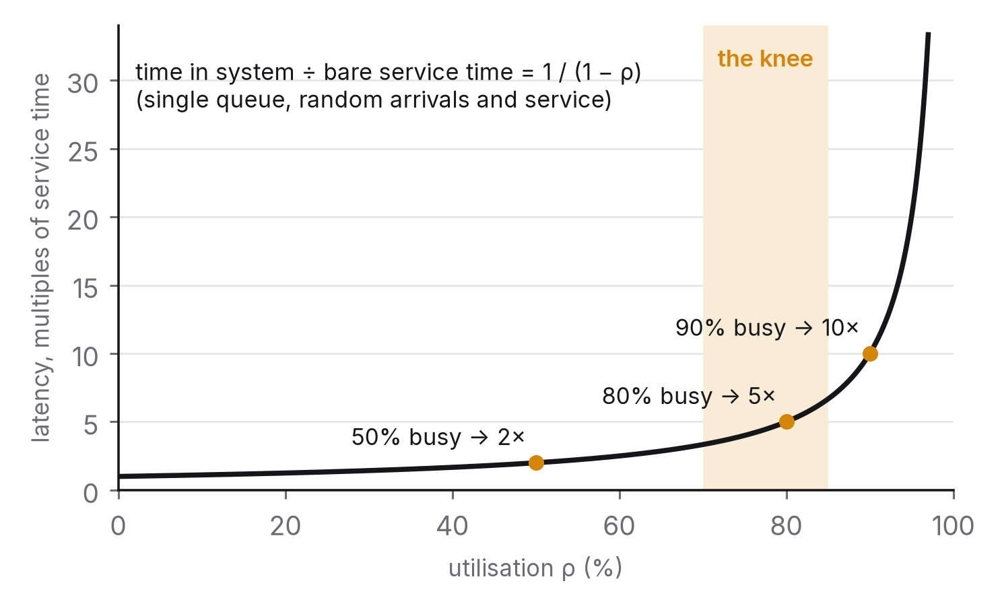

# Chapter 10 — Capacity planning and performance testing

"It scales" is the most common claim in system design and the one least often backed by a number. Scaling isn't a property a system has. It's a measured relationship between load and some resource, true over a certain range, with a point beyond which it stops being true. This chapter is about finding that relationship before your users do: the one equation that answers most capacity questions, the curve every queue follows, how to run a load test that actually means something, and how much headroom to pay for.

## The principle

*Capacity is a measured number with a date on it. Find the constraining resource, measure the load at which it saturates, keep its utilisation below the knee of the latency curve, and measure again whenever the system or the traffic changes.*

## Little's law

The most useful equation in systems engineering was proved by John Little in 1961, and it fits on one line:[^1]

> *L* = *λ* × *W*

The average number of items in a system (*L*) equals the average rate at which they arrive (*λ*) multiplied by the average time each spends in the system (*W*). It holds for any stable system whatever the distribution of arrivals or service times and whatever the queueing discipline, which is exactly why it's so useful: you don't need a model.

Apply it to a service and it says the average number of requests in flight equals the request rate times the average latency. A service handling 2,000 requests a second at an average of 50 ms has, on average, 2,000 × 0.05 = 100 requests in flight. If each in-flight request holds a thread, the service needs at least 100 threads; if each holds a database connection, at least 100 connections. And if latency doubles because a dependency slows down (chapter 7), the number in flight doubles too, along with every resource they hold. That's the arithmetic behind chapter 2's blocking argument and chapter 7's cascade, in a single line.

Apply it backwards and it tells you limits. A connection pool of 50 at 2,000 requests a second can sustain an average latency of at most 50 / 2,000 = 25 ms before the pool becomes the bottleneck. If the database's median query takes 30 ms, the pool is too small, and no amount of tuning in the application will fix that.

Apply it to a queue (chapter 8) and the average depth equals the arrival rate times the average wait. A depth of 10,000 at 500 messages a second means each message waits twenty seconds. Depth is a latency measurement in disguise.

Most capacity questions come down to Little's law plus a measurement of one of its three quantities. It's worth memorising.

## The knee of the curve

Little's law tells you how many requests are in the system. Queueing theory tells you what happens to latency as the system fills up, and the shape is the same for every resource that serves requests one at a time: a CPU core, a disk, a database connection, a thread pool, a network link.

Call the fraction of a resource's capacity in use its utilisation, *ρ*. For the simplest queue (random arrivals, random service times, one server, known as M/M/1), the average time spent in the system is

> *W* = *S* / (1 − *ρ*)

where *S* is the service time with no queue at all. At 50 per cent utilisation, latency is twice the bare service time. At 80 per cent it's five times, at 90 per cent ten times, at 95 per cent twenty, and at 99 per cent a hundred. The curve is flat and then vertical, and the bend between the two, the knee, sits somewhere around 70 to 80 per cent for this model. Exactly where depends on how variable the arrivals and service times are; more variability pulls the knee to the left.[^2]

Several things follow for capacity planning. Running a resource hot means running it slow. A CPU at 90 per cent isn't 90 per cent as fast as one at 10 per cent; its queue is ten times longer. The cheapest latency improvement available to most systems is adding capacity until the constraining resource sits below its knee.

Headroom is insurance for latency, not waste. A team that provisions to 60 per cent utilisation isn't throwing away 40 per cent. It's buying the flat part of the curve, and the ability to absorb a traffic spike or a lost instance without going over the knee. Chapter 11 puts a price on that, and for whichever resource constrains user-facing latency the price is nearly always worth paying.

And the tail feels the knee first. The formula gives the average. Percentiles rise faster, because the requests that arrive during a burst are the ones that queue, so a resource that looks fine on average at 75 per cent may already be producing a p99 several times its median. Here, chapter 1's insistence on distributions is the difference between seeing the knee coming and finding out about it.

## Finding the constraining resource

Every system has one resource that saturates first, and capacity planning is largely the discipline of knowing which one. The method is to measure the utilisation of each candidate (CPU, memory, disk IO, network, connection pools, thread pools, locks, downstream rate limits, a single hot partition) as load rises, and see which approaches its knee first. It often isn't the one people expect. Web services are frequently limited by a connection pool or a downstream dependency long before CPU; databases by disk IO or lock contention rather than CPU; data pipelines by one partition or one serial step.

Once you've found the constraint, there are exactly four things you can do: add more of it (scale up or out), use less of it per request (optimise), move work off it (cache, precompute, go asynchronous), or shed the load that would exceed it (chapter 7). Which is right is a question of cost (chapter 11) and correctness (chapters 5 and 6), and as soon as you relieve one constraint, the next resource becomes the constraint. So capacity planning isn't a project. It's a loop.

## Load tests that mean something

A load test is an experiment: apply controlled load and measure the response. Most load tests are badly designed experiments, and the usual mistakes are well known.

The first is confusing open and closed loops. A closed-loop generator runs *N* virtual users, each sending a request, waiting for the response and then sending the next. The arrival rate adapts to the system: when it slows, users wait, arrivals drop, and the system is protected from exactly the overload the test was supposed to measure. An open-loop generator sends requests at a fixed rate regardless of responses, the way real traffic arrives (people visiting a website don't wait for other people's pages to load first). Open-loop tests show you the knee. Closed-loop tests hide it, and report a flattering throughput at a latency real traffic would never get.[^3] Closed-loop testing has its uses (it answers "what's the maximum throughput with *N* concurrent clients?", which is the question chapter 1's harness asks), but it can't answer "what happens at 3,000 requests a second?". Know which question you're asking.

The second is coordinated omission, the subtler cousin of the first. If a generator records latency only for requests it managed to send, and it couldn't send any during a stall because it was waiting, the stall gets left out of the measurements precisely when the system was at its slowest. The fix is to schedule sends on a fixed timetable and measure from the intended send time, so a request delayed by a stall carries that stall in its latency. Tools that don't do this, and many don't, under-report tails by an order of magnitude in exactly the conditions you care about.[^4]

The third is an unrealistic mix. A test that hammers one cheap endpoint with one cached key is measuring the cache. The request mix, the key distribution (Zipf-like, as in chapter 3, rather than uniform), the payload sizes and the ratio of reads to writes should resemble production, which means deriving them from production logs instead of guessing.

The fourth is ignoring warm-up and duration. JIT compilers, caches, connection pools and autoscalers all take time to settle, so the first minute of any test measures a cold start; throw it away. Then run long enough for the slow things to happen, such as garbage-collection cycles, log rotation, cache expiry and the autoscaler's reaction time. A soak test, hours at moderate load, finds leaks and slow degradation that no five-minute test ever will.

The fifth is running once. One run is one sample. Chapter 1's method applies here too: several runs, with a confidence interval or at least a range, so a 5 per cent improvement isn't mistaken for a real one when runs vary by 10 per cent among themselves.

And the last is not testing failure. A load test at 120 per cent of capacity is the only way to find out whether load shedding works, whether the system recovers when load drops, and whether that recovery is quick or slow (a backlog to drain, a cache to refill). Chapter 7's exercises are really load tests with failures injected.

## Autoscaling and its lag

Elastic infrastructure turns capacity into a dial, and the dial has a delay. An autoscaler watches a metric (CPU, request rate, queue depth), decides to add instances, and the new instances take time to start, warm up and join the pool. That usually takes one to several minutes, whereas traffic can double in seconds. During the gap the existing instances absorb the spike, and if they were already near the knee, they go over it.

So scale on a leading indicator, such as request rate or queue depth, rather than a lagging one like CPU, which only rises after the queue has already formed. Keep enough headroom on existing instances to cover the scaling delay at the steepest traffic ramp you can plausibly expect. And test the autoscaler as part of your load test, by ramping traffic at production's real rate of change and watching whether capacity arrives before the knee does.

Autoscaling also does nothing for resources that don't scale horizontally: a single-leader database, a hot partition, a downstream rate limit. For those, capacity gets planned the old-fashioned way, with a measured ceiling and a date by which you'll hit it.

## How much headroom

How much spare capacity to carry is a trade between cost (resources sitting idle) and risk (going over the knee during a spike or a failure). A rule I'd defend: provision so that the constraining resource stays below its knee when traffic is at the highest level seen in the planning window plus whatever growth you expect before the next review, and when one unit of capacity (an instance, a zone) has failed. That second clause is the "N + 1" discipline from infrastructure engineering, and the first is a forecast. Both are numbers with dates, and both get re-measured at every review.

## The question you will be asked

*"Traffic will triple for a launch. What do you check, and in what order?"*

First, today's constraining resource: which pool, store or dependency is closest to its knee at current peak, according to the utilisation dashboards (chapter 9). Tripling the load will push it past the knee unless something changes, so say what. Second, the resources that don't scale horizontally (the primary database, hot partitions, third-party rate limits): measure their current peak utilisation, estimate it at triple the load, and decide now whether they need a bigger instance, a cache in front or a rate limit of your own. Third, run an open-loop load test at three times current peak with the production request mix, watch every utilisation metric, and find the new knee. Fourth, compare the autoscaler's lag with the launch's expected ramp, remembering that a launch announcement produces a step, not a ramp. Fifth, confirm that degradation and shedding (chapter 7) work at four times current load, because launches overshoot. Sixth, agree what you'll watch during the launch and who's allowed to roll back. Then say what you wouldn't do: take "it scales" on trust from anyone, yourself included, without the test.

## The trade-off, stated

Headroom costs money every day; not having it costs latency, incidents and lost users on the days that matter most. Load testing costs engineering time and a realistic environment; without it, the production launch is the load test. Autoscaling costs lag and complexity and buys capacity that follows demand. In each case the decision should be made with numbers (utilisation, the knee, the ramp, the lag) rather than adjectives, and the numbers should carry dates, because traffic grows and systems change.

## Run this yourself

Change chapter 1's harness to run open-loop: send on a fixed schedule and measure latency from each request's scheduled send time. Run the CPU-bound workload against a single-process server at 10, 20, 40, 60, 70, 80, 90 and 95 per cent of the maximum throughput you measured for it in chapter 2, and plot p50 and p99 against utilisation. You'll see the flat region, the knee somewhere between 70 and 85 per cent, and the near-vertical climb beyond it, and you'll see the p99 lift off well before the p50 does. Then switch back to closed-loop with a fixed number of clients and repeat, and notice how the closed loop won't show you the vertical part, because it slows down instead. Finally, check Little's law on one of your runs: multiply the rate by the average latency and compare it with the in-flight count the server reports. The numbers agree, which is reassuring, and the shape of that curve is worth carrying into every capacity conversation you have from now on.

---

[^1]: Little, J. D. C. (1961), "A Proof for the Queuing Formula: L = λW", *Operations Research* 9(3), 383–387.
[^2]: Kleinrock, L. (1975), *Queueing Systems, Volume 1: Theory*, Wiley — the M/M/1 result; Gunther, N. J. (2007), *Guerrilla Capacity Planning*, Springer — the practitioner's treatment, including the Universal Scalability Law for the effect of contention and coherence on throughput.
[^3]: Schroeder, B., Wierman, A. & Harchol-Balter, M. (2006), "Open Versus Closed: A Cautionary Tale", *NSDI 2006*.
[^4]: Tene, G. (2013–2015), "How NOT to Measure Latency", talks and the HdrHistogram documentation — the coordinated-omission problem and its correction.

### Sources for this chapter
- Little (1961); Kleinrock (1975); Gunther (2007) — the theory and its application.
- Schroeder, Wierman & Harchol-Balter (2006) — open vs closed loop.
- Tene (2013–2015) — coordinated omission; HdrHistogram.
- Beyer et al. (2016), *Site Reliability Engineering*, chapters 18 and 21 — capacity planning tooling and handling overload.
- Dean & Barroso (2013), "The Tail at Scale" — tail behaviour under load.
- Gregg, B. (2020), *Systems Performance*, 2nd ed., Addison-Wesley — the USE method (utilisation, saturation, errors) for finding the constraining resource.
