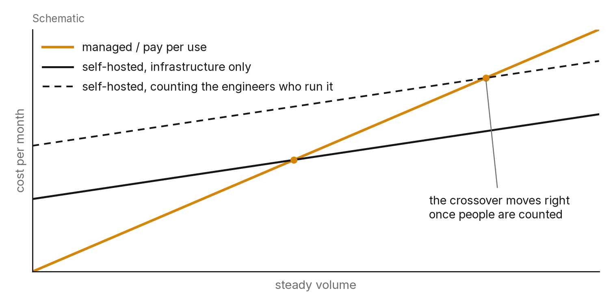

# Chapter 11 — Cost is a design constraint

Every design decision in this book has had a price, and so far that price has been paid in latency, consistency, complexity or risk. This chapter pays it in money, for two reasons. Money is the constraint that decides which of the technically correct designs actually gets built. And engineers who can reason about cost as rigorously as they reason about latency are rare enough to be valuable for that alone.

It's written for engineers, not accountants: how to see where the money in a system goes, which design choices move it, when the slower or simpler design is right because it's cheaper, and how to decide between building, buying and renting using numbers instead of preferences.

## The principle

*Cost is a first-class output of a design, like latency and availability. Model it before you build, measure it afterwards, and treat the system's cost per unit of useful work as a metric with a target.*

## Where the money goes

The bill for a system running in the cloud, which is where most new systems live, has a small number of big lines.

Compute is usually the biggest: virtual machines, containers, serverless invocations, managed service instances. It's priced by time and size, with large discounts for commitment (reserved or savings-plan pricing, typically 30 to 60 per cent below on-demand for one- to three-year terms) and for interruptible capacity (spot or preemptible instances, often 60 to 90 per cent cheaper, with the catch that they can be taken back at short notice). It's also the line most sensitive to the design choices in chapters 2, 3 and 10.

Storage covers block volumes, object storage, databases, backups and logs, priced by volume per month, by tier (hot, warm, cold and archive, with retrieval getting dearer as storage gets cheaper) and by number of operations. It's cheap per gigabyte and expensive in aggregate because it accumulates. Nothing deletes itself, and a system that's been running for three years is often paying to keep data nobody has read for two.

Data transfer means moving bytes out of a cloud region to the internet (egress), between regions, and sometimes between availability zones. Egress is the line that catches people out. It's priced per gigabyte at rates that make serving large files or media straight from compute far more expensive than serving them through a CDN, and it's why multi-region and multi-cloud designs cost more than their compute alone suggests.

Managed services (databases, queues, caches, search, monitoring, AI model APIs) are priced per instance, per request, per capacity unit or per token, each with its own curve. They trade money for engineering time and operational risk. That trade is usually a good one at small scale and increasingly worth re-examining as scale grows.

And then there are people, the line that isn't on the cloud bill and usually dwarfs everything on it. Engineering time is the most expensive resource in most systems, and a design that saves ₹10,000 a month in compute by costing a week of engineering has lost money for years to come. Any cost analysis that leaves out the people is incomplete, and most do leave them out.

## Where the money leaks

Across systems and organisations the same leaks keep recurring, and finding them is worth more than any clever optimisation.

Idle capacity is almost always the largest and the easiest to fix: instances running at 5 per cent utilisation, development environments left on overnight and over weekends, databases sized for a peak that happened once. The fix is measurement (chapter 9's utilisation metrics, read with cost in mind rather than latency) followed by scheduling, right-sizing or autoscaling.

Over-provisioning out of fear is a close relative. Chapter 10 argued for headroom below the knee; the leak is headroom far beyond it, bought because nobody measured the knee and everybody was afraid of the incident. The fix, again, is the measurement.

Chatty services make many small network calls per user request and pay for each one in latency (chapter 1) and, across zones or regions, in transfer charges. Fetching a hundred rows in a hundred calls costs more than fetching them in one, in every currency.

Logs and metrics nobody reads are chapter 9's warning: debug logging left on in production, metrics with exploding cardinality, traces sampled at 100 per cent. Telemetry is valuable in proportion to how much it's used, and the unused part is a pure leak.

Data that should have been deleted or moved to a cheaper tier piles up as backups of backups, logs kept for years by default, old object versions and orphaned volumes. A retention policy plus a lifecycle rule (hot to cold to archive to deleted, on a schedule) usually cuts storage costs by more than half.

Accidental egress comes from serving static assets from compute instead of a CDN, replicating data to regions that didn't need it, or pulling large datasets out of the cloud to process them somewhere else.

And then there's the model-API line, new since 2023 and growing fast: calls to large language models, priced per token. Its leaks are the familiar ones in new clothes. Long prompts repeated on every call are a caching problem (chapter 3); a large model used where a small one would do is a right-sizing problem; retries without budgets are chapter 7's problem; and nobody measuring cost per useful outcome is this chapter's problem. Teams that treat model calls as free during development are routinely shocked by the first production bill.

## Performance per rupee

Looking through the lens of cost changes some of the earlier chapters' conclusions, so it's worth being explicit about how.

The slower design can be the right one. A nightly batch job on cheap interruptible capacity may be better than a real-time pipeline on reserved instances running around the clock, if nobody needs the result within a day. A single-region deployment with a tested backup and restore may be better than active-active across regions, if the business can live with an hour of downtime a year but can't live with tripling the bill. Engineers instinctively reach for the faster, more available design. The cost lens asks what that latency and availability are actually for, and chapter 9's SLO is where that question gets answered.

The simpler design is usually cheaper in people. Every component is something to operate, patch, monitor and understand at three in the morning, so a system with fewer moving parts costs less on the line that isn't on the bill.

Scale changes the answer. Managed and serverless pricing is excellent at low volume, because you pay nothing while idle, and expensive at high steady volume, because you pay a premium on every unit. For almost every service there's a crossover point where running your own becomes cheaper, and it's worth calculating rather than assuming. The reverse also holds: a self-managed system that looked cheaper at scale can turn out more expensive than the managed one once you count the engineering time needed to run it.

And free tiers have cliffs. Plenty of services offer a free or nearly free tier that covers development and small production use, with prices that jump sharply past some threshold. If a design depends on staying under that threshold, you should know exactly where it is and what happens when a traffic spike crosses it, because the first bill after the cliff is a common and entirely avoidable surprise.

## Build, buy or rent

The decision that keeps coming up is whether to build a capability, buy a product or rent a managed service, and it should be settled with a short model rather than a long debate.

Over some horizon (three years is common), estimate the total cost of each option: engineering time to build it and to run it, at a loaded cost per engineer-month; infrastructure; licence or subscription fees; and the cost of the capability being unavailable or wrong. Then weigh three things that aren't money. How central is this capability to what makes your product different? Build what differentiates you and rent what doesn't. How much are the requirements likely to change? Rent while they're still unstable. And what does it cost to get out later, whether that means leaving a vendor or replacing the home-grown system?

The common mistake is counting only the first month's infrastructure and forgetting the engineer-months, and it cuts both ways: people underestimate what it costs to build and run something themselves, and they underestimate the integration and workaround costs of a product that almost fits.

## Cost as a metric

What makes cost manageable is treating it the way you treat latency: measure it continuously, attribute it to whatever causes it, and set a target.

Attribute it by tagging every resource with the service, team and environment that owns it, so the bill can be broken down. Spend nobody owns is spend nobody will reduce.

Normalise it. The raw bill grows with the business and tells you very little. Cost per unit of useful work (per thousand requests, per active user, per gigabyte processed, per model call that produced an answer someone used) separates growth from waste, and it's the number to put on the dashboard next to the p99.

Then set a target and review it, much as you would an SLO: a target cost per unit, a review whenever it's exceeded, and an explicit decision whenever a design change is going to move it. A design document that states the expected cost per unit, and gets checked against the measured cost after launch, produces engineers who can reason about cost.

## The question you will be asked

*"Cut this system's bill by 40 per cent without changing its SLO."*

Start with the breakdown: which lines dominate, compute, storage, transfer, managed services or model calls? Then go after the leaks in order of likely size. Idle and over-provisioned compute comes first (right-size from utilisation data, schedule non-production environments, autoscale below the knee), then commitment pricing for the steady baseline and interruptible capacity for batch and stateless work, then storage lifecycle rules and deleting what nobody reads, then telemetry volume and cardinality, then egress moved behind a CDN, and finally the model-API line, attacked with prompt caching, a smaller model for the easy cases and retry budgets. Say what you'd measure before and after each change, and how you'd confirm the SLO held, using chapter 9's burn rate during and after. Then give the honest part: in a system that has never been cost-reviewed, 40 per cent is usually available from idle capacity and storage alone, and in one that has been reviewed it usually isn't available at all, because the next 10 per cent costs a redesign. Say which case you think this is, and why.

## The trade-off, stated

Cost optimisation costs engineering time, and sometimes latency, availability or flexibility. It buys money, which buys everything else, engineering time included. The failure modes mirror each other: systems that were never cost-reviewed and leak half their bill, and systems optimised so aggressively that an engineer-week went into saving a month's rent on a small instance. The skill is in the model. Know the lines, know the leaks, measure per unit, and spend engineering time where the numbers say it'll pay back.

## Run this yourself

Take any system you can get access to, even a personal project on a free tier, and write a one-page cost model: every resource, its unit price from the provider's published rates, its measured or estimated utilisation, and its monthly cost, with the total broken down by line. Work out the cost per unit of useful work for one meaningful unit. List the three biggest leaks you can see and estimate what closing each would save. If the system is on a free tier, find the cliff: the exact threshold where the first bill arrives, and what that bill would be at twice your current usage. It takes an evening, and being able to do it from scratch for a system you didn't build is a skill few engineers have and every employer values.

---

### Sources for this chapter
- Public pricing pages and pricing calculators of the major cloud providers (current versions) — the primary source for every unit price; rates change, so the method matters more than any figure quoted here.
- FinOps Foundation (2023–2025), *FinOps Framework* and the *State of FinOps* reports — the vocabulary of cloud cost management (attribution, unit economics, commitment management).
- Beyer et al. (2016), *Site Reliability Engineering*, chapter 18 — capacity and cost in planning.
- Gregg, B. (2020), *Systems Performance*, 2nd ed. — utilisation measurement, the input to right-sizing.
- Wang, S. & Casado, M. (2021), "The Cost of Cloud, a Trillion Dollar Paradox", Andreessen Horowitz — the argument that cloud costs can dominate at scale, and the counter-arguments it provoked; read it with its critics.
- Provider documentation on prompt caching and model pricing tiers (2024–2026) — the model-API cost line.
