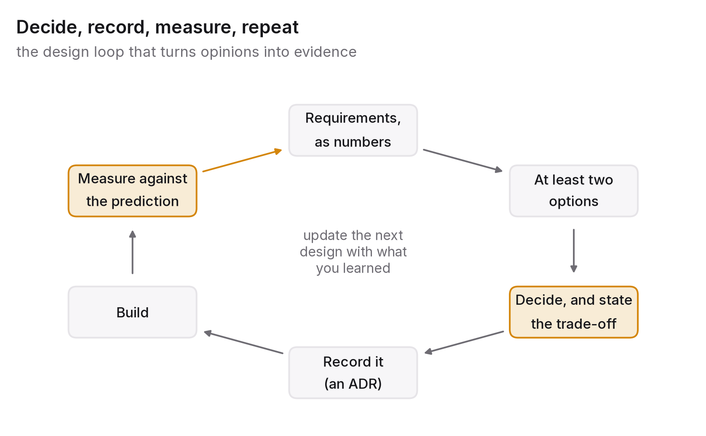

# Chapter 12 — Judgment: how to make and document a design decision

In practice, eleven chapters of principles, measurements and trade-offs boil down to a series of decisions made by one person, under uncertainty, with incomplete information and a deadline. This chapter is about that person's method: how to turn a vague request into requirements, how to choose between designs that are each right for some requirements and wrong for others, how to write a decision down so it can be understood and revisited, and how the whole discipline compresses into the forty-five minutes of a system-design interview, which isn't a different skill so much as the same one with a clock running.

## The principle

*A design is an argument from requirements to trade-offs. State the requirements as numbers, list the options honestly, choose with reasons, write down what you gave up and what would change your mind, and measure after you build.*

## Requirements before architecture

The most common design failure isn't picking the wrong one of two architectures. It's picking an architecture before knowing what it has to do. Every chapter in this book has turned on some quantity you need to know before a design can be judged, so the first job is to get those quantities out of the people who want the system, who usually haven't thought about them in those terms.

Here are the questions, roughly in the order they matter. What does it do, for whom, and what must never happen? That's the functional core in a few sentences plus the invariants: no double charges, no lost orders, no data shown to the wrong user. The invariants are what chapters 5 and 6 are about, and they decide more of the design than the features do.

How much, how fast, how often? Request rate at peak and on average, data volume now and in two years, the ratio of reads to writes, the size of a typical payload and a large one. Chapter 10's Little's law needs these numbers, and without them "it scales" means nothing.

How fast does it have to feel? That's the latency budget from chapter 1, given as a percentile and a target, say p99 under 300 ms on the interactive path, followed by the decomposition: how much budget is left after the network and the client, and how the rest is split among the stages.

How available does it need to be, and what does being down cost? That's the SLO from chapter 9, a number with a window, plus the business cost of falling short, which determines how much redundancy is worth paying for (chapters 7 and 11).

What may be stale, and for how long? That's the consistency requirement from chapter 5, worked out per kind of data. A balance can't be stale; a recommendation can be a day old. Most systems contain both kinds and treat them identically, at the expense of whichever kind loses out.

What's the budget? Money per month, and engineering time to build and run it (chapter 11). A design that exceeds either isn't a design.

And what's already there? Existing systems, teams, skills, contracts, wherever the data lives today. The best design an organisation can't build or run is worse than the second-best one it can.

Some answers will be approximate and some will be refused ("we don't know how many users we'll have"). Approximate is fine, because an order of magnitude is enough to choose between one database and a partitioned set of them. A refusal is fine too, provided it's written down and the design states the assumption it made instead, so the assumption can be checked once the real number is known.

## Choosing: list the options, then decide

Once you have the requirements, choosing an architecture usually isn't the hard part. The work is making sure the right options are on the table and that the choice gets made for reasons you can state.

List at least two options. The design that occurred to you first is a candidate, not a decision. For each major component (storage, communication, caching, deployment), name the serious alternatives and say in a line what each is good at. Most design documents skip this step, and most incident reviews wish they hadn't.

Match each option against the requirements. Which does it meet easily, which with effort, and which not at all? A relational database meets the invariants easily and the write volume with effort; a document store is the other way round; the requirements decide between them.

Prefer the simplest design that meets the requirements: not the most elegant, the most scalable or the most interesting. Every component you add is something to operate, somewhere to fail, and a cost in money and attention. Ask of each component what requirement forces it to exist, and if the answer is none, take it out. Systems gain components easily and shed them only with great difficulty.

Find the decision that's hardest to reverse and spend your time there. Partition keys (chapter 6), the primary data store, the public API and the consistency model for the core data are all expensive to change later and deserve real analysis. The web framework or the message queue can be changed and deserve a sentence each. Spending design attention in proportion to irreversibility is one of the habits that separates experienced engineers from merely careful ones.

Then decide, and name the trade-off. Every design gives something up, and a design document that claims no downside is either wrong or unfinished. The sentence "we chose X, which gives us A and B at the cost of C, and we accept C because of D" is the heart of every good design decision. If you can't write it, you don't yet understand the decision.

## Writing it down

A design decision lives in a short document with a standard shape, usually called an architecture decision record, or ADR.[^1] It's one page or less per significant decision, kept alongside the code, and never edited after the fact; a new decision supersedes an old one, and both stay in the record.

An ADR has a title and a date (what was decided, and when) and a context section setting out the requirements and constraints that bear on the decision, with numbers, and what forced a choice. It lists the options considered, each in a line or two with what it would have been good at, and then the decision itself. A consequences section says what the decision makes easy, what it makes hard, what it costs and what it commits the team to, and that's where the trade-off sentence goes. Finally there's a line on what would change our mind: the condition under which the decision should be revisited, whether a traffic level, a cost threshold or a requirement that changes. That last line is the one most often left out and the one you'll be most grateful for two years later.

An ADR does three jobs. It forces the author to actually have reasons, because they have to be written down. It lets a newcomer understand why the system is the way it is without doing archaeology. And it turns "why on earth did we do this?" from an argument about who remembers what into a matter of reading the record. A codebase with a dozen ADRs is easier to join, change and defend than one with a hundred pages of architecture documentation that nobody kept up to date.

## Measure after you build

A design is a prediction: these requirements, met in this way, at this cost. The last step in the method is checking the prediction. Did the p99 land inside the budget? Is the constraining resource the one the design expected? Is the cost per unit what the ADR estimated? Is the consistency anomaly the design accepted actually rare, or is it happening to every user?

That closes the loop this book has been describing since its first page. Chapter 1 said latency is measured, not asserted; chapter 10 said capacity is a number with a date; chapter 11 said cost is a metric. A design decision is a hypothesis and the running system is the experiment. An engineer who checks the result, writes it down next to the prediction and lets it shape the next design is doing engineering in the full sense. One who doesn't is guessing confidently.

## The interview is the job, compressed

The system-design interview, which most readers of this book will sit many times, is often treated as a performance with its own special rules. I think it's better treated as the method above, run in forty-five minutes, with the interviewer standing in for the stakeholders, the clock for the deadline and the whiteboard for the ADR.

So spend the first ten minutes on requirements. Ask the questions from the start of this chapter out loud, and write the answers (or the assumptions you make when the interviewer won't answer) somewhere you can both see them. Candidates who start drawing boxes in the first two minutes are drawing a solution to a problem they haven't understood, and interviewers notice.

Do the arithmetic: request rate, data volume, requests in flight from Little's law, storage growth, bandwidth. Rough numbers are fine. The point is to show that the numbers drive the design, and they usually reveal which component is the hard one, whether that's the database, the fan-out or a hot key.

Draw the simplest design that meets the requirements, naming each component and the requirement that forces it, then say what you deliberately left out and why.

Go deep where it's hard. The interviewer will push on one part, and it'll be the part with the hardest trade-off, which is where this book's chapters live: the consistency of the core data, the partition key, cache invalidation, a failing dependency, a growing queue. Say the trade-off sentence. Say what breaks at ten times the load and what you'd change.

Say what you'd measure: the SLO, the dashboards, the alerts, the cost per unit. Most candidates skip this, and it's the step that most clearly separates someone who has operated a system from someone who has read about one.

And manage the clock. Forty-five minutes splits roughly into ten for requirements, five for arithmetic, ten for the design, fifteen for depth and five for operations and wrap-up. If you run out of time while drawing, you've spent too long on requirements or drawn too much, and the cure is the simplest-design rule.

None of this is a trick. It's what a senior engineer does in a real design review, with the same questions, the same arithmetic and the same trade-off sentences, and an interviewer who has done the job will recognise it. The companies most readers of this book are aiming at aren't looking for someone who knows the "correct" architecture for a URL shortener. They're looking for the method, because the method transfers to problems that have no textbook answer, which describes every real one.

## The question you will be asked

*"Tell me about a design decision you got wrong."*

It's a judgement question disguised as a story question, and the method in this chapter is also the best way to answer it. Pick a real decision. State what you knew at the time and what you assumed, then the options you considered and what you chose. Say what actually happened, measured if you can, and which of your assumptions failed. Then say what you'd do differently, and, more importantly, what you now do by default because of it: an extra requirement you always ask about, a measurement you always take, a line you always write in the ADR. Interviewers aren't looking for a decision you got right in hindsight. They're looking for evidence that you can learn from the gap between prediction and result, because that gap is where every engineer's judgement actually comes from.

## Twelve questions to ask of any design

To close, a checklist with one question per chapter, to ask of any system you're designing, reviewing, joining or being interviewed about.

1. What's the latency budget, as a percentile, and where does the time go? (Latency is a distribution.)
2. What blocks what, and what happens when the queue is full? (Concurrency and backpressure.)
3. What may be stale, for how long, and how does each copy learn of a change? (Caching.)
4. Which data structure constrains this, and what does it cost in memory and time at ten times the size? (Data structures at scale.)
5. Which consistency guarantee does each kind of data actually get, and is it the one it needs? (Consistency.)
6. Who may write, what happens when writers disagree, and is every operation safe to repeat? (Replication, partitioning, idempotency.)
7. For each dependency, what happens when it fails, when it's slow and when it returns garbage? (Failure as the normal case.)
8. What's asynchronous, why, and who's watching the queue depth? (Queues and streams.)
9. What's the SLO, how is it measured, and what happens when the budget runs out? (Observability.)
10. What's the constraining resource, where's its knee, and when will we reach it? (Capacity.)
11. What does this cost per unit of useful work, and where does the money leak? (Cost.)
12. What did we give up, and what would change our mind? (Judgement.)

A design with an answer to all twelve is a design somebody understood. One with no answers is a drawing. Most fall somewhere in between, and the questions show you where the thinking stopped, which is exactly where the incident will start.

## Run this yourself

Take a system you know well (one you built, one you work on, or one whose code you can read) and write its ADRs after the fact: five to eight decisions, a page each, in the format above, trade-off sentence and "what would change our mind" line included. For each one, note whether the decision was really made for the reasons you've written down, or for reasons nobody recorded. Then ask the twelve questions of the system and list the ones it can't answer. You'll end up with the best onboarding document that system has ever had, a list of its latent incidents, and a working demonstration of the one skill this book has really been about: making the trade-off visible, and then measuring whether you were right.

---

[^1]: Nygard, M. (2011), "Documenting Architecture Decisions", cognitect.com, November 2011 — the original proposal of the ADR format.

### Sources for this chapter
- Nygard (2011) — architecture decision records.
- Brooks, F. P. (1975; anniversary ed. 1995), *The Mythical Man-Month*, Addison-Wesley — on conceptual integrity and the cost of complexity.
- Lampson, B. W. (1983), "Hints for Computer System Design", *SOSP 1983* — the classic list; most of this book's principles have an ancestor in it.
- Hamilton, J. (2007), "On Designing and Deploying Internet-Scale Services", *LISA 2007* — operational design rules from a practitioner, still current.
- Kleppmann (2017), *Designing Data-Intensive Applications*, chapter 12 — "The Future of Data Systems", on choosing by requirements.
- Xu, A. (2020, 2022), *System Design Interview*, volumes 1 and 2 — for the interview format; read for structure, and bring this book's trade-offs to its examples.
