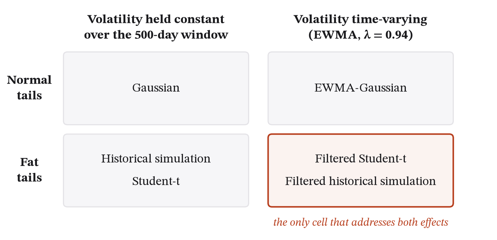
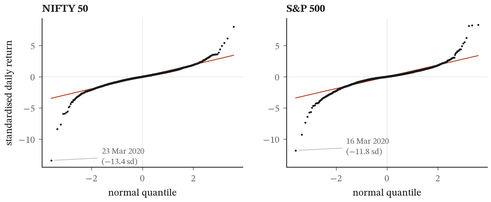
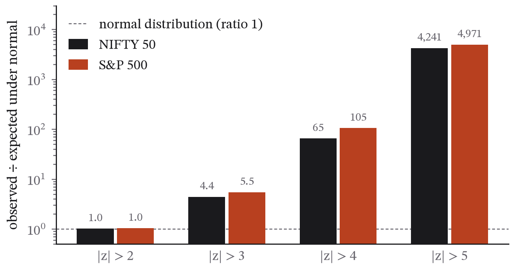
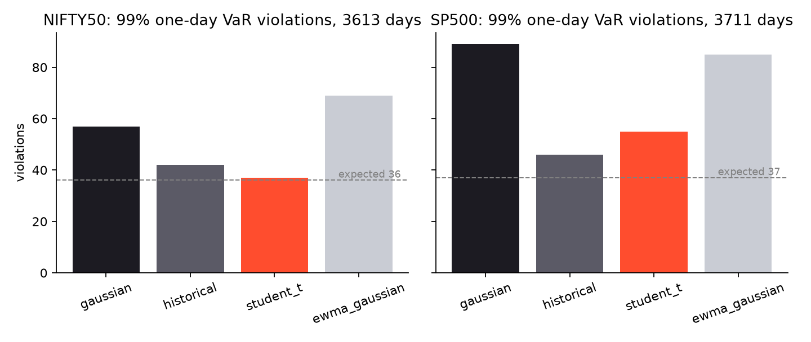
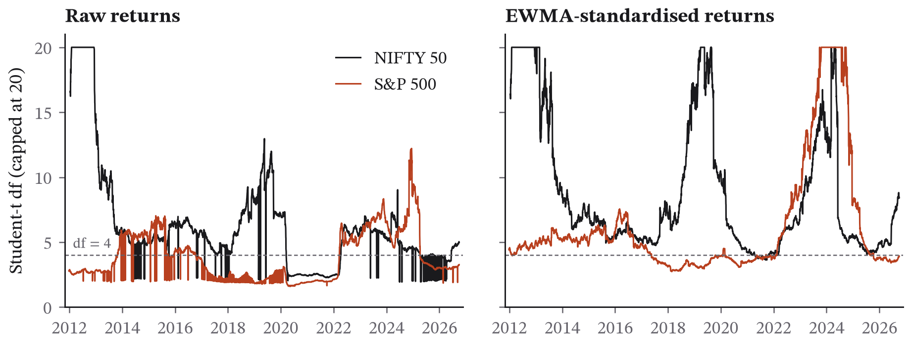

## Abstract

It has been known for more than sixty years that daily equity returns have heavier tails than the normal distribution, yet Gaussian assumptions are still the default in much introductory risk practice. This paper measures how badly the Gaussian model fails on 16.75 years of daily data for India's NIFTY 50 and the US S&P 500 (January 2010 to September 2026), and which simple alternatives repair it. Both indices have excess kurtosis near 13, and moves beyond four standard deviations occurred 65 times (NIFTY 50) and 105 times (S&P 500) more often than a normal distribution predicts. Six one-day Value-at-Risk (VaR) models were backtested strictly out of sample on a rolling 500-day window. At the 99% level the Gaussian model produced 57 violations where 36 were expected on NIFTY 50, and 89 where 37 were expected on the S&P 500, failing the Kupiec coverage test on both. Fat tails and volatility clustering turn out to be separable problems with separate fixes: an unconditional Student-t restores coverage but leaves violations clustered, while EWMA volatility removes the clustering but under-covers. Only filtered historical simulation, which addresses both, passes the Christoffersen conditional-coverage test at 95% on both indices (p = 0.50 and 0.98) and at 99% on NIFTY 50 (p = 0.25). No model passes at 99% on the S&P 500, because of March 2020. A specification that reused raw-return degrees of freedom inside a volatility model failed badly and is reported as a cautionary result. The code and data provenance are public.

## 1. Introduction

That financial returns have fat tails is an old observation (Mandelbrot 1963; Fama 1965), and the 2008 crisis made its consequences for risk measurement hard to ignore, when Gaussian-based VaR models at several institutions reported losses described as "25-standard-deviation events" on consecutive days. The Gaussian model has nevertheless survived as the default in textbooks, spreadsheets and much everyday practice, for understandable reasons: it is simple, it has a closed form, and it needs only a mean and a variance.

This paper asks two concrete questions of recent public data. The first is how large the Gaussian error actually is for a one-day VaR on two major equity indices, measured out of sample over a period that includes the 2020 pandemic crash, the 2022 rate shock and the 2025 tariff episode. The second is which repair works: a heavier-tailed distribution, a time-varying volatility, or both together. The second question deserves more attention than it usually gets, because the two repairs are often treated as interchangeable. A fat-tailed unconditional distribution and a Gaussian distribution with clustered volatility can produce the same histogram of returns, yet they imply different risk forecasts and fail backtests in different ways.

The contribution is intentionally modest. It is a clean out-of-sample comparison on two indices with a design fixed in advance, standard backtests, and public code and data. The paper also reports a specification that failed during the study, because the reason it failed turns out to be informative about the whole question.

### 1.1 Contributions

- A measurement, on 16.75 years of daily data for a major emerging-market index and a major developed-market index, of how far Gaussian one-day VaR under-covers at 95% and 99%, with the Kupiec and Christoffersen tests reported in full (Section 4.2).
- A design that separates the two causes of that failure. Six models are arranged so that tail shape and volatility dynamics vary independently (Figure 1), which lets the coverage test diagnose one and the independence test the other.
- Evidence that the unconditional Student-t degrees of freedom mostly measure volatility clustering rather than tail thickness: fitted on volatility-standardised returns, the median df rises from 3.0 to 4.7 for the S&P 500 and from 5.5 to 6.5 for NIFTY 50 (Section 4.3).
- A documented negative result. A specification that reused the raw-return df inside a volatility model produced 273 and 317 violations where 181 and 186 were expected, and Section 5.3 explains why.
- Full reproducibility: one command, public code, hashed data snapshots, and every number in a machine-readable results file.

### 1.2 Related work

Heavy tails in asset returns go back to Mandelbrot (1963) and Fama (1965), and volatility clustering to Engle (1982) and Bollerslev (1986), whose ARCH and GARCH models were the first to treat the two together. The backtests used here are the standard ones: Kupiec (1995) for unconditional coverage and Christoffersen (1998) for independence and conditional coverage. Filtered historical simulation was proposed by Barone-Adesi, Giannopoulos and Vosper (1999) as a way to combine a volatility filter with the empirical distribution of standardised returns. The most thorough comparison of VaR methods, Kuester, Mittnik and Paolella (2006), found on three decades of NASDAQ data that filtered and GARCH-based approaches dominated unconditional ones, which is the pattern this paper finds on current data for two indices it did not cover. Berkowitz, Christoffersen and Pelletier (2011) review the backtesting literature and show how weak the independence tests can be in small samples, which bears on the 99% results here. This paper does not attempt a survey of the literature on Indian equity risk; its contribution there is a current, fully reproducible baseline on the NIFTY 50 alongside the S&P 500 rather than a methodological advance.

## 2. Data

Daily closing levels of the NIFTY 50 (Yahoo Finance ticker `^NSEI`) and the S&P 500 (`^GSPC`) were downloaded on 1 October 2026 using the `yfinance` library, version 1.7.0. These are unadjusted index levels, so dividends are excluded, which does not matter for one-day log returns. NIFTY 50 history on Yahoo starts on 17 September 2007, and both series were cut to a common window from 1 January 2010 to 30 September 2026. That leaves 4,113 daily log returns for the NIFTY 50 and 4,211 for the S&P 500, each on its own trading calendar. The tickers, row counts, download time and SHA-256 hash of each file are recorded in `data/SNAPSHOT.json`. The price files themselves are not redistributed, because the index providers license their data. The repository's `fetch_data.py` downloads them again, and a second download on the same day reproduced both files byte for byte.

Table 1 gives summary statistics over the full window.

**Table 1. Daily log returns, 2010-01-04 to 2026-09-30.**

| | NIFTY 50 | S&P 500 |
|---|---|---|
| Observations | 4,113 | 4,211 |
| Mean (daily) | 0.036% | 0.046% |
| Std. dev. (daily) | 1.039% | 1.084% |
| Annualised volatility | 16.5% | 17.2% |
| Skewness | −0.88 | −0.61 |
| Excess kurtosis | 13.34 | 13.49 |
| Jarque–Bera statistic | 31,022 | 32,193 |
| Worst day | −13.90% (2020-03-23) | −12.77% (2020-03-16) |
| Best day | +8.40% (2020-04-07) | +9.09% (2025-04-09) |
| Student-t df (MLE, full sample) | 4.06 | 2.78 |

## 3. Method

The design was fixed before any result was examined. There was one revision, described in Section 3.4.

### 3.1 Distributional tests

Returns were standardised by their full-sample mean and standard deviation. For thresholds *k* = 2, 3, 4 and 5, the empirical frequency of |*z*| > *k* was compared with the two-sided normal tail probability 2Φ(−*k*), and the ratio of the two is reported. Normality is tested with Jarque–Bera, and a Student-t distribution (location, scale and degrees of freedom) is fitted to the full sample by maximum likelihood.

### 3.2 VaR models

One-day VaR at confidence α ∈ {0.95, 0.99} was forecast for every day *t* from an estimation window of the *W* = 500 trading days ending at *t* − 1, roughly two years. Both the window length and the EWMA decay are textbook defaults (J.P. Morgan/Reuters 1996) and were not tuned. The six models can be placed on a simple grid, shown in Figure 1: whether they let volatility vary over time, and whether they allow for tails heavier than the normal.

1. *Gaussian*: VaR = −(μ̂ + σ̂ z1−α), with μ̂ and σ̂ estimated on the window.
2. *Historical simulation*: the empirical (1 − α) quantile of the window.
3. *Student-t (unconditional)*: a maximum-likelihood fit of (df, loc, scale) to the window, with VaR taken from the fitted t quantile.
4. *EWMA-Gaussian*: σ2t = λσ2t−1 + (1 − λ)r2t−1 with λ = 0.94 and zero mean; VaR = −σt z1−α.
5. *Filtered Student-t*: the window's returns are standardised, zs = rs/σs, a t distribution is fitted to the standardised values, and VaR = −σt(loc + scale · t1−α(df)).
6. *Filtered historical simulation (FHS)*: VaR = −σt times the empirical (1 − α) quantile of the window's standardised returns (Barone-Adesi, Giannopoulos and Vosper 1999).

Models 1 to 3 hold volatility constant within the window and differ only in the shape of the tails. Model 4 lets volatility vary but keeps Gaussian tails. Models 5 and 6 do both. That arrangement is what makes it possible to separate the two effects.

### 3.3 Backtests

For each model and each α, a violation is a day on which *r*t < −VaRt. The Kupiec (1995) likelihood-ratio test checks unconditional coverage, that is, whether the violation rate equals 1 − α. The Christoffersen (1998) test checks independence against a first-order Markov alternative, in other words whether violations bunch together, and the conditional-coverage test combines the two. Also reported are violations by calendar year, the mean loss beyond VaR on violation days, and the mean VaR level, which is a rough measure of the capital each model would require.

### 3.4 Revision record

The first run used models 1 to 4. A fifth model was then added, defined as EWMA volatility multiplied by a unit-variance Student-t quantile whose degrees of freedom came from the raw-return window fit. It produced many more violations than even the Gaussian model (273 where 181 were expected at 95% on NIFTY 50, and 317 where 186 were expected on the S&P 500), so it was replaced by models 5 and 6 as defined above. The failed variant is still computed, and its results appear in `results.json` under `discarded_variants`. Section 5.3 explains why it failed. No other change was made after looking at results.

### 3.5 Reproducibility

Running `python analysis.py` in the paper's directory reproduces every number and figure here from the two snapshot files, in about ten minutes on a 12-thread laptop with the Student-t fits parallelised. The software is Python 3.13 with NumPy, pandas, SciPy and Matplotlib, at the versions listed in the repository's `requirements.txt`.

## 4. Results

### 4.1 The tails

Figure 2 shows normal quantile–quantile plots for both indices, and Figure 3 the exceedance ratios, with the counts in Table 2.

**Table 2. Observed and Gaussian-expected counts of |z| > k.**

| Threshold | NIFTY 50 observed | expected | ratio | S&P 500 observed | expected | ratio |
|---|---|---|---|---|---|---|
| 2σ | 190 | 187.1 | 1.02 | 198 | 191.6 | 1.03 |
| 3σ | 49 | 11.1 | 4.4 | 62 | 11.4 | 5.5 |
| 4σ | 17 | 0.26 | 65 | 28 | 0.27 | 105 |
| 5σ | 10 | 0.0024 | 4,241 | 12 | 0.0024 | 4,971 |

At two standard deviations the normal distribution is close to right. The gap opens at three and becomes extreme at four and five. A 5σ day ought to occur about once in 1,700 years of trading under a Gaussian model; each index had at least ten in under seventeen years. Both Jarque–Bera statistics reject normality at any conventional level.

The full-sample Student-t fits give 4.06 degrees of freedom for NIFTY 50 and 2.78 for the S&P 500. Taken literally, a df below 4 implies an infinite fourth moment and a df below 3 an infinite third. These numbers are better read as summaries of the unconditional histogram than as structural parameters, for reasons that become clear in Section 5.3.

### 4.2 Value-at-Risk backtests

Forecasts begin on 13 January 2012 for NIFTY 50 (3,613 forecast days) and on 27 December 2011 for the S&P 500 (3,711 days). Table 3 reports the backtests, Figure 4 plots the 99% violation counts, and Figure 5 shows the S&P 500 return series against three of the 99% VaR paths.

**Table 3. One-day VaR backtests, rolling 500-day window, out of sample. UC = Kupiec unconditional coverage; IND = Christoffersen independence; CC = conditional coverage. Entries are p-values; values of 0.05 or more (not rejected) are in bold.**

*NIFTY 50, 95% (expected violations 180.7)*

| Model | Violations | UC p | IND p | CC p | Mean VaR | Mean excess loss |
|---|---|---|---|---|---|---|
| Gaussian | 161 | **0.127** | 0.017 | 0.018 | 1.63% | 0.82% |
| Historical | 178 | **0.839** | 0.009 | 0.031 | 1.55% | 0.83% |
| Student-t | 192 | **0.391** | 0.009 | 0.022 | 1.49% | 0.81% |
| EWMA-Gaussian | 207 | 0.049 | **0.730** | **0.136** | 1.51% | 0.61% |
| Filtered Student-t | 219 | 0.005 | **0.621** | 0.016 | 1.48% | 0.60% |
| FHS | 189 | **0.527** | **0.317** | **0.496** | 1.56% | 0.62% |

*NIFTY 50, 99% (expected 36.1)*

| Model | Violations | UC p | IND p | CC p | Mean VaR | Mean excess loss |
|---|---|---|---|---|---|---|
| Gaussian | 57 | 0.001 | 0.000 | 0.000 | 2.32% | 1.15% |
| Historical | 42 | **0.339** | 0.001 | 0.003 | 2.65% | 1.38% |
| Student-t | 37 | **0.885** | **0.059** | **0.167** | 2.62% | 1.51% |
| EWMA-Gaussian | 69 | 0.000 | **0.768** | 0.000 | 2.14% | 0.75% |
| Filtered Student-t | 56 | 0.002 | **0.888** | 0.009 | 2.39% | 0.64% |
| FHS | 46 | **0.113** | **0.618** | **0.252** | 2.53% | 0.69% |

*S&P 500, 95% (expected 185.6)*

| Model | Violations | UC p | IND p | CC p | Mean VaR | Mean excess loss |
|---|---|---|---|---|---|---|
| Gaussian | 181 | **0.731** | 0.000 | 0.000 | 1.68% | 0.98% |
| Historical | 176 | **0.468** | 0.000 | 0.000 | 1.67% | 0.98% |
| Student-t | 215 | 0.030 | 0.000 | 0.000 | 1.47% | 0.99% |
| EWMA-Gaussian | 206 | **0.130** | **0.285** | **0.179** | 1.51% | 0.71% |
| Filtered Student-t | 239 | 0.000 | **0.228** | 0.000 | 1.43% | 0.69% |
| FHS | 187 | **0.913** | **0.845** | **0.975** | 1.60% | 0.71% |

*S&P 500, 99% (expected 37.1)*

| Model | Violations | UC p | IND p | CC p | Mean VaR | Mean excess loss |
|---|---|---|---|---|---|---|
| Gaussian | 89 | 0.000 | 0.000 | 0.000 | 2.39% | 1.10% |
| Historical | 46 | **0.157** | 0.000 | 0.000 | 3.00% | 1.32% |
| Student-t | 55 | 0.006 | 0.000 | 0.000 | 2.98% | 1.18% |
| EWMA-Gaussian | 85 | 0.000 | **0.059** | 0.000 | 2.13% | 0.78% |
| Filtered Student-t | 64 | 0.000 | 0.005 | 0.000 | 2.49% | 0.66% |
| FHS | 46 | **0.157** | 0.002 | 0.004 | 2.88% | 0.62% |

Four patterns stand out.

At 95%, the Gaussian model's coverage is fine but its independence is not. On both indices the Gaussian violation count is within sampling error of what is expected (161 against 181, and 181 against 186), yet the independence test rejects decisively (p = 0.017 and p < 0.001). At this level the problem is not the shape of the tails but clustering: violations arrive in bunches during volatile periods and hardly at all in calm ones. All three constant-volatility models fail the independence test on both indices, and all three EWMA-based models pass it at 95%.

At 99%, the Gaussian model fails coverage badly. It records 57 violations against 36 expected on NIFTY 50 (a rate of 1.6%) and 89 against 37 on the S&P 500 (2.4%), which means it underestimated the 1% tail by 58% and 140% respectively. This is the fat-tail failure in its textbook form.

The two repairs fix different things. The unconditional Student-t restores 99% coverage on NIFTY 50 (37 violations, UC p = 0.89) but leaves clustering in place (IND p = 0.059, and below 0.001 on the S&P 500). EWMA-Gaussian removes the clustering (IND p = 0.77 and 0.06) but still under-covers at 99% (69 and 85 violations), because Gaussian tails scaled by a correct volatility are still too thin. Neither repair is enough on its own at 99%.

FHS is the only model that passes conditional coverage at 95% on both indices and at 99% on NIFTY 50. Its 95% p-values, 0.50 and 0.98, are the only ones in the table above 0.5. At 99% on the S&P 500 its coverage is acceptable (46 against 37, UC p = 0.16) but it fails independence (p = 0.002), and the violations by year show why: five of its 46 S&P 500 violations fall in 2020, within a few weeks of each other, and a first-order Markov independence test penalises that regardless of how well the rest of the sample is covered. No model passes independence at 99% on the S&P 500. Appendix A gives every model's violations by calendar year; 2018, when the Gaussian model was breached 21 times on the S&P 500, is the other year that stands out.

Two further observations are worth recording. The EWMA-based models lose much less beyond VaR on the days they are breached (0.6–0.8%, against 1.0–1.5% for the constant-volatility models): when they are wrong, they are less wrong, because their VaR has already risen with volatility. And mean VaR levels differ by up to 40% between models (from 2.13% to 3.00% at 99% on the S&P 500), which in practice is a 40% difference in required capital. Historical simulation and the Student-t buy their coverage with VaR that is permanently higher, whereas FHS buys it with VaR that is high only when volatility is high.

### 4.3 Degrees of freedom over time

Figure 6 plots the fitted degrees of freedom across rolling windows. The raw-return fits (left) are low and unstable. For the S&P 500 the median across windows is 3.0, 62% of windows fall below 4 and 17% at or below 2, and the fit jumps between local optima in 2014–2016 and again in 2024–2025. Fits to EWMA-standardised returns (right) are higher and steadier: medians of 6.5 for NIFTY 50 and 4.7 for the S&P 500, no window at or below 2, and 3.6% and 38% of windows below 4 respectively. Once volatility clustering has been taken out, what remains is a heavy tail with finite variance, much less extreme than the unconditional histogram suggests.

## 5. Discussion

### 5.1 What fails, and why

Gaussian VaR is roughly right at 95% and badly wrong at 99% on both indices, and the reason is where the normal tail departs from the empirical one, which is somewhere between two and three standard deviations. A 95% one-day VaR sits at about 1.65σ, inside the region where the normal distribution is adequate; a 99% VaR sits at 2.33σ, outside it. Validating a Gaussian model at 95% and then using it at 99% or 99.9%, as capital rules require, therefore validates the model where it works and applies it where it does not.

### 5.2 Tails versus clustering

The central empirical point is that fat tails and volatility clustering are different problems, that they have different fixes, and that the standard backtests can tell them apart. The independence test diagnoses clustering, and the coverage test at a high confidence level diagnoses the tails. Of the six models, only the two that address both effects can pass both diagnostics, and only FHS does so convincingly. This agrees with the literature comparing VaR methods since the late 1990s (Kuester, Mittnik and Paolella 2006 found filtered approaches to dominate). What this paper adds is a clean demonstration on current data, including 2020, with a design simple enough for a student to check line by line.

### 5.3 The discarded variant, and what it shows

The specification that failed scaled EWMA volatility by a Student-t quantile standardised to unit variance, √((df − 2)/df) · t1−α(df), using the degrees of freedom from the raw-return fit. Two things went wrong at once. First, when df is close to 2, the unit-variance standardisation shrinks the quantile dramatically. At df = 2.5 the 99% unit-variance t quantile is about −2.0, which is smaller in magnitude than the Gaussian −2.33, because almost all of the variance of a t distribution with df near 2 sits in its extreme tail, leaving a unit-variance version with a very narrow body. Second, and more fundamentally, the raw-return df does not measure conditional tail thickness at all. It measures how the window mixes high- and low-volatility regimes, so using it inside a model that already removes those regimes counts the same effect twice. The filtered Student-t (model 5), which fits its t to standardised returns, avoids this problem, and its degrees of freedom are higher, as Section 4.3 showed. It still over-violates at 95%, because a t fitted to match the extreme tail places its 95% quantile inside the empirical one. FHS, which takes the empirical quantile of standardised returns directly, has no parametric shape to get wrong.

### 5.4 Limitations

The study covers two indices. The pattern is consistent with the literature, but nothing here is claimed about individual stocks, other asset classes or other markets.

The parameters are fixed and untuned. A 500-day window and λ = 0.94 are defaults. A tuned window or a GARCH volatility model would probably improve the EWMA-based models further; the design deliberately tuned nothing, so that the comparison could not be accused of fitting the sample.

The returns are index levels, not investable returns. Dividends, transaction costs and the impossibility of trading an index directly are all ignored, which is a second-order concern for a one-day VaR on an index-tracking position.

The independence test is first-order Markov. It is the standard test, and it is very sensitive to a single cluster: the run of violations in March 2020 alone is enough to reject independence for every model on the S&P 500 at 99%. A test of longer-range dependence (Engle and Manganelli 2004) might be more or less forgiving, but it was not run because it was not specified in advance.

Expected Shortfall is not backtested. ES is now the regulatory standard for market risk under Basel III, but backtesting it is harder and was out of scope; the mean-excess-loss column is a descriptive stand-in.

Finally, the data come from Yahoo Finance, which is free and widely used but not an official source. The indices' official closes are published by NSE and S&P Dow Jones Indices, and any discrepancies would appear in the fourth decimal place of a daily return and would not change any conclusion.

## 6. Conclusion

On sixteen and three-quarter years of daily NIFTY 50 and S&P 500 data, the Gaussian one-day VaR model is adequate at 95% and fails at 99%, where it underestimates violations by 58% and 140%. The failure has two separable causes, fat tails and volatility clustering, and a model has to address both to pass the standard backtests. Of six simple models tested strictly out of sample with untuned parameters, filtered historical simulation was the only one to pass conditional coverage at 95% on both indices and at 99% on NIFTY 50, and no model passed independence at 99% on the S&P 500 because of the March 2020 cluster. A variant that reused an unconditional tail estimate inside a volatility model failed badly, which illustrates that unconditional fat tails are to a large extent volatility clustering seen without a volatility model. The whole analysis reproduces from public data with a single command.

## References

- Barone-Adesi, G., Giannopoulos, K. & Vosper, L. (1999). VaR without correlations for portfolios of derivative securities. *Journal of Futures Markets*, 19(5), 583–602.
- Basel Committee on Banking Supervision (2019). *Minimum capital requirements for market risk*. Bank for International Settlements.
- Berkowitz, J., Christoffersen, P. & Pelletier, D. (2011). Evaluating value-at-risk models with desk-level data. *Management Science*, 57(12), 2213–2227.
- Bollerslev, T. (1986). Generalized autoregressive conditional heteroskedasticity. *Journal of Econometrics*, 31(3), 307–327.
- Christoffersen, P. F. (1998). Evaluating interval forecasts. *International Economic Review*, 39(4), 841–862.
- Engle, R. F. (1982). Autoregressive conditional heteroscedasticity with estimates of the variance of United Kingdom inflation. *Econometrica*, 50(4), 987–1007.
- Engle, R. F. & Manganelli, S. (2004). CAViaR: Conditional autoregressive value at risk by regression quantiles. *Journal of Business & Economic Statistics*, 22(4), 367–381.
- Fama, E. F. (1965). The behavior of stock-market prices. *Journal of Business*, 38(1), 34–105.
- J.P. Morgan/Reuters (1996). *RiskMetrics — Technical Document*, 4th ed.
- Kuester, K., Mittnik, S. & Paolella, M. S. (2006). Value-at-risk prediction: A comparison of alternative strategies. *Journal of Financial Econometrics*, 4(1), 53–89.
- Kupiec, P. H. (1995). Techniques for verifying the accuracy of risk measurement models. *Journal of Derivatives*, 3(2), 73–84.
- Mandelbrot, B. (1963). The variation of certain speculative prices. *Journal of Business*, 36(4), 394–419.

## Data and code availability

All code, `results.json` with every number in this paper, the figure code and `data/SNAPSHOT.json` (download date, row counts and SHA-256 hashes of the two price files) are available at https://github.com/Pranjulrathour/research under `papers/p1-fat-tails/`. The code is MIT-licensed. The index data come from Yahoo Finance via `yfinance` and are not redistributed; `python fetch_data.py p1` in the `papers/` folder downloads them and checks them against the recorded hashes.

## Declarations

*Competing interests and funding.* The author has no competing interests and received no funding for this work.

*Use of AI tools.* Generative AI tools were used to help draft parts of the text and code. All results were produced by the published scripts from the snapshot data, and the author reviewed the analysis and takes full responsibility for the content.

## Appendix A. Violations of 99% VaR by calendar year

Tables A1 and A2 give the counts behind Figure 4 and the independence results of Section 4.2, from `results.json`. Two years carry most of the story. In 2020 every model was breached more than its annual expectation of about 2.5 violations, and the breaches came within a few weeks of each other in March, which is what the Christoffersen independence test penalises. For the S&P 500, 2018 is the other outlier: the Gaussian model recorded 21 violations in a year that began with the February volatility spike and ended with the fourth-quarter sell-off, against 3 for FHS, because the Gaussian window still contained the quiet 2016–2017 period and its VaR had drifted down to about 1.5%. A model that rescales by current volatility recovers from a quiet window within weeks; a 500-day constant-volatility window takes two years.

**Table A1. NIFTY 50, violations of one-day 99% VaR by year (expected about 2.5 per full year).**

| Year | Gaussian | Historical | Student-t | EWMA-Gaussian | Filtered Student-t | FHS |
|---|---|---|---|---|---|---|
| 2012 | 1 | 1 | 0 | 1 | 1 | 1 |
| 2013 | 4 | 5 | 4 | 8 | 6 | 6 |
| 2014 | 0 | 0 | 0 | 3 | 3 | 3 |
| 2015 | 6 | 3 | 3 | 5 | 4 | 4 |
| 2016 | 4 | 2 | 2 | 7 | 4 | 4 |
| 2017 | 0 | 0 | 0 | 2 | 2 | 2 |
| 2018 | 9 | 7 | 7 | 4 | 4 | 4 |
| 2019 | 2 | 2 | 2 | 1 | 1 | 1 |
| 2020 | 15 | 12 | 10 | 13 | 10 | 8 |
| 2021 | 1 | 0 | 0 | 5 | 4 | 1 |
| 2022 | 3 | 0 | 3 | 4 | 4 | 1 |
| 2023 | 0 | 0 | 0 | 3 | 2 | 0 |
| 2024 | 4 | 3 | 3 | 5 | 5 | 5 |
| 2025 | 2 | 2 | 1 | 2 | 2 | 2 |
| 2026 (to Sept.) | 6 | 5 | 2 | 6 | 4 | 4 |
| Total | 57 | 42 | 37 | 69 | 56 | 46 |

**Table A2. S&P 500, violations of one-day 99% VaR by year (expected about 2.5 per full year).**

| Year | Gaussian | Historical | Student-t | EWMA-Gaussian | Filtered Student-t | FHS |
|---|---|---|---|---|---|---|
| 2011 (Dec.) | 0 | 0 | 0 | 0 | 0 | 0 |
| 2012 | 0 | 0 | 0 | 5 | 2 | 2 |
| 2013 | 0 | 0 | 0 | 5 | 5 | 3 |
| 2014 | 9 | 2 | 4 | 10 | 7 | 6 |
| 2015 | 10 | 6 | 7 | 6 | 4 | 4 |
| 2016 | 5 | 3 | 3 | 2 | 2 | 2 |
| 2017 | 0 | 0 | 0 | 4 | 4 | 3 |
| 2018 | 21 | 9 | 7 | 8 | 5 | 3 |
| 2019 | 5 | 1 | 1 | 5 | 3 | 2 |
| 2020 | 13 | 10 | 13 | 12 | 10 | 5 |
| 2021 | 0 | 0 | 0 | 8 | 6 | 2 |
| 2022 | 12 | 7 | 11 | 4 | 2 | 1 |
| 2023 | 0 | 0 | 0 | 2 | 0 | 1 |
| 2024 | 3 | 2 | 2 | 6 | 6 | 6 |
| 2025 | 10 | 6 | 6 | 6 | 6 | 4 |
| 2026 (to Sept.) | 1 | 0 | 1 | 2 | 2 | 2 |
| Total | 89 | 46 | 55 | 85 | 64 | 46 |

The constant-volatility models also show the opposite failure: whole calendar years with no violation at all (2017 for every one of them on both indices; 2012, 2013, 2021 and 2023 on the S&P 500), which means their VaR was far too conservative in calm periods. Correct coverage on average, achieved by alternating years of zero and years of twenty, is exactly what the independence test is designed to catch.
