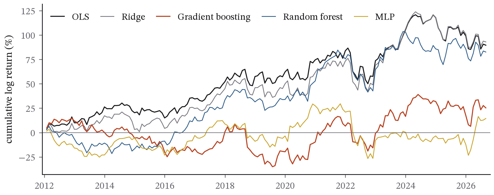
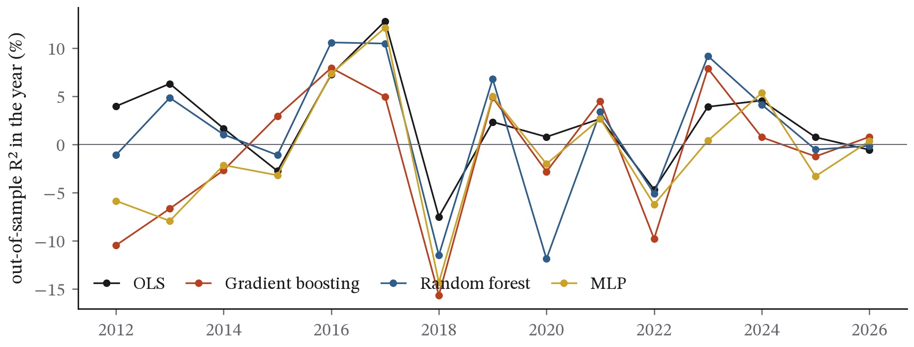

## Abstract

Tree ensembles and neural networks are widely reported to beat linear models at predicting monthly stock returns, a result established on tens of thousands of US stocks with dozens of firm characteristics. This paper asks whether the ranking survives at a scale an individual can reproduce: 29 Dow Jones stocks, ten standard price-based features and monthly returns from 2005 to 2026. Six models (OLS, ridge, lasso, random forest, gradient boosting and a small neural network) were evaluated walk-forward by calendar year from 2012, with hyperparameters chosen on the last two years of each training window, and then again with shuffled five-fold cross-validation to measure the look-ahead that random splitting introduces. Out of sample, no model beat the expanding historical mean, whose R² against a zero forecast was 2.41 per cent. The best model, lasso (2.36 per cent), had shrunk almost to that mean, and the three nonlinear models had negative R² and significantly larger errors than OLS. On returns measured relative to each month's average, every model's R² was below zero, and no long-short portfolio had a Sharpe ratio whose 90 per cent bootstrap interval excluded zero. Validation chose the most regularised setting of nearly every model in nearly every year. Shuffled cross-validation, by contrast, raised the random forest's R² from −0.3 to 13.4 per cent and gradient boosting's from −1.7 to 15.9 per cent. That inflation disappears when the common monthly component is removed from the target, which identifies its source. The code and data provenance are public.

## 1. Introduction

Gu, Kelly and Xiu (2020) compared linear and machine-learning methods for predicting monthly stock returns on the CRSP universe (about 30,000 stocks over sixty years) with 94 firm characteristics and their interactions with macroeconomic series, and found that trees and neural networks achieved markedly higher out-of-sample R² than linear models, though still a fraction of a per cent per month, and produced long-short portfolios with much higher Sharpe ratios. The paper has become the reference point for machine learning in asset pricing.

Two questions follow for anyone outside a well-resourced research group. First, *does the ranking depend on scale?* Nonlinear models need data to find nonlinearity; with a few thousand observations and ten features the comparison may invert. Second, *how much of the apparent skill in casual replications is an artefact of methodology?* Return data are a time series, and the most common error in student and practitioner replications is to split them randomly, which trains on the future.

This paper answers both on data anyone can download. Its ambition is deliberately limited: it is a small-scale replication, not a new method, and its value is in the protocol (fixed in advance, out of sample, with the wrong way measured alongside the right one) and in the candour of its reporting.

### 1.1 Contributions

- A walk-forward comparison of six return-prediction models on 29 large US stocks over fifteen test years, with hyperparameters chosen only on past data, reported against both a zero forecast and the expanding historical mean (Section 4.2).
- Evidence that at this scale the ranking of the reference study inverts: no model beats the historical mean, the best model has shrunk into it, and the three nonlinear models are significantly worse than OLS by Diebold–Mariano tests (Sections 4.2–4.3).
- A record of what validation chose: the most regularised setting of nearly every model in nearly every year (Section 4.5 and Appendix A), which is independent evidence that the data cannot support flexible models here.
- A measurement of the look-ahead that shuffled cross-validation creates in a stock panel, 14 to 18 percentage points of R² for the tree models, together with a diagnosis of its source: not training on later years, but training on the same month's returns for other stocks (Section 4.7).
- Full reproducibility, with a post-hoc summary from the saved predictions kept separate from the pre-specified results.

### 1.2 Related work

Gu, Kelly and Xiu (2020) is the reference point, and Kelly and Xiu (2023) survey the literature it started. Two earlier debates frame how this paper reads its results. Welch and Goyal (2008) showed that most proposed predictors of the equity premium failed out of sample against the historical mean, and Campbell and Thompson (2008) argued that even very small positive out-of-sample R² can be economically meaningful when the benchmark is right. Both are why this paper reports R² against the historical mean as well as against zero. On evaluation, Harvey, Liu and Zhu (2016) document how many published return predictors are likely to be false discoveries under conventional significance thresholds, and Bailey, Borwein, López de Prado and Zhu (2014) show how backtest overfitting manufactures apparent skill. López de Prado (2018) describes the specific leakage that random cross-validation creates in financial panels and proposes purged, embargoed splits; Section 4.7 of this paper measures that leakage directly and locates it in the cross-section. The features used are the standard price-based characteristics of Jegadeesh and Titman (1993) and Bali, Cakici and Whitelaw (2011), among others.

## 2. Data

Daily adjusted closing prices for the 30 current constituents of the Dow Jones Industrial Average and daily closes of the S&P 500 index were downloaded on 1 October 2026 via `yfinance` (version 1.7.0) for 2 January 2004 to 30 September 2026. One constituent, Visa, lacked a full history over the window (it listed in March 2008) and was dropped by a 95 per cent completeness rule, leaving 29 stocks; the dropped ticker is recorded in `results.json`. The download date, row counts and SHA-256 hashes of both files are recorded in `data/SNAPSHOT.json`. The files themselves are not redistributed, because the price data are licensed; `fetch_data.py p2` downloads them again. A second download on the same day reproduced the S&P 500 file exactly and the Dow 30 adjusted closes to within 1.5 parts per million, which is rounding in Yahoo's adjustment.

**Survivorship.** The universe is the *current* Dow, so stocks that were removed (and the firms that failed) are absent, and the sample's average return is biased upward relative to an investable strategy. The paper's object is the *relative ranking of forecasting methods*, not the level of returns, and survivorship affects every model's target identically. It is nonetheless a limitation and is stated as one in Section 6; the long-short portfolio results in particular should be read as comparisons between models, not as achievable performance.

## 3. Method

### 3.1 Panel construction

One observation per stock-month. For each stock and month-end *t*, features are computed from daily log returns up to *t*; the target is the stock's log return over month *t*+1. Features, all standard in the cross-sectional literature:

| Feature | Definition |
|---|---|
| `ret_1m` | return over the last month (short-term reversal) |
| `mom_12_1` | return over months *t*−12 to *t*−1 (momentum) |
| `mom_6_1` | return over months *t*−6 to *t*−1 |
| `vol_1m`, `vol_12m` | standard deviation of daily returns over 1 and 12 months |
| `max_1m` | largest daily return in the last month |
| `beta_12m` | slope of daily returns on S&P 500 daily returns over 12 months |
| `mkt_1m`, `mkt_12m` | S&P 500 return over 1 and 12 months (identical across stocks in a month) |
| `month` | month of year, mapped to [−1, 1] |

Stock-level features are rank-normalised cross-sectionally within each month to [−1, 1], following Gu, Kelly and Xiu. Market features, being constant within a month, are instead scaled by their own expanding standard deviation using only past months. Two targets are examined: the raw next-month return and the same return demeaned by its month's cross-sectional average (the pure cross-sectional problem).

The panel has 7,537 stock-months over 260 month-ends from January 2005 to August 2026 (the last target month is September 2026).

### 3.2 Models

OLS; ridge (α ∈ {0.1, 1, 10, 100}); lasso (α ∈ {10⁻⁴, 10⁻³, 10⁻²}); random forest (300 trees, max depth ∈ {3, 6, none}, minimum leaf 20); histogram gradient boosting (300 iterations, learning rate 0.03, max depth ∈ {2, 3, 5}, L2 = 1); multilayer perceptron (two hidden layers of 32, early stopping, L2 α ∈ {10⁻³, 10⁻², 10⁻¹}, inputs standardised). Two benchmarks: a zero forecast and the expanding historical mean of the target.

### 3.3 Protocol

Walk-forward by calendar year. For test year *Y* (2012 to 2026), the training window is every stock-month with a target month before January of *Y*. Hyperparameters are chosen by mean squared error on the last 24 months of the training window (the validation block), with the model fitted on the earlier part; the chosen model is then refitted on the whole training window and applied to year *Y*. The window expands each year. Stochastic models are run with seeds 0–4. Figure 1 shows the protocol, and the shuffled cross-validation of Section 3.5 that it is compared with.

### 3.4 Metrics

Pooled out-of-sample R² in the Gu–Kelly–Xiu form, 1 − Σ(*y* − *ŷ*)² / Σ *y*², against a zero forecast (and, additionally, against the historical mean); directional accuracy; a Diebold–Mariano test of each model's squared-error loss against OLS (HAC variance with lag 0, since forecasts are one step ahead), with positive statistics meaning the model beat OLS; and a monthly long-short portfolio that goes long the six stocks with the highest forecast and short the six lowest, equally weighted, reported as mean monthly return and annualised Sharpe ratio with a 90 per cent circular block-bootstrap interval (Politis and Romano 1992; block length 6 months, 2,000 resamples).

### 3.5 The wrong way, measured

The same models with the middle hyperparameter of each grid are evaluated with shuffled five-fold cross-validation over all stock-months, pooling predictions and computing the same out-of-sample R². This protocol lets a model trained on 2020 predict 2015; it is the most common error in casual replications and its inflation is reported alongside the honest results.

### 3.6 Revision record

The design as first written rank-normalised every feature within each month. For the two market features that would have been a mistake: they take the same value for every stock in a month, so their within-month rank is a constant and the information disappears. Before any result had been produced, they were changed to be scaled by their own expanding standard deviation, using only past months. The completeness rule that drops tickers without a full price history was also added at that stage, and the dropped ticker is recorded in `results.json`. Nothing was changed after results were seen. After the main run, a short post-hoc summary was computed from the saved predictions: the share of positive returns, how much each model's forecasts vary across stocks within a month, and R² by year. It explains results and changes none, and it is stored in `results.json` under `post_hoc` (`python analysis.py --post-hoc`).

### 3.7 Reproducibility

`python analysis.py` reproduces every number and figure from the two snapshot files, and `python analysis.py --plots-only` redraws the figures from a completed run. The full run took 49 minutes on the test laptop. The software is Python 3.13 with scikit-learn 1.9, pandas 2.2 and SciPy 1.18.

## 4. Results

### 4.1 The test sample

Each model made 5,104 forecasts: 29 stocks at each of 176 month-ends from January 2012 to August 2026, each forecasting the following month's return. Next-month returns were positive in 58.3 per cent of these stock-months, which matters for reading directional accuracy: a forecast that is always positive is right 58.3 per cent of the time.

### 4.2 Raw returns: nothing beats the average

Table 2 gives the results for the raw next-month return. The expanding historical mean, a benchmark with no features at all, had an out-of-sample R² of 2.41 per cent against a zero forecast, and no model beat it: every model's R² against the historical mean is negative. The closest was lasso, at 2.36 per cent against zero, and lasso got there by becoming the historical mean. Its forecasts varied across stocks within a month by a standard deviation of only 0.03 percentage points, against 0.41 for OLS and 5.7 for the returns themselves; its year-by-year R² tracks the historical mean's almost exactly; and its directional accuracy, 58.3 per cent, is precisely the share of up-months. Ridge and lasso beat OLS in Diebold–Mariano tests for the same reason. They shrink the noisy stock-level slopes towards zero, and with signal this weak, less variance is worth more than any information the slopes carry.

The three nonlinear models did worse than OLS, and significantly so: the random forest had an R² of −0.27 per cent (Diebold–Mariano statistic −2.50, p = 0.014), gradient boosting −1.68 per cent and the neural network −1.69 per cent, both with p ≤ 0.002. No model's directional accuracy exceeded the 58.3 per cent of a forecast that is always positive.

**Table 2. Raw next-month returns, walk-forward test years 2012–2026 (5,104 stock-months).** R² is pooled out of sample, in per cent. The Diebold–Mariano (DM) statistic compares squared errors with OLS; positive means better than OLS. Long-short (LS) Sharpe ratios are annualised, with 90 per cent circular block-bootstrap intervals for seed 0. Stochastic models are averaged over five seeds, with the standard deviation of R² shown. The last column is the same model under shuffled five-fold cross-validation.

| Model | R² vs zero | R² vs hist. mean | Direction | DM vs OLS (p) | LS Sharpe [90% CI] | Shuffled-CV R² |
|---|---|---|---|---|---|---|
| Historical mean | **2.41** | 0 | | | | |
| OLS | 1.09 | −1.34 | 56.6% | | 0.35 [−0.03, 0.79] | 1.76 |
| Ridge | 1.17 | −1.27 | 56.6% | +3.57 (<0.001) | 0.34 [−0.06, 0.78] | 1.76 |
| Lasso | 2.36 | −0.05 | 58.3% | +5.95 (<0.001) | −0.21 [−0.56, 0.11] | 1.84 |
| Random forest | −0.27 ± 0.12 | −2.75 | 56.8% | −2.50 (0.014) | 0.34 [−0.11, 0.76] | **13.44** |
| Gradient boosting | −1.68 ± 0.00 | −4.19 | 55.3% | −4.76 (<0.001) | 0.10 [−0.34, 0.52] | **15.89** |
| Neural network | −1.69 ± 1.08 | −4.20 | 54.8% | −5.47 (0.002) | 0.00 [−0.36, 0.52] | −3.01 |

### 4.3 Relative returns: nothing beats zero

Subtracting each month's cross-sectional average from the target leaves the pure stock-picking question: which of the 29 stocks will do better than the others next month? Table 3 shows that no model could answer it. Every R² is negative, the best being ridge at −0.07 per cent, and directional accuracy is between 50.2 and 51.5 per cent. Ridge's small improvement on OLS is significant at the 5 per cent level (p = 0.029); gradient boosting and the neural network are again significantly worse.

**Table 3. Next-month returns relative to the month's cross-sectional mean, same protocol.** The historical mean of this target is zero by construction.

| Model | R² vs zero | Direction | DM vs OLS (p) | LS Sharpe [90% CI] | Shuffled-CV R² |
|---|---|---|---|---|---|
| OLS | −0.12 | 51.5% | | 0.35 [−0.03, 0.79] | −0.06 |
| Ridge | −0.07 | 51.1% | +2.19 (0.029) | 0.36 [−0.03, 0.80] | −0.06 |
| Lasso | −0.11 | 50.2% | +0.07 (0.95) | −0.14 [−0.52, 0.22] | 0.05 |
| Random forest | −0.33 ± 0.09 | 50.6% | −0.87 (0.41) | 0.17 [−0.30, 0.49] | −0.18 |
| Gradient boosting | −1.68 ± 0.00 | 50.9% | −3.46 (0.001) | 0.10 [−0.25, 0.47] | −1.52 |
| Neural network | −2.29 ± 0.81 | 50.7% | −5.13 (<0.001) | 0.06 [−0.33, 0.42] | −6.00 |

### 4.4 Long-short portfolios

The portfolio that buys the six stocks with the highest forecast and sells the six lowest each month earned annualised Sharpe ratios of 0.35 with OLS, 0.34 with ridge and 0.34 with the random forest, 0.10 with gradient boosting, zero with the neural network and −0.21 with lasso. None of the 90 per cent intervals excludes zero, though OLS and ridge come close. Figure 2 shows the cumulative returns, including the large drawdown of 2022 that all of them share. The stock-level features are ranks, so they take the same set of values in every month, and demeaning the target changes only the coefficients on the market and calendar features. OLS therefore ranks the stocks identically under both targets, and its portfolio is the same in Tables 2 and 3.

### 4.5 Validation asked for the simplest model every time

The hyperparameters chosen on the validation blocks are a result in themselves. On the raw target, ridge took its strongest penalty (α = 100) in all 15 test years, lasso its strongest (α = 0.01) in 13, the neural network its strongest weight decay in all 15, the random forest its shallowest trees (depth 3) in 12 and gradient boosting its shallowest (depth 2) in 14. Year after year, the data asked for the least flexible model on offer. The nonlinear models' flexibility had nothing to fit except noise.

### 4.6 Year to year

Figure 3 shows how unstable skill is. OLS had an R² of 12.8 per cent in 2017 and −7.5 per cent in 2018; the linear models and the historical mean were positive in 11 of the 15 years, and the nonlinear models in only 7 or 8. The worst year for most models was 2018, which ended with a sharp sell-off in the fourth quarter; for the random forest it was 2020.

### 4.7 The leak, measured

Shuffled cross-validation transforms the nonlinear models (Figure 4 and the last column of Table 2). The random forest's R² rises from −0.27 to 13.44 per cent and gradient boosting's from −1.68 to 15.89 per cent, gains of 14 and 18 percentage points. The linear models hardly move (OLS rises from 1.09 to 1.76 per cent), and the neural network gets worse, probably because shuffled cross-validation uses the middle of each hyperparameter grid rather than the heavily regularised values that validation chose.

The demeaned target shows where the inflation comes from. On it, the shuffled protocol gives the random forest −0.18 per cent and gradient boosting −1.52 per cent, no better than the honest protocol (Table 3). The leak is therefore entirely in the common monthly component of returns. In a shuffled fold, most of a test stock's month-mates sit in the training data. The two market features take the same value for every stock in a month, so a tree can use them to pick out that month exactly, and then predict the average return that its month-mates actually earned. Next-month returns of Dow stocks move together closely, so knowing the month's average is worth a great deal. A linear model can't isolate a single month this way, which is why it gains so little. The look-ahead here doesn't come from training on later years. It comes from training on the same month's outcomes for other stocks.

## 5. Discussion

### 5.1 Why the ranking inverts at small scale

Nonlinear models earn their keep by finding interactions and thresholds that linear models miss, and finding them takes data. The reference study had roughly 30,000 stocks, sixty years and 94 characteristics; this one has 29 stocks, fifteen years of tests and ten features, and the signal in monthly returns is weak in either setting. At this scale, the variance a flexible model adds costs more than any structure it could find. The validation blocks said the same thing independently: given the choice, they picked the most constrained version of every model nearly every year. The result doesn't contradict Gu, Kelly and Xiu. It locates the boundary of their finding, which needs the breadth of data they had.

### 5.2 A zero forecast is a weak benchmark here

Gu, Kelly and Xiu measure R² against a zero forecast, because historical means of individual stocks are too noisy to be a useful benchmark across a broad universe. In this sample the zero forecast is weak. The current Dow constituents are, by construction, companies that did well, and the period was mostly a bull market, so the expanding mean was persistently positive and a forecast of zero was persistently too low. Against the historical mean, the benchmark recommended by Campbell and Thompson (2008) and Welch and Goyal (2008), no model in this study had any skill on raw returns. Anyone replicating a return-prediction result on a small, survivor-biased universe should report both benchmarks.

### 5.3 The leak is cross-sectional

The usual warning about random splits is that they let a model train on the future. In a panel of stocks, a second and larger channel exists: a random split puts other stocks' returns for the same month into the training data, and any feature that identifies the month, such as a market return, a macroeconomic series or a calendar variable, lets a flexible model read those returns off. Here that channel alone added 14 to 18 points of R² to the tree models, about six times the honest R² of the best model in the study. Walk-forward splits, or cross-validation that keeps whole months together and leaves a gap between training and test periods (López de Prado 2018), close it.

## 6. Limitations

*Scale.* 29 stocks and 10 features is two to three orders of magnitude smaller than the reference study in both dimensions. The paper tests whether the ranking holds at small scale; it cannot test the large-scale claim.

*Survivorship.* Discussed in Section 2. It raises the level of returns, which is part of why the historical mean is such a strong benchmark here (Section 5.2), but it affects every model's target identically. The long-short Sharpe ratios are comparisons between models, not achievable numbers.

*Price-based features only.* No fundamentals, no analyst data, no macro series beyond the market return. The feature set is what is free; the reference study's advantage may lie precisely in the features the free data lack.

*Monthly horizon, one rebalance rule.* Results at daily or quarterly horizons, or with different portfolio construction, may differ.

*No transaction costs.* The long-short portfolio turns over substantially each month; realistic costs would reduce every model's Sharpe ratio, and would reduce the high-turnover (reversal-driven) strategies most.

*Small hyperparameter grids.* The grids were chosen to be defensible, not exhaustive, and validation picked the most regularised end of almost every grid in almost every year (Section 4.5). The best settings probably lie beyond the grids, which would push every model further towards the historical mean rather than away from it. A wider search could also overfit the validation block.

## 7. Conclusion

On 29 Dow Jones stocks with ten price-based features, the machine-learning advantage reported for broad markets did not appear. Walk-forward from 2012 to 2026, no model beat the historical mean on raw monthly returns, no model beat zero on relative returns, the nonlinear models were significantly worse than OLS, and no long-short portfolio's Sharpe ratio was distinguishable from zero. Validation consistently chose the most regularised models available. Evaluated the wrong way, with shuffled cross-validation, the same tree models appeared to explain 13 to 16 per cent of next-month return variance, and that inflation came entirely from the shared monthly component of returns. The practical lessons are to benchmark against the historical mean, to check whether a model's forecasts actually vary across stocks, and never to shuffle a panel with a time dimension. Everything reproduces from public data with one command.

## References

- Gu, S., Kelly, B. & Xiu, D. (2020). Empirical asset pricing via machine learning. *Review of Financial Studies*, 33(5), 2223–2273.
- Harvey, C. R., Liu, Y. & Zhu, H. (2016). … and the cross-section of expected returns. *Review of Financial Studies*, 29(1), 5–68.
- Kelly, B. & Xiu, D. (2023). Financial machine learning. *Foundations and Trends in Finance*, 13(3–4), 205–363.
- Campbell, J. Y. & Thompson, S. B. (2008). Predicting excess stock returns out of sample: Can anything beat the historical average? *Review of Financial Studies*, 21(4), 1509–1531.
- Welch, I. & Goyal, A. (2008). A comprehensive look at the empirical performance of equity premium prediction. *Review of Financial Studies*, 21(4), 1455–1508.
- Diebold, F. X. & Mariano, R. S. (1995). Comparing predictive accuracy. *Journal of Business & Economic Statistics*, 13(3), 253–263.
- Jegadeesh, N. & Titman, S. (1993). Returns to buying winners and selling losers: Implications for stock market efficiency. *Journal of Finance*, 48(1), 65–91.
- Bali, T. G., Cakici, N. & Whitelaw, R. F. (2011). Maxing out: Stocks as lotteries and the cross-section of expected returns. *Journal of Financial Economics*, 99(2), 427–446.
- Bailey, D. H., Borwein, J., López de Prado, M. & Zhu, Q. J. (2014). Pseudo-mathematics and financial charlatanism: The effects of backtest overfitting on out-of-sample performance. *Notices of the AMS*, 61(5), 458–471.
- López de Prado, M. (2018). *Advances in Financial Machine Learning*. Wiley. (Chapter 7, on cross-validation leakage in finance.)
- Politis, D. N. & Romano, J. P. (1992). A circular block-resampling procedure for stationary data. In R. LePage & L. Billard (eds.), *Exploring the Limits of Bootstrap*, 263–270. Wiley.

## Data and code availability

Code, `results.json`, the figures and `data/SNAPSHOT.json` are at https://github.com/Pranjulrathour/research under `papers/p2-ml-returns/`. The code is MIT-licensed. Price data come from Yahoo Finance via `yfinance` and are not redistributed; `python fetch_data.py p2` in the `papers/` folder downloads them and checks them against the recorded hashes.

## Declarations

*Competing interests and funding.* The author has no competing interests and received no funding for this work.

*Use of AI tools.* Generative AI tools were used to help draft parts of the text and code. All results were produced by the published scripts from the snapshot data, and the author reviewed the analysis and takes full responsibility for the content.

## Appendix A. Hyperparameters chosen on the validation blocks

**Table A1. The setting chosen for each test year by mean squared error on the last 24 months of the training window, raw target.** The grids were ridge α ∈ {0.1, 1, 10, 100}, lasso α ∈ {10⁻⁴, 10⁻³, 10⁻²}, forest depth ∈ {3, 6, none}, boosting depth ∈ {2, 3, 5} and MLP weight decay α ∈ {10⁻³, 10⁻², 10⁻¹}. In 71 of the 75 choices, validation picked the most regularised option.

| Test year | Ridge α | Lasso α | Forest depth | Boosting depth | MLP α |
|---|---|---|---|---|---|
| 2012 | 100 | 0.01 | 3 | 2 | 0.1 |
| 2013 | 100 | 0.01 | 3 | 2 | 0.1 |
| 2014 | 100 | 0.01 | 3 | 2 | 0.1 |
| 2015 | 100 | 0.01 | 3 | 2 | 0.1 |
| 2016 | 100 | 0.01 | 3 | 2 | 0.1 |
| 2017 | 100 | 0.01 | 3 | 2 | 0.1 |
| 2018 | 100 | 0.01 | 3 | 2 | 0.1 |
| 2019 | 100 | 0.01 | 3 | 2 | 0.1 |
| 2020 | 100 | 0.01 | 6 | 2 | 0.1 |
| 2021 | 100 | 0.01 | 3 | 2 | 0.1 |
| 2022 | 100 | 0.01 | 3 | 3 | 0.1 |
| 2023 | 100 | 0.01 | none | 2 | 0.1 |
| 2024 | 100 | 0.01 | 3 | 2 | 0.1 |
| 2025 | 100 | 0.0001 | 6 | 2 | 0.1 |
| 2026 | 100 | 0.001 | 3 | 2 | 0.1 |

## Appendix B. Out-of-sample R² by test year

**Table B1. Pooled out-of-sample R² against a zero forecast within each test year, raw target, seed 0, in per cent.** The historical mean and lasso track each other almost exactly, which is the shrinkage described in Section 4.2. The nonlinear models' bad years (2018, 2020, 2022) are much worse than the linear models' bad years.

| Year | Hist. mean | OLS | Ridge | Lasso | Forest | Boosting | MLP |
|---|---|---|---|---|---|---|---|
| 2012 | +4.2 | +4.0 | +4.0 | +4.3 | −1.1 | −10.5 | −5.9 |
| 2013 | +7.0 | +6.3 | +6.3 | +6.9 | +4.8 | −6.7 | −8.0 |
| 2014 | +4.9 | +1.6 | +1.7 | +4.9 | +1.0 | −2.7 | −2.2 |
| 2015 | −0.6 | −2.8 | −2.7 | −0.6 | −1.1 | +2.9 | −3.2 |
| 2016 | +7.8 | +7.3 | +7.3 | +7.8 | +10.6 | +7.9 | +7.3 |
| 2017 | +12.7 | +12.8 | +12.8 | +12.7 | +10.5 | +4.9 | +12.1 |
| 2018 | −2.4 | −7.5 | −7.4 | −2.4 | −11.5 | −15.7 | −14.4 |
| 2019 | +5.0 | +2.3 | +2.5 | +5.0 | +6.8 | +4.9 | +5.0 |
| 2020 | +1.2 | +0.8 | +0.8 | +1.2 | −11.9 | −2.8 | −2.0 |
| 2021 | +4.3 | +2.7 | +2.8 | +4.3 | +3.4 | +4.5 | +2.7 |
| 2022 | −2.0 | −4.7 | −4.6 | −2.0 | −5.1 | −9.8 | −6.2 |
| 2023 | +3.2 | +3.9 | +3.9 | +3.2 | +9.2 | +7.9 | +0.4 |
| 2024 | +4.6 | +4.5 | +4.6 | +4.6 | +4.1 | +0.7 | +5.3 |
| 2025 | +1.5 | +0.7 | +0.9 | +0.9 | −0.5 | −1.3 | −3.3 |
| 2026 (to Aug.) | −0.4 | −0.6 | −0.6 | −0.5 | −0.2 | +0.8 | +0.3 |
