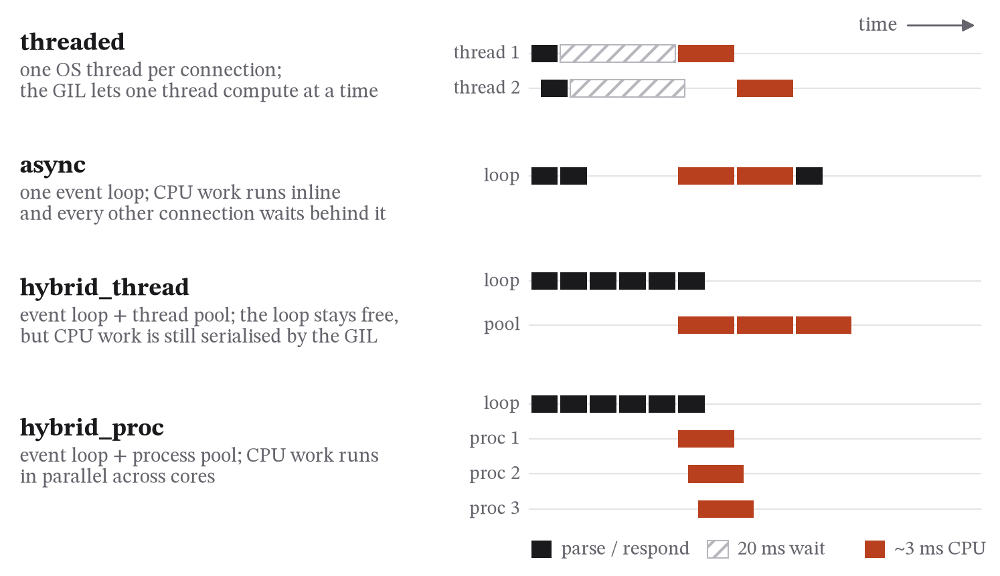
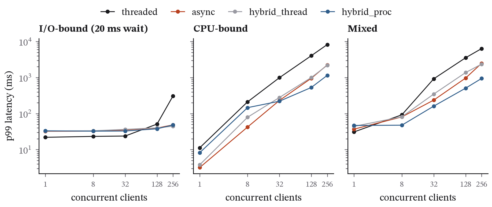
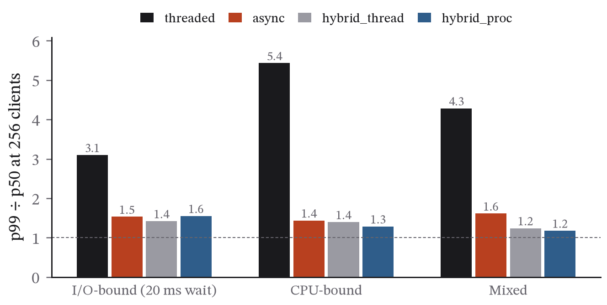

## Abstract

Choosing a concurrency model is one of the first decisions in building an API server and one of the least often measured. This paper measures it. Four minimal HTTP/1.1 servers were written in Python 3.13 that differ only in what they do while work is waiting: a thread per connection, an event loop running CPU work inline, an event loop with a thread pool, and an event loop with a process pool. Each was driven over loopback by a closed-loop generator at 1 to 256 keep-alive clients on three workloads (a 20 ms wait, 2.8 ms of CPU work, and both), three repeats per setting, with every request's latency recorded. On I/O-bound work all designs sat at their floor until 128 clients; at 256 the threaded server's p99 rose to 307 ms and its throughput halved, while the event-loop designs held p99 under 50 ms at 7,400–7,800 requests per second. On CPU-bound work the three designs that run Python under the interpreter lock had the same throughput (115–160 requests per second) but very different tails: at 256 clients the threaded server's p99 was 8.2 s against 2.2 s for the event loop, because threads under the lock are scheduled unfairly while the loop serves in order. The thread pool bought no throughput. The process pool paid 4.7 ms per hand-off, then doubled throughput and quartered the tail, then plateaued at its dispatcher's serial cost. The ratio p99/p50 at full load separated the designs: 1.2–1.6 for every event-loop design, 3.1–5.4 for threads. The single-file harness reproduces every number.

## 1. Introduction

Most API servers are built on one of three concurrency models: a thread (or process) per connection, an event loop that multiplexes many connections on one thread, or a hybrid that uses an event loop for I/O and a pool of workers for computation. Framework documentation recommends the hybrid. Folklore says event loops are for I/O-bound services and threads for CPU-bound ones. In practice, most teams choose whatever they already know, and few measure.

The quantity that should decide the choice is not throughput or mean latency but the tail: the latency of the slowest few per cent of requests. When a user request fans out to many services, the tail of each becomes the typical experience of the user (Dean and Barroso 2013). The tail is also where each design's structural weakness shows. A computation on an event loop delays every other connection on that loop; a thread pool busy with slow requests queues the fast ones behind them; and a process pool pays to copy every argument and result across a process boundary.

This paper measures the tail directly, with deliberately simple instruments, so that each mechanism is visible and a student can rerun the whole experiment in an afternoon.

### 1.1 Contributions

- A controlled comparison of the four concurrency designs in common use, implemented as minimal servers that share everything except the concurrency model, driven by the same closed-loop load generator at five concurrency levels on three workloads whose CPU and I/O components are known exactly (Section 2).
- Latency reported as distributions, not averages: p50, p95, p99 and maximum for every setting, the spread of the p99 across three repeats, and the p99/p50 ratio as a one-number signature of tail heaviness (Section 3).
- Attribution of each design's tail to a specific mechanism, by varying the workload: the event loop's collapse under inline CPU work, the thread designs' serialisation under the interpreter lock, and the process pool's parallelism (Section 4).
- A record of the measurement hygiene the results depended on, including a quiet-machine gate with the background load recorded, and a documented first-run failure caused by the standard library's five-connection listen backlog (Section 2.5).
- A single-file harness that reproduces every number and figure.

### 1.2 Related work

The threads-versus-events argument is old. Ousterhout (1996) argued that threads are a bad idea for most purposes; von Behren, Condit and Brewer (2003) answered that events are a bad idea for high-concurrency servers; Welsh, Culler and Brewer (2001) proposed the staged event-driven architecture, with explicit queues and backpressure between stages, as a middle path. Pariag et al. (2007) carried out the most careful empirical comparison of the era and found that well-tuned implementations of either model performed similarly, with the details of blocking I/O and scheduling mattering more than the model's name. This paper is in that empirical tradition, but at the tail rather than the throughput peak, and in an interpreted language with a global lock, which changes the picture for thread-based designs (PEP 703 describes the lock and the current effort to remove it). Dean and Barroso (2013) explain why the tail is the quantity that matters when requests fan out; Tene (2015) explains how measurement choices, above all coordinated omission, hide it; and Schroeder, Wierman and Harchol-Balter (2006) show how open- and closed-loop load generators measure different things, which this paper's closed-loop design inherits as a stated limitation. Chapter 21 of Beyer et al. (2016) covers the operational response to overload that the backpressure discussion in Section 4 draws on.

## 2. Method

### 2.1 Servers

There are four servers, each a few dozen lines of standard-library Python. They are identical in protocol (HTTP/1.1 with keep-alive), routing and response, and differ only in concurrency model. Figure 1 shows how each one spends its time.

- **threaded**: `ThreadingHTTPServer`, one operating-system thread per connection.
- **async**: an `asyncio` server. I/O waits are awaited, and CPU work runs inline on the event loop, which is the pattern framework documentation warns against.
- **hybrid_thread**: the same `asyncio` server, with CPU work sent to a `ThreadPoolExecutor` of 12 workers (the machine's logical CPU count).
- **hybrid_proc**: the same again with a `ProcessPoolExecutor` of 12 workers, started and warmed before measurement begins.

### 2.2 Workloads

Each request performs one of three deterministic workloads. **io** is a 20 ms sleep standing in for a downstream call to a database, a cache or a model API. **cpu** is a fixed loop of BLAKE2b hashes, calibrated to about 3 ms on the test machine; the duration is measured again at the start of every run and recorded with the results. **mixed** does the I/O wait and then the CPU work.

### 2.3 Load

A closed-loop load generator, written with `asyncio` and running in the harness process while the server runs in a process of its own, opens *C* keep-alive connections, with *C* ∈ {1, 8, 32, 128, 256}. Each client sends 40 requests in sequence, waiting for each response before sending the next, and the latency of every request is recorded on the client side. Every path is warmed up first. Each combination of server, workload and *C* is then run three times; the run with the median p99 is reported, and all three p99 values are kept to show the spread. Percentiles use the nearest-rank definition.

The closed loop is a deliberate choice with a known limitation (Schroeder, Wierman and Harchol-Balter 2006). Because each client waits for its response, the arrival rate falls as the server slows down. The generator therefore measures what each of *C* concurrent clients experiences, not what happens at a fixed arrival rate. That is the right question for how a server behaves as more users connect. The fixed-rate question needs an open-loop generator and is outside the scope of this paper.

### 2.4 Metrics and environment

For each setting the harness records the p50, p95, p99, maximum and mean latency in milliseconds, the throughput in requests per second, and the ratio of p99 to p50 as a one-number measure of how heavy the tail is. The results file also records the Python version, whether the interpreter's global lock was enabled, the platform, processor and core count, the measured duration of the CPU work, and the time of the run.

Timing benchmarks are sensitive to whatever else the machine is doing, so the harness waits before starting until other processes are using less than three-quarters of one core and at least 4 GB of memory is free, for up to two hours. It records the background load it saw at the start and again after each server, so a reader can judge how quiet the machine actually was.

### 2.5 Revision record

The design was written down before any measurement. Three things changed during the first attempts, all before any result was used.

The CPU loop was first calibrated at 8.5 ms per request, which made the CPU-bound workload dominate everything else. It was recalibrated to about 3 ms, so that CPU time and I/O wait are of comparable size.

The first full run failed at 256 clients against the threaded server, with the operating system refusing connections. Python's `socketserver` asks for a listen backlog of only five connections, and on Windows a full backlog causes outright refusal rather than a delay. The backlog was raised to 1,024 to match the `asyncio` servers, so that all four designs are compared on their concurrency model rather than on a socket default. The log of that failed run is kept in the repository as `run_first_attempt_backlog5.log`.

Server processes were first started as daemon processes, which are not allowed to start children, so the process-pool server could not create its workers. They now run as ordinary processes, and the harness terminates each server's whole process tree when it finishes, because Windows does not do this automatically.

### 2.6 Reproducibility

`python harness.py` runs the whole experiment and writes `results.json` and three figures, and `python harness.py --plots-only` redraws the figures from a saved `results.json`. The run reported here took 53 minutes, including a seven-minute wait for the machine to go quiet. Only the Python 3.13 standard library is needed for the measurements, plus psutil for the quiet-machine check and Matplotlib for the figures.

## 3. Results

### 3.1 The run

Table 1 records the environment. The quiet-machine check waited seven minutes before the run and recorded 0.70 cores of background load at the start, 0.50 after the threaded server, 0.57 after the asynchronous server, 1.85 after the thread-pool hybrid and 0.49 after the process-pool hybrid. The CPU work measured 2.82 ms per request on this machine at the start of the run. Every one of the 60 settings completed; the full table of results is in Appendix A.

**Table 1. Environment.**

| | |
|---|---|
| Processor | Intel Core i5-13420H (4 performance + 4 efficiency cores, 12 logical processors), 15.7 GB RAM |
| Operating system | Windows 11, loopback networking |
| Python | 3.13.2, global interpreter lock enabled |
| I/O wait | 20 ms sleep |
| CPU work | 7,500 BLAKE2b rounds, measured at 2.82 ms |
| Load | closed loop, 1/8/32/128/256 keep-alive clients × 40 requests, 3 repeats per setting |
| Background load | 0.70 cores at start; 0.50 / 0.57 / 1.85 / 0.49 after each server |
| Run | 1–2 October 2026, 53 minutes including the wait for a quiet machine |

### 3.2 I/O-bound: the floor, then the thread tail

With a 20 ms wait and no computation, every design sat at its floor from 1 to 128 clients (Figure 2, left; Table 2). The floors differ, and the difference is a platform artefact worth recording: the threaded server's median was 21 ms, while the three `asyncio` servers' medians were 31 ms, because on Windows `asyncio.sleep` resolves to the 15.6 ms system timer and a 20 ms sleep lasts about 31 ms, whereas `time.sleep` in the threaded server uses a high-resolution timer. Nothing in the comparison depends on it, but it means the asynchronous designs carry an extra 10 ms on this workload that they would not carry on Linux.

The designs separated only at 256 clients. The threaded server's median rose to 99 ms and its p99 to 307 ms (maximum 511 ms), and its throughput fell from 4,386 requests per second at 128 clients to 2,079. The three event-loop designs kept their medians at 31 ms, their p99s between 44 and 49 ms, and their throughput between 7,400 and 7,800 requests per second. Holding 256 idle connections costs an event loop almost nothing; holding 256 operating-system threads that all wake at once costs the threaded server scheduling, lock hand-offs and memory, and the cost appears in the tail first.

**Table 2. I/O-bound workload: median and p99 latency (ms) and throughput (requests per second).**

| Server | 1 client | 32 clients | 128 clients | 256 clients |
|---|---|---|---|---|
| threaded | 21.2 / 22.0 / 47 | 20.9 / 23.8 / 1,500 | 24.6 / 51.1 / 4,386 | 99.2 / 307.3 / 2,079 |
| async | 31.3 / 32.3 / 32 | 31.4 / 35.4 / 1,009 | 31.3 / 39.8 / 3,967 | 31.7 / 48.6 / 7,433 |
| hybrid_thread | 31.4 / 32.8 / 32 | 31.4 / 36.4 / 1,007 | 31.3 / 40.3 / 3,980 | 31.3 / 44.5 / 7,829 |
| hybrid_proc | 31.2 / 33.3 / 32 | 31.2 / 32.9 / 1,025 | 31.1 / 37.8 / 4,013 | 31.2 / 48.4 / 7,665 |

### 3.3 CPU-bound: same throughput, very different tails

With 2.8 ms of computation per request and no wait, the interpreter lock decides everything (Figure 2, centre; Table 3). The threaded server, the inline event loop and the thread-pool hybrid all execute the hashing one request at a time, and from 32 clients upward their throughputs are within a narrow band: 116 to 158 requests per second. Offloading the computation to a thread pool bought nothing in throughput, because the worker threads hold the same lock as the loop.

What the lock does not decide is the shape of the distribution. At 256 clients the threaded server and the inline event loop had similar throughput (116 against 152 requests per second), but the threaded server's p99 was 8,244 ms and its maximum 16,715 ms, against 2,240 ms and 2,257 ms for the event loop. The event loop's p99 is only 1.4 times its median; the threaded server's is 5.4 times. The two servers do the same work at nearly the same rate. The difference is in who waits: the loop serves connections in the order they become ready, so every client's request waits behind roughly the same number of others, while 256 operating-system threads contending for one lock are scheduled with no such fairness, and some requests wait sixteen seconds while others wait one.

The process-pool hybrid is the only design that can run the hashing in parallel, and its results show both the cost and the benefit. At one client it was the slowest of the four, 7.6 ms against 2.9 ms for the inline loop: the round trip to a worker process, with its argument and result pickled across a pipe, cost about 4.7 ms, more than the 2.8 ms of work it carried. From 8 clients upward it was the fastest. At 128 clients its throughput was 311 requests per second against 118 to 158 for the lock-bound designs, and its p99 was 532 ms against 957 to 4,049. Its ceiling, though, was far below the eight cores available: about 310 requests per second, or 3.2 ms of work per request in the dispatching process, which parses the request, hands off to the pool, collects the result and writes the response, all under its own lock. On this machine the design that "uses the cores" used about one of them. A production system would move the dispatch overhead down, by batching hand-offs or by using a worker model that avoids pickling, but the point stands: a process pool's throughput is bounded by the serial work left in the dispatcher.

**Table 3. CPU-bound workload: median and p99 latency (ms) and throughput (requests per second).**

| Server | 1 client | 32 clients | 128 clients | 256 clients |
|---|---|---|---|---|
| threaded | 10.1 / 11.2 / 98 | 148.9 / 993.4 / 132 | 660.9 / 4,048.6 / 118 | 1,517.5 / 8,244.4 / 116 |
| async | 2.9 / 3.2 / 345 | 206.9 / 231.5 / 153 | 783.4 / 957.0 / 158 | 1,559.1 / 2,240.2 / 152 |
| hybrid_thread | 3.0 / 3.8 / 334 | 236.6 / 279.9 / 133 | 941.2 / 1,003.4 / 137 | 1,569.5 / 2,191.8 / 155 |
| hybrid_proc | 7.6 / 8.2 / 131 | 129.5 / 220.8 / 235 | 397.0 / 531.7 / 311 | 896.1 / 1,152.6 / 279 |

Two smaller observations. The threaded server's floor at one client was 10 ms for 2.8 ms of work, where the asynchronous servers' was 3 ms; the standard library's server writes the headers and body as separate operations and does more per-request bookkeeping, and about 7 ms of fixed overhead is the price. And the lock-bound designs' throughput fell from about 340 requests per second at one client to about 150 from 32 clients onward, which means the cost of each request roughly doubled under load. Multiplexing hundreds of connections has an interpreter cost of its own, and a laptop running one core flat out for several minutes also loses clock speed; the harness cannot separate the two, and Section 5 lists this as a limitation.

### 3.4 Mixed: the realistic case

The mixed workload, a 20 ms wait followed by 2.8 ms of computation, behaves like the CPU-bound one once there is enough concurrency for the computation to queue, with the process pool's advantage intact (Figure 2, right; Table 4). At 256 clients the process-pool hybrid's p99 was 946 ms against 2,366 to 2,480 ms for the two lock-bound event-loop designs and 6,367 ms for the threaded server, and its throughput was twice theirs. The thread-pool hybrid did no better than the inline loop here either, and at 32 clients it was worse (p99 349 ms against 237), because handing work to a pool of twelve threads adds a hand-off and increases contention for the lock without adding any parallelism.

**Table 4. Mixed workload: median and p99 latency (ms) and throughput (requests per second).**

| Server | 1 client | 32 clients | 128 clients | 256 clients |
|---|---|---|---|---|
| threaded | 27.6 / 31.0 / 36 | 246.8 / 924.4 / 104 | 898.3 / 3,551.1 / 111 | 1,486.1 / 6,367.2 / 130 |
| async | 31.4 / 37.0 / 32 | 204.9 / 237.0 / 153 | 894.6 / 970.6 / 143 | 1,536.8 / 2,480.2 / 160 |
| hybrid_thread | 31.5 / 44.2 / 31 | 248.6 / 348.8 / 129 | 905.6 / 1,378.1 / 142 | 1,907.0 / 2,365.9 / 136 |
| hybrid_proc | 32.3 / 46.9 / 30 | 97.9 / 161.0 / 304 | 398.9 / 508.6 / 310 | 803.5 / 945.7 / 316 |

### 3.5 The tail signature

Figure 4 collects the ratio p99/p50 at 256 clients. For every event-loop design on every workload it lies between 1.2 and 1.6: the slowest one per cent of requests waited at most about half again as long as the median. For the threaded server it is 3.1 on the I/O workload, 4.3 on the mixed and 5.4 on the CPU-bound, and the maxima behind those ratios are 0.5, 16.5 and 16.7 seconds. The ratio is a design signature, and it is independent of throughput: Table 3 shows designs with nearly the same throughput and ratios of 1.4 and 5.4.

### 3.6 Repeatability

Each setting was run three times and the repeat with the median p99 is reported. Appendix A lists all three p99 values for every setting. For most settings they agree within 10 to 20 per cent (the threaded server's CPU-bound p99 at 256 clients was 7,987, 8,274 and 8,244 ms). The widest spreads belong to the thread-pool hybrid at 256 clients (1,684 to 2,610 ms on the CPU workload; 2,146 to 3,381 ms on the mixed), and the background-load sample taken after that server, 1.85 cores against about 0.5 for the others, suggests that other processes were active during part of its run. The comparisons in this section do not depend on those settings, and the spread is reported rather than hidden.

## 4. Discussion

### 4.1 Fairness, not capacity, made the threaded tail

The most useful result in this study is a pair of numbers from Table 3: at 256 clients the threaded server and the inline event loop had throughputs of 116 and 152 requests per second, and p99 latencies of 8.2 and 2.2 seconds. Nearly the same capacity, a fourfold difference in the tail. Both servers execute Python one request at a time. The event loop does so in the order connections become ready, which gives every request roughly the same queueing delay and a p99 close to the median. The threaded server leaves the order to the operating-system scheduler and the interpreter lock, which between them hand the processor to whichever of 256 threads wins, and some threads lose for sixteen seconds. Dean and Barroso's observation that the tail is the user's experience when requests fan out applies with full force: a service whose p99 is four times its neighbour's at the same throughput is a worse dependency, and the difference is invisible in a throughput benchmark.

### 4.2 Under the lock, a thread pool keeps the loop responsive and nothing more

Framework documentation recommends moving CPU-bound work off the event loop into an executor. The measurements show what that does and does not buy in CPython with the lock enabled. The loop stays responsive to I/O: on the I/O-bound workload the thread-pool hybrid was as good as the inline loop at every concurrency. But computation offloaded to threads still runs one task at a time, so on the CPU-bound and mixed workloads the thread-pool hybrid's throughput and tail were those of the inline loop, and at moderate concurrency its hand-off overhead made it slightly worse. The recommendation protects I/O requests from CPU requests. It does not make CPU requests faster. A service that is mostly CPU-bound gains nothing from it, and should look to processes, native code that releases the lock, or the free-threaded interpreter.

### 4.3 The process pool: a hand-off tax, a parallel benefit, and a dispatcher ceiling

The process-pool hybrid shows the three things that decide whether a worker-process design pays. First, the hand-off has a fixed cost, here about 4.7 ms per request, which made the design the slowest at low concurrency and would make it a poor choice for a service whose requests are mostly short. Second, once enough requests are in flight, parallelism dominates: twice the throughput and a quarter of the p99 of the lock-bound designs at 128 clients. Third, the benefit is capped by the serial work that remains in the dispatcher. With eight cores available, the design plateaued at about 310 requests per second, about what one core of dispatch work allows. Measuring that ceiling is the point of running the experiment rather than reasoning about it: the design "uses the cores", and on this machine it used one.

### 4.4 What to measure

Three measurement habits made these results legible, and they generalise. Report distributions, not averages: every important difference in this paper is in the p99 or the maximum, and most are invisible in the mean. Report the ratio p99/p50: it separated the designs more cleanly than any absolute number and it does not depend on the machine. And record the background load before and after each measurement: the one anomalous spread in this study is explained by a single line of metadata that most benchmarks do not collect.

### 4.5 Practical guidance

For an I/O-bound service, an event loop, with the strict rule that nothing on it computes. For a CPU-bound service in CPython, a process pool or native code, sized with the hand-off cost in mind, and with the dispatcher's own cost measured, because it is the ceiling. For a mixed service, the same, with the computation kept off the loop by discipline rather than hope. For any design, a listen backlog deliberately chosen, bounded queues, and a load test that reports the tail across several concurrencies and several repeats. And for a thread-per-connection server in CPython, the knowledge that its tail under load is a fairness problem that more hardware will not fix.

## 5. Limitations

*One machine, over loopback.* There is no real network, no network card and no other tenants. Absolute latencies don't transfer to other machines; the comparisons between designs are the result.

*Platform timers and clock speed.* On Windows, `asyncio.sleep` has about 15.6 ms resolution, which raised the asynchronous servers' I/O floor from 20 to 31 ms; `time.sleep` in the threaded server did not have this problem. And the per-request cost of the lock-bound designs roughly doubled between one client and thirty-two, which may be interpreter overhead from multiplexing many connections, a laptop losing clock speed under sustained single-core load, or both. The harness does not record processor frequency, so it cannot separate them.

*The standard-library threaded server.* `ThreadingHTTPServer` carries about 7 ms of fixed per-request overhead that the hand-written `asyncio` servers do not. A production threaded server would have less. The high-concurrency results, where design effects are measured in seconds, do not depend on it.

*The load generator shares the machine.* The generator is itself a single Python `asyncio` process on the same laptop. At high concurrency its own scheduling adds latency and it competes with the server for CPU. That affects every design, though not necessarily equally.

*Python only.* The interpreter lock makes the thread-pool hybrid behave differently from how it would in a runtime without one. The paper measures CPython 3.13 as most teams deploy it, and records the lock's state.

*Synthetic workloads.* A sleep and a hash loop have none of the variability of real dependencies or real request mixes, so real tails are heavier.

*Closed loop.* See Section 2.3: capacity at a fixed arrival rate is a different experiment.

*Minimal servers.* There is no framework, middleware, TLS, logging or serialisation. Real servers add overhead to every design, and whether they add it evenly isn't tested here.

*Small samples at low concurrency.* At *C* = 1 a run is only 40 requests, so the percentile estimates there are coarse. That is why the figures and the discussion concentrate on the higher concurrencies.

## 6. Conclusion

Four minimal servers that differ only in concurrency model were driven with the same closed-loop load on three workloads whose components are known exactly, and their latency distributions diverged in ways that a throughput benchmark would have missed. On I/O-bound work, every design sat at its floor until 128 clients, and at 256 only the thread-per-connection server failed, with a p99 six times its competitors' and half their throughput. On CPU-bound work in CPython, the three designs that run Python under the interpreter lock had the same throughput and very different tails: the threaded server's p99 was 8.2 s against 2.2 s for the event loop at the same capacity, because fairness, not throughput, is what the lock destroys. Offloading to a thread pool kept the loop responsive and bought no throughput. The process pool paid a 4.7 ms hand-off tax, then doubled throughput and quartered the tail, and plateaued at the serial cost of its own dispatcher. The ratio p99/p50 at full load, 1.2 to 1.6 for every event-loop design and 3.1 to 5.4 for threads, is the one number from this study worth putting on a dashboard. The harness, every measurement and the failed first run are public.

## References

- Beyer, B., Jones, C., Petoff, J. & Murphy, N. R. (eds.) (2016). *Site Reliability Engineering: How Google Runs Production Systems*. O'Reilly, chapter 21.
- Dean, J. & Barroso, L. A. (2013). The tail at scale. *Communications of the ACM*, 56(2), 74–80.
- Ousterhout, J. (1996). Why threads are a bad idea (for most purposes). Invited talk, *USENIX Technical Conference*.
- Pariag, D., Brecht, T., Harji, A., Buhr, P., Shukla, A. & Cheriton, D. R. (2007). Comparing the performance of web server architectures. *EuroSys 2007*, 231–243.
- Python Software Foundation (2023). PEP 703: Making the Global Interpreter Lock Optional in CPython.
- Schroeder, B., Wierman, A. & Harchol-Balter, M. (2006). Open versus closed: A cautionary tale. *NSDI 2006*.
- Tene, G. (2015). How NOT to measure latency. Talk at Strange Loop; HdrHistogram documentation.
- von Behren, R., Condit, J. & Brewer, E. (2003). Why events are a bad idea (for high-concurrency servers). *HotOS IX*.
- Welsh, M., Culler, D. & Brewer, E. (2001). SEDA: An architecture for well-conditioned, scalable internet services. *SOSP 2001*, 230–243.

## Data and code availability

The harness, `results.json` and the figures are at https://github.com/Pranjulrathour/research under `papers/p3-tail-latency/`, together with the log of the failed first run. The code is MIT-licensed. No external data are used.

## Declarations

*Competing interests and funding.* The author has no competing interests and received no funding for this work.

*Use of AI tools.* Generative AI tools were used to help draft parts of the text and code. All results were produced by the published harness, and the author reviewed the analysis and takes full responsibility for the content.

## Appendix A. Every setting

All 60 settings from `results.json`. Latencies are in milliseconds; the reported repeat is the one with the median p99 of three.

**Table A1. I/O-bound workload: latency in milliseconds and throughput, by server and concurrency.** The spread column gives the p99 of each of the three repeats; the reported row is the repeat with the median p99.

| Server | Clients | p50 | p95 | p99 | max | req/s | p99/p50 | p99 of the three repeats |
|---|---|---|---|---|---|---|---|---|
| threaded | 1 | 21.2 | 21.9 | 22.0 | 22 | 47 | 1.0 | 22, 22, 22 |
| threaded | 8 | 21.2 | 22.5 | 23.3 | 25 | 374 | 1.1 | 24, 23, 23 |
| threaded | 32 | 20.9 | 22.6 | 23.8 | 26 | 1,500 | 1.1 | 24, 25, 24 |
| threaded | 128 | 24.6 | 40.8 | 51.1 | 83 | 4,386 | 2.1 | 25, 51, 272 |
| threaded | 256 | 99.2 | 226.9 | 307.3 | 511 | 2,079 | 3.1 | 345, 266, 307 |
| async | 1 | 31.3 | 32.2 | 32.3 | 32 | 32 | 1.0 | 32, 32, 35 |
| async | 8 | 31.2 | 32.1 | 32.7 | 33 | 257 | 1.0 | 38, 33, 33 |
| async | 32 | 31.4 | 33.3 | 35.4 | 36 | 1,009 | 1.1 | 35, 36, 34 |
| async | 128 | 31.3 | 37.2 | 39.8 | 40 | 3,967 | 1.3 | 39, 40, 40 |
| async | 256 | 31.7 | 45.8 | 48.6 | 49 | 7,433 | 1.5 | 49, 46, 50 |
| hybrid_thread | 1 | 31.4 | 32.3 | 32.8 | 33 | 32 | 1.0 | 34, 32, 33 |
| hybrid_thread | 8 | 31.2 | 32.7 | 33.3 | 34 | 256 | 1.1 | 35, 33, 33 |
| hybrid_thread | 32 | 31.4 | 35.8 | 36.4 | 37 | 1,007 | 1.2 | 36, 34, 40 |
| hybrid_thread | 128 | 31.3 | 37.2 | 40.3 | 41 | 3,980 | 1.3 | 39, 41, 40 |
| hybrid_thread | 256 | 31.3 | 34.3 | 44.5 | 48 | 7,829 | 1.4 | 43, 47, 45 |
| hybrid_proc | 1 | 31.2 | 32.0 | 33.3 | 33 | 32 | 1.1 | 35, 33, 33 |
| hybrid_proc | 8 | 31.1 | 32.4 | 32.5 | 33 | 257 | 1.0 | 33, 33, 32 |
| hybrid_proc | 32 | 31.2 | 32.5 | 32.9 | 33 | 1,025 | 1.1 | 33, 33, 33 |
| hybrid_proc | 128 | 31.1 | 34.3 | 37.8 | 39 | 4,013 | 1.2 | 38, 36, 41 |
| hybrid_proc | 256 | 31.2 | 41.7 | 48.4 | 50 | 7,665 | 1.6 | 48, 49, 41 |

**Table A2. CPU-bound workload: latency in milliseconds and throughput, by server and concurrency.** The spread column gives the p99 of each of the three repeats; the reported row is the repeat with the median p99.

| Server | Clients | p50 | p95 | p99 | max | req/s | p99/p50 | p99 of the three repeats |
|---|---|---|---|---|---|---|---|---|
| threaded | 1 | 10.1 | 10.9 | 11.2 | 11 | 98 | 1.1 | 17, 11, 10 |
| threaded | 8 | 45.6 | 141.2 | 211.4 | 317 | 131 | 4.6 | 206, 211, 221 |
| threaded | 32 | 148.9 | 615.4 | 993.4 | 1,784 | 132 | 6.7 | 993, 1,005, 840 |
| threaded | 128 | 660.9 | 2,669.2 | 4,048.6 | 30,097 | 118 | 6.1 | 4,049, 4,163, 3,533 |
| threaded | 256 | 1,517.5 | 5,623.3 | 8,244.4 | 16,715 | 116 | 5.4 | 7,987, 8,274, 8,244 |
| async | 1 | 2.9 | 3.2 | 3.2 | 3 | 345 | 1.1 | 3, 3, 3 |
| async | 8 | 35.0 | 41.6 | 42.3 | 43 | 230 | 1.2 | 27, 42, 59 |
| async | 32 | 206.9 | 226.8 | 231.5 | 233 | 153 | 1.1 | 235, 232, 215 |
| async | 128 | 783.4 | 929.1 | 957.0 | 996 | 158 | 1.2 | 792, 1,305, 957 |
| async | 256 | 1,559.1 | 2,100.0 | 2,240.2 | 2,257 | 152 | 1.4 | 2,235, 2,297, 2,240 |
| hybrid_thread | 1 | 3.0 | 3.2 | 3.8 | 4 | 334 | 1.3 | 4, 4, 4 |
| hybrid_thread | 8 | 47.4 | 63.2 | 79.1 | 85 | 166 | 1.7 | 41, 79, 98 |
| hybrid_thread | 32 | 236.6 | 254.2 | 279.9 | 355 | 133 | 1.2 | 328, 280, 277 |
| hybrid_thread | 128 | 941.2 | 989.2 | 1,003.4 | 1,046 | 137 | 1.1 | 1,003, 986, 1,231 |
| hybrid_thread | 256 | 1,569.5 | 2,090.0 | 2,191.8 | 2,908 | 155 | 1.4 | 2,610, 2,192, 1,684 |
| hybrid_proc | 1 | 7.6 | 8.1 | 8.2 | 8 | 131 | 1.1 | 8, 8, 10 |
| hybrid_proc | 8 | 23.2 | 42.9 | 146.2 | 222 | 276 | 6.3 | 25, 146, 278 |
| hybrid_proc | 32 | 129.5 | 191.4 | 220.8 | 293 | 235 | 1.7 | 230, 221, 218 |
| hybrid_proc | 128 | 397.0 | 486.9 | 531.7 | 575 | 311 | 1.3 | 497, 532, 727 |
| hybrid_proc | 256 | 896.1 | 1,097.4 | 1,152.6 | 1,252 | 279 | 1.3 | 1,377, 1,153, 931 |

**Table A3. Mixed workload: latency in milliseconds and throughput, by server and concurrency.** The spread column gives the p99 of each of the three repeats; the reported row is the repeat with the median p99.

| Server | Clients | p50 | p95 | p99 | max | req/s | p99/p50 | p99 of the three repeats |
|---|---|---|---|---|---|---|---|---|
| threaded | 1 | 27.6 | 30.9 | 31.0 | 31 | 36 | 1.1 | 31, 31, 31 |
| threaded | 8 | 49.0 | 76.4 | 92.5 | 99 | 151 | 1.9 | 73, 93, 98 |
| threaded | 32 | 246.8 | 676.7 | 924.4 | 1,241 | 104 | 3.7 | 924, 752, 1,286 |
| threaded | 128 | 898.3 | 2,569.4 | 3,551.1 | 5,989 | 111 | 4.0 | 4,045, 3,551, 3,511 |
| threaded | 256 | 1,486.1 | 4,476.9 | 6,367.2 | 16,511 | 130 | 4.3 | 7,234, 6,367, 6,095 |
| async | 1 | 31.4 | 35.3 | 37.0 | 37 | 32 | 1.2 | 56, 36, 37 |
| async | 8 | 62.8 | 78.9 | 80.9 | 84 | 123 | 1.3 | 70, 81, 84 |
| async | 32 | 204.9 | 233.4 | 237.0 | 243 | 153 | 1.2 | 237, 327, 224 |
| async | 128 | 894.6 | 924.3 | 970.6 | 974 | 143 | 1.1 | 913, 971, 989 |
| async | 256 | 1,536.8 | 1,815.6 | 2,480.2 | 2,610 | 160 | 1.6 | 1,897, 2,549, 2,480 |
| hybrid_thread | 1 | 31.5 | 42.8 | 44.2 | 44 | 31 | 1.4 | 44, 45, 42 |
| hybrid_thread | 8 | 62.5 | 69.9 | 81.3 | 91 | 128 | 1.3 | 80, 81, 113 |
| hybrid_thread | 32 | 248.6 | 269.9 | 348.8 | 461 | 129 | 1.4 | 322, 349, 376 |
| hybrid_thread | 128 | 905.6 | 1,057.0 | 1,378.1 | 2,074 | 142 | 1.5 | 1,555, 1,378, 1,376 |
| hybrid_thread | 256 | 1,907.0 | 2,302.3 | 2,365.9 | 4,537 | 136 | 1.2 | 2,366, 2,146, 3,381 |
| hybrid_proc | 1 | 32.3 | 46.1 | 46.9 | 47 | 30 | 1.5 | 57, 47, 45 |
| hybrid_proc | 8 | 31.7 | 41.4 | 47.7 | 50 | 244 | 1.5 | 48, 48, 44 |
| hybrid_proc | 32 | 97.9 | 140.1 | 161.0 | 190 | 304 | 1.6 | 311, 152, 161 |
| hybrid_proc | 128 | 398.9 | 488.0 | 508.6 | 557 | 310 | 1.3 | 508, 539, 509 |
| hybrid_proc | 256 | 803.5 | 892.7 | 945.7 | 1,006 | 316 | 1.2 | 946, 1,116, 908 |

