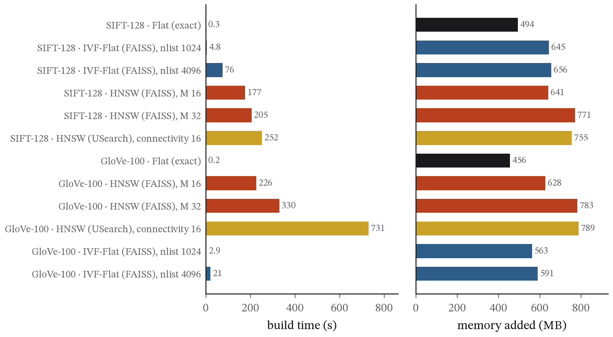

## Abstract

Vector similarity search underlies semantic search, recommendation and the retrieval step of most AI applications, and the index that performs it is chosen along a curve trading recall against speed, build time and memory. This paper measures that curve for the two index families in common use on two public datasets, SIFT-128 (one million vectors, Euclidean) and GloVe-100 (1.18 million, cosine), with exact search, IVF-Flat (two cluster counts, eight probe settings) and HNSW in two independent implementations (two graph degrees, six search widths). Every configuration was measured for recall@10, batched throughput, single-query latency on one thread, build time and memory. On SIFT, HNSW reached 99% recall at 22 times the throughput of exact search with a single-query p99 of 1.25 ms, against 5 times and 5.3 ms for IVF. On GloVe no index reached 99% recall, and at 95% the approximate indexes were no faster than exact search in batched mode, though still six times faster for a single query. Batched per-query cost understated single-query latency by a median factor of 6.4 on SIFT and 4.3 on GloVe. Graph builds took 2 to 16 times longer than IVF and added up to 56 per cent to the dataset's memory. Repeating the GloVe measurements three times on the same laptop within three hours changed recall by nothing and throughput by up to 5.9 times, so the paper reports the best timing of each attempt, keeps every attempt, and treats machine state as part of the measurement. One command reproduces everything from public data.

## 1. Introduction

A nearest-neighbour query asks which *k* vectors in a collection are closest to a query vector under some distance. An exact answer means comparing the query with every vector, or with a large fraction of them, since tree indexes degrade towards a full scan in high dimensions. At a million vectors that costs tens of milliseconds per query on one core, and the cost grows linearly with the collection. Approximate indexes return mostly-correct neighbours in a fraction of the time, and the engineering decision is where on the recall–speed curve to sit.

The ann-benchmarks project (Aumüller, Bernhardsson and Faithfull 2020) standardised this comparison with public datasets, precomputed ground truth, a plot of recall@k against queries per second, and a published harness. Its leaderboards are comprehensive, and they report batched throughput on dedicated hardware. Two things that someone designing a service needs are harder to see there. One is single-query latency on one thread, which is what a request-serving system pays. The other is the build time and memory behind each point on the curve, which decide whether the index can be rebuilt as the data change and whether it fits on the machine at all.

This paper measures all of these for the two dominant index families on two standard datasets, on one laptop, with a design fixed in advance. It aims to be a clear and reproducible reference for the trade-off; it does not propose a new index.

### 1.1 Contributions

- Recall–throughput frontiers for IVF-Flat and two independent HNSW implementations on SIFT-128 and GloVe-100, with every configuration reported rather than only the frontier points (Section 4 and Appendix A).
- The serving-style measurement the batched convention omits: single-query latency on one thread, as p50 and p99, for every configuration, and the size of the gap between it and batched per-query cost (Section 4.3).
- Build time and memory for every index, so that each point on the frontier carries its construction cost (Section 4.4).
- A documented account of how background load distorts these measurements, including an abandoned run in which batched search slowed roughly tenfold under contention, and the quiet-machine gate adopted in response (Section 3.3).
- A benchmark that reproduces with one command from public data whose hashes are recorded.

### 1.2 Related work

The ann-benchmarks project (Aumüller, Bernhardsson and Faithfull 2020) is the standard harness and leaderboard for this comparison, and the datasets and parameter sweeps here are its. Li et al. (2020) carried out a broad experimental comparison of approximate nearest-neighbour methods on high-dimensional data and found graph-based indexes to dominate at high recall, a result reproduced here at small scale. HNSW is due to Malkov and Yashunin (2018); the inverted-file approach and its combination with product quantisation to Jégou, Douze and Schmid (2011), with Johnson, Douze and Jégou (2019) and Douze et al. (2024) describing the FAISS library that implements both. Wang et al. (2021) survey graph-based methods and the design choices behind them. The angular GloVe dataset is a known hard case for all of these methods because of its high intrinsic dimension, which is why it is included alongside SIFT. What this paper adds is not a method but a measurement protocol: single-query latency, build cost and background-load accounting reported together for every configuration.

## 2. Data

Two datasets from ann-benchmarks.com were downloaded in their distributed HDF5 form on 1 October 2026. Their provenance, sizes and SHA-256 hashes are recorded in `data/SNAPSHOT.json`.

- **sift-128-euclidean**: 1,000,000 base vectors and 10,000 queries of 128-dimensional SIFT image descriptors (Jégou, Douze and Schmid 2011), compared by Euclidean distance.
- **glove-100-angular**: 1,183,514 base vectors and 10,000 queries of 100-dimensional GloVe word embeddings (Pennington, Socher and Manning 2014), compared by angle. The vectors are L2-normalised, so the inner product equals cosine similarity.

Each file ships the 100 exact nearest neighbours of every query, and recall@10 is computed against the first ten of them.

## 3. Method

### 3.1 Indexes

The two families work in different ways, as Figure 1 sketches. An inverted-file index partitions the space into cells and searches only the cells nearest the query; a graph index walks greedily through a neighbourhood graph towards the query.

- **flat**: exact search with FAISS `IndexFlatL2` or `IndexFlatIP`, the reference with recall 1.0.
- **ivf_flat**: FAISS `IndexIVFFlat` with *nlist* ∈ {1024, 4096} clusters, trained on a fixed random sample of 50 × *nlist* vectors (seed 0), and *nprobe* ∈ {1, 2, 4, 8, 16, 32, 64, 128}.
- **hnsw_faiss**: FAISS `IndexHNSWFlat` with *M* ∈ {16, 32}, *efConstruction* = 200 and *efSearch* ∈ {16, 32, 64, 128, 256, 512}.
- **hnsw_usearch**: USearch's HNSW with connectivity 16, expansion_add 200 and expansion_search ∈ {16, 32, 64, 128, 256, 512}, an independent implementation of the same algorithm (Malkov and Yashunin 2018).

The parameter ranges are the standard ann-benchmarks sweeps, and nothing was tuned after seeing results.

### 3.2 Measurements

Each configuration was measured for **recall@10**; for **batched throughput**, the full 10,000-query set searched in one call using all the threads described below, taking the best of three timings; for **single-query latency**, 500 queries (100 for exact search) searched one at a time on one thread and reported as p50 and p99; for **build time**; and for **memory added**, the growth in the process's resident memory over its level just after the dataset was loaded. The thread count, library versions, processor, core count and memory are all recorded in `results.json`.

### 3.3 Machine hygiene and revision record

The first attempt at this benchmark used every logical processor (12 on the test laptop, which has 4 performance and 4 efficiency cores). Whenever another process took a core, batched FAISS search slowed down roughly tenfold, because OpenMP's static schedule makes every thread wait for the slowest one. That run was abandoned, and its log is kept as `run_first_attempt_contended.log`. The benchmark now uses one thread per physical core (8), and before starting it waits until other processes are using less than three-quarters of one core and at least 4 GB of memory is free. It records the background load it saw at the start and after each dataset. No result from the abandoned run is used.

The second attempt was interrupted by an unrelated process restart after the SIFT measurements had been written to disk and while the GloVe measurements were in progress. Rather than repeat the SIFT hour, the script was given an explicit `--resume` option that keeps the datasets a previous run completed and runs the rest. The SIFT rows in `results.json` are therefore from the second attempt, which passed the quiet check at its start (0.52 cores of background load) and recorded 1.23 cores after the dataset finished.

GloVe was then measured twice more. The third attempt ran to completion while antivirus scans, triggered by unrelated downloads, loaded the machine: its HNSW graph builds took 2.8 to 5.3 times as long as in the second attempt. A fourth attempt, after the quiet check (0.54 cores, after a 3.4-minute wait), ran on a laptop that had by then been under benchmark load for eleven hours and had visibly throttled: exact search ran at 193 queries per second against 350 and 747 in the earlier attempts, and the graph builds were slower still. Recall@10 was identical across the three attempts to three decimal places for every configuration. Only the timings moved.

The GloVe rows reported in this paper are therefore the best timing of the attempts that measured each configuration, taken metric by metric (highest throughput, lowest latencies, shortest build), with recall from the run itself. This is the same rule the harness already applies within a run, where each batched timing is the best of three, extended across runs; it estimates what the hardware does when it is not otherwise occupied, which is the quantity the comparisons need. Every raw attempt is in the repository (`run_second_attempt_killed_during_glove.log`, `run_third_attempt_glove_contended.json`, `run_fourth_attempt_glove_throttled.json`), `results.json` records which attempt supplied each number, Appendix B lists all three side by side, and Section 5.4 discusses what the spread between them means. No measurement was altered, and none was selected on anything other than speed.

### 3.4 Reproducibility

With the two HDF5 files in `data/` (`python fetch_data.py p4` in the `papers/` folder downloads them and checks their hashes), `python benchmark.py` reproduces every number and figure, and `python benchmark.py --plots-only` redraws the figures from a saved `results.json`. `python compare_attempts.py` prints the GloVe timings from every attempt, and `python merge_glove_attempts.py` rebuilds the reported GloVe rows from them. The software is FAISS 1.15 (CPU), USearch 2.26, h5py, NumPy and psutil on Python 3.13. Expect one to two hours on a laptop, most of it spent building the HNSW graphs.

## 4. Results

### 4.1 The run

Table 1 records the environment and the attempts. Seventy configurations were measured in all, 35 per dataset: one exact index, sixteen IVF settings, twelve FAISS HNSW settings and six USearch settings. Appendix A lists every one.

**Table 1. Environment and attempts.**

| | |
|---|---|
| Processor | Intel Core i5-13420H (4 performance + 4 efficiency cores), 15.7 GB RAM, Windows 11 |
| Threads | 8 OpenMP threads for batched search and builds (one per physical core); 1 for single-query latency |
| Software | Python 3.13.2, FAISS 1.15.1 (CPU), USearch 2.26.2, h5py 3.16 |
| SIFT-128 | attempt 2, 1 October 2026, 22:00–22:19 IST; background 0.52 cores at start, 1.23 after |
| GloVe-100 | best of attempts 2, 3 and 4 (1–2 October 2026) per configuration; recall identical across attempts; Appendix B |
| Queries | 10,000 per dataset for batched throughput (best of three); 500 single queries per configuration (100 for exact search) |

### 4.2 SIFT: the graph index wins at every recall

On SIFT, exact search over a million vectors ran at 383 queries per second batched, 2.6 ms per query, and took 36 ms (p50) to 58 ms (p99) for a single query on one thread. Every approximate index was far faster, and the FAISS HNSW graph was fastest at every recall level (Figure 2, left; Table 2). At 91 per cent recall it answered 28,500 batched queries per second, 74 times the exact rate, with a single-query p99 of 0.51 ms. At 99 per cent recall it still answered 8,500 per second, 22 times exact, with a p99 of 1.25 ms. IVF-Flat reached the same recall levels at a third to a fifth of that throughput and three to four times the single-query latency: 6,570 queries per second at 92 per cent recall, 1,800 at 99 per cent. USearch's HNSW sat between the two, at roughly 55 to 60 per cent of FAISS's throughput for a given search width, with slightly higher recall at the widest settings.

**Table 2. SIFT-128: the fastest configuration in each family reaching a recall target.** Throughput is batched over 10,000 queries with 8 threads; single-query latencies are one query at a time on one thread.

| Recall target | Family | Configuration | Recall@10 | Queries/s | × exact | Single p50 (ms) | Single p99 (ms) |
|---|---|---|---|---|---|---|---|
| | Exact search | flat | 0.9993 | 383 | 1 | 35.9 | 57.8 |
| ≥ 0.90 | IVF-Flat | nlist 4096, nprobe 32 | 0.921 | 6,570 | 17 | 0.88 | 1.52 |
| | HNSW (FAISS) | M 16, efSearch 32 | 0.911 | 28,497 | 74 | 0.22 | 0.51 |
| | HNSW (USearch) | ef 32 | 0.902 | 16,204 | 42 | 0.46 | 0.99 |
| ≥ 0.95 | IVF-Flat | nlist 4096, nprobe 64 | 0.971 | 3,307 | 9 | 1.47 | 3.00 |
| | HNSW (FAISS) | M 16, efSearch 64 | 0.968 | 16,433 | 43 | 0.43 | 0.70 |
| | HNSW (USearch) | ef 64 | 0.963 | 9,107 | 24 | 0.77 | 1.40 |
| ≥ 0.99 | IVF-Flat | nlist 4096, nprobe 128 | 0.993 | 1,797 | 5 | 3.22 | 5.29 |
| | HNSW (FAISS) | M 16, efSearch 128 | 0.990 | 8,504 | 22 | 0.76 | 1.25 |
| | HNSW (USearch) | ef 256 | 0.997 | 2,581 | 7 | 2.92 | 6.05 |

The shape of the frontier is the same for every family: cheap at the bottom, steep at the top. For FAISS HNSW, going from 91 to 99 per cent recall cost a factor of 3.4 in throughput; going from 99 to 99.9 per cent (efSearch 512, 1,991 queries per second) cost another 4.3. The last percentage point costs as much as the previous eight.

### 4.3 GloVe: the frontier collapses into exact search

GloVe-100 with angular distance is a known hard case, and the frontier shows why (Figure 2, right; Table 3). No index in the study reached 99 per cent recall; the best recall any configuration achieved was 96.5 per cent (FAISS HNSW, M 32, efSearch 512). At 90 per cent recall the approximate indexes were still three times faster than exact search in batched mode. At 95 per cent they were not faster at all: the best IVF setting ran at 689 queries per second and the best HNSW setting at 627, against 747 for exact search over the whole collection with eight threads. The frontier had collapsed into the brute-force line.

**Table 3. GloVe-100: the fastest configuration in each family reaching a recall target.** No configuration reached 0.99.

| Recall target | Family | Configuration | Recall@10 | Queries/s | × exact | Single p50 (ms) | Single p99 (ms) |
|---|---|---|---|---|---|---|---|
| | Exact search | flat | 1.000 | 747 | 1 | 34.6 | 42.9 |
| ≥ 0.90 | IVF-Flat | nlist 4096, nprobe 128 | 0.914 | 2,360 | 3.2 | 1.48 | 2.25 |
| | HNSW (FAISS) | M 16, efSearch 512 | 0.921 | 1,909 | 2.6 | 3.26 | 4.80 |
| | HNSW (USearch) | ef 512 | 0.925 | 682 | 0.9 | 3.77 | 5.92 |
| ≥ 0.95 | IVF-Flat | nlist 1024, nprobe 128 | 0.963 | 689 | 0.9 | 5.30 | 8.42 |
| | HNSW (FAISS) | M 32, efSearch 512 | 0.965 | 627 | 0.8 | 4.00 | 6.77 |
| | HNSW (USearch) | — | — | — | — | — | — |

Two things make this less paradoxical than it sounds. First, exact search over 1.18 million 100-dimensional vectors is a dense matrix product that FAISS hands to a BLAS library running on all eight cores, and it is very efficient: 1.3 ms per query batched. An approximate index has to beat that with a sequence of dependent memory accesses, which is a harder contest than it is at higher dimension or larger scale. Second, GloVe's angular neighbourhoods are hard to navigate: at the same search width, HNSW's recall on GloVe is 20 to 25 points lower than on SIFT, and the search has to be widened so far to reach 95 per cent that its cost approaches a scan. The approximate indexes still had a decisive advantage for a service answering one query at a time: at 95 per cent recall their single-query p99 was 6.8 to 8.4 ms against 42.9 ms for exact search, a factor of five to six.

### 4.4 Batched throughput and single-query latency are different numbers

Figure 3 plots the frontiers against single-query p99 instead of batched throughput, and the two pictures differ in more than units. Dividing batched elapsed time by the number of queries gives a per-query cost of 0.02 to 0.6 ms for the approximate indexes on SIFT; the same configurations took 0.2 to 3.7 ms per query at the median when asked one query at a time on one thread. Across all approximate configurations the ratio of single-query p50 to batched per-query cost had a median of 6.4 on SIFT (range 3.4 to 15.5) and 4.3 on GloVe (2.5 to 8.2). Batching amortises the fixed costs of a search call and uses every core; a request-serving system gets neither benefit. A capacity estimate made from a batched throughput figure would overstate what a one-query-at-a-time service can do by that factor before any network, serialisation or application cost is counted.

### 4.5 Build time and memory

Table 4 and Figure 4 give the construction cost behind each frontier. Graph indexes were much more expensive to build than inverted files. On SIFT, the FAISS HNSW graph with M 16 took 177 s to build against 4.8 s for IVF with 1,024 lists and 76 s with 4,096 lists; on GloVe the M 32 graph took 330 s against 2.9 and 21 s. USearch's build was slower than FAISS's at comparable degree (252 s against 177 s on SIFT; 731 s against 330 s on GloVe, the latter the best of two attempts). Memory followed the graph degree: HNSW with M 32 added 771 MB of resident memory on SIFT, 56 per cent more than exact search's 494 MB, while IVF added about 150 MB. An index that must be rebuilt as data changes, or that must fit beside other services on a machine, pays these costs on every rebuild, and the frontier alone does not show them.

**Table 4. Build time and resident memory added, per index.** Build times for GloVe are the best of the attempts in Appendix B.

| Dataset | Index | Build (s) | Memory added (MB) |
|---|---|---|---|
| SIFT-128 | Exact | 0.3 | 494 |
| | IVF-Flat, nlist 1024 | 4.8 | 645 |
| | IVF-Flat, nlist 4096 | 75.7 | 656 |
| | HNSW (FAISS), M 16 | 176.6 | 641 |
| | HNSW (FAISS), M 32 | 205.0 | 771 |
| | HNSW (USearch), connectivity 16 | 252.0 | 755 |
| GloVe-100 | Exact | 0.2 | 456 |
| | IVF-Flat, nlist 1024 | 2.9 | 563 |
| | IVF-Flat, nlist 4096 | 21.1 | 591 |
| | HNSW (FAISS), M 16 | 226.4 | 628 |
| | HNSW (FAISS), M 32 | 329.9 | 783 |
| | HNSW (USearch), connectivity 16 | 731.0 | 789 |

### 4.6 Two implementations of one algorithm

FAISS and USearch implement the same algorithm, and the comparison shows how much the implementation matters. At equal graph degree and search width on SIFT, USearch's recall was within a point of FAISS's but its batched throughput was 55 to 60 per cent of FAISS's and its single-query latencies about twice as high. On GloVe the gap was wider: at search width 512, USearch reached 92.5 per cent recall at 682 queries per second against FAISS's 92.1 per cent (M 16) at 1,909. Part of the difference is in the search itself and part in the Python binding's per-call overhead, which the single-query measurement exposes and the batched one hides. The practical lesson is that "HNSW" names an algorithm, not a performance level, and that the two libraries should be measured, not assumed equivalent.

## 5. Discussion

### 5.1 The recall target decides everything

The frontiers are steep near the top on both datasets, and the steepness is the decision. On SIFT the last percentage point of recall below 100 costs as much throughput as the eight points before it; on GloVe the last five points cost the entire advantage of approximate search in batched mode. So the first question in designing a vector-search service is not which index to use but how much recall the application needs, which is a product question (does a user notice if the tenth result is the eleventh-nearest?) and should be answered, with evidence, before any index is chosen. Everything downstream, including whether an approximate index is worth having at all, follows from it.

### 5.2 Quoting batched throughput for a serving system is a factor-of-five error

The ann-benchmarks convention of recall against batched queries per second is the right one for comparing algorithms. It is the wrong one for sizing a service. The single-query measurements in this study were 2.5 to 15 times slower per query than the batched figures imply, with medians of 6.4 and 4.3 on the two datasets, and the ordering of configurations changed in places (Figure 3), because fixed per-call costs weigh more on small searches. A team planning capacity from a leaderboard number should divide it by something in that range, then measure.

### 5.3 When approximate search is not faster

The GloVe result is the most useful one in this study for a practitioner, because it is the one the leaderboards make easy to miss. Below about 1 to 2 million vectors in 100 dimensions, with a good BLAS library and a few cores, exact search is fast enough that an approximate index has to be quite accurate before it is slower, and on a hard distribution it may never be faster at the recall a product needs. The approximate index still buys single-query latency, and at larger scale, or with quantisation, the balance shifts back. But "approximate is faster" is a hypothesis to test on the actual data and the actual recall target, not a premise.

### 5.4 Machine state is part of the measurement

The three GloVe attempts are the clearest demonstration in this study of a point the benchmarking literature makes often and practice ignores: on a shared or thermally limited machine, the same code on the same data can produce timings that differ by a factor of two to six within a few hours, with no change in correctness (Appendix B). Recall was identical across attempts because the indexes are deterministic given their parameters and data; throughput and build time moved with whatever else the machine was doing and how hot it was. The standard remedies, which this study used, are to gate on a quiet machine, record the background load, repeat, and report the best timing as the estimate of what the hardware can do, while keeping every attempt. A benchmark that reports one run's timings without its environment is reporting an unknown mixture of the algorithm and the afternoon.

### 5.5 Practical guidance

Decide the recall target first, from product evidence. Measure exact search before building anything; below a few million vectors it may be good enough, and it is the baseline every index must beat at the target recall. Prefer a graph index when single-query latency at high recall matters and rebuilds are rare; prefer an inverted file when builds must be fast, memory is tight or the data changes often. Measure single-query latency on one thread as well as batched throughput, and plan capacity from the former. Measure the two HNSW libraries rather than assuming they are the same. And record the machine's state with every number, because the number is not reproducible without it.

## 6. Limitations

*One machine.* Absolute throughput and latency belong to the test laptop. The shapes of the frontiers and the relative positions of the index families are the result that transfers.

*Timing variability across attempts.* The GloVe timings are the best of three attempts whose throughputs differed by up to a factor of 5.9 (median 2.5) because of background load and thermal state (Appendix B). The SIFT timings come from a single attempt that passed the quiet check, and could be similarly understated. Recall is unaffected.

*Two datasets at the million scale.* Both are standard, and both are small by production standards. Behaviour at a hundred million or a billion vectors, where compression such as product quantisation becomes necessary, is not measured.

*No quantisation, filtering or updates.* Only uncompressed vectors are indexed. There is no metadata filtering, which changes how graph indexes behave quite a lot, and no insertion or deletion after the build. Each of these would be a separate study.

*Library defaults.* Apart from the swept parameters, every setting is the library's default. Both libraries have further options that a tuned deployment would use.

*Approximate memory figures.* Memory is measured as growth in resident memory. Memory freed by one index isn't always returned to the operating system before the next is built, so the figures for later indexes are approximate and lean high.

*Recall@10 only.* Applications that need recall@100, or that re-rank a larger set of candidates, face a different curve.

## 7. Conclusion

Seventy configurations of exact, inverted-file and graph indexes were measured on two standard datasets for recall, batched throughput, single-query latency, build time and memory. On SIFT the graph index dominated, reaching 99 per cent recall at 22 times exact-search throughput with a single-query p99 of 1.25 ms. On GloVe no index reached 99 per cent recall and at 95 per cent none was faster than exact search in batched mode, though all were several times faster for single queries. Batched per-query cost understated single-query latency by a median factor of four to six, graph builds cost minutes against seconds for inverted files, and repeating the measurements on the same laptop moved the timings by up to a factor of six without moving recall at all. The frontier is only the start of the decision: the recall target, the serving pattern, the rebuild schedule and the machine's state decide the rest, and all of them can be measured.

## References

- Aumüller, M., Bernhardsson, E. & Faithfull, A. (2020). ANN-Benchmarks: A benchmarking tool for approximate nearest neighbor algorithms. *Information Systems*, 87, 101374.
- Douze, M. et al. (2024). The Faiss library. arXiv:2401.08281.
- Jégou, H., Douze, M. & Schmid, C. (2011). Product quantization for nearest neighbor search. *IEEE Transactions on Pattern Analysis and Machine Intelligence*, 33(1), 117–128.
- Johnson, J., Douze, M. & Jégou, H. (2019). Billion-scale similarity search with GPUs. *IEEE Transactions on Big Data*, 7(3), 535–547.
- Li, W. et al. (2020). Approximate nearest neighbor search on high dimensional data: Experiments, analyses, and improvement. *IEEE Transactions on Knowledge and Data Engineering*, 32(8), 1475–1488.
- Malkov, Y. A. & Yashunin, D. A. (2018). Efficient and robust approximate nearest neighbor search using Hierarchical Navigable Small World graphs. *IEEE Transactions on Pattern Analysis and Machine Intelligence*, 42(4), 824–836.
- Pennington, J., Socher, R. & Manning, C. D. (2014). GloVe: Global vectors for word representation. *EMNLP 2014*, 1532–1543.
- Vardanian, A. (2023). USearch: Smaller and faster single-file vector search engine. Software, version 2.x.
- Wang, M., Xu, X., Yue, Q. & Wang, Y. (2021). A comprehensive survey and experimental comparison of graph-based approximate nearest neighbor search. *Proceedings of the VLDB Endowment*, 14(11), 1964–1978.

## Data and code availability

Code, `results.json`, the figures and `data/SNAPSHOT.json` are at https://github.com/Pranjulrathour/research under `papers/p4-ann-frontiers/`. The code is MIT-licensed. The HDF5 datasets are distributed by ann-benchmarks.com and are not committed here because of their size (1 GB); `fetch_data.py p4` downloads them and checks them against the recorded hashes.

## Declarations

*Competing interests and funding.* The author has no competing interests and received no funding for this work.

*Use of AI tools.* Generative AI tools were used to help draft parts of the text and code. All results were produced by the published benchmark script, and the author reviewed the analysis and takes full responsibility for the content.

## Appendix A. Every configuration

All 70 configurations from `results.json`. GloVe timings are the best of the attempts in Appendix B; recall is from the run itself.

**Table A1. sift-128-euclidean: every configuration.** QPS is batched over the 10,000-query test set with 8 threads, best of three; single-query latencies are one query at a time on one thread (500 queries; 100 for exact search).

| Index | Configuration | Recall@10 | QPS (batched) | Batched ms/query | Single p50 (ms) | Single p99 (ms) | Build (s) | Memory (MB) |
|---|---|---|---|---|---|---|---|---|
| Flat (exact) | exact | 0.9993 | 383 | 2.613 | 35.88 | 57.76 | 0.3 | 494 |
| IVF-Flat | nlist 1024, nprobe 1 | 0.3670 | 64,643 | 0.015 | 0.08 | 0.24 | 4.8 | 645 |
| IVF-Flat | nlist 1024, nprobe 2 | 0.5282 | 36,372 | 0.027 | 0.12 | 0.31 | 4.8 | 645 |
| IVF-Flat | nlist 1024, nprobe 4 | 0.6908 | 18,612 | 0.054 | 0.18 | 0.56 | 4.8 | 645 |
| IVF-Flat | nlist 1024, nprobe 8 | 0.8313 | 9,334 | 0.107 | 0.38 | 0.84 | 4.8 | 645 |
| IVF-Flat | nlist 1024, nprobe 16 | 0.9277 | 4,873 | 0.205 | 0.69 | 1.62 | 4.8 | 645 |
| IVF-Flat | nlist 1024, nprobe 32 | 0.9775 | 2,574 | 0.389 | 1.37 | 3.76 | 4.8 | 645 |
| IVF-Flat | nlist 1024, nprobe 64 | 0.9954 | 1,015 | 0.985 | 4.07 | 9.64 | 4.8 | 645 |
| IVF-Flat | nlist 1024, nprobe 128 | 0.9990 | 471 | 2.124 | 8.39 | 16.21 | 4.8 | 645 |
| IVF-Flat | nlist 4096, nprobe 1 | 0.2794 | 62,520 | 0.016 | 0.25 | 0.49 | 75.7 | 656 |
| IVF-Flat | nlist 4096, nprobe 2 | 0.4127 | 49,062 | 0.020 | 0.26 | 0.46 | 75.7 | 656 |
| IVF-Flat | nlist 4096, nprobe 4 | 0.5638 | 35,378 | 0.028 | 0.30 | 0.58 | 75.7 | 656 |
| IVF-Flat | nlist 4096, nprobe 8 | 0.7100 | 24,736 | 0.040 | 0.39 | 0.67 | 75.7 | 656 |
| IVF-Flat | nlist 4096, nprobe 16 | 0.8324 | 12,234 | 0.082 | 0.53 | 0.95 | 75.7 | 656 |
| IVF-Flat | nlist 4096, nprobe 32 | 0.9212 | 6,570 | 0.152 | 0.88 | 1.52 | 75.7 | 656 |
| IVF-Flat | nlist 4096, nprobe 64 | 0.9714 | 3,307 | 0.302 | 1.47 | 3.00 | 75.7 | 656 |
| IVF-Flat | nlist 4096, nprobe 128 | 0.9926 | 1,797 | 0.557 | 3.22 | 5.29 | 75.7 | 656 |
| HNSW (FAISS) | M 16, efSearch 16 | 0.8075 | 47,293 | 0.021 | 0.16 | 0.33 | 176.6 | 641 |
| HNSW (FAISS) | M 16, efSearch 32 | 0.9108 | 28,497 | 0.035 | 0.22 | 0.51 | 176.6 | 641 |
| HNSW (FAISS) | M 16, efSearch 64 | 0.9675 | 16,433 | 0.061 | 0.43 | 0.70 | 176.6 | 641 |
| HNSW (FAISS) | M 16, efSearch 128 | 0.9904 | 8,504 | 0.118 | 0.76 | 1.25 | 176.6 | 641 |
| HNSW (FAISS) | M 16, efSearch 256 | 0.9973 | 4,303 | 0.232 | 1.45 | 2.72 | 176.6 | 641 |
| HNSW (FAISS) | M 16, efSearch 512 | 0.9990 | 1,991 | 0.502 | 3.07 | 5.81 | 176.6 | 641 |
| HNSW (FAISS) | M 32, efSearch 16 | 0.8575 | 37,200 | 0.027 | 0.20 | 0.51 | 205.0 | 771 |
| HNSW (FAISS) | M 32, efSearch 32 | 0.9402 | 22,097 | 0.045 | 0.30 | 0.65 | 205.0 | 771 |
| HNSW (FAISS) | M 32, efSearch 64 | 0.9807 | 12,873 | 0.078 | 0.50 | 0.99 | 205.0 | 771 |
| HNSW (FAISS) | M 32, efSearch 128 | 0.9950 | 6,764 | 0.148 | 0.96 | 1.51 | 205.0 | 771 |
| HNSW (FAISS) | M 32, efSearch 256 | 0.9988 | 3,478 | 0.288 | 1.79 | 2.94 | 205.0 | 771 |
| HNSW (FAISS) | M 32, efSearch 512 | 0.9993 | 1,703 | 0.587 | 3.74 | 8.91 | 205.0 | 771 |
| HNSW (USearch) | connectivity 16, ef 16 | 0.8000 | 26,428 | 0.038 | 0.35 | 0.64 | 252.0 | 755 |
| HNSW (USearch) | connectivity 16, ef 32 | 0.9020 | 16,204 | 0.062 | 0.46 | 0.99 | 252.0 | 755 |
| HNSW (USearch) | connectivity 16, ef 64 | 0.9634 | 9,107 | 0.110 | 0.77 | 1.40 | 252.0 | 755 |
| HNSW (USearch) | connectivity 16, ef 128 | 0.9893 | 5,014 | 0.199 | 1.44 | 2.49 | 252.0 | 755 |
| HNSW (USearch) | connectivity 16, ef 256 | 0.9971 | 2,581 | 0.387 | 2.92 | 6.05 | 252.0 | 755 |
| HNSW (USearch) | connectivity 16, ef 512 | 0.9990 | 1,380 | 0.725 | 6.32 | 14.26 | 252.0 | 755 |

**Table A2. glove-100-angular: every configuration.** QPS is batched over the 10,000-query test set with 8 threads, best of three; single-query latencies are one query at a time on one thread (500 queries; 100 for exact search).

| Index | Configuration | Recall@10 | QPS (batched) | Batched ms/query | Single p50 (ms) | Single p99 (ms) | Build (s) | Memory (MB) |
|---|---|---|---|---|---|---|---|---|
| Flat (exact) | exact | 1.0000 | 747 | 1.339 | 34.55 | 42.89 | 0.2 | 456 |
| HNSW (FAISS) | M 16, efSearch 16 | 0.5637 | 44,809 | 0.022 | 0.17 | 0.41 | 226.4 | 628 |
| HNSW (FAISS) | M 16, efSearch 32 | 0.6751 | 25,833 | 0.039 | 0.24 | 0.51 | 226.4 | 628 |
| HNSW (FAISS) | M 16, efSearch 64 | 0.7638 | 15,128 | 0.066 | 0.39 | 0.91 | 226.4 | 628 |
| HNSW (FAISS) | M 16, efSearch 128 | 0.8321 | 8,029 | 0.125 | 0.75 | 1.29 | 226.4 | 628 |
| HNSW (FAISS) | M 16, efSearch 256 | 0.8822 | 4,111 | 0.243 | 1.55 | 2.58 | 226.4 | 628 |
| HNSW (FAISS) | M 16, efSearch 512 | 0.9214 | 1,909 | 0.524 | 3.26 | 4.80 | 226.4 | 628 |
| HNSW (FAISS) | M 32, efSearch 16 | 0.6565 | 30,085 | 0.033 | 0.25 | 0.49 | 329.9 | 783 |
| HNSW (FAISS) | M 32, efSearch 32 | 0.7544 | 18,067 | 0.055 | 0.36 | 0.83 | 329.9 | 783 |
| HNSW (FAISS) | M 32, efSearch 64 | 0.8309 | 10,202 | 0.098 | 0.69 | 1.20 | 329.9 | 783 |
| HNSW (FAISS) | M 32, efSearch 128 | 0.8897 | 4,664 | 0.214 | 1.20 | 2.21 | 329.9 | 783 |
| HNSW (FAISS) | M 32, efSearch 256 | 0.9345 | 1,223 | 0.817 | 2.17 | 4.98 | 329.9 | 783 |
| HNSW (FAISS) | M 32, efSearch 512 | 0.9645 | 627 | 1.594 | 4.00 | 6.77 | 329.9 | 783 |
| HNSW (USearch) | connectivity 16, ef 16 | 0.5592 | 26,942 | 0.037 | 0.31 | 1.22 | 731.0 | 789 |
| HNSW (USearch) | connectivity 16, ef 32 | 0.6725 | 8,807 | 0.114 | 0.49 | 1.84 | 731.0 | 789 |
| HNSW (USearch) | connectivity 16, ef 64 | 0.7631 | 5,152 | 0.194 | 1.01 | 2.87 | 731.0 | 789 |
| HNSW (USearch) | connectivity 16, ef 128 | 0.8322 | 2,628 | 0.380 | 1.23 | 1.98 | 731.0 | 789 |
| HNSW (USearch) | connectivity 16, ef 256 | 0.8840 | 1,330 | 0.752 | 2.16 | 3.42 | 731.0 | 789 |
| HNSW (USearch) | connectivity 16, ef 512 | 0.9254 | 682 | 1.465 | 3.77 | 5.92 | 731.0 | 789 |
| IVF-Flat | nlist 1024, nprobe 1 | 0.3765 | 59,230 | 0.017 | 0.09 | 0.24 | 2.9 | 563 |
| IVF-Flat | nlist 1024, nprobe 2 | 0.5087 | 32,436 | 0.031 | 0.12 | 0.26 | 2.9 | 563 |
| IVF-Flat | nlist 1024, nprobe 4 | 0.6279 | 17,991 | 0.056 | 0.19 | 0.74 | 2.9 | 563 |
| IVF-Flat | nlist 1024, nprobe 8 | 0.7281 | 9,684 | 0.103 | 0.33 | 0.59 | 2.9 | 563 |
| IVF-Flat | nlist 1024, nprobe 16 | 0.8110 | 5,085 | 0.197 | 0.66 | 1.36 | 2.9 | 563 |
| IVF-Flat | nlist 1024, nprobe 32 | 0.8750 | 2,603 | 0.384 | 1.29 | 2.16 | 2.9 | 563 |
| IVF-Flat | nlist 1024, nprobe 64 | 0.9258 | 1,351 | 0.740 | 2.67 | 4.37 | 2.9 | 563 |
| IVF-Flat | nlist 1024, nprobe 128 | 0.9626 | 689 | 1.452 | 5.30 | 8.42 | 2.9 | 563 |
| IVF-Flat | nlist 4096, nprobe 1 | 0.3145 | 57,222 | 0.017 | 0.10 | 0.15 | 21.1 | 591 |
| IVF-Flat | nlist 4096, nprobe 2 | 0.4318 | 48,622 | 0.021 | 0.11 | 0.21 | 21.1 | 591 |
| IVF-Flat | nlist 4096, nprobe 4 | 0.5456 | 34,307 | 0.029 | 0.12 | 0.28 | 21.1 | 591 |
| IVF-Flat | nlist 4096, nprobe 8 | 0.6473 | 23,399 | 0.043 | 0.18 | 0.37 | 21.1 | 591 |
| IVF-Flat | nlist 4096, nprobe 16 | 0.7341 | 13,899 | 0.072 | 0.26 | 0.48 | 21.1 | 591 |
| IVF-Flat | nlist 4096, nprobe 32 | 0.8071 | 7,917 | 0.126 | 0.46 | 0.88 | 21.1 | 591 |
| IVF-Flat | nlist 4096, nprobe 64 | 0.8660 | 4,466 | 0.224 | 0.87 | 1.60 | 21.1 | 591 |
| IVF-Flat | nlist 4096, nprobe 128 | 0.9141 | 2,360 | 0.424 | 1.48 | 2.25 | 21.1 | 591 |

## Appendix B. The GloVe measurements across attempts

**Table B1. Recall, batched throughput, single-query p99 and build time for every GloVe configuration in each attempt.** Attempt 2 was killed before the USearch index was built; attempt 3 ran under antivirus load; attempt 4 ran on a throttled machine after eleven hours of benchmarks. Recall is identical across attempts to three decimals; the reported rows take the best timing per metric.

| Configuration | Recall@10 | QPS: attempt 2 | 3 | 4 | Single p99 (ms): 2 | 3 | 4 | Build (s): 2 | 3 | 4 |
|---|---|---|---|---|---|---|---|---|---|---|
| Flat (exact)  | 1.000 | 350 | 747 | 747 | 106.41 | 42.89 | 42.89 | 0 | 0 | 0 |
| HNSW (FAISS) M 16, efSearch 16 | 0.564 | 44,809 | 23,150 | 44,809 | 0.41 | 0.87 | 0.41 | 226 | 247 | 226 |
| HNSW (FAISS) M 16, efSearch 32 | 0.675 | 25,833 | 15,626 | 25,833 | 0.51 | 1.00 | 0.51 | 226 | 247 | 226 |
| HNSW (FAISS) M 16, efSearch 64 | 0.764 | 15,128 | 6,346 | 15,128 | 0.91 | 2.40 | 0.91 | 226 | 247 | 226 |
| HNSW (FAISS) M 16, efSearch 128 | 0.832 | 8,029 | 3,782 | 8,029 | 1.29 | 2.25 | 1.29 | 226 | 247 | 226 |
| HNSW (FAISS) M 16, efSearch 256 | 0.882 | 4,111 | 1,914 | 4,111 | 4.12 | 3.85 | 2.58 | 226 | 247 | 226 |
| HNSW (FAISS) M 16, efSearch 512 | 0.921 | 1,909 | 873 | 1,909 | 8.72 | 4.80 | 4.80 | 226 | 247 | 226 |
| HNSW (FAISS) M 32, efSearch 16 | 0.657 | 30,085 | 12,040 | 30,085 | 0.49 | 0.95 | 0.49 | 330 | 924 | 330 |
| HNSW (FAISS) M 32, efSearch 32 | 0.754 | 18,067 | 7,188 | 18,067 | 0.83 | 1.16 | 0.83 | 330 | 924 | 330 |
| HNSW (FAISS) M 32, efSearch 64 | 0.831 | 10,202 | 3,989 | 10,202 | 1.20 | 2.78 | 1.20 | 330 | 924 | 330 |
| HNSW (FAISS) M 32, efSearch 128 | 0.890 | 4,664 | 2,017 | 4,664 | 2.21 | 2.90 | 2.21 | 330 | 924 | 330 |
| HNSW (FAISS) M 32, efSearch 256 | 0.934 | 1,212 | 1,097 | 1,223 | 5.04 | 4.98 | 4.98 | 330 | 924 | 330 |
| HNSW (FAISS) M 32, efSearch 512 | 0.964 | 627 | 524 | 627 | 11.27 | 7.15 | 6.77 | 330 | 924 | 330 |
| HNSW (USearch) ef 16 | 0.559 | – | 10,179 | 26,942 | – | 1.81 | 1.22 | – | 1,331 | 731 |
| HNSW (USearch) ef 32 | 0.672 | – | 4,155 | 8,807 | – | 2.10 | 1.84 | – | 1,331 | 731 |
| HNSW (USearch) ef 64 | 0.763 | – | 2,783 | 5,152 | – | 3.51 | 2.87 | – | 1,331 | 731 |
| HNSW (USearch) ef 128 | 0.832 | – | 1,584 | 2,628 | – | 2.54 | 1.98 | – | 1,331 | 731 |
| HNSW (USearch) ef 256 | 0.884 | – | 792 | 1,330 | – | 15.01 | 3.42 | – | 1,331 | 731 |
| HNSW (USearch) ef 512 | 0.925 | – | 420 | 682 | – | 13.97 | 5.92 | – | 1,331 | 731 |
| IVF-Flat nlist 1024, nprobe 1 | 0.376 | 34,846 | 59,230 | 59,230 | 0.45 | 0.24 | 0.24 | 8 | 3 | 3 |
| IVF-Flat nlist 1024, nprobe 2 | 0.509 | 21,495 | 32,436 | 32,436 | 0.44 | 0.26 | 0.26 | 8 | 3 | 3 |
| IVF-Flat nlist 1024, nprobe 4 | 0.628 | 11,507 | 17,991 | 17,991 | 0.77 | 0.74 | 0.74 | 8 | 3 | 3 |
| IVF-Flat nlist 1024, nprobe 8 | 0.728 | 6,248 | 9,684 | 9,684 | 1.41 | 0.59 | 0.59 | 8 | 3 | 3 |
| IVF-Flat nlist 1024, nprobe 16 | 0.811 | 3,306 | 5,085 | 5,085 | 2.70 | 1.36 | 1.36 | 8 | 3 | 3 |
| IVF-Flat nlist 1024, nprobe 32 | 0.875 | 1,741 | 2,603 | 2,603 | 4.27 | 2.16 | 2.16 | 8 | 3 | 3 |
| IVF-Flat nlist 1024, nprobe 64 | 0.926 | 907 | 1,351 | 1,351 | 10.00 | 4.37 | 4.37 | 8 | 3 | 3 |
| IVF-Flat nlist 1024, nprobe 128 | 0.963 | 468 | 689 | 689 | 24.18 | 8.42 | 8.42 | 8 | 3 | 3 |
| IVF-Flat nlist 4096, nprobe 1 | 0.315 | 25,216 | 57,222 | 57,222 | 0.43 | 0.15 | 0.15 | 58 | 21 | 21 |
| IVF-Flat nlist 4096, nprobe 2 | 0.432 | 26,142 | 48,622 | 48,622 | 0.43 | 0.21 | 0.21 | 58 | 21 | 21 |
| IVF-Flat nlist 4096, nprobe 4 | 0.546 | 20,288 | 34,307 | 34,307 | 0.56 | 0.28 | 0.28 | 58 | 21 | 21 |
| IVF-Flat nlist 4096, nprobe 8 | 0.647 | 14,066 | 23,399 | 23,399 | 0.62 | 0.37 | 0.37 | 58 | 21 | 21 |
| IVF-Flat nlist 4096, nprobe 16 | 0.734 | 9,515 | 13,899 | 13,899 | 0.97 | 0.48 | 0.48 | 58 | 21 | 21 |
| IVF-Flat nlist 4096, nprobe 32 | 0.807 | 5,521 | 7,917 | 7,917 | 2.22 | 0.88 | 0.88 | 58 | 21 | 21 |
| IVF-Flat nlist 4096, nprobe 64 | 0.866 | 3,015 | 4,466 | 4,466 | 3.35 | 1.60 | 1.60 | 58 | 21 | 21 |
| IVF-Flat nlist 4096, nprobe 128 | 0.914 | 1,637 | 2,360 | 2,360 | 5.23 | 2.25 | 2.25 | 58 | 21 | 21 |
