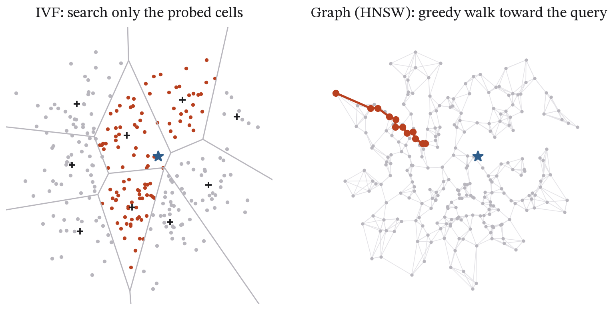

## Abstract

Vector similarity search sits underneath semantic search, recommendation and the retrieval step of most AI applications, and the index that performs it is chosen along a curve that trades recall against speed, build time and memory. This paper measures that curve for the two index families in common use, on two standard public datasets. Exact search, inverted-file indexes (IVF-Flat, with two cluster counts and eight probe settings) and graph indexes (HNSW, in two implementations, with two graph degrees and six search widths) were built over SIFT-128 (one million 128-dimensional vectors, Euclidean distance) and GloVe-100 (1.18 million 100-dimensional vectors, cosine similarity). Each configuration was measured for recall@10 against the ground truth shipped with the data, batched throughput over the 10,000-query test set, single-query latency on one thread (the number an online service actually pays), build time and memory.

<!-- RESULTS SUMMARY: fill from results.json -->

The study follows the ann-benchmarks methodology at a scale one person can reproduce, adds the serving-style single-query measurement that the batched-throughput convention leaves out, and reports every configuration it ran. The code and data provenance are public, and the benchmark reproduces with one command.

## 1. Introduction

A nearest-neighbour query asks which *k* vectors in a collection are closest to a query vector under some distance. An exact answer means comparing the query with every vector, or with a large fraction of them, since tree indexes degrade towards a full scan in high dimensions. At a million vectors that costs tens of milliseconds per query on one core, and the cost grows linearly with the collection. Approximate indexes return mostly-correct neighbours in a fraction of the time, and the engineering decision is where on the recall–speed curve to sit.

The ann-benchmarks project (Aumüller, Bernhardsson and Faithfull 2020) standardised this comparison with public datasets, precomputed ground truth, a plot of recall@k against queries per second, and a published harness. Its leaderboards are comprehensive, and they report batched throughput on dedicated hardware. Two things that someone designing a service needs are harder to see there. One is single-query latency on one thread, which is what a request-serving system pays. The other is the build time and memory behind each point on the curve, which decide whether the index can be rebuilt as the data change and whether it fits on the machine at all.

This paper measures all of these for the two dominant index families on two standard datasets, on one laptop, with a design fixed in advance. It aims to be a clear and reproducible reference for the trade-off; it does not propose a new index.

### 1.1 Contributions

- Recall–throughput frontiers for IVF-Flat and two independent HNSW implementations on SIFT-128 and GloVe-100, with every configuration reported rather than only the frontier points (Section 4 and Appendix A).
- The serving-style measurement the batched convention omits: single-query latency on one thread, as p50 and p99, for every configuration, and the size of the gap between it and batched per-query cost (Section 4.3).
- Build time and memory for every index, so that each point on the frontier carries its construction cost (Section 4.4).
- A documented account of how background load distorts these measurements, including an abandoned run in which batched search slowed roughly tenfold under contention, and the quiet-machine gate adopted in response (Section 3.3).
- A benchmark that reproduces with one command from public data whose hashes are recorded.

### 1.2 Related work

The ann-benchmarks project (Aumüller, Bernhardsson and Faithfull 2020) is the standard harness and leaderboard for this comparison, and the datasets and parameter sweeps here are its. Li et al. (2020) carried out a broad experimental comparison of approximate nearest-neighbour methods on high-dimensional data and found graph-based indexes to dominate at high recall, a result reproduced here at small scale. HNSW is due to Malkov and Yashunin (2018); the inverted-file approach and its combination with product quantisation to Jégou, Douze and Schmid (2011), with Johnson, Douze and Jégou (2019) and Douze et al. (2024) describing the FAISS library that implements both. Wang et al. (2021) survey graph-based methods and the design choices behind them. The angular GloVe dataset is a known hard case for all of these methods because of its high intrinsic dimension, which is why it is included alongside SIFT. What this paper adds is not a method but a measurement protocol: single-query latency, build cost and background-load accounting reported together for every configuration.

## 2. Data

Two datasets from ann-benchmarks.com were downloaded in their distributed HDF5 form on 1 October 2026. Their provenance, sizes and SHA-256 hashes are recorded in `data/SNAPSHOT.json`.

- **sift-128-euclidean**: 1,000,000 base vectors and 10,000 queries of 128-dimensional SIFT image descriptors (Jégou, Douze and Schmid 2011), compared by Euclidean distance.
- **glove-100-angular**: 1,183,514 base vectors and 10,000 queries of 100-dimensional GloVe word embeddings (Pennington, Socher and Manning 2014), compared by angle. The vectors are L2-normalised, so the inner product equals cosine similarity.

Each file ships the 100 exact nearest neighbours of every query, and recall@10 is computed against the first ten of them.

## 3. Method

### 3.1 Indexes

The two families work in different ways, as Figure 1 sketches. An inverted-file index partitions the space into cells and searches only the cells nearest the query; a graph index walks greedily through a neighbourhood graph towards the query.

- **flat**: exact search with FAISS `IndexFlatL2` or `IndexFlatIP`, the reference with recall 1.0.
- **ivf_flat**: FAISS `IndexIVFFlat` with *nlist* ∈ {1024, 4096} clusters, trained on a fixed random sample of 50 × *nlist* vectors (seed 0), and *nprobe* ∈ {1, 2, 4, 8, 16, 32, 64, 128}.
- **hnsw_faiss**: FAISS `IndexHNSWFlat` with *M* ∈ {16, 32}, *efConstruction* = 200 and *efSearch* ∈ {16, 32, 64, 128, 256, 512}.
- **hnsw_usearch**: USearch's HNSW with connectivity 16, expansion_add 200 and expansion_search ∈ {16, 32, 64, 128, 256, 512}, an independent implementation of the same algorithm (Malkov and Yashunin 2018).

The parameter ranges are the standard ann-benchmarks sweeps, and nothing was tuned after seeing results.

### 3.2 Measurements

Each configuration was measured for **recall@10**; for **batched throughput**, the full 10,000-query set searched in one call using all the threads described below, taking the best of three timings; for **single-query latency**, 500 queries (100 for exact search) searched one at a time on one thread and reported as p50 and p99; for **build time**; and for **memory added**, the growth in the process's resident memory over its level just after the dataset was loaded. The thread count, library versions, processor, core count and memory are all recorded in `results.json`.

### 3.3 Machine hygiene and revision record

The first attempt at this benchmark used every logical processor (12 on the test laptop, which has 4 performance and 4 efficiency cores). Whenever another process took a core, batched FAISS search slowed down roughly tenfold, because OpenMP's static schedule makes every thread wait for the slowest one. That run was abandoned, and its log is kept as `run_first_attempt_contended.log`. The benchmark now uses one thread per physical core (8), and before starting it waits until other processes are using less than three-quarters of one core and at least 4 GB of memory is free. It records the background load it saw at the start and after each dataset. No result from the abandoned run is used.

The second attempt was interrupted by an unrelated process restart after the SIFT measurements had been written to disk and while the GloVe measurements were in progress. Rather than repeat the SIFT hour, the script was given an explicit `--resume` option that keeps the datasets a previous run completed and runs the rest; the SIFT rows in `results.json` therefore come from the second attempt and the GloVe rows from the third, each on a machine that passed the quiet check at its start. Both attempts' logs are in the repository, and `results.json` records the resume. No measurement was altered or selected.

### 3.4 Reproducibility

With the two HDF5 files in `data/` (`python fetch_data.py p4` in the `papers/` folder downloads them and checks their hashes), `python benchmark.py` reproduces every number and figure, and `python benchmark.py --plots-only` redraws the figures from a saved `results.json`. The software is FAISS 1.15 (CPU), USearch 2.26, h5py, NumPy and psutil on Python 3.13. Expect one to two hours on a laptop, most of it spent building the HNSW graphs.

## 4. Results

<!-- RESULTS: fill from results.json
  Table 1: machine metadata (threads, background load)
  Table 2: flat reference per dataset (recall 1.0, QPS, single p50/p99, memory)
  Table 3: for each family, the configuration reaching recall >= 0.95 and >= 0.99 at the highest QPS, with its single p99,
           build time and memory
  Figure 2: recall vs batched QPS frontiers; Figure 3: recall vs single-query p99; Figure 4: build time and memory
  Text: shape of frontiers; IVF vs HNSW crossover; the two HNSW implementations compared; batched vs single-query gap;
        build/memory cost; dataset differences (SIFT easier than GloVe)
-->

## 5. Discussion

<!-- fill after results -->

## 6. Limitations

*One machine.* Absolute throughput and latency belong to the test laptop. The shapes of the frontiers and the relative positions of the index families are the result that transfers.

*Two datasets at the million scale.* Both are standard, and both are small by production standards. Behaviour at a hundred million or a billion vectors, where compression such as product quantisation becomes necessary, is not measured.

*No quantisation, filtering or updates.* Only uncompressed vectors are indexed. There is no metadata filtering, which changes how graph indexes behave quite a lot, and no insertion or deletion after the build. Each of these would be a separate study.

*Library defaults.* Apart from the swept parameters, every setting is the library's default. Both libraries have further options that a tuned deployment would use.

*Approximate memory figures.* Memory is measured as growth in resident memory. Memory freed by one index isn't always returned to the operating system before the next is built, so the figures for later indexes are approximate and lean high.

*Recall@10 only.* Applications that need recall@100, or that re-rank a larger set of candidates, face a different curve.

## 7. Conclusion

<!-- fill after results -->

## References

- Aumüller, M., Bernhardsson, E. & Faithfull, A. (2020). ANN-Benchmarks: A benchmarking tool for approximate nearest neighbor algorithms. *Information Systems*, 87, 101374.
- Douze, M. et al. (2024). The Faiss library. arXiv:2401.08281.
- Jégou, H., Douze, M. & Schmid, C. (2011). Product quantization for nearest neighbor search. *IEEE Transactions on Pattern Analysis and Machine Intelligence*, 33(1), 117–128.
- Johnson, J., Douze, M. & Jégou, H. (2019). Billion-scale similarity search with GPUs. *IEEE Transactions on Big Data*, 7(3), 535–547.
- Li, W. et al. (2020). Approximate nearest neighbor search on high dimensional data: Experiments, analyses, and improvement. *IEEE Transactions on Knowledge and Data Engineering*, 32(8), 1475–1488.
- Malkov, Y. A. & Yashunin, D. A. (2018). Efficient and robust approximate nearest neighbor search using Hierarchical Navigable Small World graphs. *IEEE Transactions on Pattern Analysis and Machine Intelligence*, 42(4), 824–836.
- Pennington, J., Socher, R. & Manning, C. D. (2014). GloVe: Global vectors for word representation. *EMNLP 2014*, 1532–1543.
- Vardanian, A. (2023). USearch: Smaller and faster single-file vector search engine. Software, version 2.x.
- Wang, M., Xu, X., Yue, Q. & Wang, Y. (2021). A comprehensive survey and experimental comparison of graph-based approximate nearest neighbor search. *Proceedings of the VLDB Endowment*, 14(11), 1964–1978.

## Data and code availability

Code, `results.json`, the figures and `data/SNAPSHOT.json` are at https://github.com/Pranjulrathour/research under `papers/p4-ann-frontiers/`. The code is MIT-licensed. The HDF5 datasets are distributed by ann-benchmarks.com and are not committed here because of their size (1 GB); `fetch_data.py p4` downloads them and checks them against the recorded hashes.

## Declarations

*Competing interests and funding.* The author has no competing interests and received no funding for this work.

*Use of AI tools.* Generative AI tools were used to help draft parts of the text and code. All results were produced by the published benchmark script, and the author reviewed the analysis and takes full responsibility for the content.
