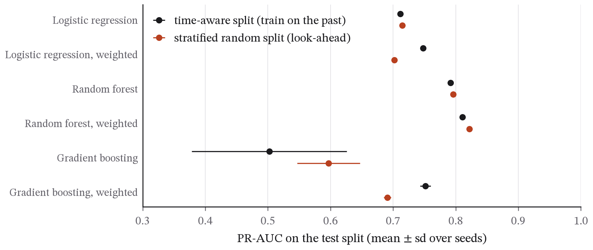

## Abstract

Fraud detection is the textbook imbalanced-classification problem, and it is often taught with methods that would fail in production: random splits that leak the future into the past, accuracy as the headline metric, and thresholds chosen on the test set. This paper benchmarks seven standard classifiers on the public ULB credit-card dataset (284,807 transactions over two days, 492 frauds) with a chronological 70/10/20 split, precision–recall area (PR-AUC) as the primary metric, a cost-based threshold chosen on validation data and five seeds per stochastic model, and repeats everything on a stratified random split for comparison. A random forest with balanced class weights did best, with a PR-AUC of 0.811 ± 0.003, while a majority-class dummy is 99.87 per cent accurate and has a PR-AUC of 0.001. ROC-AUC ranked the models differently and would have picked weighted logistic regression. Class weighting raised PR-AUC for every model family but badly damaged the calibration of the logistic and boosted models. At a threshold chosen out of sample, the best model recovered 68 per cent of the largest possible saving. Unweighted gradient boosting was unstable across seeds (0.50 ± 0.12), which a post-hoc check traced to scikit-learn's default early stopping on a random holdout of about 38 frauds. Contrary to the study's starting hypothesis, the random split did not inflate the results: the differences were small and mixed in sign, as expected when two days of data contain little drift. The code, the data provenance and every number are public.

## 1. Introduction

Three habits make most published fraud-detection results unreliable as a guide to deployment.

The first is **random splitting**. Fraud evolves: patterns that appear late in a dataset were not available when early transactions were scored. A random split trains on the future and tests on the past, and the resulting metrics describe a model that could never have existed at deployment time. The leak is well known in forecasting and under-appreciated in classification, where the rows look exchangeable but are not.

The second is **the wrong metric**. With 0.17 per cent positives, a classifier that flags nothing is 99.83 per cent accurate. Accuracy, and to a lesser degree ROC-AUC (which is dominated by the ranking of the vast negative class), reward models that are useless for the task. The metric that tracks the operational question (*of the transactions I flag, how many are fraud, and how much fraud do I catch?*) is the precision–recall curve and its area.

The third is **threshold selection on the test set**. A probabilistic classifier is only a decision once a threshold is chosen, and the threshold should be chosen on data the test set has not seen, under the cost structure the business actually faces. Reporting "recall at the threshold that maximised F1 on the test set" is a form of tuning on the test set.

This paper avoids all three and measures what the first one costs. On this dataset the answer turns out to be very little, and the reason is instructive: a random split leaks information only to the extent that the future differs from the past, and two days of transactions barely drift. The contribution is a clean, reproducible baseline on the most widely used public fraud dataset, using the methodology practitioners need and students are rarely shown, together with an honest measurement of the leak, including when it comes out near zero.

### 1.1 Contributions

- A benchmark of seven standard classifiers on the ULB credit-card data under a pre-registered, chronological protocol, with PR-AUC as the primary metric, five seeds per stochastic model and a cost-based threshold chosen on validation data (Section 4.2).
- A direct comparison of ROC-AUC and PR-AUC rankings on the same models, showing that ROC-AUC would have chosen a different and weaker model (Section 4.2).
- A measurement of what class weighting does to calibration as well as to ranking: PR-AUC improves for every model family, while the Brier score of the logistic model deteriorates 25-fold (Section 4.3).
- A diagnosis, confirmed by a post-hoc ablation, of why unweighted gradient boosting is unstable across seeds: scikit-learn's default early stopping on a random holdout containing about 38 frauds (Section 4.5).
- An honest negative result on the study's own hypothesis: a stratified random split did not inflate performance on this two-day dataset, with an explanation of why (Sections 4.6 and 5.1).

### 1.2 Related work

The ULB dataset was introduced by Dal Pozzolo, Caelen, Johnson and Bontempi (2015), whose paper also showed that undersampling distorts posterior probabilities and must be corrected, and Dal Pozzolo et al. (2018) describe a realistic fraud-detection setting with delayed labels, concept drift and daily retraining, which is the production context this paper's batch protocol only approximates. He and Garcia (2009) survey learning from imbalanced data. On metrics, Davis and Goadrich (2006) establish the relationship between precision–recall and ROC curves, and Saito and Rehmsmeier (2015) show on imbalanced data how ROC curves can look favourable while precision is poor. Elkan (2001) is the foundation for cost-sensitive thresholding, and Niculescu-Mizil and Caruana (2005) document how different model families miscalibrate and how to repair them. Kaufman, Rosset, Perlich and Stitelman (2012) formalise leakage in data mining; this paper's temporal split follows their advice, and its near-zero measured leak is consistent with their observation that leakage requires the test data to carry information unavailable at prediction time.

## 2. Data

The dataset is the credit-card transaction set released by the Université Libre de Bruxelles Machine Learning Group (Dal Pozzolo et al., 2015), containing 284,807 transactions made by European cardholders over two days in September 2013, of which 492 (0.1727 per cent) are frauds. Features V1–V28 are principal components of the original confidential variables; `Time` is the number of seconds since the first transaction; `Amount` is the transaction value; `Class` is the label.

The copy used here is OpenML dataset 1597 (licence: Public). One detail matters for reproducibility: OpenML marks `Time` as the dataset's row-identifier attribute, so `scikit-learn`'s `fetch_openml` drops it silently. The analysis therefore reads the raw ARFF file (OpenML file id 1673544), which retains `Time`; `Time` is non-decreasing in the file's row order (the snapshot records this), and the script sorts by it in any case, so the chronological split is well defined. Provenance, the download time and the SHA-256 hashes of the ARFF file and of the CSV built from it are recorded in `data/SNAPSHOT.json`; `fetch_data.py p5` repeats the download and rebuilds the CSV byte for byte.

## 3. Method

The design was fixed before the first run and is recorded in the script's docstring.

### 3.1 Split

Rows are sorted by `Time`. The first 70 per cent form the training set, the next 10 per cent the validation set and the final 20 per cent the test set. Nothing from the validation or test sets is used to fit any model, and the test set is touched once per model, at the end. Because the two days have a strong daily cycle, the boundaries fall at 36.9 and 40.4 hours after the first transaction, so the test set is the last seven and a half hours of the second day (Figure 1).

### 3.2 Models

Seven classifiers from `scikit-learn`, with default hyperparameters except where stated: a majority-class dummy (predicts the prior); logistic regression, plain and with balanced class weights; random forest (300 trees), plain and with `balanced_subsample` class weights; histogram gradient boosting (300 iterations, learning rate 0.05), plain and with balanced class weights. `Time` and `Amount` are standardised on the training set; V1–V28 are used as given. A rule-based baseline that flags the largest 0.2 per cent of amounts is included to show what no learning at all achieves.

### 3.3 Metrics

Primary: average precision (area under the precision–recall curve). Also reported: ROC-AUC (with the argument against relying on it), recall at precision 0.5 and 0.9, precision at recall 0.8, the Brier score and a reliability diagram for calibration, and, once, accuracy of the dummy classifier, to show why accuracy is meaningless here.

### 3.4 Threshold and cost model

A missed fraud costs its amount; a false alarm costs a fixed review cost of 2.0 currency units (the dataset's amounts are in an unstated European currency; the ratio is what matters). For each model, 400 candidate thresholds spanning the 90th to 99.99th percentile of validation scores are evaluated, together with a threshold above every score (flag nothing, savings zero), and the one that maximises validation savings (fraud amount caught minus review cost times alerts) is chosen. That threshold is applied unchanged to the test set, and test savings and alert count are reported. Savings are relative to doing nothing.

### 3.5 Seeds and the leak comparison

Stochastic models (the forests and the boosters) are run with seeds 0–4 and reported as mean ± standard deviation; deterministic models once. The entire protocol is then repeated on a stratified random split with the same 70/10/20 proportions (random state 0), labelled throughout as the wrong way, and the two sets of results are compared model by model.

### 3.6 Revision record

Two problems were found and fixed at the very start, before any model result was looked at beyond the first lines of the log. The first was the missing `Time` column described in Section 2, which made the chronological split impossible until the CSV was rebuilt from the ARFF. The second was that the threshold search originally had no flag-nothing option. A model whose scores are all equal, such as the majority-class dummy, was then forced to flag every transaction, which turned a harmless baseline into a large reported loss. The flag-nothing candidate was added. The log of that first run is kept as `run_first_attempt_threshold_bug.log`.

One analysis was added after the first complete run: the check of gradient boosting's early stopping in Section 4.5. It explains an observation and changes no reported number, and it is stored in `results.json` under `post_hoc`, together with the test-set totals in Table 1 (`python analysis.py --post-hoc` reproduces it).

### 3.7 Reproducibility

`python analysis.py` in the paper's directory reproduces every number and figure from `data/creditcard.csv`, and `python analysis.py --plots-only` redraws the figures. The full run took about six hours on the test laptop while other work was running, most of it in the random forests. The software is Python 3.13 with scikit-learn 1.9 and pandas 2.2, at the versions listed in the repository's `requirements.txt`.

## 4. Results

### 4.1 What the test sets contain

Table 1 describes the two test sets. The chronological test set is the evening of the second day, and its fraud rate (0.132 per cent) is lower than the dataset's overall rate. The time-aware training set contains 384 frauds and the validation block only 33, which is the number every decision threshold is chosen on.

**Table 1. The two test sets.** The most that could be saved is the total fraud amount minus the review cost of flagging exactly the frauds.

| | Time-aware split | Stratified random split |
|---|---|---|
| Rows: training / validation / test | 199,364 / 28,481 / 56,962 | 199,364 / 28,481 / 56,962 |
| Frauds in the test set | 75 | 98 |
| Fraud rate in the test set | 0.132% | 0.172% |
| Fraud amount in the test set | 7,729 | 9,007 |
| Most that could be saved | 7,579 | 8,811 |
| Accuracy of flagging nothing | 99.868% | 99.828% |

### 4.2 Model comparison

Table 2 gives the time-aware results. The weighted random forest had the highest PR-AUC, 0.811 ± 0.003, followed by the unweighted forest (0.792), weighted gradient boosting (0.752) and weighted logistic regression (0.748). Plain logistic regression, the simplest model in the study, reached 0.712. The rule that flags the largest amounts did no better than chance on PR-AUC (0.0014, against a base rate of 0.0013), and its ROC-AUC of 0.38 is below one half, because in these data frauds tend to be smaller than ordinary transactions. The dummy classifier is 99.87 per cent accurate and catches nothing.

**Table 2. Time-aware test set, 56,962 transactions with 75 frauds.** Forests and boosting are mean ± standard deviation over five seeds; the other models are deterministic. Recall@P0.9 is the recall achievable at 90 per cent precision; Precision@R0.8 is the precision at 80 per cent recall. Savings and alerts are at the threshold chosen on the validation block.

| Model | PR-AUC | ROC-AUC | Recall@P0.9 | Precision@R0.8 | Brier | Savings | Alerts |
|---|---|---|---|---|---|---|---|
| Majority dummy | 0.001 | 0.500 | 0.00 | 0.00 | 0.00132 | 0 | 0 |
| Logistic regression | 0.712 | 0.975 | 0.45 | 0.51 | 0.00062 | 4,570 | 80 |
| Logistic regression, weighted | 0.748 | **0.983** | 0.67 | 0.50 | 0.01571 | 4,959 | 65 |
| Random forest | 0.792 ± 0.002 | 0.956 | 0.73 | 0.46 | **0.00044** | 5,090 ± 94 | 76 |
| Random forest, weighted | **0.811 ± 0.003** | 0.947 | **0.76** | **0.67** | 0.00045 | **5,168 ± 7** | 81 |
| Gradient boosting | 0.502 ± 0.124 | 0.755 | 0.24 | 0.01 | 0.00098 | 3,929 ± 943 | 148 |
| Gradient boosting, weighted | 0.752 ± 0.008 | 0.952 | 0.70 | 0.30 | 0.00327 | 3,901 ± 392 | 70 |

The two area metrics disagree about which model is best. ROC-AUC puts weighted logistic regression first (0.983) and the weighted forest, the best model by PR-AUC, fifth of the six learned models (0.947). The reason is where each metric looks. ROC-AUC averages performance over every false-positive rate up to one, and nearly all of that range corresponds to flagging thousands of legitimate transactions, which no fraud team would do. The precision–recall curve concentrates on the top of the ranking, where alerts are actually raised (Davis and Goadrich 2006; Saito and Rehmsmeier 2015). Figure 2 shows the curves.

### 4.3 Class weighting: better ranking, worse probabilities

Weighting the rare class raised PR-AUC for all three families: by 0.036 for logistic regression, 0.019 for the forest and 0.25 for gradient boosting. Its effect on calibration depended on the model. The Brier score of logistic regression became 25 times worse (0.00062 to 0.01571) and that of gradient boosting more than three times worse (0.00098 to 0.00327), while the forest's was unchanged (0.00044 against 0.00045). Weighting pushes the logistic model's scores so far towards one that the threshold chosen on validation data was 0.9999. The right-hand panel of Figure 2 shows the effect: the weighted logistic model predicts fraud probabilities far above the rates actually observed. Ranking is improved, but the scores stop being probabilities, so anything that uses them as probabilities (an expected-loss calculation, or a combination with other risk scores) needs them recalibrated first (Niculescu-Mizil and Caruana 2005).

### 4.4 Thresholds and savings

With the threshold chosen on the validation block and applied unchanged, the weighted forest saved 5,168 ± 7 of a possible 7,579, or 68 per cent, while raising 81 alerts for 75 frauds. Logistic regression saved 60 per cent and its weighted version 65 per cent. Weighted gradient boosting did worst among the competent models, at 51 per cent (3,901 ± 392), although its PR-AUC is almost the same as weighted logistic regression's. A good ranking doesn't guarantee a good decision. The threshold is itself an estimate made from 33 validation frauds, so savings at the chosen threshold are much noisier than PR-AUC, and a model can rank transactions well and still have its cut-off land in the wrong place.

### 4.5 The unstable booster

Plain gradient boosting stands out in Table 2 for its spread across seeds (PR-AUC 0.502 ± 0.124). The histogram gradient boosting in scikit-learn turns on early stopping by default when there are more than 10,000 training rows. It then holds out a random 10 per cent of the training data, here about 38 frauds, and stops when the loss on that holdout stops improving. A post-hoc check, run after the main results and stored separately in `results.json`, refitted the model for each seed with early stopping on and off (Table 3).

**Table 3. Plain gradient boosting on the time-aware split, with and without the default early stopping (post-hoc check).**

| Seed | Rounds trained, early stopping on | PR-AUC, early stopping on | PR-AUC, early stopping off (300 rounds) |
|---|---|---|---|
| 0 | 11 | 0.341 | 0.614 |
| 1 | 19 | 0.632 | 0.614 |
| 2 | 11 | 0.515 | 0.614 |
| 3 | 11 | 0.641 | 0.614 |
| 4 | 11 | 0.381 | 0.614 |

With early stopping on, training stopped after 11 to 19 rounds, and the quality of the result depended on which 38 frauds happened to land in the holdout. With it off, every seed produced the same model, since nothing else in the algorithm is random at these settings, with a PR-AUC of 0.614: stable, though still well below the forest. The weighted booster trained for much longer on average (143 seconds against 6), which is consistent with its weighted holdout loss continuing to improve for many more rounds. A default chosen with ordinary classification problems in mind behaves badly when positives are this rare.

### 4.6 The leak that didn't appear

Table 4 and Figure 3 compare each model's PR-AUC under the two protocols. There is no systematic inflation. Three of the six differences are within ±0.011, and the larger ones go both ways: the stratified random split favours plain gradient boosting by 0.095, which is within that model's own seed-to-seed spread, and penalises weighted logistic regression by 0.046 and weighted gradient boosting by 0.061. Expressed as a share of the largest possible saving, the weighted forest recovers 68 per cent on the time-aware split and 67 per cent on the random one.

**Table 4. PR-AUC under the two protocols (mean over seeds).**

| Model | Time-aware | Stratified random | Difference |
|---|---|---|---|
| Logistic regression | 0.712 | 0.715 | +0.003 |
| Logistic regression, weighted | 0.748 | 0.702 | −0.046 |
| Random forest | 0.792 | 0.796 | +0.004 |
| Random forest, weighted | 0.811 | 0.822 | +0.011 |
| Gradient boosting | 0.502 | 0.597 | +0.095 |
| Gradient boosting, weighted | 0.752 | 0.691 | −0.061 |

## 5. Discussion

### 5.1 Why the random split did no harm here

A random split leaks information from the future into training only to the extent that the future is different from the past. In this dataset the time-aware test set begins three and a half hours after the training data end, and fraud patterns have little time to change in that gap. The two test sets also differ in size and fraud rate (75 frauds against 98), so a difference of a few hundredths in PR-AUC between protocols is within the noise of the comparison. The result doesn't show that random splitting is safe. It shows that a two-day benchmark can't reveal the leak, because the leak's size is set by drift, and this dataset has almost none. Studies of card fraud over longer periods, where fraud patterns appear and are shut down, find drift that a model must keep up with (Dal Pozzolo et al. 2018). Since the amount of drift isn't known before a model is deployed, splitting by time is still the right default: it costs nothing when there is no drift and protects against it when there is.

### 5.2 What a practitioner should take from this

Five things. PR-AUC, not accuracy and not ROC-AUC, is the metric to rank models by when positives are this rare, because ROC-AUC rewards performance at alert volumes no one would ever use. A forest with balanced class weights is a strong, stable baseline, and plain logistic regression gets surprisingly close. Class weighting improves ranking but can wreck calibration, so weighted scores should be recalibrated before they are used as probabilities. Thresholds should be chosen out of sample under an explicit cost model, with the understanding that a validation block holding a few dozen positives gives a noisy cut-off. And library defaults deserve checking, since a default as innocuous-looking as early stopping on a random holdout can turn a reasonable model into a lottery.

## 6. Limitations

*One dataset, two days.* The ULB data are the standard public benchmark, and they cover very little time. Two days can't show seasonal or adversarial drift, and the chronological split tests only whether patterns from the first day and a half carry over to the evening of the second day. The near-zero leak measured here is a property of this short dataset and says nothing about how large the leak would be on months of data.

*PCA features.* The anonymised principal components prevent feature engineering of the kind real fraud systems depend on (velocity features, merchant history, device signals). Results are a floor for what the raw data would support.

*A toy cost model.* A fixed review cost and a loss equal to the amount ignore chargeback fees, customer friction from false declines, and the difference between card-present and card-not-present fraud. The point of the cost model is to make threshold selection explicit and out-of-sample, not to estimate real savings.

*No sequential or online learning.* Production systems retrain continuously and score transactions in sequence with features computed from the account's history. This paper evaluates a one-shot batch model, which is the setting most published results use and the one in which the leak is most often made.

*Default hyperparameters.* Nothing was tuned. Tuned models would score higher; the comparisons between models and between splits are the finding, not the absolute levels.

## 7. Conclusion

On the ULB credit-card data, a random forest with balanced class weights was the best and most stable of seven standard classifiers, with a PR-AUC of 0.811 on a strictly chronological test set and 68 per cent of the possible saving recovered at a threshold chosen out of sample. ROC-AUC ranked the models differently and would have chosen a weaker one. Class weighting helped ranking and hurt calibration. Plain gradient boosting was unstable because of a library default, which a post-hoc check confirmed. The random split, which the study set out to expose, made little difference here, because two days of data contain little drift for it to leak; the case for splitting by time rests on the drift a benchmark this short can't show. Everything reproduces from public data with one command.

## References

- Dal Pozzolo, A., Caelen, O., Johnson, R. A. & Bontempi, G. (2015). Calibrating probability with undersampling for unbalanced classification. *IEEE Symposium Series on Computational Intelligence (SSCI)*, 159–166.
- Dal Pozzolo, A., Boracchi, G., Caelen, O., Alippi, C. & Bontempi, G. (2018). Credit card fraud detection: A realistic modeling and a novel learning strategy. *IEEE Transactions on Neural Networks and Learning Systems*, 29(8), 3784–3797.
- Saito, T. & Rehmsmeier, M. (2015). The precision–recall plot is more informative than the ROC plot when evaluating binary classifiers on imbalanced datasets. *PLoS ONE*, 10(3), e0118432.
- Davis, J. & Goadrich, M. (2006). The relationship between precision–recall and ROC curves. *ICML 2006*, 233–240.
- Elkan, C. (2001). The foundations of cost-sensitive learning. *IJCAI 2001*, 973–978.
- He, H. & Garcia, E. A. (2009). Learning from imbalanced data. *IEEE Transactions on Knowledge and Data Engineering*, 21(9), 1263–1284.
- Kaufman, S., Rosset, S., Perlich, C. & Stitelman, O. (2012). Leakage in data mining: Formulation, detection, and avoidance. *ACM TKDD*, 6(4), 15.
- Niculescu-Mizil, A. & Caruana, R. (2005). Predicting good probabilities with supervised learning. *ICML 2005*, 625–632.
- Pedregosa, F. et al. (2011). Scikit-learn: Machine learning in Python. *JMLR*, 12, 2825–2830.

## Data and code availability

Code, `results.json` (every number in this paper), the figures and `data/SNAPSHOT.json` are at https://github.com/Pranjulrathour/research under `papers/p5-fraud-imbalance/`. The code is MIT-licensed. The dataset is distributed by OpenML (id 1597) and is not committed here because of its size; `python fetch_data.py p5` in the `papers/` folder downloads the ARFF, rebuilds the CSV with its `Time` column and checks both against the recorded hashes.

## Declarations

*Competing interests and funding.* The author has no competing interests and received no funding for this work.

*Use of AI tools.* Generative AI tools were used to help draft parts of the text and code. All results were produced by the published scripts from the snapshot data, and the author reviewed the analysis and takes full responsibility for the content.

## Appendix A. All metrics for both protocols

Tables A1 and A2 give every metric recorded for every model, from `results.json`. Recall@P0.5 is the recall achievable at 50 per cent precision. The threshold column is the score cut-off chosen on the validation block; the dummy's "flag nothing" is the infinite threshold described in Section 3.6. Fit time is on the test laptop with other work running, and the two forests differ because the balanced-subsample forest grows shallower trees.

**Table A1. Time-aware split (test: 56,962 transactions, 75 frauds).**

| Model | PR-AUC | ROC-AUC | Recall@P0.5 | Recall@P0.9 | Precision@R0.8 | Brier | Threshold | Savings | Alerts | Fit (s) |
|---|---|---|---|---|---|---|---|---|---|---|
| Amount rule (top 0.2%) | 0.0014 | 0.382 | 0.00 | 0.00 | 0.001 | | | | | |
| Majority dummy | 0.001 | 0.500 | 0.00 | 0.00 | 0.001 | 0.00132 | flag nothing | 0 | 0 | 0 |
| Logistic regression | 0.712 | 0.975 | 0.80 | 0.45 | 0.508 | 0.00062 | 0.098 | 4,570 | 80 | 2 |
| Logistic regression, weighted | 0.748 | 0.983 | 0.80 | 0.67 | 0.504 | 0.01571 | 0.9999 | 4,959 | 65 | 4 |
| Random forest | 0.792 ± 0.002 | 0.956 ± 0.003 | 0.79 | 0.73 | 0.462 | 0.00044 | 0.178 | 5,090 ± 94 | 76 | 485 |
| Random forest, weighted | 0.811 ± 0.003 | 0.947 ± 0.005 | 0.81 | 0.76 | 0.667 | 0.00045 | 0.067 | 5,168 ± 7 | 81 | 283 |
| Gradient boosting | 0.502 ± 0.124 | 0.755 ± 0.105 | 0.59 | 0.24 | 0.007 | 0.00098 | 0.038 | 3,929 ± 943 | 148 | 6 |
| Gradient boosting, weighted | 0.752 ± 0.008 | 0.952 ± 0.009 | 0.76 | 0.70 | 0.301 | 0.00327 | 0.881 | 3,901 ± 392 | 70 | 143 |

**Table A2. Stratified random split (test: 56,962 transactions, 98 frauds).**

| Model | PR-AUC | ROC-AUC | Recall@P0.5 | Recall@P0.9 | Precision@R0.8 | Brier | Threshold | Savings | Alerts | Fit (s) |
|---|---|---|---|---|---|---|---|---|---|---|
| Amount rule (top 0.2%) | 0.0017 | 0.387 | 0.00 | 0.00 | 0.002 | | | | | |
| Majority dummy | 0.002 | 0.500 | 0.00 | 0.00 | 0.002 | 0.00172 | flag nothing | 0 | 0 | 0 |
| Logistic regression | 0.715 | 0.967 | 0.84 | 0.14 | 0.738 | 0.00075 | 0.010 | 5,911 | 217 | 1 |
| Logistic regression, weighted | 0.702 | 0.975 | 0.83 | 0.00 | 0.669 | 0.02286 | 0.994 | 6,081 | 124 | 3 |
| Random forest | 0.796 ± 0.002 | 0.946 ± 0.008 | 0.81 | 0.69 | 0.763 | 0.00054 | 0.151 | 6,032 ± 82 | 104 | 726 |
| Random forest, weighted | 0.822 ± 0.002 | 0.952 ± 0.006 | 0.85 | 0.78 | 0.819 | 0.00051 | 0.169 | 5,905 ± 5 | 92 | 2,662 |
| Gradient boosting | 0.597 ± 0.050 | 0.828 ± 0.036 | 0.70 | 0.11 | 0.011 | 0.00101 | 0.485 | 4,920 ± 433 | 100 | 2 |
| Gradient boosting, weighted | 0.691 ± 0.006 | 0.945 ± 0.008 | 0.80 | 0.00 | 0.472 | 0.00391 | 0.708 | 5,533 ± 146 | 155 | 50 |

One row deserves a comment. The weighted logistic model's recall at 90 per cent precision is 0.67 on the time-aware split and 0.00 on the random one, although its PR-AUC is similar on both. At the top of its ranking on the random split sit a few legitimate transactions scored above every fraud, so precision never reaches 90 per cent at any recall. Single operating-point metrics are brittle in this way with fewer than a hundred positives, which is one more reason to rank models by the area and to report several points along the curve.
